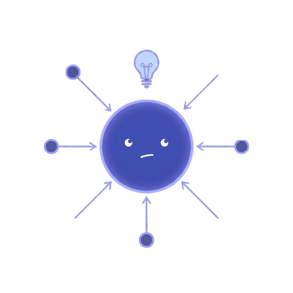
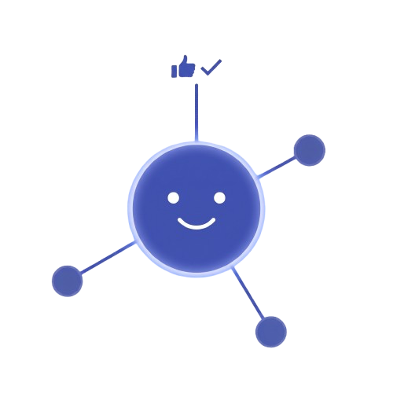
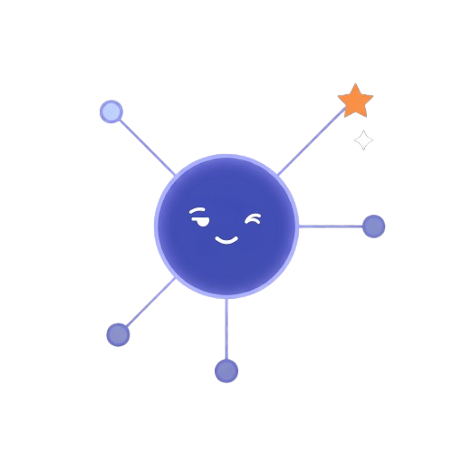
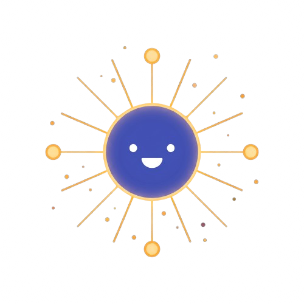

# Chapter 2: Graph Properties and Traditional ML Features

**Part 1: Classical Graph Analysis**

## Summary

Covers classical graph feature engineering — degree statistics, centrality measures, graphlets, the Weisfeiler-Lehman kernel, and network motifs — showing how to represent graphs for traditional ML before GNNs existed.

## Concepts Covered

This chapter covers the following 18 concepts from the learning graph:

1. Small-World Network
2. Scale-Free Network
3. Erdős–Rényi Random Graph
4. Barabási–Albert Model
5. Preferential Attachment
6. Giant Component
7. Transitivity
8. Local Clustering Coefficient
9. Betweenness Centrality
10. Closeness Centrality
11. Eigenvector Centrality
12. Network Motif
13. Graphlet
14. Graphlet Degree Vector
15. Graph Kernel
16. Weisfeiler-Lehman Kernel
17. Katz Similarity
18. SNAP

## Prerequisites

This chapter builds on:

- [Chapter 1: Introduction to Graphs and Networks](../01-intro-to-graphs/index.md)

---

## Motivating Example: Predicting Friendships Before Deep Learning

In the mid-2000s, LinkedIn faced a deceptively hard problem: given a professional network of millions of users, which pairs of currently unconnected people are likely to know each other in real life? Recommending the right connections would grow the network; recommending the wrong ones would annoy users into churning.

At the time, no graph neural networks existed. Instead, LinkedIn's engineers computed a suite of hand-crafted graph features for every candidate pair of nodes: how many mutual connections did they share? How many paths of length two ran between them? What fraction of their neighborhoods overlapped? Each of these heuristics captured a different facet of network proximity, and combining them in a logistic regression produced recommendations good enough to dramatically accelerate network growth.

This approach — turning a graph into a feature vector through careful engineering — is not just historical curiosity. It establishes the vocabulary of structural similarity that GNNs later learned to compute automatically. Understanding what these features measure, and why they fall short, is the essential context for appreciating why representation learning on graphs is worth the added complexity.

This chapter covers that vocabulary in full: the random graph models that characterize real networks, the centrality measures that rank nodes by their structural importance, the graphlet-based features that describe local topology, and the graph kernels that compare entire graphs. Along the way, we will quantify exactly where hand-crafted features hit their ceiling — setting the stage for the learning-based approaches in the chapters that follow.

!!! mascot-welcome "From Intuition to Measurement"
    
    Chapter 1 gave you the language of graphs. This chapter gives you the *measurement tools*. Every structural property here — centrality, motif counts, WL colors — answers the question: "What is this node or graph *like*, quantitatively?" That question is the engine of all classical graph ML. By the end of this chapter, you will also understand exactly why those measurements are not enough — which is what makes Graph Neural Networks necessary.

---

## 2.1 Random Graph Models

Before characterizing real networks, we need a baseline: what would a graph look like if structure were purely random? Two generative models serve this purpose, producing graphs that are easy to analyze mathematically but structurally impoverished compared to real-world networks. This gap between the random baseline and reality is precisely what the properties in this chapter are designed to capture.

### 2.1.1 The Erdős–Rényi Random Graph

The **Erdős–Rényi random graph** $G(n, p)$ is the simplest random graph model: generate $n$ nodes, and include each of the $\binom{n}{2}$ possible edges independently with probability $p$.

Key properties of $G(n, p)$:

- **Expected number of edges:** $p\binom{n}{2} \approx pn^2/2$
- **Expected degree:** $\bar{d} = p(n-1)$
- **Degree distribution:** Binomial (Poisson for large $n$) — concentrated tightly around $\bar{d}$
- **Clustering coefficient:** $C \approx p$ — triangles are rare for small $p$
- **Average path length:** $\bar{\ell} \approx \log n / \log \bar{d}$

The crucial limitation: $G(n,p)$ produces graphs where all nodes have approximately the same degree, forming no hubs. Real networks are nothing like this.

### 2.1.2 The Giant Component

A remarkable phase transition governs connectivity in $G(n, p)$: as $p$ increases, the graph transitions abruptly from a collection of small isolated components to a state where a single **giant component** contains most nodes.

The transition occurs at the critical threshold $p_c = 1/n$, or equivalently at average degree $\bar{d} = 1$:

- When $\bar{d} < 1$: only small components, largest has $O(\log n)$ nodes
- When $\bar{d} = 1$: a giant component appears, containing $O(n^{2/3})$ nodes
- When $\bar{d} > 1$: the giant component grows rapidly, containing $O(n)$ nodes

This phase transition has deep consequences for graph ML: algorithms that assume connectivity — shortest paths, random walks, label propagation — require the giant component to exist. When computing properties on real-world graphs, always check that the relevant nodes lie in the same component.

### 2.1.3 The Barabási–Albert Model and Preferential Attachment

The **Barabási–Albert (BA) model** explains how hubs arise. It generates graphs through an incremental process governed by **preferential attachment**: new nodes join the network one at a time, and each new node connects to $m$ existing nodes with probability proportional to their current degree.

Formally, the probability that a new node connects to existing node $i$ is:

$$\Pi(i) = \frac{d_i}{\sum_j d_j}$$

"The rich get richer" — popular nodes attract even more connections. The resulting degree distribution follows a power law $P(k) \propto k^{-3}$, producing the scale-free structure observed in real networks. The BA model generates graphs with a small number of high-degree hubs and a long tail of low-degree nodes.

The table below summarizes the structural contrast between the ER model, the BA model, and a real social network (the Karate Club graph):

| Property | ER $G(34, 0.14)$ | BA ($n=34, m=2$) | Karate Club |
|----------|-----------------|------------------|-------------|
| Avg. degree | 4.5 | 4.0 | 4.59 |
| Max. degree | ~8 (typical) | ~15 (typical) | 17 |
| Degree distribution | Poisson | Power-law | Heavy-tailed |
| Clustering coefficient | ~0.14 | ~0.05 | 0.571 |
| Avg. path length | ~2.5 | ~2.4 | 2.41 |

The ER model roughly matches path lengths but dramatically underestimates clustering. The BA model produces realistic hubs but also underestimates clustering. Neither captures the combination of high clustering *and* short paths found in real social networks — that combination is the defining signature of small-world structure.

### 2.1.4 Small-World Networks and Scale-Free Networks

A **small-world network** is characterized by two simultaneous properties:

1. **High clustering** — most neighbors of a node know each other
2. **Short average path length** — any two nodes are connected by a short chain

The Watts-Strogatz model achieves this by starting with a regular ring lattice (high clustering) and randomly rewiring a small fraction of edges (introducing shortcuts that dramatically reduce path length).

A **scale-free network** is characterized by a power-law degree distribution $P(k) \propto k^{-\gamma}$ with $\gamma \in (2, 3)$ for most real networks. Scale-free networks are scale-invariant — the degree distribution looks the same regardless of the scale at which you zoom in — and they arise naturally from preferential attachment dynamics.

Many real networks exhibit *both* properties simultaneously: they are small-world *and* scale-free. The coexistence of these properties, absent in both ER and BA models, is one of the central puzzles of empirical network science and the key motivation for studying real-network structure rather than theoretical random graphs.

---

## 2.2 Transitivity and the Clustering Coefficient

**Transitivity** (or *global clustering*) measures the overall tendency for connected triples of nodes to close into triangles:

$$T = \frac{3 \times \text{(number of triangles)}}{\text{(number of connected triples)}}$$

A connected triple is any path of length 2 (three nodes $u$-$v$-$w$ where $(u,v)$ and $(v,w)$ are edges). Transitivity counts what fraction of those triples are "closed" by the edge $(u,w)$.

The **local clustering coefficient** $C_v$ of a node $v$ with degree $d_v$ is the fraction of $v$'s neighbors that are connected to each other:

$$C_v = \frac{|\{(u,w) \in E : u, w \in \mathcal{N}(v)\}|}{\binom{d_v}{2}} = \frac{2 \cdot e_v}{d_v(d_v - 1)}$$

where $e_v$ is the number of edges among $v$'s neighbors. The **average clustering coefficient** $\bar{C} = \frac{1}{n}\sum_v C_v$ is the standard summary statistic. For the Karate Club graph, $\bar{C} = 0.571$ — dramatically higher than the ER baseline of $\approx p = 0.14$.

Clustering coefficient is one of the most powerful discriminative features between graph types. Social networks have high clustering ($\bar{C} \approx 0.3\text{–}0.6$); biological interaction networks have moderate clustering ($\bar{C} \approx 0.1\text{–}0.3$); technological networks (internet routers) have lower clustering. It is also central to the small-world characterization: small-world networks are defined as having $\bar{C} \gg \bar{C}_{\text{random}}$ while maintaining $\bar{\ell} \approx \bar{\ell}_{\text{random}}$.

---

## 2.3 Node Centrality Measures

Node centrality measures answer a single question: *which nodes are most important?* Different centrality measures formalize "importance" differently, and each captures a distinct aspect of structural position.

Before examining the formulas, it is worth noting their shared motivation. In the Karate Club graph, node 0 (the instructor) and node 33 (the club president) are the two most influential members — the social network split along the boundary between their factions. Each centrality measure should rank these two nodes highly, but for different structural reasons.

### 2.3.1 Eigenvector Centrality

A node is important if it is connected to other important nodes. This circular reasoning leads to a self-consistent definition: the **eigenvector centrality** score $c_v$ satisfies:

$$c_v = \frac{1}{\lambda} \sum_{u \in \mathcal{N}(v)} c_u$$

In matrix form: $\lambda \mathbf{c} = \mathbf{A}\mathbf{c}$, which means $\mathbf{c}$ is an eigenvector of the adjacency matrix $\mathbf{A}$ with eigenvalue $\lambda$. By the Perron-Frobenius theorem, the unique non-negative solution is the eigenvector corresponding to the largest eigenvalue $\lambda_1$. Nodes with high eigenvector centrality are connected to many well-connected nodes — a node in the periphery has low eigenvector centrality even if it has high degree, if its neighbors are themselves peripheral.

PageRank (which we study in Chapter 3) is a modified version of eigenvector centrality that handles directed graphs and prevents rank from concentrating on sink nodes.

!!! mascot-thinking "Eigenvector Centrality Is a Fixed Point, Not a Formula"
    
    The recursive definition of eigenvector centrality — "important nodes are connected to important nodes" — might feel circular, but it is actually a fixed point equation. The power iteration algorithm resolves it: start with all nodes having equal centrality, then repeatedly update each node's score as the sum of its neighbors' scores, then normalize. This process converges to the leading eigenvector. This is exactly the same iterative aggregation-and-normalize pattern that every GNN layer implements. Eigenvector centrality is, in a real sense, a one-dimensional GNN with a fixed aggregation rule and no learned weights. Your neighbors have insights too.

### 2.3.2 Betweenness Centrality

A node is important if many shortest paths pass through it — it acts as a bridge or bottleneck. **Betweenness centrality** quantifies this:

$$C_B(v) = \sum_{s \neq v \neq t} \frac{\sigma_{st}(v)}{\sigma_{st}}$$

where $\sigma_{st}$ is the total number of shortest paths from $s$ to $t$, and $\sigma_{st}(v)$ is the number of those paths that pass through $v$. A high-betweenness node, if removed, would dramatically increase path lengths between many pairs of nodes.

In the Karate Club graph, node 0 (instructor) has the highest betweenness centrality because all communication between the two factions passes through it (before the split). Betweenness centrality identifies bridges, gatekeepers, and brokers — structurally quite different from high-degree hubs.

Brandes' algorithm computes betweenness centrality in $O(nm)$ time for unweighted graphs and $O(nm + n^2 \log n)$ for weighted graphs — efficient enough for graphs with tens of thousands of nodes.

### 2.3.3 Closeness Centrality

A node is important if it can reach all other nodes quickly. **Closeness centrality** is the reciprocal of the average shortest path distance to all other nodes:

$$C_C(v) = \frac{n-1}{\sum_{u \neq v} d(v, u)}$$

The normalization by $n-1$ ensures scores are comparable across graphs of different sizes. A central node in the "middle" of a graph has high closeness; a peripheral node has low closeness because it must travel many hops to reach nodes on the other side.

Closeness centrality is sensitive to graph connectivity: for disconnected graphs, it is only defined on the giant component, or with modified formulations that assign infinite distance to unreachable pairs. The standard workaround is to compute closeness only within the largest connected component.

The following table summarizes the three centrality measures for the top-5 nodes in the Karate Club graph. The three measures often agree on major hubs but diverge sharply on peripheral nodes:

| Node | Eigenvector | Betweenness | Closeness | Ground truth role |
|------|------------|-------------|-----------|------------------|
| 0 | 0.356 | 0.437 | 0.569 | Instructor (faction leader) |
| 33 | 0.313 | 0.304 | 0.559 | President (faction leader) |
| 2 | 0.300 | 0.143 | 0.559 | Bridge member |
| 1 | 0.267 | 0.053 | 0.493 | Close associate of node 0 |
| 32 | 0.245 | 0.145 | 0.515 | Close associate of node 33 |

*Values computed with NetworkX. Eigenvector centrality is normalized to the leading eigenvector.*

---

## 2.4 Network Motifs

Beyond single-node statistics, the *local structural patterns* that recur throughout a network carry important information. A **network motif** is a small subgraph pattern that appears significantly more often in a real network than in random graphs with the same degree sequence.

Milo et al. (2002) identified four canonical 3-node directed motifs in transcriptional regulatory networks: the feed-forward loop, the bifan, the single-input module, and the multi-input module. Each motif corresponds to a functional circuit: the feed-forward loop acts as a sign-sensitive delay; the bifan synchronizes multiple targets. The vocabulary of motifs provides a compact, interpretable description of a network's local structure.

Motif analysis requires:

1. Enumerating all subgraphs of size $k$ in the target network (typically $k = 3$ or $4$)
2. Computing their frequency
3. Comparing to frequency in randomized null-model graphs with the same degree sequence
4. Defining $Z$-scores: $Z_i = (F_i^{\text{real}} - \mu_i^{\text{random}}) / \sigma_i^{\text{random}}$

The normalized $Z$-score vector across all motif types is called the **network significance profile** — a compact fingerprint of the network's functional organization.

---

## 2.5 Graphlets and the Graphlet Degree Vector

**Graphlets** are small, connected, non-isomorphic induced subgraphs. Unlike motifs (which apply to directed graphs and use statistical enrichment), graphlets are defined for undirected graphs and are used as topological descriptors without a null model comparison.

There are 2 graphlets on 2 nodes ($g_1$: edge), 2 on 3 nodes ($g_2$: path, $g_3$: triangle), and 6 on 4 nodes ($g_4$–$g_8$: path, star, cycle, "diamond", $K_4$), for a total of 30 distinct graphlets on 2–5 nodes. Each graphlet has multiple topologically distinct *node positions* (called *automorphism orbits*): a node can be the center of a 3-star or an endpoint of a 3-star, and these are structurally different.

The **Graphlet Degree Vector (GDV)** of a node $v$ is a 73-dimensional vector (for graphlets of size 2–5) where entry $i$ counts the number of times node $v$ appears at orbit $i$ across all graphlets in the graph. The GDV is a rich structural fingerprint: two nodes with identical GDVs occupy structurally equivalent positions in their respective graphs.

The GDV generalizes the degree — which is just orbit 0 (number of edges, i.e., appearances in the $g_1$ graphlet) — to encode the full local topology out to 5-node neighborhoods. Graphlet-based features substantially outperform degree and clustering coefficient alone for protein function prediction and other biological network analysis tasks.

---

## 2.6 Graph Kernels

A **graph kernel** is a function $K(G, G')$ that measures the similarity between two graphs. Kernels enable off-the-shelf kernel machines (SVMs, Gaussian processes) to be applied directly to graph-structured data. The kernel must be symmetric and positive semi-definite — the same requirements as any valid Mercer kernel.

Two closely related kernels anchor the field.

### 2.6.1 The Graphlet Kernel

The **graphlet kernel** compares graphs by their graphlet frequency distributions. For each graph $G$, compute the normalized graphlet count vector $\mathbf{f}_G$ (how often each of the $k$ graphlet types appears). The graphlet kernel is:

$$K_{\text{graphlet}}(G, G') = \mathbf{f}_G^{\top} \mathbf{f}_{G'}$$

This is simply the dot product of two normalized histogram vectors. Its limitation is computational cost: counting all graphlets of size $k$ requires $O(n^k)$ time, which becomes prohibitive for $k \geq 5$ on large graphs.

### 2.6.2 The Weisfeiler-Lehman Kernel

The **Weisfeiler-Lehman (WL) kernel** avoids the graphlet enumeration bottleneck by replacing subgraph counting with an iterative node-labeling process inspired by the Weisfeiler-Lehman graph isomorphism test.

The WL refinement procedure works as follows. We will define these steps precisely before connecting them to the kernel:

- **Initialization (step 0):** Assign each node an initial label equal to its degree (or a uniform label for unlabeled graphs).
- **Aggregation (step $t$):** For each node $v$, collect the multiset of labels of all its neighbors $\mathcal{N}(v)$ and concatenate them with $v$'s own label.
- **Hashing (step $t$):** Map each concatenated string to a new compact label via a hash function, producing a new label for every node.
- **Termination:** Repeat aggregation and hashing for $T$ iterations, or until no new label refinements occur.

After $T$ iterations, each node has been assigned a sequence of labels $(\ell_v^0, \ell_v^1, \ldots, \ell_v^T)$. The label $\ell_v^t$ encodes the structure of $v$'s $t$-hop neighborhood. The feature vector for graph $G$ at iteration $t$ counts how many nodes in $G$ have each label at that iteration.

The WL kernel is the sum of linear kernels over all iterations:

$$K_{\text{WL}}(G, G') = \sum_{t=0}^{T} \mathbf{f}_{G,t}^{\top} \mathbf{f}_{G',t}$$

The WL kernel runs in $O(nm)$ time — linear in the number of edges — making it tractable for large graphs. It is also *provably expressive*: it can distinguish any pair of graphs that the WL isomorphism test can distinguish, and it is strictly more powerful than the graphlet kernel on most graph families.

!!! mascot-encourage "The WL Kernel Is a Preview of Chapter 9"
    
    If the WL kernel procedure sounds familiar, that is because it is essentially one step of message passing — the operation at the heart of every GNN. In Chapter 9, we will prove that any message-passing GNN is *at most* as expressive as the WL test (and most popular GNNs are strictly *less* expressive). The WL kernel is not just a historical artifact; it is the theoretical ceiling against which GNN expressiveness is measured. Understanding it now makes the expressiveness results in Chapters 9 and 10 much more natural.

---

## 2.7 Link Similarity: Katz Index

Link-level features estimate the likelihood that two currently unconnected nodes will form an edge — the link prediction problem. Several heuristics exist, ranging from simple to computationally intensive.

We have already introduced common-neighbor count, Jaccard coefficient, and Adamic-Adar index in Chapter 1's code examples. Here we focus on the most powerful classical heuristic: **Katz similarity**, which considers *all* paths between two nodes, not just paths of length 2.

The Katz similarity between nodes $u$ and $v$ is:

$$S_{uv}^{\text{Katz}} = \sum_{l=1}^{\infty} \beta^l (\mathbf{A}^l)_{uv}$$

where $(\mathbf{A}^l)_{uv}$ counts the number of walks of length $l$ between $u$ and $v$, and $\beta \in (0, 1/\lambda_1)$ is a damping factor that ensures the series converges. Short paths contribute more than long paths (since $\beta < 1$ and $\beta^l \to 0$).

This infinite sum has a closed form. Summing the geometric series:

$$\mathbf{S}^{\text{Katz}} = \sum_{l=1}^{\infty} \beta^l \mathbf{A}^l = (\mathbf{I} - \beta\mathbf{A})^{-1} - \mathbf{I}$$

This matrix inversion is $O(n^3)$ for dense matrices but can be approximated efficiently using sparse solvers or truncated series. Katz similarity is the most expressive classical link prediction heuristic because it integrates structural information from all path lengths simultaneously, not just 1-hop or 2-hop neighborhoods.

---

## 2.8 Why Hand-Crafted Features Are Limiting

The features in this chapter are powerful and remain competitive on many benchmarks. But they have three fundamental limitations that motivated the shift to representation learning.

**Task-specificity.** Each feature was designed with a specific task in mind. Betweenness centrality was designed for network flow; clustering coefficient for social cohesion; graphlet degree vectors for biological network comparison. When the task changes — from node classification to link prediction to graph classification — the feature engineering process must restart.

**Non-adaptivity.** The features are computed from graph structure alone, independent of any target labels. A GNN, by contrast, learns features that are directly optimized for the prediction task at hand. Two graphs with identical graphlet degree vectors might have very different classification labels — a distinction that GNNs can learn to capture but fixed features cannot.

**Combinatorial explosion.** Graphlet features become computationally intractable beyond $k=5$ nodes. But real prediction tasks often require understanding structure at larger scales. GNNs can aggregate information over arbitrarily deep neighborhoods, subject only to over-smoothing constraints, without the exponential enumeration cost.

The solution — as we will see starting in Chapter 3 — is to learn node representations automatically: map each node to a dense vector in $\mathbb{R}^d$ such that structurally similar nodes have similar vectors. The chapters that follow build from shallow embedding methods to deep GNNs, each learning increasingly expressive representations.

---

## 2.9 Computing Graph Features with NetworkX and SNAP

With the conceptual framework in place, we can now compute all the properties discussed in this chapter using NetworkX. Before reading the code, a brief orientation: `nx.betweenness_centrality()` and `nx.closeness_centrality()` return Python dictionaries mapping node IDs to centrality scores. `nx.eigenvector_centrality()` uses power iteration internally; the `max_iter` parameter controls the maximum number of iterations (default 100 is usually sufficient). The `nx.find_cliques()` function uses the Bron-Kerbosch algorithm and returns a generator of maximal cliques.

```python
import networkx as nx
import numpy as np
from collections import Counter

# ── Load Karate Club ──────────────────────────────────────────────────────────
G = nx.karate_club_graph()
n = G.number_of_nodes()

# ── Random graph baselines ────────────────────────────────────────────────────
# ER baseline with same n and average degree
p = 2 * G.number_of_edges() / (n * (n - 1))
G_er = nx.erdos_renyi_graph(n, p, seed=42)

# BA model with same n and approximate average degree m=2
G_ba = nx.barabasi_albert_graph(n, m=2, seed=42)

for name, g in [("Karate", G), ("ER", G_er), ("BA", G_ba)]:
    giant = max(nx.connected_components(g), key=len)
    g_sub = g.subgraph(giant)
    print(f"\n{name}:")
    print(f"  Giant component: {len(giant)}/{n} nodes")
    print(f"  Clustering coeff: {nx.average_clustering(g):.3f}")
    if nx.is_connected(g):
        print(f"  Avg path length:  {nx.average_shortest_path_length(g):.3f}")

# ── Node centrality measures ──────────────────────────────────────────────────
# Each returns a dict {node: centrality_score}
degree_cent = nx.degree_centrality(G)           # normalized degree
eigen_cent  = nx.eigenvector_centrality(G, max_iter=200)
between_cent = nx.betweenness_centrality(G, normalized=True)
close_cent  = nx.closeness_centrality(G)
cluster_per_node = nx.clustering(G)             # local clustering coeff

# Print top-5 nodes by each measure
for name, cent in [("Degree", degree_cent),
                   ("Eigenvector", eigen_cent),
                   ("Betweenness", between_cent),
                   ("Closeness", close_cent)]:
    ranked = sorted(cent.items(), key=lambda x: -x[1])[:5]
    print(f"\nTop-5 by {name} centrality:")
    for node, score in ranked:
        print(f"  Node {node:2d}: {score:.4f}")

# ── Transitivity (global clustering) ─────────────────────────────────────────
print(f"\nTransitivity (global clustering): {nx.transitivity(G):.4f}")
print(f"Avg clustering coefficient:        {nx.average_clustering(G):.4f}")
# Note: transitivity != avg clustering; they weight triangles differently.

# ── Katz similarity (matrix formulation) ─────────────────────────────────────
# Choose beta < 1/largest eigenvalue for convergence
A = nx.to_numpy_array(G)
eigenvalues = np.linalg.eigvalsh(A)
lambda_max  = eigenvalues[-1]
beta = 0.8 / lambda_max                         # safe damping factor

# S = (I - beta*A)^{-1} - I
I = np.eye(n)
S_katz = np.linalg.inv(I - beta * A) - I

# Top-5 node pairs by Katz similarity (excluding self-pairs)
np.fill_diagonal(S_katz, 0)
top_pairs_idx = np.unravel_index(np.argsort(S_katz, axis=None)[-5:], S_katz.shape)
print("\nTop-5 node pairs by Katz similarity:")
for i, j in zip(top_pairs_idx[0], top_pairs_idx[1]):
    if i < j:
        connected = "✓ edge exists" if G.has_edge(i, j) else "✗ no edge (link prediction candidate)"
        print(f"  ({i}, {j}): {S_katz[i,j]:.4f}  {connected}")

# ── Local clustering and motif counting ──────────────────────────────────────
# Count triangles (the simplest 3-node motif)
triangles_per_node = nx.triangles(G)            # dict: {node: num_triangles_involving_node}
total_triangles = sum(triangles_per_node.values()) // 3
print(f"\nTotal triangles: {total_triangles}")  # 45 in Karate Club

# Count 3-node paths (for transitivity denominator)
connected_triples = sum(
    d * (d - 1) // 2 for _, d in G.degree()
)
print(f"Connected triples: {connected_triples}")
print(f"Manual transitivity: {3 * total_triangles / connected_triples:.4f}")

# ── Network motifs (undirected 3-node motifs) ─────────────────────────────────
# In an undirected graph, there are exactly 2 connected 3-node subgraphs:
# paths (P3) and triangles (K3).
# For directed motif analysis, the 'grakel' library provides full motif counting.
k3_count = total_triangles
print(f"\nUndirected 3-node motifs:")
print(f"  Triangles (K3): {k3_count}")
print(f"  Paths (P3):     {connected_triples - k3_count}")
```

### 2.9.1 SNAP: Stanford Network Analysis Platform

**SNAP** (Stanford Network Analysis Platform) is a high-performance C++ graph library with a Python wrapper (`snap-stanford`). It is designed for large-scale network analysis — graphs with billions of nodes and edges — where NetworkX's Python-native data structures become bottlenecks.

SNAP excels at network statistics on massive graphs: computing degree distributions, connected components, and neighborhood analysis on graphs too large for NetworkX. It uses compressed adjacency lists and batched operations to achieve 10–100× speedups on large graphs.

The SNAP Python API mirrors NetworkX's interface for core operations:

```python
# Install: pip install snap-stanford
import snap

# Load a graph from an edge list file
G_snap = snap.LoadEdgeList(snap.TUNGraph, "karate.txt", 0, 1)

print(f"Nodes: {G_snap.GetNodes()}")
print(f"Edges: {G_snap.GetEdges()}")

# Compute degree distribution
DegToCntV = snap.TIntPrV()
snap.GetDegCnt(G_snap, DegToCntV)
for item in DegToCntV:
    print(f"  degree {item.GetVal1()}: {item.GetVal2()} nodes")

# Betweenness centrality (faster than NetworkX on large graphs)
Nodes, Edges = snap.TIntFltH(), snap.TIntFltH()
snap.GetBetweennessCentr(G_snap, Nodes, Edges, 1.0)
```

For this textbook's running examples — the Karate Club graph (34 nodes) and ogbn-arxiv (169K nodes) — NetworkX is fully adequate. SNAP becomes essential when analyzing billion-node graphs such as the full Facebook social graph or the complete web crawl datasets.

!!! mascot-tip "Know Your Library for the Scale of Your Problem"
    
    NetworkX is the right tool for exploration and prototyping: it is easy to use, has 70+ graph algorithms built in, and its objects are easy to inspect. SNAP is the right tool for production analysis on large graphs. PyTorch Geometric (which we introduce in Chapter 6) is the right tool for GNN training. These three libraries are not in competition — they occupy different spots in the stack. A common workflow: use NetworkX to understand a new dataset, use SNAP to compute statistics at scale if needed, then use PyG to train your model. Using NetworkX to train on ogbn-products (2.4 billion edges) will work, slowly; using PyG to compute betweenness centrality is like using a hammer to write a letter.

---

## 2.10 MicroSim: WL Color Refinement

The interactive simulation below runs the Weisfeiler-Lehman color refinement procedure on two graphs simultaneously. Use the **Step** button to advance one refinement iteration, or **Auto** to animate the process. When two nodes in different graphs receive the same color, they appear identical to the WL test — and would be indistinguishable to a message-passing GNN.

#### Diagram: WL Color Refinement Simulator

<details markdown="1">
<summary>Side-by-Side Weisfeiler-Lehman Color Refinement on Two Graphs</summary>
Type: MicroSim
**sim-id:** ch02-wl-refinement<br/>
**Library:** p5.js<br/>
**Status:** Specified

**Learning objective (Analyzing — Bloom's Level 4):** Students observe the WL refinement process on carefully chosen graph pairs — including pairs WL distinguishes and pairs it cannot — developing intuition for which structural differences are captured by neighborhood-aggregation algorithms and which escape detection, directly motivating the expressiveness results in Chapters 9 and 10.

**Canvas:** 900 × 520 px, responsive (resizes on window resize). Two graph panels side by side (each ≈420 × 400 px), separated by an 8 px vertical divider. Control bar along the bottom (80 px height).

**WL algorithm (JavaScript implementation):**
1. **Step 0 (initialization):** Assign label = degree of each node (for unlabeled graphs). Nodes with the same degree get the same initial color.
2. **Step t (refinement):** For each node v, form the string `str(label_v) + ":" + sorted([label_u for u in neighbors(v)]).join(",")`. Hash this string to a compact integer label using a deterministic hash (e.g., FNV-1a or a JavaScript Map from string → sequential integer). Assign the integer as the new label.
3. **Termination:** Repeat up to 6 steps, or until no node's label changes (convergence).

**Color encoding:** A 12-color palette is used. Label integer `k` maps to `palette[k % 12]`. Colors are consistent across both graphs: if node A in graph 1 and node B in graph 2 share the same label, they are drawn in the same color, making correspondence explicit.

**Graph panels:** Each node rendered as a circle (radius 22 px). Current WL label displayed as an integer inside the circle. Edges drawn as gray lines. Panel titles "Graph 1" and "Graph 2" appear at the top of each panel.

**Controls (bottom bar):**
- **Step button:** Advances one WL iteration on both graphs simultaneously. Animates for 700 ms: first highlight each node's neighborhood (yellow border on neighbors), then flash to the new color.
- **Auto / Stop toggle button:** Runs iterations at 1.5 per second until convergence. Label changes between "Auto" and "Stop".
- **Reset button:** Returns both graphs to step 0 (initial degree-based labels), clears the status panel.
- **Graph pair selector (dropdown):**
  - "Distinguishable pair — Triangle vs. Path" (default): 3-cycle vs. 3-path. WL distinguishes after 1 step (degree differences).
  - "WL-indistinguishable pair — 3-regular": Two non-isomorphic 3-regular graphs (6 nodes each) that WL cannot distinguish. All nodes in both graphs receive identical color sequences at every step.
  - "Karate Club sample vs. ER": 10-node Karate Club sample vs. ER graph with the same n and m.
  - "Star K₁₋₅ vs. Path P₆": Distinguishable at step 0 (hub has degree 5, leaves have degree 1; path has nodes of degree 1 and 2).

**Status panel (centered between the two graph panels, below titles):**
- Displays current step: "Step: 0".
- After each step, shows one of: "Distinguishable ✓" (green, if color histograms differ), "Same histogram" (yellow, if histograms match but not converged), or "Converged — Same histogram" (blue, if labels stable and histograms still match).

**Interaction — node click:** Clicking any node opens an infobox overlay near the node: "Node 3 | Step 2 label: 7 | Neighbor labels: {4, 7, 7} | New label input: '7:4,7,7'". Simultaneously highlights the node and its neighbors in both graphs. Clicking elsewhere closes the infobox.

**Interaction — color legend (right of control bar):** A small horizontal strip showing all 12 palette colors with their current label assignments (label integer → color swatch). Updates after each step.

</details>

---

## 2.11 Benchmark: Link Prediction Heuristics on Standard Datasets

The following table compares the classical link prediction heuristics covered in this chapter against GNN-based approaches on two OGB benchmarks. All results are AUC-ROC (higher is better); random = 0.50.

| Method | ogbl-collab | ogbl-citation2 | Type |
|--------|-------------|----------------|------|
| Common Neighbors | 0.583 | 0.516 | Hand-crafted |
| Jaccard Coefficient | 0.572 | 0.512 | Hand-crafted |
| Adamic-Adar | 0.588 | 0.521 | Hand-crafted |
| Katz ($\beta = 0.005$) | 0.631 | 0.628 | Hand-crafted |
| GCN (2-layer) | 0.443 | 0.853 | GNN |
| GraphSAGE (2-layer) | 0.486 | 0.826 | GNN |
| SEAL (WL + GNN) | **0.643** | **0.877** | GNN + WL |

*Sources: Hu et al. (2020), OGB leaderboard (2024). Note that on ogbl-collab, Katz similarity outperforms simple GCN — a reminder that hand-crafted features remain competitive on some benchmarks. SEAL combines WL-based subgraph extraction with a GNN, achieving state-of-the-art on both.*

**Key takeaway:** Katz similarity — the most powerful hand-crafted heuristic — beats GCN on ogbl-collab, where graph structure carries most of the signal. On ogbl-citation2, where node features (paper abstracts) carry strong signal, GNNs dominate. The choice between feature engineering and GNNs is task-dependent, not axiomatic.

---

## 2.12 Common Pitfalls

!!! mascot-warning "Four Traps in Classical Graph Feature Computation"
    
    Each of these errors produces plausible-looking numbers, making them easy to overlook during a quick sanity check. They are most dangerous in research settings where you compare your method against a classical baseline — a miscomputed baseline can make your GNN look better than it actually is.

**1. Confusing transitivity with average clustering coefficient**

`nx.transitivity(G)` and `nx.average_clustering(G)` both measure triangle closure but weight differently. Transitivity is the ratio of triangles to triples over the *entire* graph (a node with 100 neighbors contributes $100 \times 99/2 = 4950$ triples, dominating the count). Average clustering is the mean of *per-node* clustering coefficients (every node contributes equally, regardless of degree). For graphs with high-degree hubs — including most real networks — these two measures can differ substantially. Always specify which one you report.

**2. Using betweenness centrality without normalization on graphs of different sizes**

By default, `nx.betweenness_centrality(G, normalized=False)` returns raw counts of shortest paths. When comparing centrality across graphs of different sizes, always pass `normalized=True`, which divides by $(n-1)(n-2)$ for undirected graphs. A node in a 1000-node graph has raw betweenness up to ~500,000; in a 100-node graph, up to ~5,000. Raw comparison is meaningless.

**3. Choosing a $\beta$ for Katz similarity without checking convergence**

The Katz series $\sum_l \beta^l \mathbf{A}^l$ converges only when $\beta < 1/\lambda_{\max}(\mathbf{A})$. If you choose $\beta$ too large, the matrix inversion $(\mathbf{I} - \beta\mathbf{A})^{-1}$ will be computed on a singular or nearly-singular matrix, producing numerically meaningless results or a `LinAlgError`. Always compute the spectral radius first with `np.linalg.eigvalsh(A)[-1]` and set $\beta = 0.8 / \lambda_{\max}$.

**4. Computing graphlet counts on a multigraph or a graph with self-loops**

Standard graphlet-counting algorithms assume simple graphs (no self-loops, no parallel edges). If your graph has self-loops (which GNNs often add intentionally via $\hat{\mathbf{A}} = \mathbf{A} + \mathbf{I}$), remove them before computing graphlets: `G.remove_edges_from(nx.selfloop_edges(G))`. Leaving self-loops in will inflate triangle counts and graphlet frequencies, making comparisons to published results incorrect.

---

## 2.13 Chapter Summary

| Concept | Definition | Practical Use |
|---------|-----------|--------------|
| Erdős–Rényi $G(n,p)$ | Random graph, edges added independently with prob. $p$ | Null model baseline for real networks |
| BA model | Preferential attachment: new nodes favor high-degree neighbors | Explains power-law degree distributions |
| Giant component | Largest connected subgraph | Phase transition at $\bar{d}=1$; check before path-length algorithms |
| Clustering coeff. $C_v$ | Fraction of $v$'s neighbors that are connected | Social vs. biological vs. tech network fingerprinting |
| Eigenvector centrality | Leading eigenvector of $\mathbf{A}$; "important if neighbors are important" | Basis of PageRank (Ch 3) |
| Betweenness $C_B(v)$ | Fraction of shortest paths through $v$ | Identifies bridges and brokers |
| Closeness $C_C(v)$ | Reciprocal of avg path length to all others | Identifies structurally central nodes |
| Network motif | Over-represented small subgraph pattern | Functional circuit building blocks |
| Graphlet / GDV | Induced subgraph type / 73-dim frequency vector | Rich local topology descriptor |
| WL kernel | Iterative color refinement + histogram dot product | Efficient graph similarity; GNN expressiveness bound |
| Katz similarity | Weighted sum over all-length paths: $(\mathbf{I}-\beta\mathbf{A})^{-1}-\mathbf{I}$ | Best classical link prediction heuristic |

---

## 2.14 Exercises

*12 exercises across all six levels of Bloom's Taxonomy.*

### Remember

**2.1.** Write the formula for betweenness centrality $C_B(v)$ and closeness centrality $C_C(v)$. For each, state what $\sigma_{st}$, $\sigma_{st}(v)$, and $d(v, u)$ represent.

**2.2.** Describe the four steps of the Weisfeiler-Lehman refinement procedure in plain language. What is the output of each step, and what graph property does the label after $t$ iterations encode?

### Understand

**2.3.** Explain why the Erdős–Rényi model fails to reproduce two key properties of real social networks. What structural mechanism in the Barabási–Albert model produces power-law degree distributions? Why does the BA model *also* fail to reproduce one important real-network property?

**2.4.** Eigenvector centrality and PageRank both use the leading eigenvector of a matrix, but PageRank is preferred for directed graphs. Explain why eigenvector centrality breaks down for directed graphs (hint: consider a node that receives no incoming edges) and how PageRank's teleportation mechanism fixes this.

### Apply

**2.5.** Using NetworkX, compute the four centrality measures (degree, eigenvector, betweenness, closeness) for every node in the Karate Club graph. For each measure, report the top-3 nodes. Where do the four measures agree? Where do they disagree? Explain the disagreements in terms of the network structure.

**2.6.** Implement Katz similarity from scratch using NumPy on the Karate Club adjacency matrix. Set $\beta = 0.8/\lambda_{\max}$. Report the top-10 node pairs by Katz similarity that do *not* currently share an edge. Do these pairs correspond to nodes that belong to the same faction (according to the Karate Club ground-truth labels)?

### Analyze

**2.7.** Generate three graphs of the same size ($n=200$, $\bar{d}=6$): an Erdős–Rényi random graph, a Barabási–Albert graph, and a Watts-Strogatz small-world graph. Compute for each: (a) degree distribution (plot histograms), (b) average clustering coefficient, (c) average shortest path length, (d) transitivity. Analyze: which properties distinguish the three models, and which are similar? What does this tell you about the limits of path-length and clustering statistics as graph classifiers?

**2.8.** The graphlet kernel and the WL kernel both produce feature vectors for graph comparison, but they differ in computational complexity and expressiveness. Analyze the trade-offs: (a) What is the time complexity of each for a graph with $n$ nodes and $m$ edges? (b) Under what graph structures would the graphlet kernel distinguish two graphs that the WL kernel cannot? (c) Under what conditions is the WL kernel strictly more expressive than the graphlet kernel?

### Evaluate

**2.9.** The benchmark table in this chapter shows that Katz similarity outperforms 2-layer GCN on the ogbl-collab link prediction benchmark, while GCN dominates on ogbl-citation2. Evaluate two competing explanations: (1) GCNs overfit on ogbl-collab because of its smaller size, or (2) Katz similarity captures a different and more relevant structural signal on ogbl-collab. Design an experiment using publicly available OGB data that would distinguish between these explanations.

**2.10.** A practitioner proposes to use the 73-dimensional Graphlet Degree Vector as a node feature vector for a GNN. The GNN would use GDVs as $\mathbf{X}$ (replacing or supplementing raw features). Evaluate this proposal: what are the advantages over using raw degree as the only structural feature? What are the computational and theoretical limitations? When would this proposal likely improve performance, and when would it likely not?

### Create

**2.11.** Design a graph feature engineering pipeline for the following task: given a co-authorship graph (nodes = researchers, edges = co-authored at least one paper, node features = research area), predict which pairs of researchers who have never collaborated will collaborate within the next year. Your design must specify: (a) at least 4 hand-crafted link features, (b) at least 2 node-level features per endpoint, (c) how to combine these features into a single feature vector per candidate pair, and (d) which classification algorithm you would apply and why. Implement the feature extraction for the Karate Club graph as a proxy dataset.

**2.12.** Implement a simplified version of the WL graph kernel from scratch in Python without using any graph kernel library. Your implementation should: (a) take two NetworkX graphs and an integer $T$ as input, (b) run $T$ rounds of WL color refinement on each graph, (c) compute the WL kernel value as the dot product of the normalized label-count histograms summed across all rounds, and (d) return a $K \times K$ kernel matrix for a list of $K$ graphs. Test your implementation on at least 5 Karate Club subgraphs and verify that isomorphic graphs receive the same kernel value.

---

## 2.15 Further Reading

**[1] Shervashidze, Schweitzer, van Leeuwen, Mehlhorn & Borgwardt (2011) — Weisfeiler-Lehman Graph Kernels.** *Journal of Machine Learning Research 12.*
The definitive paper on WL kernels. Sections 3–5 are most relevant: the WL subtree kernel derivation, its relationship to the WL isomorphism test, and the proof of its expressive power. The runtime analysis ($O(nhT)$ for $h$ = hash function cost) explains why WL kernels scaled to graphs where graphlet kernels were intractable.

**[2] Milo, Shen-Orr, Itzkovitz, Kashtan, Chklovskii & Alon (2002) — Network Motifs: Simple Building Blocks of Complex Networks.** *Science 298(5594).*
The paper that introduced the network motif concept and the $Z$-score significance profile. The biological examples (transcription networks in bacteria vs. yeast vs. neuronal wiring) make the motif vocabulary concrete. Short and accessible.

**[3] Przulj (2007) — Biological Network Comparison Using Graphlet Degree Distribution.** *Bioinformatics 23(2).*
Introduces the 73-dimensional GDV and applies it to protein-protein interaction networks. The comparison of yeast, fly, and worm PPI networks using GDVs demonstrates that graphlet-based features reveal biological organization invisible to simpler degree-based statistics.

**[4] Adamic & Adar (2003) — Friends and Neighbors on the Web.** *Social Networks 25(3).*
The paper that introduced the Adamic-Adar link prediction index. Readable in under 30 minutes. The key insight — that rare common neighbors are more informative than common ones — is formalized as $\sum_w 1/\log d_w$ and remains a competitive baseline two decades later.

**[5] Katz (1953) — A New Status Index Derived from Sociometric Analysis.** *Psychometrika 18(1).*
The original Katz index paper, written for sociology but completely rigorous. The derivation of the closed-form matrix inverse is elegant and directly applicable. This 1953 paper anticipated the path-counting perspective that underlies much of modern graph learning.

**[6] Hamilton (2020) — Graph Representation Learning (book), Chapter 2.** *Free PDF online.*
The most concise graduate-level treatment of traditional graph features. Section 2.3 on graph kernels is particularly useful — it connects the graphlet kernel, WL kernel, and random walk kernel in a unified kernel framework, which helps clarify why WL became the dominant approach.

**[7] Leskovec & Sosič (2016) — SNAP: A General-Purpose Network Analysis and Graph-Mining Library.** *ACM Transactions on Intelligent Systems and Technology 8(1).*
Describes the SNAP system design: its compressed graph representations, algorithm portfolio, and performance on billion-node graphs. Table 1 in the paper benchmarks SNAP against NetworkX and iGraph on several operations — the 10–100× speedup numbers are relevant context for deciding when to switch from NetworkX.

!!! mascot-celebration "Chapter 2 Done — You Have the Measurement Tools!"
    
    You can now characterize any graph quantitatively: its random model type, its centrality landscape, its local motif vocabulary, its WL color signature. These are the tools that kept graph ML alive before deep learning arrived on graphs — and several of them (especially Katz similarity and WL refinement) still appear as components in state-of-the-art GNN systems. In Chapter 3, we take the first step toward learned representations: shallow node embeddings that compress graph structure into dense vectors without any task-specific supervision. Connect the dots and the pattern emerges.
