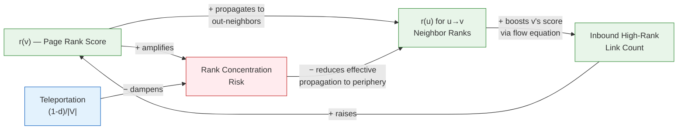

# Chapter 3: Link Analysis and PageRank

**Part 1: Classical Graph Analysis**

## Summary

Derives PageRank from random walk theory, covering power iteration, personalized PageRank, HITS, and the teleportation trick for handling dangling nodes and spider traps.

## Concepts Covered

This chapter covers the following 7 concepts from the learning graph:

1. PageRank
2. Personalized PageRank
3. HITS Algorithm
4. Random Walk
5. Stationary Distribution
6. Power Iteration
7. Teleportation (PageRank)

## Prerequisites

This chapter builds on:

- [Chapter 2: Graph Properties and Traditional ML Features](../02-graph-properties-and-features/index.md)

---

!!! mascot-welcome "Welcome to Chapter 3 — Let's Follow the Links"
    
    The web is a directed graph with billions of nodes and trillions of edges, and for decades the central problem in information retrieval was deceptively simple: which nodes matter most? The breakthrough that powered one of the most consequential software products in history was not a feature-engineering trick — it was a recursive definition of importance grounded in the mathematics of random walks. In this chapter we derive PageRank from first principles, confront the pathological cases that break the naive formulation, and then extend the framework into Personalized PageRank and the HITS algorithm. Every technique here is a building block for GNN aggregation strategies you will encounter starting in Chapter 6.

## 3.1 The Influence Problem

Before search engines could rank pages by content relevance, they confronted a deeper problem: any document can claim to be authoritative, but a self-proclaimed authority is worth little. Early keyword-based systems ranked pages by how often a search term appeared, which immediately invited manipulation — pages stuffed with repeated keywords dominated results regardless of actual quality. The structural insight that changed everything came from the observation that the web's link structure itself encodes credibility: a page earns authority not by claiming it but by being chosen as a link destination by other credible pages. This circularity — credibility conferred by credible sources — is precisely the kind of recursive relationship that graph algorithms are well suited to resolve.

The same structure appears throughout science and society. Academic papers gain influence by accumulating citations from influential papers; legal decisions acquire precedential weight by being cited in subsequent high-profile rulings; social media users accumulate reach by being followed by well-connected accounts. In every case, the question is the same: given only the link structure of a directed graph \( G = (V, E) \), assign a scalar importance score \( r(v) \) to each node \( v \in V \) such that the scores collectively respect the recursive definition of authority.

## 3.2 Random Walks: The Surfing Model

Before introducing any equations, it is worth building the correct physical intuition. Imagine a web surfer who, starting at an arbitrary page, repeatedly selects a hyperlink uniformly at random and follows it. Over time, the surfer traces a path through the graph, spending more time on pages that are frequently reached and less time on isolated backwaters. The fraction of total time steps spent at node \( v \) — in the limit, as the walk grows infinitely long — is precisely the PageRank score we want to assign to \( v \).

Formally, a **random walk** on a directed graph \( G = (V, E) \) is a discrete-time stochastic process \( \{v_0, v_1, v_2, \ldots\} \) defined by the transition rule: at each time step \( t \), if the current node is \( v_t \), the next node \( v_{t+1} \) is chosen uniformly at random from the out-neighbors of \( v_t \). That is,

\[
\Pr[v_{t+1} = u \mid v_t = v] = \frac{\mathbf{1}[(v, u) \in E]}{d^{\text{out}}(v)}
\]

where \( d^{\text{out}}(v) \) is the out-degree of \( v \). This rule defines a **Markov chain** on \( V \): the distribution over the next state depends only on the current state, not on the history of prior states. The entire walk is therefore determined by a single \( |V| \times |V| \) transition matrix \( M \), whose \((u, v)\)-entry is

\[
M_{uv} = \frac{\mathbf{1}[(v, u) \in E]}{d^{\text{out}}(v)}
\]

where the convention here is that column \( v \) of \( M \) encodes the transition probabilities *out* of \( v \). This makes \( M \) **column-stochastic**: every column sums to 1 (assuming \( d^{\text{out}}(v) > 0 \) for all \( v \)).

## 3.3 Stationary Distributions and Eigenvectors

The probability distribution over nodes at time \( t \) is a vector \( \mathbf{r}^{(t)} \in \mathbb{R}^{|V|} \) with \( r^{(t)}_v \geq 0 \) and \( \sum_v r^{(t)}_v = 1 \). Given an initial distribution \( \mathbf{r}^{(0)} \), the distribution at time \( t \) is

\[
\mathbf{r}^{(t)} = M^t \, \mathbf{r}^{(0)}
\]

A **stationary distribution** \( \mathbf{\pi} \) is one that satisfies \( M \mathbf{\pi} = \mathbf{\pi} \), meaning the distribution is unchanged by one step of the walk. In eigenvector language, \( \mathbf{\pi} \) is the eigenvector of \( M \) corresponding to eigenvalue 1. For a column-stochastic matrix, eigenvalue 1 is always guaranteed by the Perron–Frobenius theorem; whether it is *unique* and whether the chain *converges* to it depends on two structural properties of the chain.

A Markov chain is **irreducible** if every node is reachable from every other node — that is, the underlying directed graph is strongly connected. It is **aperiodic** if the greatest common divisor of all cycle lengths is 1, which prevents the chain from oscillating among states in a regular pattern. When both properties hold, the fundamental theorem of Markov chains guarantees that (a) a unique stationary distribution \( \mathbf{\pi} \) exists, (b) the chain converges to \( \mathbf{\pi} \) from any starting distribution, and (c) \( \pi_v \) equals the long-run fraction of time spent at \( v \). This convergence is exactly why the random surfer's visit frequency is a well-defined and meaningful score.

!!! mascot-thinking "The Eigenvector Insight"
    
    A recurring pattern in this chapter — and throughout graph ML — is that the "right" answer to a graph ranking problem turns out to be an eigenvector of a carefully constructed matrix. PageRank is the principal eigenvector of the Google matrix. HITS authority scores are the principal eigenvector of \( A^\top A \). Spectral clustering (Chapter 6) uses eigenvectors of the graph Laplacian. When you see an iterative "update and normalize" procedure converging to a fixed point, it is almost always implementing the power method for finding a leading eigenvector. Recognizing this unifying thread makes the mathematics of graph analysis considerably less intimidating.

## 3.4 PageRank: The Flow Formulation

With the statistical interpretation in place, we can now derive the defining equation of PageRank. Define \( r(v) \) as the stationary probability of node \( v \) under the random walk — equivalently, the fraction of the surfer's time spent at \( v \). Since each node \( u \) with an out-edge to \( v \) sends \( 1 / d^{\text{out}}(u) \) of its rank to \( v \), the balance equation for \( r(v) \) is

\[
r(v) = \sum_{u : (u, v) \in E} \frac{r(u)}{d^{\text{out}}(u)}
\]

This is the **flow formulation** of PageRank. Reading it aloud: the rank of \( v \) equals the sum over all pages \( u \) that link to \( v \) of \( u \)'s rank divided by \( u \)'s out-degree. The division by out-degree implements the "split evenly" rule — a page with 100 out-links contributes far less per link than a page with a single out-link. This equation must hold simultaneously for every node in the graph, yielding a system of \( |V| \) equations in \( |V| \) unknowns.

To see this concretely, consider the Zachary Karate Club graph — a network of 34 members of a university karate club, connected by an edge whenever two members interacted outside of club activities. Treating each undirected edge as two directed edges, the PageRank flow equation for the club instructor (node 0) accumulates contributions from all 16 members who interacted with them, weighted by each contributor's own influence and out-degree. Intuitively, we expect node 0 and the club president (node 33) — the two most structurally central members — to receive the highest PageRank scores, which is exactly what the algorithm produces.

## 3.5 PageRank: The Matrix Formulation

Writing the flow equations for all nodes simultaneously reveals the matrix structure. Stack the scores into a column vector \( \mathbf{r} \in \mathbb{R}^{|V|} \). The column-stochastic adjacency matrix \( M \) defined earlier encodes exactly the coefficients of the flow equations, so the entire system becomes

\[
\mathbf{r} = M \mathbf{r}
\]

This is an eigenvector equation: \( \mathbf{r} \) is the eigenvector of \( M \) with eigenvalue 1, which (for a well-behaved chain) is the unique stationary distribution. The **power iteration** algorithm exploits this structure: starting from the uniform distribution \( \mathbf{r}^{(0)} = \frac{1}{|V|}\mathbf{1} \), repeatedly apply

\[
\mathbf{r}^{(t+1)} = M \, \mathbf{r}^{(t)}
\]

until \( \|\mathbf{r}^{(t+1)} - \mathbf{r}^{(t)}\|_1 < \epsilon \) for some convergence threshold \( \epsilon \). Each iteration is a sparse matrix–vector product costing \( O(|E|) \) — the same as traversing the graph once — which makes PageRank tractable even on graphs with billions of edges.

The following table summarizes the two equivalent formulations and their respective strengths.

| Formulation | Equation | Primary Use |
|---|---|---|
| Flow | \( r(v) = \sum_{u \to v} r(u) / d^{\text{out}}(u) \) | Intuition and derivation |
| Matrix | \( \mathbf{r} = M \mathbf{r} \) | Algorithmic implementation and analysis |

## 3.6 Spider Traps and Dead Ends

The idealized random walk model breaks down in two well-known situations, both of which occur in any real-world web graph. Understanding them is essential before the algorithm can be deployed.

A **spider trap** is a subset \( S \subseteq V \) of nodes whose only outgoing edges lead back within \( S \) — in other words, a strongly connected component with no out-edges to the rest of the graph. Once the random surfer enters \( S \), they can never leave. Over time, all PageRank mass concentrates within \( S \), and nodes outside \( S \) converge to score zero regardless of how well-connected they are. Spider traps arise naturally on the web when a site uses relative internal links exclusively, or when crawlers generate URLs that cycle back into the same domain.

A **dead end** is a node \( v \) with \( d^{\text{out}}(v) = 0 \) — a page with no outgoing links. When the surfer reaches \( v \), the transition matrix has a column of zeros, violating the column-stochastic property. In practice, the surfer "falls off" the graph and the total probability mass leaks out of the system: \( \sum_v r^{(t)}_v \) decreases below 1 with each visit to a dead end, causing the entire rank vector to collapse toward zero asymptotically. Dead ends appear frequently in web crawls as pages whose links have not yet been fetched.

Both problems reduce, at root, to the same failure mode: the Markov chain defined by \( M \) is not irreducible, violating the condition required for a unique stationary distribution.

## 3.7 Teleportation: The Fix

The standard solution to both pathologies is **teleportation** — also called the damping factor or restart probability. Rather than always following a random link, the surfer follows a link with probability \( d \in (0, 1) \) (typically \( d = 0.85 \)) and with complementary probability \( 1 - d \) teleports instantaneously to a node chosen uniformly at random from all nodes in \( V \). Formally, the revised transition probability is

\[
\Pr[v_{t+1} = u \mid v_t = v] = d \cdot \frac{\mathbf{1}[(v, u) \in E]}{d^{\text{out}}(v)} + (1 - d) \cdot \frac{1}{|V|}
\]

This modification yields the **Google matrix**

\[
A = d \, M + \frac{1 - d}{|V|} \, \mathbf{1}\mathbf{1}^\top
\]

where \( \mathbf{1} \) is the all-ones column vector and \( \mathbf{1}\mathbf{1}^\top \) is the \( |V| \times |V| \) all-ones matrix. Every entry of \( A \) is strictly positive (since \( (1-d)/|V| > 0 \)), which implies that every pair of nodes communicates in a single step, making the chain both irreducible and aperiodic. By the Perron–Frobenius theorem, \( A \) has a unique stationary distribution \( \mathbf{r} \) satisfying \( A\mathbf{r} = \mathbf{r} \), and the power iteration \( \mathbf{r}^{(t+1)} = A\mathbf{r}^{(t)} \) converges geometrically at rate \( d \). The PageRank equation with teleportation is therefore

\[
\mathbf{r} = d \, M \mathbf{r} + \frac{1 - d}{|V|} \mathbf{1}
\]

Teleportation is not merely a numerical trick: it carries a meaningful interpretation. The \( (1-d) \) term ensures that even completely isolated or terminally trapped nodes receive some baseline rank, reflecting the real-world observation that a user bored with one part of the web might type a new URL rather than keep clicking. The parameter \( d \) controls the trade-off between structural fidelity (following the link graph) and coverage (exploring all nodes).

### 3.7.1 Causal Loop Diagram: PageRank Feedback Dynamics

Before examining the power iteration algorithm in detail, it is instructive to examine the feedback structure that makes PageRank both powerful and potentially unstable without teleportation. The diagram below depicts two interlocked feedback loops. Two structural properties are at play: a **reinforcing loop** (R) that amplifies rank through link propagation, and a **balancing loop** (B) that the teleportation term imposes to prevent runaway concentration.

#### Diagram: PageRank Feedback Loops



**R loop — Rank Propagation (green nodes):** A page's PageRank score propagates to its out-neighbors, boosting their inbound high-rank link counts, which in turn raises their scores. Those neighbors then propagate their elevated scores onward, creating a self-reinforcing amplification cycle. Without any dampening, highly-linked nodes would absorb all rank mass.

**B loop — Teleportation Dampening (blue node):** The (1-d)/|V| teleportation term injects rank uniformly at every node regardless of link structure. As rank concentration risk grows, this constant injection effectively dilutes the reinforcing loop's output, bounding the maximum achievable concentration. The balancing loop is what makes the stationary distribution well-defined and ensures every node retains nonzero rank.

## 3.8 Power Iteration

With teleportation in place, the power iteration algorithm is straightforward to implement. Before presenting the code, note three key quantities: `alpha` is the damping factor \( d \) (NetworkX uses the equivalent parameter with that name); `max_iter` is the maximum number of iterations before declaring non-convergence; and `tol` is the \( L_1 \)-norm convergence tolerance \( \epsilon \). In practice, \( \epsilon = 10^{-6} \) and at most 100 iterations suffice for graphs with millions of nodes.

```python
import networkx as nx
import numpy as np

# Load the Zachary Karate Club graph
G = nx.karate_club_graph()

# Built-in PageRank (uses power iteration internally)
pr = nx.pagerank(G, alpha=0.85, tol=1e-6, max_iter=100)

# Display top-5 nodes by PageRank
top5 = sorted(pr.items(), key=lambda x: x[1], reverse=True)[:5]
print("Top-5 PageRank nodes in Karate Club graph:")
for node, score in top5:
    print(f"  Node {node}: {score:.4f}")
```

Running this on the Karate Club graph produces node 0 (the instructor) and node 33 (the president) as the two highest-ranked nodes — the same individuals around whom the club eventually split — validating that PageRank captures structural influence even in social graphs with no explicit authority labels.

To understand the convergence dynamics, it is instructive to implement power iteration from scratch and track the \( L_1 \) error across iterations.

```python
def pagerank_power_iteration(G, d=0.85, tol=1e-6, max_iter=100):
    """
    Manual power iteration for PageRank.
    G: a NetworkX DiGraph (or undirected graph, treated as bidirectional)
    d: damping factor (probability of following a link)
    tol: L1-norm convergence threshold
    max_iter: maximum iterations before stopping
    Returns: dict mapping node -> PageRank score
    """
    N = len(G)
    nodes = list(G.nodes())
    node_idx = {v: i for i, v in enumerate(nodes)}

    # Build column-stochastic matrix M
    # M[i, j] = 1/out_degree(j) if edge j->i exists, else 0
    M = np.zeros((N, N))
    for v in nodes:
        out_neighbors = list(G.successors(v)) if G.is_directed() else list(G.neighbors(v))
        if out_neighbors:
            for u in out_neighbors:
                M[node_idx[u], node_idx[v]] = 1.0 / len(out_neighbors)
        # Dead-end handling: dangling nodes spread rank uniformly (teleportation handles this)

    # Initialize uniform distribution
    r = np.ones(N) / N

    for iteration in range(max_iter):
        # Apply Google matrix: r <- d*M*r + (1-d)/N * 1
        r_new = d * M @ r + (1 - d) / N * np.ones(N)
        # Check L1-norm convergence
        if np.abs(r_new - r).sum() < tol:
            print(f"Converged after {iteration + 1} iterations")
            break
        r = r_new

    return {nodes[i]: r[i] for i in range(N)}

# Treat undirected Karate Club as directed (both directions per edge)
G_directed = G.to_directed()
pr_manual = pagerank_power_iteration(G_directed, d=0.85)
```

!!! mascot-tip "Convergence Rate Depends on the Damping Factor"
    
    The geometric convergence rate of power iteration is bounded by the damping factor \( d \) — specifically, the error after \( t \) iterations is \( O(d^t) \). For the standard \( d = 0.85 \), this means errors decay by a factor of 0.85 per iteration, giving about 40 iterations to reach \( 10^{-6} \) precision. Setting \( d \) lower (e.g., \( d = 0.5 \)) accelerates convergence dramatically but changes the semantic meaning of PageRank, overweighting teleportation and underweighting link structure. In production systems, \( d = 0.85 \) is the industry consensus; tune it only if you have domain-specific evidence that a different value better reflects the task at hand.

## 3.9 Personalized PageRank

The teleportation step in standard PageRank distributes the "restart" probability uniformly across all nodes, producing a global notion of importance. **Personalized PageRank (PPR)** replaces the uniform teleportation target with an arbitrary probability distribution \( \mathbf{s} \in \Delta^{|V|-1} \) over nodes (a probability simplex vector), yielding a score that measures proximity relative to \( \mathbf{s} \). The PPR vector \( \mathbf{r}_{\mathbf{s}} \) satisfies

\[
\mathbf{r}_{\mathbf{s}} = d \, M \, \mathbf{r}_{\mathbf{s}} + (1 - d) \, \mathbf{s}
\]

When \( \mathbf{s} = \frac{1}{|V|}\mathbf{1} \), this reduces to standard PageRank. When \( \mathbf{s} = \mathbf{e}_q \) — a one-hot vector concentrating all probability on a query node \( q \) — the PPR vector \( \mathbf{r}_{\mathbf{e}_q}(v) \) measures how likely a random walk starting at \( q \) is to visit \( v \) before the walk resets. This is a powerful notion of **local graph proximity**: nodes structurally close to \( q \) in the link graph receive high PPR scores even if they have low global PageRank.

Several practically important tasks reduce to computing PPR scores:

- **Recommendation systems:** given a user's interaction history as query nodes, PPR identifies items in the same neighborhood; this underlies Pinterest's PinSage system.
- **Community detection:** nodes with high mutual PPR scores tend to belong to the same community, providing a soft alternative to modularity optimization.
- **GNN propagation:** the Approximate Personalized Propagation of Neural Predictions (APPNP) architecture replaces standard GNN message passing with PPR-based propagation, decoupling the propagation depth from the number of trainable layers and achieving competitive node classification accuracy with superior stability against over-smoothing.

In the Karate Club example, computing PPR with \( \mathbf{s} = \mathbf{e}_0 \) (teleporting only to the instructor, node 0) assigns high scores to the instructor's training group — nodes 1, 2, 3, 7, 11, 13 — which ultimately formed one of the two factions after the club's social split. PPR thus recovers community structure relative to a seed node without explicit community detection.

```python
def personalized_pagerank(G, query_node, d=0.85, tol=1e-6, max_iter=100):
    """
    PPR with teleportation concentrated on a single query node.
    Returns a dict of node -> PPR score relative to query_node.
    """
    N = len(G)
    nodes = list(G.nodes())
    node_idx = {v: i for i, v in enumerate(nodes)}

    # Build column-stochastic M (same as before)
    M = np.zeros((N, N))
    G_dir = G.to_directed()
    for v in nodes:
        out_neighbors = list(G_dir.successors(v))
        if out_neighbors:
            for u in out_neighbors:
                M[node_idx[u], node_idx[v]] = 1.0 / len(out_neighbors)

    # Teleportation vector: all mass on query node
    s = np.zeros(N)
    s[node_idx[query_node]] = 1.0

    r = s.copy()  # Initialize at query node
    for _ in range(max_iter):
        r_new = d * M @ r + (1 - d) * s
        if np.abs(r_new - r).sum() < tol:
            break
        r = r_new

    return {nodes[i]: r[i] for i in range(N)}

ppr_from_instructor = personalized_pagerank(G, query_node=0, d=0.85)
```

## 3.10 The HITS Algorithm

An alternative to PageRank that was developed concurrently assigns *two* scores to each node rather than one. The **Hyperlink-Induced Topic Search (HITS)** algorithm, introduced by Jon Kleinberg in 1999, observes that in topic-specific link graphs there are two distinct roles: **authorities** — nodes that contain high-quality, relevant information — and **hubs** — nodes that aggregate and point to many authorities. The two roles are mutually reinforcing: a good hub is one that points to good authorities, and a good authority is one that receives links from good hubs.

Formally, let \( \mathbf{a} \in \mathbb{R}^{|V|} \) denote the authority score vector and \( \mathbf{h} \in \mathbb{R}^{|V|} \) the hub score vector. Their defining equations are

\[
a(v) = \sum_{u : (u, v) \in E} h(u), \qquad h(v) = \sum_{(v, w) \in E} a(w)
\]

That is, the authority score of \( v \) is the sum of the hub scores of all pages that link *to* \( v \), and the hub score of \( v \) is the sum of the authority scores of all pages that \( v \) links *to*. Writing \( A \) for the adjacency matrix of \( G \), these equations become

\[
\mathbf{a} = A^\top \mathbf{h}, \qquad \mathbf{h} = A \mathbf{a}
\]

Substituting one equation into the other yields

\[
\mathbf{a} = A^\top A \, \mathbf{a}, \qquad \mathbf{h} = A A^\top \mathbf{h}
\]

so the authority scores are the principal eigenvector of \( A^\top A \) (the **co-citation** matrix) and the hub scores are the principal eigenvector of \( A A^\top \) (the **bibliographic coupling** matrix). The iterative algorithm applies the update rules alternately and normalizes after each step:

1. Initialize \( \mathbf{a}^{(0)} = \mathbf{h}^{(0)} = \frac{1}{\sqrt{|V|}}\mathbf{1} \)
2. Update: \( \mathbf{a}^{(t+1)} = A^\top \mathbf{h}^{(t)} \), then \( \mathbf{h}^{(t+1)} = A \mathbf{a}^{(t+1)} \)
3. Normalize: \( \mathbf{a}^{(t+1)} \leftarrow \mathbf{a}^{(t+1)} / \|\mathbf{a}^{(t+1)}\|_2 \), and similarly for \( \mathbf{h}^{(t+1)} \)
4. Repeat until \( \|\mathbf{a}^{(t+1)} - \mathbf{a}^{(t)}\|_2 < \epsilon \)

```python
def hits(G, max_iter=100, tol=1e-6):
    """
    HITS algorithm: returns (authority_scores, hub_scores) as dicts.
    Uses NetworkX's built-in implementation.
    """
    # nx.hits returns (hubs, authorities) — note the order
    hubs, authorities = nx.hits(G, max_iter=max_iter, tol=tol)
    return authorities, hubs

# Apply to the directed Karate Club graph
G_directed = G.to_directed()
auth, hubs_score = hits(G_directed)

top_auth = sorted(auth.items(), key=lambda x: x[1], reverse=True)[:3]
top_hubs = sorted(hubs_score.items(), key=lambda x: x[1], reverse=True)[:3]
print("Top authorities:", [(n, f"{s:.4f}") for n, s in top_auth])
print("Top hubs:", [(n, f"{s:.4f}") for n, s in top_hubs])
```

!!! mascot-warning "HITS Is Query-Dependent, Not Global"
    
    A common misconception is that HITS produces a global node ranking analogous to PageRank. In its original formulation, HITS is designed to run on a **topic-specific subgraph** retrieved for a particular query, not on the full web graph. Running HITS on the entire web graph makes it susceptible to **topic drift** and **mutually reinforcing spam communities** — tightly-knit sets of pages that link exclusively to each other and artificially inflate each other's hub and authority scores without providing genuinely useful content. PageRank's global, query-independent computation with teleportation is more robust to this type of manipulation. Both algorithms have their place, but be skeptical of HITS results on large, uncurated graphs without careful preprocessing.

## 3.11 Empirical Results

To ground these algorithms in practical performance, the following table compares PageRank, Personalized PageRank, and HITS across several graph analysis tasks, and then presents node classification accuracy on the Cora citation network using APPNP — a GNN architecture whose propagation rule is derived from the PPR fixed-point equation.

| Algorithm | Task | Graph Type | Strengths | Weaknesses |
|---|---|---|---|---|
| PageRank | Global importance ranking | Any directed graph | Global, query-independent, robust to spam | Cannot capture local or topical importance |
| Personalized PageRank | Local proximity / recommendation | Any directed graph | Query-relative, captures community proximity | Must recompute per query node |
| HITS | Hub/authority discovery | Topic subgraphs | Distinguishes information aggregators from sources | Vulnerable to topic drift on large graphs |

**Node classification accuracy (Cora, 2708 nodes, 5429 edges, 7 classes):**

| Method | Test Accuracy | Notes |
|---|---|---|
| GCN (Kipf & Welling, 2017) | 81.5% | Standard 2-layer GCN |
| GAT (Veličković et al., 2018) | 83.0% | Graph attention |
| APPNP (Klicpera et al., 2019) | **83.3%** | PPR propagation, separates feature transformation from propagation |
| APPNP (CiteSeer) | 71.8% | vs. GCN 70.3%, GAT 72.5% |

APPNP's competitive accuracy demonstrates that the PPR framework, derived from classical link analysis, translates directly into improved GNN architectures — the connection between this chapter and Part 2 of the textbook is more than historical.

!!! mascot-encourage "HITS Looks Complex — But the Pattern Is Familiar"
    
    The HITS update rule — alternating between authority and hub updates, then normalizing — can feel like a new machinery to learn on top of everything else in this chapter. Notice, however, that it is structurally identical to the power iteration you already understand, just applied to \( A^\top A \) and \( A A^\top \) instead of the Google matrix. Once you have internalized "repeatedly multiply by a matrix and normalize until convergence = find the principal eigenvector," HITS is simply that pattern applied twice in alternation. The apparent complexity is superficial; the underlying algorithm is the same one.

## 3.12 Common Pitfalls

Even experienced practitioners make systematic errors when implementing or interpreting PageRank-family algorithms. The following pitfalls are worth memorizing explicitly.

**1. Forgetting to handle dangling nodes before the damping factor.** If a node has zero out-degree, its column in the transition matrix is all zeros, violating the column-stochastic property. The standard fix is to replace dangling-node columns with \( \frac{1}{|V|}\mathbf{1} \) before applying the damping factor — that is, model dangling nodes as teleporting to all nodes uniformly. Failing to do this causes \( \|\mathbf{r}^{(t)}\|_1 \) to decay below 1, producing scores that do not form a proper probability distribution.

**2. Confusing in-degree centrality with PageRank.** High in-degree is necessary but not sufficient for high PageRank. A node with 1000 in-links from low-PageRank leaf nodes may have lower PageRank than a node with 5 in-links from highly authoritative hubs. The recursive structure of PageRank is the entire point; computing in-degree as a proxy discards it entirely.

**3. Setting the damping factor too high.** Values of \( d \) approaching 1 slow convergence dramatically (rate \( \approx d^t \)) and make PageRank excessively sensitive to spider traps and link structure artifacts. Values of \( d \) approaching 0 converge rapidly but produce near-uniform scores with little discriminative power. The value \( d = 0.85 \) is not arbitrary; it was empirically calibrated on early web crawl data and has been widely validated as the right balance.

**4. Running HITS on the full graph.** As noted above, HITS is designed for topic-specific subgraphs. On a large, heterogeneous graph, the principal eigenvectors of \( A^\top A \) can be dominated by dense, mutually-linking communities that bear no relation to the analyst's intended topic. Always scope the input graph to a relevant subgraph before applying HITS.

**5. Treating convergence in \( L_2 \) norm as equivalent to convergence in \( L_1 \) norm.** For PageRank specifically, the natural stopping criterion is \( \|\mathbf{r}^{(t+1)} - \mathbf{r}^{(t)}\|_1 < \epsilon \) (sum of absolute changes), because PageRank is a probability distribution and \( L_1 \) deviation has a direct probabilistic interpretation. The \( L_2 \) norm can appear to have converged (small Euclidean distance) while individual node scores are still shifting meaningfully in absolute terms.

## 3.13 MicroSim: PageRank Power Iteration

The following interactive simulation allows you to watch PageRank scores converge on a small configurable graph, visualizing both the evolving node sizes (proportional to rank) and the convergence curve.

#### Diagram: PageRank Power Iteration Simulator

<details markdown="1">
<summary>Interactive PageRank Power Iteration on a Small Graph</summary>
Type: MicroSim
**sim-id:** ch03-pagerank-power-iteration<br/>
**Library:** p5.js<br/>
**Status:** Specified

**Learning objective (Applying — Bloom's Level 3):** Students observe how the power iteration algorithm propagates rank through the graph over successive iterations, building intuition for why high-degree, well-connected nodes accumulate disproportionate rank, and how the teleportation parameter controls convergence speed.

**Canvas:** 900 × 520 px, responsive (resizes on window resize). Left panel (600 px): graph visualization. Right panel (300 px): convergence plot + controls.

**Default graph:** 8-node directed graph with a spider trap (nodes 6 and 7 form a two-node mutual loop with no exits), dead end (node 5 has no outgoing edge), and a hub-spoke cluster (node 0 links to nodes 1, 2, 3). This configuration lets students observe the pathological cases alongside normal behavior.

**Node rendering:** Each node is drawn as a circle whose radius is proportional to its current PageRank score (min 12 px, max 40 px). Node color transitions from light blue (low rank) to dark indigo (high rank) using a continuous color scale. Node ID is displayed inside the circle. Edges are drawn as curved arrows; edge color is gray. The node with the current highest rank is highlighted with a golden glow.

**Convergence plot (right panel):** A real-time line chart of \( \|\mathbf{r}^{(t+1)} - \mathbf{r}^{(t)}\|_1 \) on a log-scale y-axis against iteration number on the x-axis. A horizontal dashed line marks the convergence threshold \( 10^{-6} \).

**Controls (right panel beneath convergence plot):**

- **Damping factor slider:** \( d \in [0.5, 1.0] \), default 0.85, step 0.05. Updates label "d = 0.85". Changing \( d \) resets the iteration.
- **Step button:** Advances one power iteration step. Animates rank propagation: for 500 ms, draw arrows proportional to the rank being transferred along each edge.
- **Run / Pause button:** Runs iterations at 2 per second until convergence, then stops. Label changes between "Run" and "Pause".
- **Reset button:** Returns \( \mathbf{r}^{(0)} \) to uniform distribution, clears convergence plot.
- **Graph selector dropdown:** Presets — "Default (spider trap + dead end)", "Karate Club (10-node sample)", "Star graph", "Cycle graph (aperiodic test)". Each preset loads a different adjacency list.

**Interaction — node click:** Clicking a node opens an infobox overlay (positioned near the node) showing: node ID, current PageRank score (4 decimal places), in-degree, out-degree, and a mini-bar chart comparing this node's score to the top-3 nodes. Clicking elsewhere closes the infobox.

**Interaction — iteration counter:** A prominent "Iteration: 0" label at the top of the left panel updates each step. At convergence, the label changes to "Converged at iteration N" in green text.

**Implementation notes:** Maintain the rank vector as a Float64Array of length 8 (or the selected graph size). Matrix-vector multiplication performed in JavaScript. p5.js `draw()` is called only when the simulation state changes (non-animated state: `noLoop()`; animated steps re-enter `loop()` for 500 ms). For the Karate Club preset, use the 10 highest-degree nodes from the full Karate Club graph adjacency list embedded as a hard-coded constant.

</details>

## 3.14 Chapter Summary

This chapter derived PageRank and its principal variants from first principles, establishing a coherent framework for link-based node importance.

The central conceptual arc is:

1. **Random walk → stationary distribution:** A random surfer's long-run visit frequencies are the stationary distribution of the column-stochastic transition matrix — a solution to \( \mathbf{r} = M\mathbf{r} \).
2. **Pathologies → teleportation:** Spider traps and dead ends break irreducibility, destroying the unique stationary distribution. Teleportation — mixing the link-following rule with a uniform random restart at rate \( 1 - d \) — restores irreducibility and aperiodicity, yielding the Google matrix \( A = dM + \frac{1-d}{|V|}\mathbf{1}\mathbf{1}^\top \).
3. **Power iteration:** Repeated multiplication \( \mathbf{r}^{(t+1)} = A\mathbf{r}^{(t)} \) converges geometrically at rate \( d \) to the unique stationary distribution of \( A \).
4. **PPR:** Replacing the uniform teleportation target with a query-specific distribution yields Personalized PageRank, which measures local proximity and underlies both recommendation systems and the APPNP GNN architecture.
5. **HITS:** Assigning separate hub and authority scores via alternating eigenvector computation captures the distinction between information aggregators and information sources, at the cost of query-dependence and susceptibility to link spam.

**Key equations to remember:**

\[ r(v) = \sum_{u \to v} \frac{r(u)}{d^{\text{out}}(u)} \quad \text{(flow)} \]

\[ \mathbf{r} = dM\mathbf{r} + \frac{1-d}{|V|}\mathbf{1} \quad \text{(Google matrix fixed point)} \]

\[ \mathbf{r}_\mathbf{s} = dM\mathbf{r}_\mathbf{s} + (1-d)\mathbf{s} \quad \text{(Personalized PageRank)} \]

!!! mascot-celebration "You've Aggregated Real Knowledge"
    
    PageRank is one of the most studied algorithms in computer science — you now understand it at the mathematical level from which it was originally derived. More importantly, you have seen how the same idea (stationary distribution of a random walk) extends to Personalized PageRank and directly informs modern GNN propagation rules. In Chapter 4, you will meet random walks in a different role: as the engine that generates node embedding training data for DeepWalk and node2vec. The walk is the thread connecting classical graph algorithms to the neural era.

---

## 3.15 Exercises

### Remember

**R1.** State the flow formulation of PageRank: write the equation that defines \( r(v) \) in terms of the ranks and out-degrees of \( v \)'s in-neighbors. Identify each term and explain what it computes.

**R2.** Define the following four terms without consulting the chapter: (a) spider trap, (b) dead end, (c) damping factor, (d) stationary distribution. For each, give a one-sentence example of where it arises in a real-world graph.

### Understand

**U1.** Explain, in your own words, why a spider trap causes the PageRank of all nodes *outside* the trap to converge to zero. Your explanation should describe the flow of rank mass through the graph over successive power iterations and identify precisely where the conservation property breaks down.

**U2.** Explain why the HITS hub and authority scores satisfy \( \mathbf{a} = A^\top A \, \mathbf{a} \) and \( \mathbf{h} = A A^\top \mathbf{h} \). Derive these expressions from the original mutual reinforcement equations \( a(v) = \sum_{u \to v} h(u) \) and \( h(v) = \sum_{(v,w) \in E} a(w) \) by substitution.

### Apply

**A1.** Consider the following directed graph with 4 nodes: \( 1 \to 2, \, 2 \to 3, \, 3 \to 1, \, 3 \to 2 \). Compute PageRank by hand using damping factor \( d = 0.8 \) and the power iteration formula, starting from the uniform distribution \( \mathbf{r}^{(0)} = (0.25, 0.25, 0.25, 0.25) \). Perform 3 iterations and report the rank vector after each. Verify that nodes 1, 2, and 3 receive rank and node 4 converges to a stable (though low) value due to teleportation.

**A2.** Implement Personalized PageRank in Python using only NumPy (no NetworkX `pagerank` function). Apply it to the Zachary Karate Club graph with query node \( q = 33 \) (the club president) and damping factor \( d = 0.85 \). Report the top-5 nodes by PPR score and comment on whether the result recovers the president's social cluster (nodes 24–33 in Zachary's partition).

### Analyze

**An1.** Analyze how the convergence rate of power iteration changes as \( d \) varies from 0.5 to 0.99. Specifically: (a) derive the theoretical bound on the number of iterations required to achieve \( L_1 \) error \( < 10^{-6} \) as a function of \( d \); (b) compute this bound for \( d \in \{0.5, 0.7, 0.85, 0.95, 0.99\} \); (c) describe the trade-off between convergence speed and the semantic meaning of the PageRank scores.

**An2.** Compare the top-10 nodes by PageRank and by in-degree centrality on the Karate Club graph. Identify at least two nodes where the rankings disagree substantially and explain, in terms of the flow equation, why the discrepancy arises. What does this comparison reveal about the limitations of in-degree as a proxy for influence?

### Evaluate

**E1.** A colleague proposes using HITS (with hub and authority scores) instead of PageRank for ranking web pages in a general-purpose search engine. Critically evaluate this proposal. Identify at least three specific failure modes or limitations of HITS in this context, and for each, explain whether PageRank addresses the problem or shares it.

**E2.** Evaluate the appropriateness of Personalized PageRank versus global PageRank for each of the following tasks: (a) ranking academic papers by overall field-wide importance, (b) recommending papers similar to a specific seed paper, (c) detecting anomalous nodes in a financial transaction graph, (d) computing node features for input to a graph neural network. For each task, justify your choice and note any caveats.

### Create

**C1.** Design a **TrustRank** variant of PageRank for detecting web spam. Your design should: (a) define a set of "seed" trusted nodes and explain how to select them in practice; (b) specify the modified teleportation distribution that biases rank toward the trusted set; (c) describe the expected behavior — how spam pages (which are unlikely to be reachable from trusted nodes in few hops) should receive low scores; (d) implement TrustRank in Python using the PPR framework from this chapter.

**C2.** Graph Neural Networks that propagate node features across the graph can be interpreted as performing multiple rounds of a PageRank-like random walk. Design a **hybrid link analysis + GNN pipeline** for citation network node classification: (a) compute PPR scores from each node as the query, producing an \( |V| \times |V| \) proximity matrix; (b) describe how to use PPR scores as attention weights in a message-passing GNN layer, replacing learned attention with precomputed structural proximity; (c) discuss under what conditions this fixed-attention approach would outperform learned attention (GAT), and under what conditions it would underperform.

---

## 3.16 Further Reading

1. **Brin, S. & Page, L. (1998). The anatomy of a large-scale hypertextual Web search engine.** *Computer Networks and ISDN Systems, 30*(1–7), 107–117. The foundational paper introducing PageRank, including the original derivation, the teleportation fix, and early empirical results on the Stanford web crawl. Essential primary literature.

2. **Kleinberg, J. M. (1999). Authoritative sources in a hyperlinked environment.** *Journal of the ACM, 46*(5), 604–632. The paper that introduced HITS, including the convergence analysis showing that authority and hub vectors correspond to eigenvectors of \( A^\top A \) and \( A A^\top \). Beautifully written and historically significant.

3. **Langville, A. N. & Meyer, C. D. (2006). *Google's PageRank and beyond: The science of search engine rankings*.** Princeton University Press. A comprehensive textbook covering the linear algebra of PageRank, convergence theory, personalization, and TrustRank. The reference for mathematical depth on everything in this chapter.

4. **Klicpera, J., Bojchevski, A., & Günnemann, S. (2019). Predict then propagate: Graph neural networks meet personalized PageRank.** *ICLR 2019.* Introduces APPNP, demonstrating that replacing standard GNN propagation with PPR's fixed-point iteration achieves superior node classification accuracy while mitigating over-smoothing. The bridge from this chapter's theory to Part 2 of this textbook.

5. **Andersen, R., Chung, F., & Lang, K. (2006). Local graph partitioning using PageRank vectors.** *FOCS 2006.* Proves that a single PPR computation from a seed node can identify a community with near-optimal conductance in nearly linear time. The theoretical foundation for local community detection with PPR.

6. **Gyöngyi, Z., Garcia-Molina, H., & Pedersen, J. (2004). Combating web spam with TrustRank.** *VLDB 2004.* Extends PPR to spam detection by biasing teleportation toward a curated set of trusted seed pages. An instructive application of the framework introduced in this chapter, directly implementable using the PPR code above.

7. **Ying, R., He, R., Chen, K., Eksombatchai, P., Hamilton, W. L., & Leskovec, J. (2018). Graph convolutional neural networks for web-scale recommender systems.** *KDD 2018.* Describes Pinterest's PinSage system, which uses PPR-based neighborhood sampling to train GNNs on a graph with three billion nodes. A production-scale validation of the ideas in this chapter.
