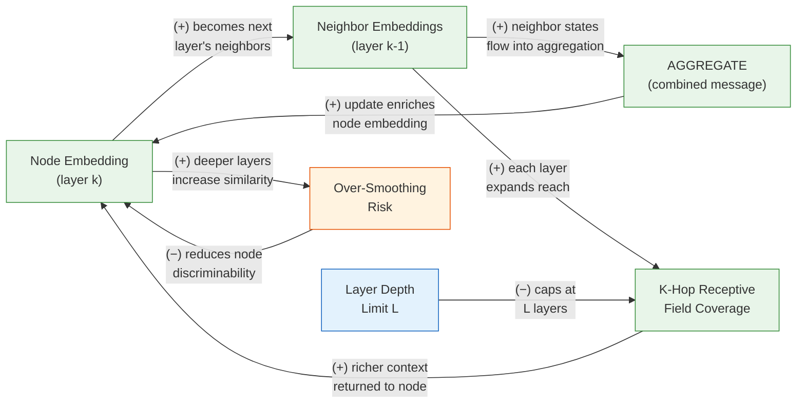

# Chapter 6: GNN Foundations: Message Passing and GCN

**Part 2: Graph Neural Networks**

## Summary

Derives the Graph Convolutional Network from spectral graph theory, introduces the message passing neural network framework, and establishes the spatial vs. spectral view of graph convolutions.

## Concepts Covered

This chapter covers the following 23 concepts from the learning graph:

1. Graph Neural Network (GNN)
2. Message Passing Neural Net
3. Message Function
4. Aggregation Function
5. Update Function
6. Graph Convolutional Network
7. Sum Aggregation
8. Mean Aggregation
9. Max Aggregation
10. Neighborhood Aggregation
11. K-Hop Neighborhood
12. Receptive Field (GNN)
13. Layer Depth (GNN)
14. Spectral Graph Convolution
15. Chebyshev Polynomial Conv
16. Graph Laplacian
17. Normalized Graph Laplacian
18. Spectral Domain (Graph)
19. Spatial Domain (Graph)
20. Spectral Clustering
21. Normalized Cut
22. PyTorch Geometric (PyG)
23. DGL

## Prerequisites

This chapter builds on:

- [Chapter 0: Math and Programming Prerequisites](../00-math-prerequisites/index.md)
- [Chapter 1: Introduction to Graphs and Networks](../01-intro-to-graphs/index.md)
- [Chapter 2: Graph Properties and Traditional ML Features](../02-graph-properties-and-features/index.md)
- [Chapter 3: Link Analysis and PageRank](../03-link-analysis-pagerank/index.md)
- [Chapter 4: Node Embeddings: DeepWalk and node2vec](../04-node-embeddings/index.md)
- [Chapter 5: Label Propagation and Semi-Supervised Learning](../05-label-propagation/index.md)

---

!!! mascot-welcome "Aggregating Knowledge — Welcome to Part 2"
    
    Welcome to Part 2 — the part of the textbook I have been waiting for. The first five chapters built an arsenal of classical tools: degree distributions, random walks, PageRank, label propagation. All of them aggregated information from a node's neighbors in some form. This chapter makes that aggregation **learnable**: instead of fixing a hand-designed rule for how neighbor information combines, we parameterize it with neural network weights and train those weights end-to-end on downstream tasks. The result is the Graph Neural Network — a framework so general that it subsumes nearly every method in this book as a special case. Your neighbors have insights too, and now we are going to learn exactly how much to listen to each of them.

---

## 6.1 Why Shallow Embeddings Aren't Enough

The node embedding methods of Chapter 4 — DeepWalk and node2vec — share a fundamental architectural limitation: they are **transductive**. Each node receives a dedicated embedding vector that is trained on a fixed graph; when a new node arrives (a newly registered user, a newly published paper), the model must be retrained from scratch to produce an embedding for it. More importantly, these methods are **feature-blind**: they exploit only the graph's topology and have no mechanism for incorporating node attributes such as user profiles, paper abstracts, or molecular bond descriptors.

What we need is a function \( f : (\mathbf{A}, \mathbf{X}) \to \mathbf{Z} \) that takes both the adjacency matrix \( \mathbf{A} \) and a node feature matrix \( \mathbf{X} \in \mathbb{R}^{|V| \times d} \) as input and produces node embeddings \( \mathbf{Z} \in \mathbb{R}^{|V| \times d'} \) as output, where this function **generalizes inductively** — a node unseen during training can receive an embedding by running \( f \) forward on its local neighborhood. Graph Neural Networks provide exactly such a function.

Consider the problem of predicting the toxicity of drug molecules, where each molecule is a graph — atoms as nodes, bonds as edges — and each atom has features such as atomic number, charge, and hybridization state. No two drugs have the same molecular graph, so any transductive method trained on one molecule cannot transfer to another. A GNN, by contrast, learns a shared aggregation function that operates on any graph's local structure and can generalize across the entire chemical space.

---

## 6.2 The Core Idea: Neighborhood Aggregation

Before formalizing the equations, the intuition is worth dwelling on. Imagine you are a node in a social network trying to characterize yourself. Your direct acquaintances (1-hop neighbors) tell you something about your immediate social circle. Their acquaintances (2-hop neighbors) tell you about the broader community you are embedded in. A Graph Neural Network formalizes this intuition into a computational procedure: at each layer \( k \), every node collects information from its immediate neighbors, combines that information with its own current representation, and produces a new, richer representation. After \( K \) layers, each node's representation encodes its entire \( K \)-hop neighborhood — the local subgraph structure that is uniquely characteristic of that node's position in the graph.

This procedure is called **neighborhood aggregation**, and it is the defining operation of GNNs. Three design questions determine what a specific GNN architecture does:

- **What information does each node send to its neighbors?** (the message function)
- **How are the arriving messages combined?** (the aggregation function)
- **How is the combined message merged with the node's current state?** (the update function)

Different choices for these three components yield different GNN architectures — GCN, GraphSAGE, GAT, GIN — all of which are instances of the same underlying framework.

---

## 6.3 The Message Passing Framework

The **Message Passing Neural Network** (MPNN) framework, introduced by Gilmer et al. (2017) to unify molecular property prediction models, provides the canonical formalism for GNNs. A single layer of an MPNN operates in two phases: a message-passing phase and an update phase.

**Message phase:** each directed edge \( (u, v) \) generates a message from node \( u \) to node \( v \) using a learned **message function** \( \phi^{(k)} \):

\[
\mathbf{m}_{u \to v}^{(k)} = \phi^{(k)}\!\left(\mathbf{h}_u^{(k-1)},\, \mathbf{h}_v^{(k-1)},\, \mathbf{e}_{uv}\right)
\]

where \( \mathbf{h}_v^{(k-1)} \) is node \( v \)'s representation at the previous layer, and \( \mathbf{e}_{uv} \) is an optional edge feature vector. The simplest message function is \( \phi^{(k)}(\mathbf{h}_u, \mathbf{h}_v, \mathbf{e}) = \mathbf{h}_u \), which passes the source node's representation directly without any transformation.

**Aggregation phase:** the messages arriving at node \( v \) from all its neighbors are combined by an **aggregation function** \( \bigoplus^{(k)} \):

\[
\mathbf{a}_v^{(k)} = \bigoplus_{u \in \mathcal{N}(v)} \mathbf{m}_{u \to v}^{(k)}
\]

**Update phase:** the aggregated message \( \mathbf{a}_v^{(k)} \) is merged with node \( v \)'s own previous-layer representation by an **update function** \( \gamma^{(k)} \):

\[
\mathbf{h}_v^{(k)} = \gamma^{(k)}\!\left(\mathbf{h}_v^{(k-1)},\, \mathbf{a}_v^{(k)}\right)
\]

Written as a single expression, the layer update is:

\[
\mathbf{h}_v^{(k)} = \text{UPDATE}^{(k)}\!\left(\mathbf{h}_v^{(k-1)},\; \text{AGGREGATE}^{(k)}\!\left(\left\{\phi^{(k)}(\mathbf{h}_u^{(k-1)}, \mathbf{h}_v^{(k-1)}, \mathbf{e}_{uv}) : u \in \mathcal{N}(v)\right\}\right)\right)
\]

with initialization \( \mathbf{h}_v^{(0)} = \mathbf{x}_v \) (the node's input feature vector).

### 6.3.1 The Three Aggregation Functions

The choice of aggregation function \( \bigoplus \) has profound consequences for a GNN's expressive power and inductive bias. Three aggregation functions are in widespread use, each with distinct properties that we will now define before comparing them.

**Sum aggregation** computes the element-wise sum of all incoming messages:

\[
\mathbf{a}_v^{(k)} = \sum_{u \in \mathcal{N}(v)} \mathbf{m}_{u \to v}^{(k)}
\]

Sum aggregation is **injective** on multisets: two nodes with different multisets of neighbor representations will (in principle) receive different aggregated values. This makes sum aggregation maximally expressive — a point we will revisit in depth in Chapter 9 (GNN Theory).

**Mean aggregation** normalizes the sum by the node's degree:

\[
\mathbf{a}_v^{(k)} = \frac{1}{|\mathcal{N}(v)|} \sum_{u \in \mathcal{N}(v)} \mathbf{m}_{u \to v}^{(k)}
\]

Mean aggregation is **degree-invariant**: a hub node with 1,000 neighbors and an ordinary node with 10 neighbors will produce comparable aggregated magnitudes, because the sum is normalized. This prevents high-degree nodes from dominating the optimization landscape and makes mean aggregation more numerically stable in practice.

**Max aggregation** takes the element-wise maximum across all incoming messages:

\[
\mathbf{a}_v^{(k)}\![j] = \max_{u \in \mathcal{N}(v)} \mathbf{m}_{u \to v}^{(k)}\![j], \quad \forall j
\]

Max aggregation is **set-size-invariant** and captures the most salient feature in the neighborhood — useful when the neighborhood's defining characteristic is the presence of a particular feature in at least one neighbor, rather than the average or total quantity across all neighbors.

The following table summarizes these three aggregation types, which we have now fully defined.

| Aggregation | Formula | Degree sensitivity | Expressiveness | Best when |
|---|---|---|---|---|
| Sum | \( \sum_{u} \mathbf{m}_u \) | High (grows with degree) | Maximally expressive | Neighborhood size is informative |
| Mean | \( \frac{1}{\|N(v)\|} \sum_{u} \mathbf{m}_u \) | None (normalized) | Can conflate distinct multisets | Stability / hub-heavy graphs |
| Max | \( \max_u \mathbf{m}_u \) | None | Detects presence, not quantity | Outlier features matter |

---

### 6.3.2 Causal Loop Diagram: GNN Message Passing Dynamics

Before examining how depth interacts with this loop, it is worth pausing to understand the feedback structure inherent in multi-layer message passing. Two loops operate simultaneously — one reinforcing, one balancing — and their interplay determines how GNNs behave as depth increases.

#### Diagram: GNN Message Passing Feedback Dynamics



**R loop (Representation Enrichment):** Node embedding (layer k) → neighbor embeddings (layer k-1) → AGGREGATE → enriched node embedding (layer k). Each layer's embedding feeds into the next layer's neighbor messages, which aggregate back into a richer representation. The loop is **reinforcing**: adding more layers gives each node access to progressively larger neighborhoods, compounding the information available at every step.

**B loop (Depth Ceiling):** the Layer Depth Limit \( L \) imposes a hard cap on how many times the reinforcing loop can fire — after \( L \) iterations, the receptive field stops expanding. This is a structural balancing loop, not a dynamic one: it does not push back against the R loop within a fixed-depth GNN, but it does prevent unbounded depth from being the default.

**B loop (Over-Smoothing):** a second balancing loop emerges as depth grows large — node representations become increasingly similar because every node is averaging information from its entire connected component. This suppresses node discriminability and acts as a negative feedback on the practical benefit of adding more layers.

## 6.4 K-Hop Neighborhoods and the Receptive Field

Before discussing depth in more detail, two terms need precise definitions. The **k-hop neighborhood** of node \( v \), written \( \mathcal{N}^k(v) \), is the set of all nodes reachable from \( v \) in exactly \( k \) steps (or, in the inclusive version, in at most \( k \) steps). The **receptive field** of a node \( v \) in a \( K \)-layer GNN is the set of nodes whose features influence \( v \)'s final representation: this is precisely \( \mathcal{N}^K(v) \) in the inclusive sense.

The computation graph of node \( v \) in a \( K \)-layer GNN is a tree rooted at \( v \), where the children of each node \( u \) at depth \( d \) are its neighbors in the original graph. Critically, this computation tree is **unique to each root node** — different nodes have different trees even though they share the same GNN weights. This is the key architectural insight: a GNN does not apply a single global computation; it applies a shared function locally around each node's own neighborhood structure.

The size of the receptive field grows as \( O(\bar{d}^K) \), where \( \bar{d} \) is the average degree. On typical social or citation networks with \( \bar{d} \approx 10 \), even \( K = 3 \) layers gives a receptive field of about 1,000 nodes — and at \( K = 6 \), it covers nearly the entire graph on most real networks (because the average path length in many real networks is 4–6 hops). This is both a strength and a liability, as we discuss next.

!!! mascot-thinking "The Computation Graph Insight"
    
    Here is the observation that took some researchers by surprise when GNNs were first analyzed theoretically: despite sharing weights across all nodes, a GNN computes a **different function** for each node. Node A's 2-hop computation tree is a different graph from node B's 2-hop computation tree — they just both use the same neural network weights to process their respective trees. This means the GNN weight-sharing is analogous to weight-sharing in a CNN across spatial positions: the same filter is applied everywhere, but the input to that filter is spatially local and position-dependent. The consequence is that GNNs are fundamentally local algorithms — a node's representation is only influenced by nodes within \( K \) hops, no matter how many layers you stack.

---

## 6.5 Layer Depth and the Over-Smoothing Horizon

**Layer depth** (the number of GNN layers \( K \)) is one of the most consequential hyperparameters in GNN design, and its behavior is non-intuitive. Naively, more layers seem better: each additional layer expands the receptive field by one hop, giving every node access to a richer context. In practice, GNNs with more than 3–4 layers almost universally perform worse than shallower counterparts on node classification benchmarks.

The reason is **over-smoothing**: as \( K \) increases, every node's representation converges toward the same global stationary distribution — the Personalized PageRank vector for the graph. Formally, the iterative aggregation \( H^{(k+1)} = \tilde{A} H^{(k)} \) (without the linear transform) converges as \( k \to \infty \) to a matrix where every row is proportional to the degree vector, making node representations identical up to degree scaling and eliminating all discriminative signal.

With a finite depth \( K \), over-smoothing is less catastrophic but still measurable: the mutual information between a node's representation and its original features decreases monotonically with depth. The practical implication is that most state-of-the-art GNN architectures use \( K \in \{2, 3\} \) layers for node classification and introduce explicit mechanisms — residual connections, jumping knowledge, or APPNP-style decoupled propagation — to achieve larger effective receptive fields without the over-smoothing penalty.

!!! mascot-warning "Deeper Is Not Always Better"
    
    If you come from a computer vision background, your intuition says "add more layers." On graphs, that intuition is dangerous. Every paper reporting GNN results includes a depth-ablation table — always look at it. If accuracy peaks at \( K = 2 \) and falls at \( K = 3 \), the graph has a short diameter and over-smoothing is the binding constraint. If accuracy still climbs at \( K = 5 \), the graph has long-range dependencies (e.g., molecules where bond paths matter over 5+ steps). Do not assume depth from a prior work will transfer to your graph.

---

## 6.6 The Graph Convolutional Network

The **Graph Convolutional Network** (GCN), introduced by Kipf and Welling (2017), is the foundational GNN architecture and remains the most widely used baseline. Its layer update rule is:

\[
H^{(k+1)} = \sigma\!\left(\tilde{D}^{-1/2}\, \tilde{A}\, \tilde{D}^{-1/2}\, H^{(k)}\, W^{(k)}\right)
\]

where:

- \( \tilde{A} = A + I \) is the adjacency matrix with self-loops added (so each node also aggregates its own features)
- \( \tilde{D} \) is the degree matrix of \( \tilde{A} \) (diagonal, \( \tilde{D}_{ii} = \sum_j \tilde{A}_{ij} \))
- \( W^{(k)} \in \mathbb{R}^{d^{(k)} \times d^{(k+1)}} \) is a learnable weight matrix for layer \( k \)
- \( \sigma \) is a non-linearity (typically ReLU for intermediate layers, softmax for the output layer on multi-class tasks)

For a single node \( v \), the GCN update is:

\[
\mathbf{h}_v^{(k+1)} = \sigma\!\left(W^{(k)} \cdot \sum_{u \in \mathcal{N}(v) \cup \{v\}} \frac{1}{\sqrt{\tilde{d}_v \tilde{d}_u}}\, \mathbf{h}_u^{(k)}\right)
\]

where \( \tilde{d}_v = \tilde{D}_{vv} \) is the degree of node \( v \) in \( \tilde{A} \). This is a **mean aggregation with symmetric degree normalization**: each neighbor's contribution is down-weighted by both the neighbor's own degree and the receiving node's degree, preventing high-degree nodes from disproportionately influencing their neighbors.

In the MPNN framework terms: the message function is \( \phi(h_u, h_v, e_{uv}) = \frac{1}{\sqrt{\tilde{d}_u \tilde{d}_v}} h_u \) (scaled source representation), the aggregation is sum, and the update function applies the linear transform \( W^{(k)} \) followed by the nonlinearity.

---

## 6.7 Spectral Graph Theory: The Mathematical Foundation

The GCN formula did not appear by intuition — it was derived from spectral graph theory. Understanding this derivation reveals why the specific normalization \( \tilde{D}^{-1/2} \tilde{A} \tilde{D}^{-1/2} \) appears and what it means mathematically.

### 6.7.1 The Graph Laplacian

The **Graph Laplacian** is the matrix \( L = D - A \), where \( D \) is the degree matrix and \( A \) is the adjacency matrix. The Laplacian is positive semi-definite and encodes the graph's differential structure: for any vector \( \mathbf{f} \in \mathbb{R}^{|V|} \),

\[
\mathbf{f}^T L \mathbf{f} = \sum_{(u,v) \in E} (f_u - f_v)^2
\]

This quadratic form measures the **total variation** of the signal \( \mathbf{f} \) across the graph — how much adjacent nodes differ in their values. Minimizing \( \mathbf{f}^T L \mathbf{f} \) subject to constraints forces \( \mathbf{f} \) to be smooth across edges, which is precisely the objective of label propagation from Chapter 5.

### 6.7.2 The Normalized Graph Laplacian

The **normalized (symmetric) Graph Laplacian** is:

\[
L_{\text{sym}} = D^{-1/2} L D^{-1/2} = I - D^{-1/2} A D^{-1/2}
\]

Its eigenvalues \( 0 = \lambda_0 \leq \lambda_1 \leq \cdots \leq \lambda_{n-1} \leq 2 \) are bounded in \( [0, 2] \) regardless of graph size, which is critical for numerical stability of spectral methods. The smallest eigenvalue \( \lambda_0 = 0 \) corresponds to the constant eigenvector (all ones), and the multiplicity of the zero eigenvalue equals the number of connected components.

### 6.7.3 The Spectral Domain of a Graph

In classical signal processing on \( \mathbb{R}^n \), the Fourier transform decomposes a signal into sinusoidal basis functions. On a graph, the analogue of sinusoidal basis functions is the **eigenvectors of the normalized Laplacian**. Given the eigen-decomposition \( L_{\text{sym}} = U \Lambda U^T \) (where columns of \( U \) are eigenvectors), the **graph Fourier transform** of a signal \( \mathbf{x} \) is:

\[
\hat{\mathbf{x}} = U^T \mathbf{x}
\]

and the **graph spectral convolution** of \( \mathbf{x} \) with a filter \( g_\theta \) (parameterized in the spectral domain) is:

\[
\mathbf{x} *_G g_\theta = U\left(g_\theta(\Lambda)\, U^T \mathbf{x}\right)
\]

where \( g_\theta(\Lambda) \) is a diagonal matrix applying the filter to each eigenvalue. This is the **spectral domain** view of graph convolution: define a filter in the eigenvalue space and transform back to the node space.

The limitation is computational: computing \( U \) requires full eigendecomposition of \( L \), which costs \( O(|V|^3) \) — completely infeasible for million-node graphs. The Chebyshev polynomial approximation resolves this bottleneck.

!!! mascot-encourage "The Spectral Derivation Is Worth It"
    
    The next few paragraphs involve a moderately dense mathematical argument. If spectral graph theory is new to you, the steps may feel unmotivated on first read — but they are worth following carefully, because the final result (the GCN formula) emerges inevitably from a sequence of principled approximations. Each approximation makes a specific trade-off between expressiveness and computational efficiency, and understanding those trade-offs will give you intuition for why GCN behaves the way it does on different graph structures.

### 6.7.4 Chebyshev Polynomial Convolution

To avoid the \( O(|V|^3) \) eigendecomposition, Defferrard et al. (2016) proposed parameterizing the spectral filter using **Chebyshev polynomials** \( T_k \). Chebyshev polynomials are defined by the recurrence \( T_0(x) = 1 \), \( T_1(x) = x \), \( T_k(x) = 2x T_{k-1}(x) - T_{k-2}(x) \), and they form an orthogonal basis on \( [-1, 1] \). Since the normalized Laplacian's eigenvalues lie in \( [0, 2] \), scaling to \( \tilde{L} = 2L_{\text{sym}}/\lambda_{\max} - I \) maps them to \( [-1, 1] \).

The Chebyshev spectral convolution with order \( K \) is:

\[
\mathbf{x} *_G g_\theta = \sum_{k=0}^{K} \theta_k\, T_k(\tilde{L})\, \mathbf{x}
\]

This is efficient because \( T_k(\tilde{L}) \mathbf{x} \) can be computed without ever forming \( U \): it requires only repeated sparse matrix-vector multiplications using \( \tilde{L} \), costing \( O(K \cdot |E|) \) rather than \( O(|V|^3) \). The filter has exactly \( K+1 \) learnable parameters \( \theta_0, \ldots, \theta_K \), and it is **\( K \)-hop localized** — the filter at node \( v \) depends only on nodes within \( K \) hops, because \( (T_k(\tilde{L}))_{uv} = 0 \) whenever the graph distance between \( u \) and \( v \) exceeds \( k \).

### 6.7.5 From Chebyshev to GCN: A First-Order Approximation

Kipf and Welling (2017) showed that restricting to \( K = 1 \) (a first-order Chebyshev polynomial filter) and making the approximation \( \lambda_{\max} \approx 2 \) yields:

\[
\mathbf{x} *_G g_\theta \approx \theta_0 \mathbf{x} + \theta_1 (L_{\text{sym}} - I)\, \mathbf{x} = \theta_0 \mathbf{x} - \theta_1 D^{-1/2} A D^{-1/2} \mathbf{x}
\]

Constraining to a single shared parameter \( \theta = \theta_0 = -\theta_1 \) (to prevent overfitting in the low-label-rate setting):

\[
\approx \theta\, (I + D^{-1/2} A D^{-1/2})\, \mathbf{x}
\]

The matrix \( I + D^{-1/2} A D^{-1/2} \) has eigenvalues in \( [0, 2] \), which can cause numerical instability in deep networks. The **renormalization trick** substitutes \( \tilde{A} = A + I \) and \( \tilde{D} \) (the degree matrix of \( \tilde{A} \)):

\[
I + D^{-1/2} A D^{-1/2} \;\longrightarrow\; \tilde{D}^{-1/2} \tilde{A}\, \tilde{D}^{-1/2}
\]

Stacking this across \( C_{\text{in}} \) input channels with a weight matrix \( W \in \mathbb{R}^{C_{\text{in}} \times C_{\text{out}}} \) and adding a nonlinearity gives the GCN layer:

\[
H^{(k+1)} = \sigma\!\left(\tilde{D}^{-1/2} \tilde{A}\, \tilde{D}^{-1/2}\, H^{(k)}\, W^{(k)}\right)
\]

The derivation reveals that GCN is not an arbitrary design choice but a principled, computationally efficient approximation to spectral graph convolution — specifically, a first-order localized filter with a renormalization trick for numerical stability.

---

## 6.8 Spectral Clustering and Normalized Cut

Spectral graph theory does not only motivate GCNs — it underlies the classical **spectral clustering** algorithm, which uses the Laplacian's eigenvectors to partition a graph into cohesive communities. Understanding spectral clustering clarifies the geometric meaning of the graph Laplacian and its eigenvectors.

The **Normalized Cut** (NCut) objective formalizes the intuition that a good graph partition should minimize the number of edges crossing between clusters while keeping clusters roughly balanced in size. For a bipartition into sets \( A \) and \( B = V \setminus A \):

\[
\text{NCut}(A, B) = \frac{\text{cut}(A, B)}{\text{vol}(A)} + \frac{\text{cut}(A, B)}{\text{vol}(B)}
\]

where \( \text{cut}(A, B) = \sum_{u \in A, v \in B} w_{uv} \) is the total weight of edges crossing the partition, and \( \text{vol}(A) = \sum_{u \in A} d_u \) is the sum of degrees within \( A \). Dividing by volume rather than size ensures that the partition cannot be gamed by cutting off a single isolated node.

Minimizing NCut over discrete cluster assignments is NP-hard. The key insight of spectral clustering is that the **second smallest eigenvector** \( \mathbf{u}_1 \) of \( L_{\text{sym}} \) (the Fiedler vector) provides a continuous relaxation: partitioning nodes by the sign of \( \mathbf{u}_1 \) approximately minimizes NCut. For \( k \) clusters, the algorithm uses the \( k \) smallest eigenvectors of \( L_{\text{sym}} \) as a \( k \)-dimensional embedding, then applies k-means in that space.

The spectral clustering algorithm thus operates in what we now recognize as the **spectral domain** of the graph: it decomposes the graph signal into eigenvector components and uses the low-frequency (small eigenvalue) components to identify cluster structure. The spatial domain (the actual graph topology) provides the input; the spectral domain (the Laplacian eigenstructure) provides the computational machinery.

#### Diagram: Spectral vs. Spatial GNN Explorer

<details markdown="1">
<summary>Interactive diagram comparing spectral and spatial views of graph convolution</summary>

**sim-id:** ch06-spectral-spatial-explorer<br/>
**Library:** p5.js<br/>
**Status:** Specified

**Learning objective:** Analyzing (Bloom's Level 4) — Students compare the spectral domain (Laplacian eigenvectors) and spatial domain (neighborhood aggregation) views of graph operations, identifying which operations are equivalent and which differ.

**Canvas:** 800×500px, responsive to window resize. Split into two labeled panels side by side:

**Left panel — Spatial Domain (400×500):**
- A 12-node graph drawn with force layout (fixed seed positions for determinism)
- Two seed nodes marked in orange; an interactive depth slider (K = 1, 2, 3) below the panel
- Clicking "Propagate" runs K rounds of mean aggregation from the seed nodes, with concentric highlight rings showing the receptive field expanding hop-by-hop (color: blue→teal→green by distance)
- Node labels show current h_v value (scalar, 2 decimal places) next to each node
- Title: "Spatial: K-hop neighborhood aggregation"

**Right panel — Spectral Domain (400×500):**
- A bar chart of the 12 eigenvectors (sorted by eigenvalue) of the normalized Laplacian
- Each bar colored by the eigenvalue magnitude (low = blue, high = red)
- Clicking a bar highlights the corresponding eigenvector values on the graph in the left panel (node colors = eigenvector component values, diverging colormap)
- A "low-pass filter" toggle: when on, zeros out all eigenvalues above a threshold (slider 0–λ_max), showing the smoothing effect of low-pass spectral filtering on the spatial graph
- Title: "Spectral: Laplacian eigenvectors"

**Interaction bridge:** actions in one panel synchronize to the other:
- Propagating K hops in the spatial view updates the spectral filter band in the right panel to show which frequency components are active
- Clicking a spectral eigenvector in the right panel highlights nodes by component magnitude in the left panel

**Hover tooltips:** every node shows "Node [id] | h_v: [value] | degree: [d]"; every bar shows "Eigenvector [k] | λ_k = [value]"

**Implementation notes:** pre-compute the 12-node graph's Laplacian eigendecomposition (all 12 eigenvalues and eigenvectors) as hardcoded arrays in the JavaScript. Use D3 or p5.js for rendering.

</details>

---

## 6.9 Spatial vs. Spectral: A Unifying View

The derivation above makes precise what practitioners observe intuitively: GCN and most modern GNNs operate in the **spatial domain** — they aggregate directly over neighborhoods — but their design can be motivated and analyzed using **spectral domain** reasoning. The spatial view gives computational efficiency (message passing is \( O(|E|) \) per layer); the spectral view gives theoretical insight into what frequencies a GNN can represent and why certain depth regimes cause problems.

The spatial domain contains all GNNs that can be expressed as \( h_v^{(k)} = f\!\left(h_v^{(k-1)}, \{h_u^{(k-1)} : u \in \mathcal{N}(v)\}\right) \) for some function \( f \). This includes GCN, GraphSAGE, GAT, GIN, and virtually every other named architecture. The spectral domain provides a complementary lens: a GNN with \( K \) layers and a mean aggregation is a \( K \)-th order polynomial low-pass filter on the graph — it smooths signals over neighborhoods of radius \( K \), suppressing high-frequency variations (adjacent nodes that differ significantly) while preserving low-frequency structure (slowly varying community-level signals).

!!! mascot-tip "Choosing Your Aggregation in Practice"
    
    Here is a decision heuristic that works in most practical settings. Start with **mean aggregation** (GCN-style) as your default: it is numerically stable, handles degree-heterogeneous graphs well, and achieves competitive performance on most benchmarks. Switch to **sum aggregation** if your task requires distinguishing neighborhood sizes (e.g., molecule property prediction where atom count matters). Switch to **max aggregation** if your task involves detecting the presence of specific features in the neighborhood (e.g., anomaly detection where one anomalous neighbor is all that matters). When in doubt: run a quick ablation with all three on a 10% validation split and let the data decide.

---

## 6.10 PyTorch Geometric and DGL

Two dominant Python libraries implement GNN research and production pipelines. Understanding both is practically important because research codebases and industry systems may use either.

**PyTorch Geometric (PyG)**, maintained by the PyG team (Fey and Lenssen, 2019), implements GNNs as a collection of `MessagePassing` base classes with a well-defined interface. PyG's design mirrors the MPNN formalism directly: subclassing `MessagePassing` requires implementing a `message()` method (the message function \( \phi \)) and optionally an `update()` method (the update function \( \gamma \)). PyG handles the edge-parallel message dispatch and aggregation internally. Its dataset ecosystem includes Planetoid (Cora, Citeseer, Pubmed), OGB, TUDataset, and many others. PyG uses a **COO (coordinate list) edge index** format: `edge_index` is a \( 2 \times |E| \) tensor where `edge_index[0]` contains source nodes and `edge_index[1]` contains destination nodes.

**Deep Graph Library (DGL)**, maintained by AWS and academic collaborators, provides a more explicit graph object abstraction: `DGLGraph` carries node/edge feature tensors directly. DGL's message-passing API uses `send_and_recv` or the higher-level `apply_edges` + `update_all` functions, which map cleanly onto the message and aggregation phases. DGL supports multiple backends (PyTorch, TensorFlow, MXNet) and emphasizes graph batching for heterogeneous-size graph classification tasks.

The following table summarizes the key practical differences.

| Dimension | PyTorch Geometric (PyG) | Deep Graph Library (DGL) |
|---|---|---|
| Graph representation | `edge_index` tensor (COO) | `DGLGraph` object |
| Message passing API | `MessagePassing` subclass | `apply_edges` + `update_all` |
| Backend support | PyTorch only | PyTorch, TF, MXNet |
| Heterogeneous graphs | `HeteroData` | `HeteroGraph` |
| Dataset ecosystem | Largest (Planetoid, OGB, …) | Strong (OGB, TUDataset, …) |
| Production readiness | High | High |

From Chapter 6 onward, all code examples in this textbook use PyTorch Geometric unless otherwise noted.

---

## 6.11 Code: GCN from Scratch, Then with PyG

The following two implementations — one manual, one using PyG — demonstrate the GCN layer on the Cora citation network (2,708 nodes, 5,429 edges, 7 classes, 1,433 features per node). Reading the manual implementation first makes PyG's abstraction transparent.

Before reading the code, note the key parameters: `hidden_channels` (16 by default in the original GCN paper) controls the width of the hidden layer; `dropout` (0.5) regularizes between layers. The `GCNConv` layer in PyG handles the \( \tilde{D}^{-1/2} \tilde{A} \tilde{D}^{-1/2} \) normalization and self-loop addition automatically.

```python
import torch
import torch.nn as nn
import torch.nn.functional as F
from torch_geometric.nn import GCNConv
from torch_geometric.datasets import Planetoid
from torch_geometric.utils import add_self_loops, degree

# ── Load Cora dataset ────────────────────────────────────────────────────────
dataset = Planetoid(root='/tmp/Cora', name='Cora')
data = dataset[0]
# data.x:          [2708, 1433] node feature matrix
# data.edge_index: [2, 5429]    COO edge index (undirected = each edge appears twice)
# data.y:          [2708]       node class labels (0–6)
# data.train_mask: [2708]       boolean mask — 140 training nodes

# ── Manual GCN layer (for transparency) ────────────────────────────────────
def gcn_layer_manual(x, edge_index, W, n):
    """
    x:          [N, d]    node features
    edge_index: [2, E]    COO edge index
    W:          [d, d']   learnable weight matrix
    n:          int       number of nodes
    """
    # Add self-loops to edge_index (Ã = A + I)
    src, dst = edge_index
    self_loops = torch.arange(n, device=x.device)
    src = torch.cat([src, self_loops])
    dst = torch.cat([dst, self_loops])

    # Compute degree-normalized adjacency: D̃^{-1/2} Ã D̃^{-1/2}
    deg = degree(dst, num_nodes=n)        # D̃ (degree in Ã)
    deg_inv_sqrt = deg.pow(-0.5)
    norm = deg_inv_sqrt[src] * deg_inv_sqrt[dst]  # per-edge normalization

    # Aggregate: h_v = Σ_{u∈N(v)∪{v}} norm_{uv} * x_u
    h = torch.zeros_like(x)
    h.scatter_add_(0, dst.unsqueeze(1).expand(-1, x.size(1)),
                   norm.unsqueeze(1) * x[src])

    # Linear transform + ReLU
    return F.relu(h @ W)

# ── PyG GCN model ───────────────────────────────────────────────────────────
class GCN(nn.Module):
    def __init__(self, in_channels, hidden_channels, out_channels):
        super().__init__()
        # GCNConv handles self-loop addition and symmetric normalization
        self.conv1 = GCNConv(in_channels, hidden_channels)
        self.conv2 = GCNConv(hidden_channels, out_channels)

    def forward(self, data):
        x, edge_index = data.x, data.edge_index
        x = F.relu(self.conv1(x, edge_index))   # Layer 1: [N, 1433] → [N, 16]
        x = F.dropout(x, p=0.5, training=self.training)
        x = self.conv2(x, edge_index)            # Layer 2: [N, 16] → [N, 7]
        return F.log_softmax(x, dim=1)

# ── Training loop ────────────────────────────────────────────────────────────
model = GCN(dataset.num_node_features, 16, dataset.num_classes)
optimizer = torch.optim.Adam(model.parameters(), lr=0.01, weight_decay=5e-4)

def train():
    model.train()
    optimizer.zero_grad()
    out = model(data)
    loss = F.nll_loss(out[data.train_mask], data.y[data.train_mask])
    loss.backward()
    optimizer.step()
    return loss.item()

def test():
    model.eval()
    out = model(data)
    pred = out.argmax(dim=1)
    accs = []
    for mask in [data.train_mask, data.val_mask, data.test_mask]:
        accs.append((pred[mask] == data.y[mask]).float().mean().item())
    return accs  # [train_acc, val_acc, test_acc]

for epoch in range(1, 201):
    loss = train()
    if epoch % 50 == 0:
        tr, va, te = test()
        print(f"Epoch {epoch:03d} | Loss: {loss:.4f} | "
              f"Train: {tr:.3f} | Val: {va:.3f} | Test: {te:.3f}")
```

After 200 epochs, this two-layer GCN should achieve approximately 81% test accuracy on Cora — a result that is both impressive (using only 140 labeled nodes out of 2,708) and characteristic of GCN's behavior on homophilic citation networks.

#### Diagram: GCN Message Passing Visualizer

<details markdown="1">
<summary>Interactive GCN message passing animation on the Karate Club graph</summary>

**sim-id:** ch06-gcn-message-passing<br/>
**Library:** p5.js<br/>
**Status:** Specified

**Learning objective:** Understanding (Bloom's Level 2) — Students observe how a GCN layer aggregates neighbor representations into a node's new embedding, developing intuition for the receptive field expansion across layers.

**Canvas:** 760×540px, responsive to window resize. Force-directed layout of the 34-node Karate Club graph with fixed seed positions.

**Initial state:**
- All nodes rendered as gray circles (radius proportional to degree, range 10–20px)
- Each node labeled with its current scalar feature value \( h_v^{(0)} \) (initialize to degree value normalized to [0,1])
- A layer counter: "Layer: 0 / K"

**Controls (below canvas):**
- **K slider** (1–3, integer): number of GNN layers to animate
- **Select node** button: click a node to highlight it as the "focal node" — messages from its neighbors will be animated
- **Step** button: animate one layer of message passing for the focal node
- **Reset** button: return to initial state

**Animation per step:**
1. **Message phase (1.2s):** animated arrows appear along all edges incident to the focal node, flowing from neighbors toward the focal node (color: gradient from gray to gold). Neighbor nodes briefly highlight (brighter outline).
2. **Aggregation phase (0.8s):** the arrows converge to a glowing circle at the focal node. A small text overlay shows "AGGREGATE: mean of [N] neighbors".
3. **Update phase (0.8s):** the focal node's color transitions smoothly from its current shade to its updated shade (new \( h_v \) value). The layer counter increments.

**Receptive field visualization:**
- When K > 1 and the user clicks Step multiple times, concentric rings highlight the 1-hop, 2-hop, 3-hop neighborhoods of the focal node in decreasing opacity (dark blue, medium blue, light blue).
- A sidebar panel lists: "Focal node: [id] | Degree: [d] | h_v after Layer [k]: [value]"

**Hover:** hovering any node shows "Node [id] | h_v: [value] | Neighbors: [list of IDs]"

**Implementation notes:** Pre-compute Karate Club adjacency as a hardcoded edge list. Use a simple numerical mean aggregation (\( h_v^{(k)} \leftarrow \text{mean}_{u \in N(v) \cup \{v\}} h_u^{(k-1)} \)) for the animation — no learned weights needed. Ensure arrows are curved slightly for visual clarity on bidirectional edges.

</details>

---

## 6.12 Benchmark Comparison

The following table reports node classification accuracy on two standard benchmarks: Cora (homophilic citation network, 2,708 nodes, 7 classes, 140 labeled nodes) and ogbn-arxiv (OGB citation network, 169,343 nodes, 40 classes, ~90K labeled nodes, 2020 publications as test set).

| Method | Cora Test Acc. | ogbn-arxiv Test Acc. | Parameters | Depth |
|---|---|---|---|---|
| GCN (Kipf & Welling 2017) | 81.5% | 71.7% | ~92K | 2 |
| GraphSAGE (Hamilton et al. 2017) | 82.0% | 71.5% | ~220K | 2 |
| GAT (Veličković et al. 2018) | 83.0% | 73.9% | ~365K | 2 |
| APPNP (Gasteiger et al. 2019) | 83.3% | — | ~92K | K=10 prop. |
| GCN + C&S (Huang et al. 2021) | 84.2% | 74.0% | ~92K | 2+post |
| RevGNN (Li et al. 2021) | — | 74.0% | ~1.8M | 112 |

GCN achieves strong performance on Cora with only two layers, illustrating that deep GNNs are rarely necessary on citation networks whose diameter is small. On ogbn-arxiv, attention (GAT) and post-processing (C&S) outperform base GCN, motivating the architectures explored in subsequent chapters.

---

## 6.13 Common Pitfalls

**1. Forgetting self-loops in GCN.** The GCN formula uses \( \tilde{A} = A + I \), not bare \( A \). Without self-loops, the update function cannot incorporate the node's own previous representation — it would aggregate only from neighbors, which is an asymmetric design that the normalization assumes away. PyG's `GCNConv` adds self-loops by default; if implementing manually, never forget this step.

**2. Applying GCN to a directed graph without symmetrization.** The symmetric normalization \( \tilde{D}^{-1/2} \tilde{A} \tilde{D}^{-1/2} \) assumes an undirected graph. On a directed graph, the degree counts are asymmetric and the formula is no longer a valid spectral approximation. Either symmetrize the adjacency before using GCN, or switch to a directed GNN architecture.

**3. Stacking more than 3 GCN layers without residual connections.** As discussed under over-smoothing, accuracy degrades rapidly beyond 3 layers on most node classification benchmarks. If your task requires long-range propagation, use APPNP (which decouples feature learning from propagation) or JK-Net (jumping knowledge) rather than simply adding more GCN layers.

**4. Confusing the spectral and spatial views of the same operation.** \( \tilde{D}^{-1/2} \tilde{A} \tilde{D}^{-1/2} H W \) is simultaneously (a) a first-order Chebyshev polynomial spectral filter and (b) a spatially localized mean aggregation with symmetric normalization. These two descriptions are mathematically equivalent; the spatial view is computationally efficient, while the spectral view explains what signal frequencies the operation amplifies or suppresses.

**5. Expecting PyG's `edge_index` to match your adjacency matrix's convention.** PyG stores edges as `(source, destination)` pairs in the COO format, with the convention that messages flow from `edge_index[0]` (source) to `edge_index[1]` (destination). If your adjacency matrix represents \( A_{ij} = 1 \) for an edge from \( j \) to \( i \) (column-source convention), you must transpose before passing to PyG. This mismatch is a common and subtle source of incorrect results.

---

!!! mascot-celebration "You Just Built a GNN"
    
    This chapter covered more ground than any other so far — 23 concepts, from the abstract MPNN framework down to the renormalization trick that makes GCN numerically stable, through spectral clustering and all the way to working PyG code. You now have everything you need to read the GCN paper itself (Kipf & Welling 2017) and understand every equation in it. More importantly, you have the conceptual vocabulary for the chapters ahead: GraphSAGE, GAT, GIN, and Graph Transformers are all instances of the MPNN framework you just learned, differing only in their choice of message function, aggregation function, and update function. Connect the dots and the pattern emerges.

---

## 6.14 Exercises

### Remember

1. State the three components of the Message Passing Neural Network (MPNN) framework and write the general layer-update equation using the `UPDATE` and `AGGREGATE` notation. Define each term precisely.

2. Define the **Graph Laplacian** \( L \) and the **normalized Graph Laplacian** \( L_{\text{sym}} \), giving the matrix formula for each. What are the eigenvalue bounds of \( L_{\text{sym}} \) for any graph, and what do the zero eigenvalues indicate about graph structure?

### Understand

3. The GCN symmetric normalization \( \tilde{D}^{-1/2} \tilde{A}\, \tilde{D}^{-1/2} \) can be interpreted as a weighted mean aggregation. Explain why this specific normalization (rather than row normalization \( \tilde{D}^{-1} \tilde{A} \)) preserves the spectral approximation derived from the Chebyshev polynomial framework. What property of \( \tilde{D}^{-1/2} \tilde{A}\, \tilde{D}^{-1/2} \) makes it preferable for spectral analysis?

4. Sum aggregation is described as more expressive than mean aggregation because it is injective on multisets. Construct a concrete example: give two distinct neighborhoods (specific neighbor feature vectors) that produce the **same** output under mean aggregation but **different** outputs under sum aggregation. What property of the two neighborhoods makes them indistinguishable under mean?

### Apply

5. A 3-node graph has adjacency \( A = \begin{pmatrix} 0&1&1\\1&0&0\\1&0&0 \end{pmatrix} \) and node features \( H^{(0)} = \begin{pmatrix}1\\0\\0\end{pmatrix} \) (a scalar feature per node). Compute \( H^{(1)} \) using the GCN formula \( H^{(1)} = \tilde{D}^{-1/2} \tilde{A}\, \tilde{D}^{-1/2} H^{(0)} W \) with \( W = 2 \) (a scalar). Show all intermediate matrices.

6. Implement a two-layer GCN from scratch in PyTorch (without using `GCNConv`) for a 4-node graph of your choice. Initialize \( W^{(1)} \) and \( W^{(2)} \) randomly, run a forward pass, and verify that the output dimensions are correct. Then implement the same network using `GCNConv` and confirm that the outputs match when the same weights are used.

### Analyze

7. On a **star graph** with one hub (degree 100) and 100 leaves (degree 1), how does mean aggregation differ from sum aggregation for the hub node's representation after one GNN layer? Which aggregation is more stable numerically, and which better preserves structural information about the hub's centrality? Analyze the trade-off precisely.

8. The receptive field of a \( K \)-layer GNN grows as \( O(\bar{d}^K) \), where \( \bar{d} \) is the average degree. On the ogbn-arxiv citation network (\( \bar{d} \approx 13.7 \)), compute the approximate receptive field size for \( K = 1, 2, 3 \). At what depth does the receptive field cover the entire 169,343-node graph? What does this imply about over-smoothing at that depth?

### Evaluate

9. Evaluate the claim: "GCN is just a linear model followed by softmax — it cannot learn nonlinear functions over graph structure." Specifically, identify what makes a 2-layer GCN nonlinear (point to the formula), explain why the number of layers matters for expressiveness, and describe what a 1-layer GCN with a linear activation actually computes. Is the claim correct in any meaningful sense?

10. Compare the spectral clustering approach (using the Fiedler vector of \( L_{\text{sym}} \)) with GCN-based node classification on the task of partitioning the Karate Club graph. What information does GCN use that spectral clustering does not? Under what conditions would spectral clustering outperform GCN, and under what conditions would GCN outperform spectral clustering?

### Create

11. Design a **directed GCN** variant that extends the standard GCN formula to directed graphs. Specifically, define separate weight matrices for in-neighbors and out-neighbors, and write the modified layer equation. Justify your normalization choice, and explain what information your design captures that the standard (symmetrized) GCN cannot.

12. Propose a **multi-scale GCN** architecture that computes node representations at multiple receptive field scales (\( K = 1, 2, 3 \)) and combines them adaptively. Write the architecture formally (including the combination function), identify the trainable parameters beyond the standard GCN weights, and describe what downstream tasks you expect this architecture to outperform a standard single-scale GCN on. Justify your answer by reference to the over-smoothing analysis in this chapter.

---

## 6.15 Further Reading

1. **Kipf, T. N., & Welling, M. (2017). Semi-supervised classification with graph convolutional networks.** *International Conference on Learning Representations (ICLR 2017).* The foundational GCN paper. Read the spectral derivation (Section 2.1) alongside this chapter's treatment; the renormalization trick and first-order Chebyshev approximation are explained step-by-step.

2. **Gilmer, J., Schütt, S. S., Riley, P. F., Vinyals, O., & Dahl, G. E. (2017). Neural message passing for quantum chemistry.** *Proceedings of ICML 2017.* Introduces the MPNN framework that unifies GCN, GG-NN, interaction networks, and molecular fingerprints into a single formalism. The framework in this chapter follows their notation directly.

3. **Defferrard, M., Bresson, X., & Vandergheynst, P. (2016). Convolutional neural networks on graphs with fast localized spectral filtering.** *Advances in Neural Information Processing Systems (NeurIPS 29).* Introduces ChebConv — the Chebyshev polynomial spectral convolution that GCN's first-order approximation simplifies. Understanding ChebConv is necessary for any serious spectral GNN work.

4. **Hamilton, W., Ying, R., & Leskovec, J. (2017). Inductive representation learning on large graphs.** *Advances in Neural Information Processing Systems (NeurIPS 30).* Introduces GraphSAGE, which generalizes GCN to inductive settings by learning a sampling-based aggregation function. The comparison between GCN's transductive training and GraphSAGE's inductive aggregation is essential for understanding when each applies.

5. **Fey, M., & Lenssen, J. E. (2019). Fast graph representation learning with PyTorch Geometric.** *ICLR Workshop on Representation Learning on Graphs and Manifolds.* The PyTorch Geometric paper. The `MessagePassing` base class design and the COO edge index format are described here; reading this alongside the code examples in this chapter will make the API transparent.

6. **Shi, J., & Malik, J. (2000). Normalized cuts and image segmentation.** *IEEE Transactions on Pattern Analysis and Machine Intelligence, 22(8).* The foundational Normalized Cut paper, originally in the computer vision context but directly applicable to graph partitioning. The spectral relaxation argument (Section III) is a masterpiece of applied linear algebra.

7. **Nt, H., & Maehara, T. (2019). Revisiting graph neural networks: All we have is low-pass filtering.** *arXiv:1905.09550.* A rigorous analysis showing that GCN with ReLU activations is a polynomial low-pass filter and that over-smoothing is the inevitable consequence of high-order (deep) filtering. The spectral/spatial equivalence argument in this chapter builds on this work.

8. **Bronstein, M. M., Bruna, J., Cohen, T., & Veličković, P. (2021). Geometric deep learning: Grids, groups, graphs, geodesics, and gauges.** *arXiv:2104.13478.* The comprehensive theoretical treatment of graph deep learning from first principles of symmetry and equivariance. Chapters 3–5 cover the spectral and spatial GNN derivations at graduate textbook depth.
