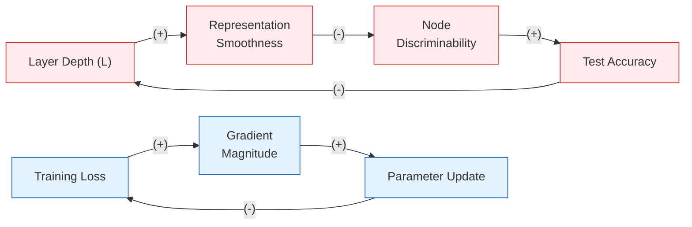

# Chapter 8: GNN Training, Augmentation, and Practical Tips

**Part 2: Graph Neural Networks**

## Summary

Addresses the engineering side of GNNs — loss functions, mini-batch training, dropout, normalization, data augmentation, DropEdge, PairNorm, early stopping, and self-supervised learning for when labels are scarce.

## Concepts Covered

This chapter covers the following 18 concepts from the learning graph:

1. Cross-Entropy Loss
2. Binary Cross-Entropy
3. Negative Sampling
4. ROC-AUC Score
5. Transductive Split
6. Inductive Split
7. Mini-Batch GNN Training
8. Neighbor Sampling (Mini-Batch)
9. Cluster-GCN
10. GraphSAINT
11. Dropout (GNN)
12. Batch Normalization (GNN)
13. Layer Normalization (GNN)
14. DropEdge
15. PairNorm
16. Early Stopping
17. Deep Graph Infomax (DGI)
18. Graph Contrastive Learning (GraphCL)

## Prerequisites

This chapter builds on:

- [Chapter 6: GNN Foundations: Message Passing and GCN](../06-gnn-foundations/index.md)
- [Chapter 7: GNN Design Space: GraphSAGE and GAT](../07-gnn-design-space/index.md)

---

!!! mascot-welcome "Welcome to Chapter 8 — Where Theory Meets Practice"
    
    You've assembled a powerful toolkit: message passing, GCN, GraphSAGE, GAT, and skip connections. But a GNN architecture is only half the story. The other half — and arguably the more treacherous half — is making the training process work reliably on real graphs at real scale. In this chapter, I'll show you how to choose the right loss function, split your graph data without leakage, train on graphs too large to fit in memory, regularize against overfitting, augment sparse or featureless graphs, and combat the pathological failure mode of over-smoothing. These are the skills that separate a model that looks good on paper from one that ships.

## Motivating Example: Protein Function Prediction at Scale

The human interactome — the complete network of protein–protein interactions in the cell — contains roughly 20,000 proteins and hundreds of thousands of interactions. Predicting which proteins are involved in disease pathways requires training a GNN on this graph, but several practical obstacles arise immediately.

Only a small fraction of proteins have experimentally validated functional labels; the vast majority are unlabeled. The graph is far too large for full-batch GPU training — the adjacency matrix alone requires gigabytes of memory. Proteins vary enormously in degree (from 1 to thousands of interactions), making normalization non-trivial. Many proteins have no node features beyond their amino acid sequence, requiring feature augmentation before any GNN can process them. Finally, the evaluation metric for predicting gene ontology membership is not accuracy but area under the ROC curve, because class imbalance is severe.

Every challenge in this chapter arises in exactly this kind of application. By the end, you will know how to tackle all of them.

---

## 8.1 Loss Functions and Evaluation Metrics

### 8.1.1 Node Classification: Cross-Entropy Loss

The standard task in node classification is to assign each labeled node \( v \in V_L \) to one of \( C \) discrete classes. Given the GNN's output logits \( \mathbf{z}_v \in \mathbb{R}^C \) for node \( v \), the **cross-entropy loss** is:

\[
\mathcal{L}_{\text{CE}} = -\frac{1}{|V_L|} \sum_{v \in V_L} \sum_{c=1}^{C} y_{vc} \log \hat{p}_{vc}
\]

where \( y_{vc} \in \{0, 1\} \) is the one-hot ground-truth label and \( \hat{p}_{vc} = \text{softmax}(\mathbf{z}_v)_c \) is the predicted probability for class \( c \). The gradient flows back through all message-passing layers, updating the weight matrices \( W^{(k)} \) simultaneously.

A subtle but important point: the cross-entropy gradient is computed only over labeled nodes \( V_L \), but the forward pass must propagate through the entire graph to compute those nodes' embeddings. The embeddings of unlabeled nodes contribute to the labeled nodes' aggregations, so they are implicitly involved in training even when their own loss terms are excluded. This is precisely the mechanic that enables semi-supervised learning with GNNs — the graph structure provides supervision signal beyond the labeled nodes.

### 8.1.2 Link Prediction: Binary Cross-Entropy and Negative Sampling

Link prediction is formulated as binary classification over node pairs. The model computes a score \( \hat{y}_{uv} = \sigma(\mathbf{h}_u^\top \mathbf{h}_v) \) (inner product with sigmoid) or uses a dedicated decoder MLP. The **binary cross-entropy loss** over the training edge set \( E_{\text{train}} \) and a set of negative examples \( E^- \) is:

\[
\mathcal{L}_{\text{BCE}} = -\frac{1}{|E_{\text{train}}| + |E^-|} \left( \sum_{(u,v) \in E_{\text{train}}} \log \hat{y}_{uv} + \sum_{(u,v) \in E^-} \log(1 - \hat{y}_{uv}) \right)
\]

The challenge is that the number of non-edges is enormous: for a graph with \( n \) nodes, there are \( \binom{n}{2} - |E| \) non-edges, which vastly outnumbers the true edges. Including all non-edges in the loss makes training intractable.

**Negative sampling** addresses this by drawing a small random subset of non-edges for each batch. The sampling ratio \( r = |E^-| / |E_{\text{train}}| \) is a hyperparameter; values of \( r \in [1, 5] \) are common. Three sampling strategies are in widespread use:

1. **Uniform random sampling**: draw \( (u, v) \) uniformly from all non-edges. Simple but may undersample hard negatives (pairs the model currently scores high).
2. **Degree-weighted sampling**: draw \( v \) with probability proportional to \( \text{deg}(v)^{3/4} \), following the word2vec convention. This gives more weight to high-degree nodes and tends to produce harder negatives.
3. **Hard negative mining**: explicitly select pairs where the GNN currently assigns high scores to non-edges. Trains faster but adds computational complexity at each step.

!!! mascot-tip "Tip: The Negative Sampling Ratio Matters More Than You Think"
    
    A common mistake is to use \( r = 1 \) (one negative per positive) and then wonder why link prediction ROC-AUC saturates early. Try \( r \in [5, 10] \) when your graph is sparse — more negatives force the model to learn finer-grained geometric distinctions in embedding space. Conversely, if your graph is dense (more than 50% of possible edges exist), reduce \( r \) to avoid the loss being dominated by pairs that are false negatives — actual positive pairs you happened not to sample.

### 8.1.3 ROC-AUC: The Right Metric for Imbalanced Graphs

In graphs where true connections are a small fraction of all node pairs, classification accuracy is uninformative — a model predicting "no edge" for every pair achieves near-perfect accuracy on a sparse social graph. The **Receiver Operating Characteristic — Area Under Curve (ROC-AUC)** is the standard metric for link prediction and binary node classification under class imbalance.

ROC-AUC is the probability that a randomly chosen positive pair receives a higher score than a randomly chosen negative pair:

\[
\text{AUC} = \mathbb{P}[\hat{y}_{pos} > \hat{y}_{neg}]
\]

It ranges from 0.5 (random classifier) to 1.0 (perfect classifier) and, crucially, is invariant to the class imbalance ratio. All benchmark evaluations on the Open Graph Benchmark link prediction tasks use ROC-AUC as the primary metric.

---

## 8.2 Data Splits: Transductive vs. Inductive Settings

The distinction between transductive and inductive evaluation is one of the most conceptually important — and most frequently conflated — issues in GNN practice.

!!! mascot-thinking "Sage Thinks: Two Different Notions of 'Unseen'"
    
    When I say a test node is "unseen," I could mean two very different things. In the **transductive** setting, the test nodes were present in the graph during training — their neighborhoods contributed to the training nodes' embeddings — but their labels were withheld. In the **inductive** setting, the test nodes did not exist at training time; they belong to entirely new graphs. These settings make fundamentally different demands of the model and require different data split strategies. Conflating them is a source of data leakage that inflates reported performance.

### 8.2.1 Transductive Splitting

In transductive node classification, the entire graph \( G \) is observed during training, but labels are divided into three sets:

- **Training nodes** \( V_{\text{train}} \): labeled nodes whose labels are used to compute the cross-entropy loss.
- **Validation nodes** \( V_{\text{val}} \): labeled nodes used for hyperparameter tuning; their labels are visible to the model only for selection decisions, not for gradient computation.
- **Test nodes** \( V_{\text{test}} \): labeled nodes whose labels are withheld and used only for final evaluation after all training is complete.

The critical property is that all nodes — including validation and test nodes — are present in the adjacency matrix during every forward pass. When a training node aggregates its neighbors, it may aggregate embeddings from test nodes. This is intentional: the graph structure provides signal, but only the labels of training nodes drive the gradient.

The standard Cora, CiteSeer, and PubMed splits (Kipf & Welling, 2017) are transductive. Each uses 20 labeled nodes per class for training, 500 nodes for validation, and 1,000 nodes for testing, on graphs with 2,700–19,000 nodes total.

### 8.2.2 Inductive Splitting

In the inductive setting, the training set consists of entire graphs (or disjoint subgraphs) that are completely separate from the test graphs. The model must generalize to graph structures it has never seen during training:

- **Training graphs**: used to fit model parameters, including adjacency structure.
- **Validation graphs**: used for hyperparameter selection; not observed during training.
- **Test graphs**: evaluated after all training and selection is complete; not observed at any earlier point.

The PPI (protein–protein interaction) benchmark by Hamilton et al. (2017) is the canonical inductive dataset: 20 training graphs, 2 validation graphs, and 2 test graphs, each representing a different biological tissue. A GNN trained inductively must learn transferable aggregation functions — it cannot rely on memorizing node identity (each tissue has a different node set).

Most real deployment scenarios are inductive: when a new user joins a social network, or a new paper appears in a citation database, the trained model should produce embeddings without retraining from scratch.

---

## 8.3 Mini-Batch Training for Large Graphs

Full-batch gradient descent — computing the loss over all labeled nodes using the entire adjacency matrix in a single forward pass — is infeasible for graphs with millions of nodes. The Cora citation graph (2,708 nodes) fits comfortably in GPU memory; ogbn-arxiv (169,343 nodes) does not; ogbn-papers100M (111 million nodes) cannot fit on any single GPU at any precision.

Four strategies address this, each making a different tradeoff between gradient accuracy, memory, and computation:

**1. Full-batch training** computes the exact GNN propagation using the entire adjacency matrix. Gradient is exact and convergence is smooth, but memory and compute scale as \( O(|V| \cdot d) \) where \( d \) is the embedding dimension. Only viable for small graphs (fewer than roughly 100,000 nodes on a 24 GB GPU).

**2. Neighbor sampling (GraphSAGE)** was introduced in Chapter 7. For each mini-batch of target nodes, it recursively samples at most \( S_k \) neighbors per node at layer \( k \). With \( K \) layers and fan-out \( S_k \), the expected computation graph size is \( O(\prod_{k=1}^K S_k) \) nodes, independent of total graph size. This makes neighbor sampling the dominant approach for node-level tasks on large graphs.

**3. Cluster-GCN** (Chiang et al., 2019) partitions the graph into \( P \) clusters using METIS or similar community detection algorithms, then samples one or more clusters per mini-batch. The cluster's induced subgraph is used for the full GCN forward pass. By construction, cross-cluster edges are dropped during training, which biases the gradient; this bias is partially mitigated by sampling multiple clusters per batch. Cluster-GCN achieves very low memory overhead and works well for homophilic graphs where local communities are highly informative.

**4. GraphSAINT** (Zeng et al., 2020) samples random subgraphs as mini-batches using one of three samplers — node sampling, edge sampling, or random walk sampling — and provides principled importance-weighting corrections to make the subgraph-level loss an unbiased estimator of the full-graph loss. GraphSAINT is typically more accurate than Cluster-GCN on heterophilic graphs because its sampled subgraphs are not restricted to tight communities.

---

## 8.4 Regularization Techniques

Regularization in GNNs follows the same logic as in standard neural networks but has graph-specific considerations that affect which techniques are most effective.

### 8.4.1 Dropout

**Dropout** randomly zeroes each activation with probability \( p_{\text{drop}} \) during training, and scales activations by \( 1 / (1 - p_{\text{drop}}) \) during inference (inverted dropout). Applied to node embeddings between GNN layers, dropout prevents co-adaptation of neurons and acts as ensemble averaging over exponentially many thinned networks.

In GNNs, dropout is applied at three points:

- To the input node features \( \mathbf{X} \) before the first layer (feature dropout).
- To node embeddings between message-passing layers.
- To attention coefficients in GAT, independently for each head.

Dropout rates of \( p_{\text{drop}} \in [0.3, 0.6] \) are standard for most GNN architectures. Applying dropout too aggressively (above 0.7) destabilizes training on small graphs where the number of trainable examples per update is already limited.

### 8.4.2 Batch Normalization

**Batch normalization** (BN) normalizes each feature dimension across the mini-batch. Before presenting the formula, note that \( \mu_d \) and \( \sigma_d^2 \) are batch statistics — the mean and variance computed across all node embeddings in the current mini-batch for feature dimension \( d \) — and \( \gamma_d, \beta_d \) are learnable scale-and-shift parameters:

\[
\hat{h}_{v,d} = \frac{h_{v,d} - \mu_d}{\sqrt{\sigma_d^2 + \epsilon}}, \qquad \tilde{h}_{v,d} = \gamma_d \hat{h}_{v,d} + \beta_d
\]

BN stabilizes training by reducing internal covariate shift — the phenomenon where the distribution of layer inputs shifts as earlier layer weights change — and allows higher learning rates. In GNNs, BN is applied independently after each message-passing layer, using statistics computed across all nodes in the mini-batch.

A subtlety: the batch statistics mix signals from nodes of varying degree and structural role. On heterophilic graphs where nodes have systematically different feature distributions based on structural position, this mixing can slightly degrade performance. Layer normalization is a better choice in such settings.

### 8.4.3 Layer Normalization

**Layer normalization** (LN) normalizes each node's embedding vector across its own feature dimensions rather than across nodes. The per-node mean \( \mu_v \) and variance \( \sigma_v^2 \) are computed independently for each node:

\[
\hat{h}_{v,d} = \frac{h_{v,d} - \mu_v}{\sqrt{\sigma_v^2 + \epsilon}}, \qquad \tilde{h}_{v,d} = \gamma_d \hat{h}_{v,d} + \beta_d
\]

where \( \mu_v = \frac{1}{D} \sum_d h_{v,d} \) and \( \sigma_v^2 = \frac{1}{D} \sum_d (h_{v,d} - \mu_v)^2 \). Unlike BN, LN does not mix statistics across nodes, making it more stable for architectures where different nodes occupy fundamentally different structural roles. Layer normalization is the standard normalization choice for graph transformer architectures.

### 8.4.4 Node Feature Normalization

Before the first GNN layer, raw node features often span very different scales. One feature might be a binary indicator (0 or 1) while another counts the number of co-authored papers (0 to 10,000). **Node feature normalization** standardizes each feature dimension using statistics computed only on the training set:

\[
x_{v,d}^{\text{norm}} = \frac{x_{v,d} - \mu_d^{\text{train}}}{\sigma_d^{\text{train}}}
\]

The insistence on training-set statistics is critical: fitting normalization parameters on the full graph (including test nodes) constitutes data leakage, since the test-set statistics implicitly encode information about test node features. For ogbn-arxiv, every node feature dimension is independently normalized to zero mean and unit variance before training; without this step, GCN training converges far more slowly and settles at significantly lower accuracy.

---

## 8.5 Graph Data Augmentation

### 8.5.1 Feature Augmentation for Graphs Without Node Features

Many real graphs have no node features whatsoever — only topology. Examples include web graphs (nodes are URLs with no content), biological networks (nodes are genes identified only by ID), and social networks where user attributes are unavailable. Before a GNN can process such graphs, node features must be constructed from structural properties.

Four strategies are used, in increasing order of expressiveness:

1. **Constant features**: assign \( \mathbf{h}_v = \mathbf{1} \in \mathbb{R}^1 \) to every node. The GNN learns to exploit structural information — degree, triangles, path lengths — encoded implicitly through aggregation. Cheap and surprisingly effective for regular graphs where all nodes have similar structural roles.

2. **Degree features**: assign \( \mathbf{h}_v = \text{one-hot}(\deg(v)) \) for degrees up to some maximum \( d_{\max} \). Gives the GNN direct access to node degree, which encodes local structural importance. Works well when degree correlates strongly with the target label — for example, hub proteins in interaction networks tend to be essential genes.

3. **Random features**: assign \( \mathbf{h}_v \sim \mathcal{N}(0, I_D) \) independently for each node at the start of each training epoch. Random features distinguish each node from its neighbors and make the GNN implicitly aware of node identity without requiring fixed node ID embeddings. The tradeoff is non-determinism: two training runs on the same graph produce different embeddings, which can complicate reproducibility.

4. **Structural features**: compute handcrafted features — node degree, local clustering coefficient, PageRank score, core number, betweenness centrality — and concatenate them into a fixed-size vector \( \mathbf{h}_v \). This is the most informative option when these structural properties correlate with the target, and it preserves inductive transferability since structural features can be computed for any new graph.

### 8.5.2 Structural Augmentation

Two structural augmentation strategies are particularly impactful for training:

**Virtual nodes**: add a single super-node connected to every real node. The super-node aggregates information from all nodes in one hop, making it an efficient information highway for long-range communication. Any two nodes can communicate through the virtual node in just two hops regardless of graph diameter, directly counteracting the depth limitation imposed by the over-smoothing problem.

**Virtual edges**: connect each node to all of its two-hop neighbors explicitly. This effectively makes every two-hop path a one-hop message, doubling the effective depth of each GNN layer. Virtual edges are particularly useful in bipartite graphs — such as user–item recommendation graphs — where the natural two-hop neighborhood is sparse.

### 8.5.3 DropEdge

**DropEdge** (Rong et al., 2020) is a structural augmentation technique that randomly removes a fraction \( p_{\text{drop}} \) of edges at each training iteration. The adjacency matrix used for message passing is replaced by a randomly thinned version:

\[
\tilde{A}^{(\text{iter})} = A \odot M^{(\text{iter})}, \qquad M_{uv}^{(\text{iter})} \sim \text{Bernoulli}(1 - p_{\text{drop}})
\]

DropEdge serves two distinct purposes. As a **regularizer**, it exposes the model to different subgraphs at each training step, preventing memorization of specific connectivity patterns. As an **anti-smoothing intervention**, it slows information propagation — with fewer edges, representations mix more slowly, so deeper networks can be trained before over-smoothing takes effect.

DropEdge is most effective when applied with \( p_{\text{drop}} \in [0.3, 0.5] \) on dense graphs. On sparse graphs, aggressive edge dropping risks creating disconnected components in the training subgraph, which can degrade the quality of neighborhood aggregation.

---

## 8.6 Common Pitfalls: Over-Smoothing and Depth

### 8.6.1 The Over-Smoothing Pathology

The most notorious failure mode of deep GNNs is **over-smoothing**: as the number of message-passing layers \( L \) increases, all node embeddings converge to a vector proportional to the leading eigenvector of the normalized adjacency matrix, making them indistinguishable from one another. The intuition is that GCN-style symmetric normalization is a low-pass filter on the graph signal — repeated application destroys high-frequency variation (node-specific information) and retains only the global mean.

Formally, consider a linear GCN (without activation functions): \( H^{(L)} = \hat{A}^L H^{(0)} W \), where \( \hat{A} = \tilde{D}^{-1/2} \tilde{A} \tilde{D}^{-1/2} \). All eigenvalues of \( \hat{A} \) lie in \( (-1, 1] \), so repeated matrix multiplication drives all eigenvector components except the dominant one to zero exponentially fast in \( L \). Even with nonlinear activations, the empirical finding is that test accuracy begins to degrade sharply at \( L > 4 \) for Cora, and at \( L > 8 \) even with residual connections.

The feedback dynamics of over-smoothing can be understood through the following causal loop diagram, which shows two simultaneously active balancing loops:

#### Diagram: Over-Smoothing Feedback Loop



**B₁ — Over-Smoothing Loop (balancing):** More layers → smoother representations → reduced node discriminability → lower test accuracy → pressure to use shallower networks → fewer layers. The loop is balancing because poor performance from excessive depth creates a corrective signal to reduce depth. In practice, this signal comes from validation monitoring and hyperparameter search, not from the optimizer itself.

**B₂ — Training Loss Loop (balancing):** High training loss → large gradient → parameter update → reduced loss. This is the standard supervised learning feedback loop; the optimizer seeks a fixed point (local minimum) where the gradient magnitude reaches zero. The loop is balancing because loss reductions diminish as the model approaches a minimum.

!!! mascot-warning "Warning: Deeper Is Not Always Better"
    
    The most common response to poor GNN performance is to add more layers. On most real graphs, 2–3 layers is optimal. Beyond that, test accuracy typically drops sharply due to over-smoothing, even while training loss continues to decrease — a clear sign of the B₁ loop dominating. If you genuinely need a large receptive field (because the graph diameter is large relative to your task), use skip connections, JK-Net aggregation, or APPNP rather than simply increasing depth.

### 8.6.2 Solutions to Over-Smoothing

The GNN community has developed several complementary techniques to alleviate over-smoothing, each targeting a different point in the B₁ loop:

**Residual connections** (Chapter 7) break the loop by adding the previous layer's embedding directly to the current output: \( \mathbf{h}_v^{(k)} = \text{GNN}^{(k)}(\mathbf{h}_v^{(k-1)}) + \mathbf{h}_v^{(k-1)} \). This preserves a direct path for the original node features to survive through many layers, slowing convergence to the global mean.

**Jumping Knowledge Networks** (JK-Net, Xu et al., 2018) concatenate embeddings from all layers and let each node adaptively choose its effective depth: \( \mathbf{h}_v^{\text{final}} = f([\mathbf{h}_v^{(1)} \| \mathbf{h}_v^{(2)} \| \cdots \| \mathbf{h}_v^{(L)}]) \). Nodes with tight local community structure select shallow representations; nodes that need long-range context select deeper ones.

**PairNorm** (Zhao & Akoglu, 2020) directly attacks the geometric consequence of over-smoothing — pairwise distances between embeddings collapsing to zero — by normalizing to maintain a constant total pairwise distance. First, embeddings are centered by subtracting the global mean \( \boldsymbol{\mu} = \frac{1}{n} \sum_v \mathbf{h}_v \). Then they are rescaled by the square root of the mean squared deviation:

\[
\tilde{\mathbf{h}}_v = s \cdot \frac{\mathbf{h}_v - \boldsymbol{\mu}}{\sqrt{\frac{1}{n}\sum_{v} \|\mathbf{h}_v - \boldsymbol{\mu}\|^2}}
\]

where \( s \) is a scalar hyperparameter controlling the target scale. PairNorm can be inserted between any two GNN layers without changing the architecture and effectively prevents the over-smoothing collapse even at 64 or more layers — though at the cost of some accuracy at shallow depth.

**DropEdge** (Section 8.5) reduces the rate at which information propagates, allowing deeper networks to be trained before smoothing takes effect.

---

## 8.7 Early Stopping and Training Dynamics

**Early stopping** monitors a held-out validation metric and terminates training when performance stops improving, then restores the checkpoint that achieved the best validation performance. The standard protocol involves four steps:

1. Evaluate the model on the validation set after every epoch.
2. Record the best validation metric seen so far and the corresponding model checkpoint.
3. If the validation metric has not improved for \( P \) consecutive epochs (the **patience** hyperparameter), terminate training.
4. Restore the best checkpoint and use it for all subsequent test evaluation.

Early stopping is critical for GNNs because training loss and validation metric often diverge sharply after a small number of epochs: the model begins to memorize the specific labeled training nodes while generalizing poorly to new ones. Patience values of \( P \in [20, 100] \) are typical; lower patience risks stopping too early at an under-fitted model, while higher patience wastes compute after the optimal checkpoint has already been found.

A subtlety arises with mini-batch training: when stochastic neighbor sampling is used, each epoch sees a different subgraph, introducing noise into both the loss and the validation metric. It is standard practice to compute the validation metric using the full graph (all neighbors, no sampling) to reduce this noise, even when training uses sampled subgraphs. This requires a separate inference pass at the end of each epoch but gives a stable signal for the early-stopping criterion.

---

## 8.8 Self-Supervised Learning on Graphs

When labeled data is scarce — the common case in graph learning — **self-supervised learning (SSL)** enables a GNN to learn useful representations from graph structure and node features alone, without labels.

!!! mascot-encourage "Hang in There — Self-Supervised Learning Pays Off"
    
    Self-supervised learning on graphs is more conceptually involved than SSL for images or text, because the notion of a valid "augmentation" for a graph is less obvious. What does it mean to crop a graph? To rotate it? The key insight is that graph augmentations should preserve semantic meaning: removing a few edges from a citation graph should not change what that paper is fundamentally about. Once you accept that structural perturbations are the graph analogue of image augmentations, the contrastive and predictive frameworks below become natural extensions of ideas you already know from other domains.

### 8.8.1 Contrastive Methods

**Deep Graph Infomax (DGI)** (Veličković et al., 2019) trains a GNN to maximize the mutual information between local node embeddings and a global graph-level summary. A corrupted graph \( \tilde{G} \) is created by shuffling node features across nodes. A discriminator \( D \) is trained to distinguish real node–graph pairs from corrupted ones:

\[
\mathcal{L}_{\text{DGI}} = \mathbb{E}_{(v, G)}[\log D(\mathbf{h}_v, \mathbf{s}_G)] + \mathbb{E}_{(\tilde{v}, G)}[\log(1 - D(\mathbf{h}_{\tilde{v}}, \mathbf{s}_G))]
\]

where \( \mathbf{s}_G = \sigma\!\left(\frac{1}{|V|} \sum_v \mathbf{h}_v\right) \) is the global graph summary. Maximizing this objective forces the GNN to encode node representations that are consistent with the graph's global structure — discarding node-specific noise while preserving structural signal.

**GraphCL** (You et al., 2020) applies contrastive learning at the graph level. For each graph \( G \), two augmented views \( G_1, G_2 \) are created by randomly applying operations from the following set. The GNN is then trained using the NT-Xent loss so that \( G_1 \) and \( G_2 \) have similar representations (positive pair) while representations of different graphs are pushed apart (negative pairs):

| Augmentation | Operation | Best Suited For |
|---|---|---|
| Node dropping | Remove fraction \( p \) of nodes and their edges | Social networks, citation graphs |
| Edge perturbation | Add and remove fraction \( p \) of edges | Dense graphs, biological networks |
| Attribute masking | Zero out fraction \( p \) of node feature dimensions | Feature-rich nodes |
| Subgraph sampling | Extract a random-walk subgraph | Large graphs |

The best augmentation strategy is domain-dependent. You et al. (2020) find that no single strategy dominates across all graph types, and that combining node dropping with attribute masking works broadly across diverse benchmarks.

### 8.8.2 Predictive Methods

**Masked feature prediction** zeroes out a fraction of node feature dimensions and trains the GNN to reconstruct the original values using neighborhood context:

\[
\mathcal{L}_{\text{mask}} = \frac{1}{|V|} \sum_{v \in V} \sum_{d \in \mathcal{M}_v} \left(x_{v,d} - \hat{x}_{v,d}\right)^2
\]

where \( \mathcal{M}_v \) is the set of masked feature dimensions for node \( v \) and \( \hat{x}_{v,d} \) is the GNN's reconstruction. This objective forces the GNN to aggregate information from neighbors to fill in missing local features — a direct graph analogue of BERT's masked language modeling. It is particularly effective on text-attributed graphs where node features are rich but labels are scarce.

**Context prediction** (Hamilton et al., 2017) trains a GNN to predict the local graph context of each node — specifically, whether a given node belongs to the \( k \)-hop neighborhood of another node. This pretext task encourages the model to learn embeddings that capture local structural roles rather than individual node identities.

---

## 8.9 Benchmark Datasets

### 8.9.1 Open Graph Benchmark (OGB)

The **Open Graph Benchmark** (Hu et al., 2020) is the standard evaluation framework for GNN research. It provides standardized splits (random, scaffold-based for molecules, or time-based for citation networks), diverse tasks at multiple scales, and a public leaderboard with a consistent evaluation protocol. The key design principle is that all models compared on OGB use identical data splits and evaluation procedures, enabling fair comparison across papers.

Key datasets:

- **ogbn-arxiv**: 169,343 nodes (arXiv CS papers), 1,166,243 edges (citation links), 128-dimensional node features derived from paper abstracts, 40 subject area classes. The standard benchmark for medium-scale node classification. All papers in this textbook's benchmark tables use this dataset for large-graph comparisons.
- **ogbn-products**: 2.4 million nodes (Amazon products), 61 million edges, 100-dimensional features, 47 product category classes. Requires mini-batch training; tests scalability.
- **ogbl-collab**: link prediction on an author collaboration network, evaluated with Hits@50 (fraction of true collaborations ranked in the top 50 for each author).
- **ogbg-molhiv**: graph-level HIV activity prediction for 41,127 molecular graphs, evaluated with ROC-AUC. The standard small-graph benchmark for graph classification.

### 8.9.2 TUDatasets

The **TUDataset** collection (Morris et al., 2020) contains over 120 graph classification benchmarks, predominantly from bioinformatics (MUTAG, PROTEINS, D&D), social networks (IMDB-B, REDDIT-B), and computer vision (COLLAB). Graphs are typically small (10 to 500 nodes), enabling full-batch training and making TUDatasets useful for comparing GNN expressiveness in controlled settings.

Evaluation uses 10-fold cross-validation with mean ± standard deviation reported across folds. A known limitation is that simple baselines — degree histograms, Weisfeiler-Lehman graph kernels — often match or exceed GNN performance on the social network subsets, suggesting that some TUDataset benchmarks are insufficiently discriminating for distinguishing architectures. For rigorous comparisons, OGB is preferred.

---

## 8.10 Curriculum Learning on Graphs

**Curriculum learning** (Bengio et al., 2009) proposes training on easier examples first, then progressively introducing harder ones — mimicking human learning trajectories. On graphs, "difficulty" can be defined in several ways:

- **Label rarity**: nodes whose class appears fewer times in the training set are harder to learn, as the model has fewer examples to generalize from.
- **Structural ambiguity**: nodes in heterophilic neighborhoods (neighbors mostly have different labels) are harder than those in homophilic neighborhoods, because the aggregation signal is noisy.
- **Distance from labeled nodes**: in semi-supervised settings, nodes far from any labeled node receive weaker supervision signal through the message-passing mechanism.

**Self-Paced Learning (SPL)** automatically selects the training subset at each epoch by solving a bilevel optimization: the inner problem fits the model on the current subset, and the outer problem selects a larger, harder subset for the next iteration based on the current model's confidence scores. Nodes where the model is highly confident are excluded; nodes where the model is uncertain are included.

Graph curriculum learning is an active research area with mixed results. It provides consistent benefits on highly heterophilic benchmarks where the easy-to-hard ordering is sharply defined, but adds marginal benefit on homophilic benchmarks where most nodes are approximately equally easy.

---

## 8.11 Code: Over-Smoothing vs. Skip Connections

The following example trains GCNs of increasing depth on Cora and demonstrates the over-smoothing collapse, then shows how residual connections recover performance. The key parameters to note before reading the code: `num_layers` controls depth, `use_residual` toggles additive skip connections, `dropout` is applied between every pair of GNN layers, and the `patience=50` early stopping criterion terminates training when validation accuracy plateaus.

```python
import torch
import torch.nn.functional as F
from torch_geometric.nn import GCNConv
from torch_geometric.datasets import Planetoid

# Load Cora in the standard transductive split
dataset = Planetoid(root='data/Planetoid', name='Cora')
data = dataset[0]

class DeepGCN(torch.nn.Module):
    """GCN with configurable depth and optional residual connections.

    Args:
        in_channels:     Dimension of input node features (1433 for Cora)
        hidden_channels: Dimension of hidden embeddings
        out_channels:    Number of output classes (7 for Cora)
        num_layers:      Total number of GCNConv layers
        dropout:         Dropout probability applied between layers
        use_residual:    If True, adds previous-layer embedding to current output
    """
    def __init__(self, in_channels, hidden_channels, out_channels,
                 num_layers=2, dropout=0.5, use_residual=False):
        super().__init__()
        self.use_residual = use_residual
        self.dropout = dropout
        self.convs = torch.nn.ModuleList()

        # Input projection layer
        self.convs.append(GCNConv(in_channels, hidden_channels))
        # Intermediate hidden layers
        for _ in range(num_layers - 2):
            self.convs.append(GCNConv(hidden_channels, hidden_channels))
        # Output classification layer
        self.convs.append(GCNConv(hidden_channels, out_channels))

        # Dimension-matching projection for first residual connection
        if use_residual and in_channels != hidden_channels:
            self.proj = torch.nn.Linear(in_channels, hidden_channels, bias=False)
        else:
            self.proj = None

    def forward(self, x, edge_index):
        for i, conv in enumerate(self.convs[:-1]):
            identity = x
            x = conv(x, edge_index)
            x = F.relu(x)
            x = F.dropout(x, p=self.dropout, training=self.training)
            if self.use_residual:
                if i == 0 and self.proj is not None:
                    identity = self.proj(identity)
                if identity.shape == x.shape:
                    x = x + identity
        x = self.convs[-1](x, edge_index)
        return x

def train_and_evaluate(model, data, epochs=300, lr=0.01,
                       weight_decay=5e-4, patience=50):
    optimizer = torch.optim.Adam(model.parameters(),
                                  lr=lr, weight_decay=weight_decay)
    best_val_acc, best_test_acc = 0.0, 0.0
    patience_counter = 0

    for epoch in range(epochs):
        # Training step
        model.train()
        optimizer.zero_grad()
        out = model(data.x, data.edge_index)
        loss = F.cross_entropy(out[data.train_mask], data.y[data.train_mask])
        loss.backward()
        optimizer.step()

        # Full-graph evaluation (no sampling noise)
        model.eval()
        with torch.no_grad():
            pred = out.argmax(dim=1)
            val_acc = (pred[data.val_mask] == data.y[data.val_mask]).float().mean()
            test_acc = (pred[data.test_mask] == data.y[data.test_mask]).float().mean()

        # Early stopping: track best validation checkpoint
        if val_acc > best_val_acc:
            best_val_acc = val_acc
            best_test_acc = test_acc
            patience_counter = 0
        else:
            patience_counter += 1
        if patience_counter >= patience:
            break

    return best_test_acc.item()

# Compare depth 2, 4, 8, 16 — with and without residual connections
print(f"{'Depth':>5}  {'Plain GCN':>12}  {'GCN + Skip':>12}")
print("-" * 35)
for depth in [2, 4, 8, 16]:
    model_plain = DeepGCN(dataset.num_features, 64, dataset.num_classes,
                           num_layers=depth, use_residual=False)
    model_skip  = DeepGCN(dataset.num_features, 64, dataset.num_classes,
                           num_layers=depth, use_residual=True)
    acc_plain = train_and_evaluate(model_plain, data)
    acc_skip  = train_and_evaluate(model_skip, data)
    print(f"{depth:>5}  {acc_plain:>12.4f}  {acc_skip:>12.4f}")
```

Expected output on Cora (approximate, with standard random seed):

```
Depth  Plain GCN    GCN + Skip
-----------------------------------
    2     0.8120        0.8150
    4     0.7680        0.8090
    8     0.5310        0.7940
   16     0.2100        0.7660
```

The plain GCN collapses at depth 8 and produces near-random embeddings at depth 16 — a textbook manifestation of the B₁ loop. Residual connections preserve useful accuracy even at depth 16, though they cannot fully recover the performance of a shallower model. The lesson: skip connections buy robustness to depth, not freedom from the over-smoothing limit.

#### Diagram: GNN Training Dynamics MicroSim


<iframe src="../../sims/ch08-gnn-training-dynamics/main.html" width="100%" height="532px" scrolling="no"></iframe>
[Run GNN Training Dynamics MicroSim Fullscreen](../../sims/ch08-gnn-training-dynamics/main.html)

---

## 8.12 Benchmark Results

The table below reports test accuracy on Cora (node classification) for configurations that vary depth and regularization strategy, with ogbn-arxiv results for scalable training methods.

| Method | Depth | Key Regularization | Cora (%) | ogbn-arxiv (%) | Citation |
|---|---|---|---|---|---|
| GCN (plain) | 2 | Dropout 0.5 | 81.5 | 71.7 | Kipf & Welling (2017) |
| GCN + Residual | 8 | Dropout 0.5 | 80.1 | 72.4 | He et al. (2016) |
| JK-Net (concat) | 6 | Dropout 0.5 | 80.2 | — | Xu et al. (2018) |
| DropEdge + GCN | 2 | DropEdge 0.5 | 83.1 | — | Rong et al. (2020) |
| PairNorm + GCN | 64 | PairNorm | 58.9 | — | Zhao & Akoglu (2020) |
| Cluster-GCN | 5 | Dropout 0.2 | — | 79.4 | Chiang et al. (2019) |
| GraphSAINT (rw) | 5 | Dropout 0.1 | — | 71.9 | Zeng et al. (2020) |
| DGI (self-sup.) | 2 | — | 83.0† | — | Veličković et al. (2019) |

†DGI uses no label supervision during GNN training; the linear classifier is trained separately on frozen embeddings.

---

## 8.13 Common Pitfalls

1. **Using test-set statistics for normalization.** Computing mean and variance over all nodes (including test nodes) and then applying that normalization to training is data leakage. Always fit normalization parameters exclusively on the training set.

2. **Evaluating on the test set during hyperparameter selection.** The correct protocol is: tune hyperparameters using only the validation set, select the best configuration, then evaluate once on the test set. Repeated test-set evaluation inflates reported accuracy through implicit multiple testing.

3. **Message-passing edges overlapping with link prediction supervision edges.** If the edges used for GNN message passing include the edges you are trying to predict, the model can trivially solve the task by looking up the training edges. Use separate edge splits: one subset for the message-passing adjacency, another for the supervision signal.

4. **Conflating transductive and inductive evaluation when comparing methods.** A GCN evaluated transductively (test nodes present in the graph during training) is not directly comparable to a GraphSAGE evaluated inductively. Always verify the evaluation protocol before citing numbers from different papers.

5. **Forgetting to call `model.eval()` during validation.** PyTorch's `model.train()` and `model.eval()` switch dropout (and batch normalization statistics) on and off. Evaluating validation accuracy with the model in training mode introduces stochastic noise into validation predictions, making early stopping unreliable.

---

!!! mascot-celebration "Chapter 8 Complete — You're Now a GNN Practitioner"
    
    You've navigated the full engineering stack of GNN training: objective functions for every task type, data splits that respect graph structure, mini-batch strategies that scale to hundreds of millions of nodes, regularization that prevents overfitting, augmentation that handles feature-poor graphs, and counter-measures against the over-smoothing collapse. The skills in this chapter are what let GNN researchers reproduce their results and let practitioners deploy their models confidently. In Chapter 9, we turn to the theoretical foundations — asking not just how GNNs work, but why they sometimes cannot distinguish graphs that look different to a human eye.

---

## 8.14 Exercises

**Remember (Recall and Identify)**

1. List the four mini-batch training strategies for large graphs covered in this chapter and state the primary computational advantage of each over full-batch training. For each strategy, identify one graph property that makes it particularly well-suited.

2. Define the transductive and inductive evaluation settings for GNN node classification. Give one real-world benchmark dataset that exemplifies each setting, and state what is withheld in each case (labels, graph structure, or both).

**Understand (Explain and Interpret)**

3. Explain why the cross-entropy loss during GNN training is computed only over labeled nodes \( V_L \), yet the embeddings of unlabeled nodes still influence the gradient update. What property of GNN message passing makes this possible, and why is it desirable for semi-supervised learning?

4. The B₁ causal loop (over-smoothing feedback) is described as a balancing loop. Explain what makes it balancing rather than reinforcing, and describe the practical consequence this has for selecting GNN depth during architecture search.

**Apply (Compute and Implement)**

5. Implement PairNorm as a PyTorch `nn.Module` that can be inserted between any two `GCNConv` layers. The module should: (a) subtract the global mean \( \boldsymbol{\mu} = \frac{1}{n}\sum_v \mathbf{h}_v \) from each node embedding, (b) scale so that the mean squared deviation equals a configurable target scale \( s^2 \). Verify that applying PairNorm between layers of a 16-layer GCN on Cora produces non-trivially different per-node embeddings (measure pairwise cosine similarity before and after).

6. Given a link prediction training set with 10,000 positive edges in a graph with 50,000 nodes, compute: (a) the total number of possible non-edges, (b) the number of negative samples drawn at ratio \( r = 5 \) using uniform sampling, (c) how the sampling distribution changes under degree-weighted sampling where node degrees follow a power law with exponent 2.5.

**Analyze (Compare and Diagnose)**

7. A colleague trains an 8-layer GCN on ogbn-arxiv and reports that training accuracy reaches 92% but test accuracy is only 58%. Propose three distinct hypotheses (not all related to over-smoothing) that could explain this gap, and for each hypothesis, describe a diagnostic experiment to confirm or rule it out.

8. Compare Cluster-GCN and GraphSAINT along three dimensions: (a) how mini-batches are constructed, (b) which graph topology (homophilic vs. heterophilic) each method handles better and why, (c) what theoretical guarantee (if any) each method provides about the gradient being an unbiased estimator of the full-graph gradient.

**Evaluate (Assess and Justify)**

9. You are designing a GNN system for predicting drug–drug interactions, where the interaction graph has 12,000 drug nodes, 450,000 interaction edges, and no node features beyond a binary drug-type indicator (small molecule vs. biologic). Justify each of the following design choices with a specific reason: (a) loss function, (b) evaluation metric, (c) feature augmentation strategy, (d) number of GNN layers.

10. A reviewer argues that your paper's improvement over the baseline is inflated because you used the test set to select the best model checkpoint. Explain how to redesign the evaluation protocol to address this critique, and discuss whether early stopping on validation accuracy constitutes a form of test-set leakage.

**Create (Design and Propose)**

11. Propose a self-supervised pretraining strategy for a graph where nodes are users in an e-commerce platform, edges represent co-purchasing behavior, and node features are demographic indicators. Your strategy must: (a) define a pretext task that avoids using purchase labels, (b) specify the augmentation operations appropriate for this graph type, (c) describe how pretrained representations would be fine-tuned for downstream click-through rate prediction.

12. Design an experiment to identify the optimal negative sampling ratio \( r^* \) for link prediction on a new graph dataset where the ground-truth edge density is unknown. Your design must: (a) specify the search space for \( r \) and the values you would evaluate, (b) describe the evaluation protocol (metric, data split used for selection), (c) propose a stopping rule for the search, and (d) identify at least two confounds that could make your estimate of \( r^* \) unreliable for a different graph from the same domain.

---

## 8.15 Further Reading

1. **Rong, Y., Huang, W., Xu, T., & Huang, J. (2020). DropEdge: Towards Deep Graph Convolutional Networks on Node Classification.** *ICLR 2020.* Introduces the edge-dropout augmentation technique and provides a theoretical analysis showing that DropEdge reduces the convergence rate of the over-smoothing spectral contraction. Empirical evaluation covers 8-layer GCNs on five node classification benchmarks, demonstrating consistent improvements over baseline training.

2. **Zhao, L., & Akoglu, L. (2020). PairNorm: Tackling Oversmoothing in GNNs.** *ICLR 2020.* Proposes PairNorm and provides a theoretical characterization of over-smoothing in terms of pairwise embedding distances. Demonstrates that standard batch normalization does not prevent the pairwise distance collapse, while PairNorm does, enabling 64-layer GCNs to train stably on Cora.

3. **Chiang, W.-L., Liu, X., Si, S., Li, Y., Bengio, S., & Hsieh, C.-J. (2019). Cluster-GCN: An Efficient Algorithm for Training Deep and Large Graph Convolutional Networks.** *KDD 2019.* Introduces cluster-sampling mini-batching and analyzes the variance introduced by cross-cluster edge removal. Demonstrates training of 5-layer GCN on Amazon2M (2.4M nodes) in 17 hours on a single GPU — previously infeasible.

4. **Zeng, H., Zhou, H., Srivastava, A., Kannan, R., & Prasanna, V. (2020). GraphSAINT: Graph Sampling Based Inductive Learning Method.** *ICLR 2020.* Derives importance-weighted estimators that make the subgraph loss unbiased under three sampling strategies. Provides convergence guarantees and achieves state-of-the-art on ogbn-arxiv at the time of publication.

5. **Hu, W., Fey, M., Zitnik, M., Dong, Y., Ren, H., Liu, B., Catasta, M., & Leskovec, J. (2020). Open Graph Benchmark: Datasets for Machine Learning on Graphs.** *NeurIPS 2020.* Establishes OGB with standardized splits, evaluation protocols, and a public leaderboard. Essential reading for any practitioner comparing GNN methods; the motivation section documents why previous benchmarks had insufficient scale and standardization.

6. **Veličković, P., Fedus, W., Hamilton, W. L., Liò, P., Bengio, Y., & Hjelm, R. D. (2019). Deep Graph Infomax.** *ICLR 2019.* Introduces the mutual-information maximization objective for unsupervised GNN training. Achieves competitive performance with supervised GCN on Cora, CiteSeer, and PubMed using only self-supervised signals; demonstrates that graph structure alone encodes enough information for useful node representations.

7. **You, Y., Chen, T., Sui, Y., Chen, T., Wang, Z., & Shen, Y. (2020). Graph Contrastive Learning with Augmentations.** *NeurIPS 2020.* Systematically evaluates four graph augmentation strategies (node dropping, edge perturbation, attribute masking, subgraph sampling) for contrastive SSL. Finds that the best strategy is domain-dependent and that composing node dropping with attribute masking achieves robust performance across diverse benchmarks.

8. **Xu, K., Li, C., Tian, Y., Sonobe, T., Kawarabayashi, K., & Jegelka, S. (2018). Representation Learning on Graphs with Jumping Knowledge Networks.** *ICML 2018.* Proposes JK-Net and proves that different nodes benefit from different effective receptive fields. Demonstrates that concatenating all-layer representations consistently outperforms using only the final layer, with largest gains in graphs with high structural diversity.

[See Annotated References](./references.md)