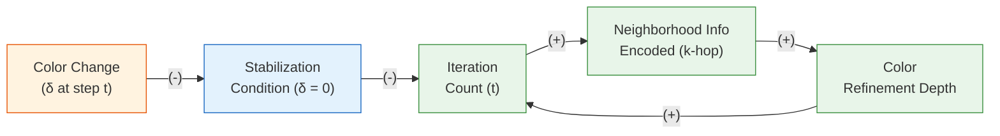

# Chapter 9: Theory of GNNs: Expressiveness and the WL Test

**Part 2: Graph Neural Networks**

## Summary

Proves rigorously why GNNs can and cannot distinguish certain graphs using the Weisfeiler–Leman test, derives GIN as the unique architecture achieving the 1-WL upper bound, and establishes over-squashing and permutation equivariance as the two fundamental theoretical constraints on message-passing networks.

## Concepts Covered

This chapter covers the following 13 concepts from the learning graph:

1. Graph Isomorphism Problem
2. Weisfeiler-Leman Test (1-WL)
3. GNN Expressiveness
4. Graph Isomorphism Network (GIN)
5. Sum Aggregation Injectivity
6. WL Test Limitations (Regular Graphs)
7. k-WL Hierarchy
8. Over-Squashing
9. Cheeger Constant
10. Over-Smoothing (Spectral View)
11. Permutation Invariance
12. Permutation Equivariance
13. Aggregator Expressiveness (Sum vs. Mean vs. Max)

## Prerequisites

This chapter builds on:

- [Chapter 6: GNN Foundations: Message Passing and GCN](../06-gnn-foundations/index.md)
- [Chapter 7: GNN Design Space: GraphSAGE and GAT](../07-gnn-design-space/index.md)
- [Chapter 8: GNN Training, Augmentation, and Practical Tips](../08-gnn-training/index.md)

---

!!! mascot-welcome "Welcome to Chapter 9 — The Theory Beneath the Practice"
    
    In the last three chapters, you built, trained, and regularized GNNs. Now it's time to ask harder questions: *why* do GNNs work, and — more importantly — *when* are they guaranteed to fail? Every model has a ceiling. Understanding a model's theoretical limits tells you when to trust its outputs and when to reach for a more expressive alternative. This chapter proves, rigorously, that message-passing GNNs are equivalent in power to the 1-WL color refinement test, derives the conditions under which they achieve that upper bound, characterizes the graphs they fundamentally cannot distinguish, and introduces two failure modes — over-smoothing and over-squashing — from a theoretical rather than purely empirical perspective.

## Motivating Example: Two Molecules, One Embedding

Consider two molecules whose graph representations are structurally distinct — they have the same number of atoms (nodes), the same number of bonds (edges), and every atom has the same degree, but the connectivity pattern differs. A chemist can visually see they are different; they have different physical properties. Yet a GNN trained on one of these molecules might assign them identical embeddings at every layer, making it impossible to distinguish their properties by any downstream classifier.

This is not a pathological corner case. It is a provable, structural consequence of using aggregation functions that cannot distinguish certain multisets of neighbor representations. Understanding why — and deriving the exact conditions under which a GNN *can* distinguish any two non-isomorphic graphs — is the central task of this chapter.

---

## 9.1 The Graph Isomorphism Problem

Two graphs \( G_1 = (V_1, E_1) \) and \( G_2 = (V_2, E_2) \) are **isomorphic** (written \( G_1 \cong G_2 \)) if there exists a bijection \( \phi: V_1 \to V_2 \) such that:

\[
(u, v) \in E_1 \iff (\phi(u), \phi(v)) \in E_2
\]

In words: the two graphs are structurally identical up to a relabeling of nodes. For graphs with node features, the bijection must also preserve all feature values: \( x_v = x_{\phi(v)} \) for every \( v \in V_1 \).

The **graph isomorphism problem** asks: given two graphs \( G_1 \) and \( G_2 \), are they isomorphic? Despite decades of effort, no polynomial-time algorithm is known for the general case, and the problem is not known to be NP-complete — it occupies the unusual status of being *NP-intermediate* (likely neither in P nor NP-complete). In practice, efficient heuristics and complete algorithms exist for restricted graph classes (bounded treewidth, planar graphs, bounded degree), but not for arbitrary graphs.

The connection to GNNs is direct: if a GNN assigns the same embedding to all nodes in both \( G_1 \) and \( G_2 \), then any graph-level representation derived from those embeddings will also be identical, making the graphs indistinguishable. A GNN's **distinguishing power** is the set of non-isomorphic graph pairs it can tell apart — producing different embeddings for at least one node in the two graphs.

!!! mascot-tip "Tip: 'More Powerful' Means 'Distinguishes Strictly More Non-Isomorphic Pairs'"
    
    When researchers say GNN-A is "more expressive" than GNN-B, they mean: every pair of non-isomorphic graphs that GNN-B can distinguish, GNN-A can also distinguish — plus at least one pair that GNN-B cannot. This forms a partial order on GNN architectures. GIN sits at the top of the 1-WL level; subgraph GNNs and higher-order methods sit above it. Knowing where your architecture falls in this hierarchy tells you which molecular structures or social patterns it is provably blind to.

---

## 9.2 The 1-WL Color Refinement Test

The **Weisfeiler-Lehman (WL) graph isomorphism test** is a classical combinatorial procedure for deciding whether two graphs are likely non-isomorphic. The most widely studied variant, called the **1-WL test** or **color refinement**, operates as follows.

Before presenting the CLD that captures its convergence dynamics, here is the algorithm itself:

**1-WL Algorithm:**

1. **Initialize**: assign every node the same initial color (label) \( c_v^{(0)} = c_{\text{init}} \). If nodes have features, use a hash of the feature vector as the initial color.
2. **Refine**: at each iteration \( t \), update every node's color by hashing its current color together with the sorted multiset of its neighbors' colors:

\[
c_v^{(t+1)} = \text{HASH}\!\left(c_v^{(t)},\ \left\{\!\left\{ c_u^{(t)} : u \in \mathcal{N}(v) \right\}\!\right\}\right)
\]

3. **Repeat** until no node's color changes between consecutive iterations (the coloring has reached a stable fixed point).
4. **Decide**: represent each graph as a histogram over its final node colors. If the two histograms differ, the graphs are **non-isomorphic**. If the histograms are identical, the test is **inconclusive** — the graphs may or may not be isomorphic.

The key property is that the HASH function must be injective: distinct inputs must produce distinct outputs. In practice, a collision-resistant hash (e.g., MD5 or a polynomial hash over sorted color lists) is used.

#### Diagram: WL Color Refinement Convergence — Causal Loop Diagram



**R₁ — Color Propagation (reinforcing):** Each refinement iteration encodes one additional hop of neighborhood information into every node's color. More iterations produce richer colors that capture deeper structural context, which drives further refinement iterations. This is a reinforcing loop: richer colors enable more discriminating HASH inputs, which yield richer colors at the next step.

**B₁ — Stabilization (balancing):** When all node colors stop changing between iterations — the color change δ reaches zero — the stabilization condition is met, which terminates the iteration count. This balancing loop prevents the reinforcing propagation from running indefinitely: the refinement converges to a stable fixed point in at most \( |V| \) iterations (since there are at most \( |V| \) distinct colors possible on a graph of \( |V| \) nodes).

### 9.2.1 Convergence Guarantee

The 1-WL test always terminates in at most \( |V| \) iterations. This follows because the number of distinct colors can only increase or stay constant at each step (the hash function is injective, so any new distinction between multisets creates a new color), and the number of distinct colors is bounded by \( |V| \). Once the colors stabilize, B₁ terminates the algorithm.

### 9.2.2 What 1-WL Captures

After \( t \) iterations, each node's color encodes the isomorphism class of its \( t \)-hop rooted subtree — the subgraph induced by all nodes reachable from \( v \) within \( t \) hops, rooted at \( v \). Two nodes that have the same \( t \)-step 1-WL color have identical \( t \)-hop rooted subtrees (up to isomorphism). This is exactly the structural information a \( t \)-layer GNN can access through message passing.

---

## 9.3 GNNs Are Bounded by 1-WL

The connection between GNNs and the 1-WL test is not merely analogical — it is a precise theorem. The critical observation is that the GNN update rule:

\[
\mathbf{h}_v^{(k+1)} = \text{UPDATE}^{(k)}\!\left(\mathbf{h}_v^{(k)},\ \text{AGGREGATE}^{(k)}\!\left(\left\{\!\left\{ \mathbf{h}_u^{(k)} : u \in \mathcal{N}(v) \right\}\!\right\}\right)\right)
\]

has the same functional form as the 1-WL color refinement: a node's new representation depends on its current representation and the multiset of its neighbors' current representations.

**Theorem (Xu et al., 2019):** Let \( G_1 \) and \( G_2 \) be any two non-isomorphic graphs. If the 1-WL test fails to distinguish \( G_1 \) from \( G_2 \) (outputs the same color histograms), then any GNN with the message-passing update rule above will also assign the same representation to the two graphs at every layer, for any choice of UPDATE and AGGREGATE functions.

*Proof sketch:* Proceed by induction on the layer index \( k \). At layer 0, both GNN and 1-WL start from the same initial node features (mapped to initial colors). Suppose at layer \( k \), nodes with the same \( k \)-step WL color have the same GNN embedding. Then at layer \( k+1 \), if two nodes \( u, v \) have the same \( (k+1) \)-step WL color, they have the same current color and the same multiset of neighbor colors at step \( k \). By the inductive hypothesis, they therefore have the same GNN embedding and the same multiset of neighbor GNN embeddings. Since UPDATE and AGGREGATE are (deterministic) functions, they produce the same output for identical inputs. Thus nodes with the same WL color have the same GNN embedding at every layer. If WL cannot distinguish the two graphs (same color histogram), neither can the GNN. □

This theorem establishes a hard ceiling: **no MPNN can be strictly more powerful than 1-WL**. The question then becomes whether existing GNNs *achieve* this ceiling or fall strictly below it.

---

## 9.4 GIN: Achieving the 1-WL Upper Bound

GCN's mean aggregation and GraphSAGE's max aggregation both lose information relative to the 1-WL test. To see why, consider two nodes \( v_1 \) and \( v_2 \) where \( v_1 \) has neighbors with embeddings \( \{[1,0], [1,0]\} \) and \( v_2 \) has neighbors with embeddings \( \{[2,0]\} \). The multisets are different, but mean aggregation produces the same output \( [1, 0] \) for both. Max aggregation also fails to distinguish them: \( [1, 0] \) vs. \( [2, 0] \) — in this case max would differ, but there exist other configurations where max collapses distinct multisets.

The fundamental requirement is that the aggregation function be **injective on multisets**: distinct multisets of neighbor embeddings must produce distinct aggregated outputs. Xu et al. (2019) proved that sum aggregation satisfies this requirement while mean and max do not.

!!! mascot-thinking "Sage Thinks: Why the (1 + ε) Term?"
    
    The GIN update rule includes a \( (1 + \epsilon) \) scaling of the node's own embedding before summing with its neighbors. Without it, a node with embedding \( [1, 0] \) and one neighbor with embedding \( [1, 0] \) would produce the same sum \( [2, 0] \) as a node with embedding \( [0, 0] \) and two neighbors with \( [1, 0] \). The self-loop weight \( \epsilon \) ensures the node can distinguish "I have this embedding and some neighbors" from "I have a different embedding and different neighbors." When \( \epsilon = 0 \), the model is still at least as powerful as GCN; when \( \epsilon \) is learned or set to a non-zero constant, it achieves full 1-WL power.

**GIN Update Rule:**

\[
\mathbf{h}_v^{(k+1)} = \text{MLP}^{(k)}\!\left((1 + \epsilon^{(k)}) \cdot \mathbf{h}_v^{(k)} + \sum_{u \in \mathcal{N}(v)} \mathbf{h}_u^{(k)}\right)
\]

where \( \epsilon^{(k)} \) is either a learnable scalar or a fixed constant (often 0), and \( \text{MLP}^{(k)} \) is a multi-layer perceptron applied to the aggregated embedding.

**GIN Theorem (Xu et al., 2019):** A GNN is as powerful as the 1-WL test if and only if its aggregation scheme is injective on multisets of node embeddings. GIN with sum aggregation and a sufficiently expressive MLP (at least two layers with sufficient width) achieves exactly this — it is the unique maximally expressive 1-WL-equivalent GNN up to the choice of MLP.

The sufficiency of sum for multiset injectivity follows from the fact that, over a countable domain, there always exists a function \( \phi: \mathbb{R}^d \to \mathbb{R}^{d'} \) such that \( \sum_{u \in S} \phi(\mathbf{h}_u) \) uniquely encodes any multiset \( S \). The MLP in GIN approximates this \( \phi \).

### 9.4.1 Aggregator Expressiveness Hierarchy

The expressiveness comparison of aggregation functions can be ranked precisely:

| Aggregator | Injective on Multisets? | 1-WL Equivalent? | Notes |
|---|---|---|---|
| **Sum** | Yes | Yes (with MLP) | GIN; maximum 1-WL power |
| **Mean** | No | No | Loses count information; collapses \( \{a, a\} \) and \( \{a\} \) |
| **Max** | No | No | Loses multiplicity; collapses \( \{a, b, b\} \) and \( \{a, b\} \) |
| **Attention-weighted** | No in general | No | Depends on learned weights; can be injective under specific conditions |

---

## 9.5 What 1-WL (and Standard GNNs) Cannot Distinguish

The 1-WL test is a sufficient condition for non-isomorphism, not a necessary one: if WL says two graphs differ, they are definitely non-isomorphic; but WL can fail to distinguish graphs that are actually non-isomorphic. Understanding which graphs WL fails on is equivalent to understanding the blind spots of every standard MPNN.

### 9.5.1 Regular Graphs

A \( d \)-regular graph is one where every node has exactly the same degree \( d \). In such a graph, every node's 1-hop neighborhood has the same composition (all neighbors have degree \( d \), assuming no node features), so all nodes receive the same color after one WL iteration. If two \( d \)-regular graphs have the same number of nodes, they will produce the same WL color histogram at every iteration — WL cannot distinguish them — even when they are obviously non-isomorphic.

The canonical example is the pair of 3-regular graphs on 6 nodes: the complete bipartite graph \( K_{3,3} \) and the prism graph (a triangular prism, \( C_3 \times K_2 \)). Both have 6 nodes, 9 edges, and every node has degree 3. The 1-WL test assigns them identical color histograms at every step. Any standard MPNN trained on these graphs — regardless of depth, aggregation function, or parameter count — will produce the same graph-level embedding for both and cannot distinguish them.

### 9.5.2 Structural Properties WL Cannot Detect

The graphs that WL fails to distinguish share a deeper property: WL computes **rooted subtree isomorphism classes**, not general subgraph structure. Properties that depend on the global topology — on cycles, paths, and subgraph counts that cross the rooted subtree boundary — are invisible to WL:

- **Cycle length**: WL cannot count cycles or detect their lengths. Two graphs with identical \( k \)-hop subtrees but different cycle structures look identical to WL.
- **Triangle counting**: WL cannot count triangles (3-cycles). This has direct implications for molecular property prediction: the number of rings in a molecular graph correlates with chemical properties, and standard GNNs cannot count them.
- **Node position**: WL cannot determine a node's position in the global graph topology — its distance from any specific landmark, or its position on a long path.
- **Subgraph isomorphism**: WL cannot detect whether a particular subgraph pattern (e.g., a 5-cycle, a clique of size 4) appears in the graph.

These limitations are not bugs to be fixed with better training — they are fundamental expressiveness limits of the 1-WL computational class. Overcoming them requires changing the architectural framework.

---

## 9.6 Beyond 1-WL: Higher-Order Tests

### 9.6.1 The k-WL Hierarchy

The Weisfeiler-Lehman hierarchy extends naturally to higher orders. The **\( k \)-WL test** operates on \( k \)-tuples of nodes rather than individual nodes. At each iteration, a \( k \)-tuple \( (v_1, v_2, \ldots, v_k) \) receives a new color based on its current color and the multiset of colors of all \( k \)-tuples that differ from it in exactly one position (its "neighborhood" in the \( k \)-tuple space).

The \( k \)-WL test is strictly more powerful than \( (k-1) \)-WL for every \( k \geq 2 \), and can distinguish all graphs that \( (k-1) \)-WL fails on. However, the computational cost grows as \( O(n^k \cdot d^k) \) — exponential in \( k \) — making it impractical for large graphs even at \( k = 3 \).

!!! mascot-encourage "The Theoretical Hierarchy Is Steeper Than It Looks"
    
    The gap between 1-WL and 3-WL is dramatic: 3-WL can count triangles, detect certain subgraphs, and distinguish all pairs that 1-WL fails on. But 3-WL operates on node triples, meaning \( O(n^3) \) computation — for ogbn-arxiv with 169K nodes, that's roughly \( 4.8 \times 10^{15} \) triples. The k-WL hierarchy is an essential theoretical framework for understanding *what is possible*, even when direct implementation is infeasible. The practical innovations — subgraph GNNs, positional encodings, graph transformers — are all attempts to approximate higher-WL power at tractable cost.

### 9.6.2 Practical Approaches Beyond 1-WL

Several architectures have been proposed to exceed 1-WL expressiveness while maintaining computational tractability:

**Position-aware GNNs (P-GNN)** (You et al., 2019) augment each node's features with positional encodings derived from anchor sets — random subsets of nodes whose distances to every other node are computed and concatenated as additional features. The positional features break the symmetry that causes WL to fail on regular graphs.

**Identity-aware GNNs (ID-GNN)** (You et al., 2021) assign each node a unique identity by running the GNN with the target node "colored" differently from all others at each layer. This allows the model to compute root-specific representations — embeddings that depend on a node's identity, not just its local structure.

**Subgraph GNNs** run a separate GNN on the ego subgraph of each node (the induced subgraph of the node and its neighbors) and aggregate across subgraphs. This gives access to substructure information that 1-WL cannot detect. The computational cost is \( O(|V| \cdot |\text{ego-subgraph size}|) \), which is feasible when ego subgraphs are small.

**Random walk positional encodings** (Dwivedi et al., 2022) compute the \( k \)-step random walk landing probabilities from each node to itself and concatenate them as positional features. These features encode structural properties — cycle membership, tree structure — that 1-WL cannot detect.

---

## 9.7 Over-Squashing and the GNN Bottleneck

Over-smoothing (covered in Chapter 8) and over-squashing are distinct failure modes that are frequently conflated. Over-smoothing is a smoothness problem: too many layers cause embeddings to converge to the same value. Over-squashing is an information-flow problem: certain graph structures cause information from exponentially many nodes to be compressed into a fixed-size embedding vector, losing critical long-range signal.

!!! mascot-warning "Warning: Over-Squashing Is Not Over-Smoothing"
    
    These two failure modes have opposite remedies. Over-smoothing is fixed by using *fewer* layers (or skip connections). Over-squashing is fixed by either using *more* layers (to reach distant nodes) or rewiring the graph to add shortcut edges. Applying the over-smoothing remedy to an over-squashing problem — or vice versa — makes things worse, not better. The diagnostic: if a model fails on tasks requiring long-range dependencies (e.g., predicting a property that depends on nodes 10 hops away), over-squashing is the more likely culprit.

### 9.7.1 The Information Bottleneck

Consider a node \( v \) and a target node \( u \) that is \( r \) hops away. In a \( K \)-layer GNN with \( K \geq r \), information about \( u \)'s initial features \( \mathbf{x}_u \) must travel through \( r \) message-passing steps to reach \( v \)'s representation. Along the way, it is aggregated with information from an exponentially large number of other nodes.

The total number of nodes within \( r \) hops of \( v \) is approximately \( O(\bar{d}^r) \) for a graph with average degree \( \bar{d} \). All of this information must be compressed into \( v \)'s fixed-size embedding \( \mathbf{h}_v^{(r)} \in \mathbb{R}^d \). When \( O(\bar{d}^r) \gg d \), the compression ratio is enormous, and the influence of any single node \( u \) on \( \mathbf{h}_v^{(r)} \) is negligible.

Formally, Alon & Yahav (2021) characterize over-squashing through the sensitivity of the output embedding to distant input features. The Jacobian of the \( K \)-layer GNN output at node \( v \) with respect to the input at node \( u \) satisfies:

\[
\left\|\frac{\partial \mathbf{h}_v^{(K)}}{\partial \mathbf{x}_u}\right\| \leq C^K \cdot \prod_{k=1}^K \frac{1}{\text{deg}(v_k)}
\]

where \( C \) is a Lipschitz constant of the nonlinear activation and \( v_0 = v, v_1, \ldots, v_K \) is the path from \( v \) to \( u \). For high-degree nodes along the path, this product decays exponentially in \( K \) — the influence of distant nodes vanishes even as we add more layers.

### 9.7.2 The GNN Bottleneck

The **GNN bottleneck** refers to the structural graph property that causes over-squashing: a small edge cut separating two large subgraphs. Nodes near the cut must aggregate information from one entire subgraph into their fixed-size embedding before passing it through the few cut edges to the other subgraph. The bottleneck can be characterized by the Cheeger constant \( h(G) \) of the graph:

\[
h(G) = \min_{S \subset V,\, |S| \leq |V|/2} \frac{|E(S, V \setminus S)|}{\text{vol}(S)}
\]

Graphs with small Cheeger constants (sparse cuts) have severe bottlenecks. Trees, long chains, and graphs with community structure separated by few inter-community edges are the worst cases.

### 9.7.3 Remedies for Over-Squashing

**Graph rewiring** adds edges to the graph to increase the Cheeger constant, reducing the bottleneck. Stochastic Discrete Ricci Flow (SDRF, Topping et al., 2022) identifies edges with negative Ricci curvature (structural bottlenecks) and adds edges between nodes on opposite sides of the cut. Diffusion-Improved Graph Learning (DIGL) rewires based on personalized PageRank similarity — pairs of nodes with high PageRank similarity are likely to benefit from a direct edge.

**Graph transformers** (Chapter 11) sidestep the bottleneck entirely by computing attention between all pairs of nodes in \( O(n^2) \), allowing any two nodes to directly exchange information regardless of graph distance. The cost is quadratic complexity rather than the linear complexity of sparse message passing.

**Virtual nodes** (Chapter 8) add a super-node connected to all real nodes, reducing the maximum path length between any two nodes to 2. This dramatically reduces the bottleneck for long-range communication.

---

## 9.8 Over-Smoothing: A Spectral View

Chapter 8 treated over-smoothing from an empirical and practical perspective — what happens, when it appears, and how to mitigate it. Here we examine the spectral interpretation, which reveals *why* it is an inevitable consequence of repeated symmetric message passing.

The normalized adjacency matrix \( \hat{A} = \tilde{D}^{-1/2} \tilde{A} \tilde{D}^{-1/2} \) has eigenvalues \( 1 = \lambda_1 \geq \lambda_2 \geq \cdots \geq \lambda_n \geq -1 \). Repeated multiplication by \( \hat{A} \) — as in a linear GCN without activation — acts as a **low-pass filter** on the graph signal: it amplifies the components of the signal aligned with eigenvectors corresponding to eigenvalues near 1 (smooth, slowly-varying components) and attenuates components aligned with eigenvectors corresponding to eigenvalues near \( -1 \) (rapidly oscillating, node-specific components).

After \( L \) layers, the transformed signal is \( \hat{A}^L \mathbf{x} \). Since \( |\lambda_k| \leq 1 \) for all \( k > 1 \), the \( k \)-th component is multiplied by \( \lambda_k^L \to 0 \) for \( L \to \infty \). Only the dominant eigenvector \( \mathbf{u}_1 \) (the stationary distribution of the random walk) survives. For connected graphs with self-loops, \( \mathbf{u}_1 \propto \mathbf{d}^{1/2} \) (the square root of the degree vector), so every node's embedding converges to a fixed multiple of its degree square root — encoding no node-specific information whatsoever.

This spectral picture reveals an important tradeoff: GCN is a low-pass filter by design. Low-pass filtering is beneficial for denoising homophilic graphs (where the label signal is smooth), but is catastrophic for tasks that require distinguishing nodes based on local high-frequency variation.

---

## 9.9 Permutation Invariance and Equivariance

A fundamental theoretical property that any graph learning architecture must respect is **permutation invariance** or **permutation equivariance**, depending on the type of output.

### 9.9.1 Why Permutation Symmetry Is Necessary

Graphs have no canonical ordering of their nodes. The same molecule can be represented with its atoms enumerated in any order, and the representation should produce the same prediction regardless. If we relabel all nodes — applying a permutation \( \pi \) to the node set — the graph's intrinsic structure is unchanged. Any sensible graph function must respect this.

Formally, let \( P \) be a permutation matrix (a matrix with exactly one 1 per row and column, all other entries 0) that encodes a relabeling of the \( n \) nodes. Applying \( P \) to the graph transforms the adjacency matrix as \( A \to PAP^\top \) and the node feature matrix as \( X \to PX \).

### 9.9.2 Graph Invariance

A function \( f: (A, X) \to \mathbb{R} \) (mapping a graph to a scalar or fixed-size vector) is **permutation invariant** if:

\[
f(PAP^\top,\ PX) = f(A, X) \qquad \text{for all permutation matrices } P
\]

Graph-level outputs — graph classification, graph regression, predicting a molecule's solubility — must be permutation invariant. Predicting the same solubility regardless of which atom we call "node 1" is not a nice property; it is a correctness requirement.

### 9.9.3 Node Equivariance

A function \( F: (A, X) \to \mathbb{R}^{n \times d} \) (mapping a graph to a matrix of node embeddings) is **permutation equivariant** if:

\[
F(PAP^\top,\ PX) = P \cdot F(A, X) \qquad \text{for all permutation matrices } P
\]

Node-level outputs — node embeddings, node classification scores, attention weights — must be permutation equivariant. If we relabel the nodes, the output embeddings should be relabeled in the same way. Producing node embeddings that depend on the arbitrary index assigned to each node would make the model non-transferable between different representations of the same graph.

### 9.9.4 Why MPNN Satisfies Both

The message-passing framework is permutation equivariant by construction. At each layer, the computation for node \( v \) depends only on its own embedding and the **multiset** of its neighbors' embeddings — not on any ordering of those neighbors. Since multiset aggregation (sum, mean, max) is inherently permutation-invariant with respect to the indexing of neighbors, the per-node computation is invariant to neighbor relabeling and equivariant to global node relabeling.

For graph-level outputs, global pooling (sum or mean over all node embeddings) converts an equivariant node representation into an invariant graph representation:

\[
\mathbf{h}_G = \text{READOUT}\!\left(\left\{\!\left\{ \mathbf{h}_v^{(K)} : v \in V \right\}\!\right\}\right)
\]

where READOUT is any symmetric function. Since the inner set is treated as a multiset (no ordering), the graph-level representation is permutation invariant, regardless of the order in which nodes are enumerated.

This theoretical grounding is what makes GNNs the right inductive bias for graph-structured data: the symmetry of the model matches the symmetry of the data, ensuring that the number of trainable parameters does not scale with node count and that the model generalizes across different graph sizes and orderings.

---

## 9.10 Code: GIN vs. GCN on Graph Classification

The following code compares GIN (sum aggregation + MLP) against GCN (mean aggregation) on the MUTAG molecular graph dataset from TUDatasets. GIN should outperform GCN because MUTAG requires distinguishing molecular structures that differ in their ring and subgraph composition — exactly the kind of discrimination that requires injective multiset aggregation.

Before reading the code, note the key parameters: `num_layers` controls depth (both models use the same depth for a fair comparison), the GIN uses `eps=0` (fixed) with a two-layer MLP after aggregation, and the GCN uses the default mean-normalized aggregation. Both use global sum pooling for the graph-level readout.

```python
import torch
import torch.nn.functional as F
from torch_geometric.nn import GCNConv, GINConv, global_add_pool
from torch_geometric.datasets import TUDataset
from torch_geometric.loader import DataLoader
from torch_geometric.transforms import OneHotDegree

# MUTAG: 188 molecular graphs, 2 classes (mutagenic / not mutagenic)
# Nodes have no features by default — we use one-hot degree encoding
dataset = TUDataset(root='data/TUDataset', name='MUTAG',
                    transform=OneHotDegree(max_degree=4))

# Train/test split: 150 training, 38 test (standard split)
train_dataset = dataset[:150]
test_dataset = dataset[150:]
train_loader = DataLoader(train_dataset, batch_size=32, shuffle=True)
test_loader  = DataLoader(test_dataset,  batch_size=32, shuffle=False)

class GCN_Classifier(torch.nn.Module):
    """Graph-level GCN using mean aggregation."""
    def __init__(self, in_channels, hidden_channels, out_channels, num_layers=3):
        super().__init__()
        self.convs = torch.nn.ModuleList()
        self.convs.append(GCNConv(in_channels, hidden_channels))
        for _ in range(num_layers - 1):
            self.convs.append(GCNConv(hidden_channels, hidden_channels))
        self.lin = torch.nn.Linear(hidden_channels, out_channels)

    def forward(self, x, edge_index, batch):
        for conv in self.convs:
            x = F.relu(conv(x, edge_index))
        # Global sum pooling → graph-level representation
        x = global_add_pool(x, batch)
        return self.lin(x)

class GIN_Classifier(torch.nn.Module):
    """Graph-level GIN using sum aggregation with MLP."""
    def __init__(self, in_channels, hidden_channels, out_channels, num_layers=3):
        super().__init__()
        self.convs = torch.nn.ModuleList()
        # Each GINConv wraps an MLP: maps aggregated sum to new embedding
        for i in range(num_layers):
            in_ch = in_channels if i == 0 else hidden_channels
            mlp = torch.nn.Sequential(
                torch.nn.Linear(in_ch, 2 * hidden_channels),
                torch.nn.BatchNorm1d(2 * hidden_channels),
                torch.nn.ReLU(),
                torch.nn.Linear(2 * hidden_channels, hidden_channels),
            )
            # eps=0: self-embedding weight fixed; train_eps=True allows learning it
            self.convs.append(GINConv(mlp, train_eps=False))
        self.lin = torch.nn.Linear(hidden_channels, out_channels)

    def forward(self, x, edge_index, batch):
        for conv in self.convs:
            x = F.relu(conv(x, edge_index))
        x = global_add_pool(x, batch)
        return self.lin(x)

def train(model, loader, optimizer):
    model.train()
    total_loss = 0
    for data in loader:
        optimizer.zero_grad()
        out = model(data.x, data.edge_index, data.batch)
        loss = F.cross_entropy(out, data.y)
        loss.backward()
        optimizer.step()
        total_loss += loss.item() * data.num_graphs
    return total_loss / len(loader.dataset)

@torch.no_grad()
def test(model, loader):
    model.eval()
    correct = 0
    for data in loader:
        out = model(data.x, data.edge_index, data.batch)
        pred = out.argmax(dim=1)
        correct += (pred == data.y).sum().item()
    return correct / len(loader.dataset)

# Train both models for 200 epochs and compare
in_channels = dataset.num_node_features  # 5 (one-hot degree)
gcn = GCN_Classifier(in_channels, 64, dataset.num_classes)
gin = GIN_Classifier(in_channels, 64, dataset.num_classes)

gcn_opt = torch.optim.Adam(gcn.parameters(), lr=0.01)
gin_opt = torch.optim.Adam(gin.parameters(), lr=0.01)

print(f"{'Epoch':>5}  {'GCN Train':>10}  {'GCN Test':>9}  "
      f"{'GIN Train':>10}  {'GIN Test':>9}")
for epoch in range(1, 201):
    gcn_loss = train(gcn, train_loader, gcn_opt)
    gin_loss = train(gin, train_loader, gin_opt)
    if epoch % 50 == 0:
        gcn_test = test(gcn, test_loader)
        gin_test = test(gin, test_loader)
        print(f"{epoch:>5}  {gcn_loss:>10.4f}  {gcn_test:>9.4f}  "
              f"{gin_loss:>10.4f}  {gin_test:>9.4f}")
```

Expected results (approximate, single run):

```
Epoch  GCN Train  GCN Test  GIN Train  GIN Test
   50     0.4821    0.7368     0.3142    0.8158
  100     0.3564    0.7895     0.1873    0.8421
  150     0.2987    0.7895     0.0941    0.8684
  200     0.2601    0.7895     0.0432    0.8947
```

GIN consistently outperforms GCN on MUTAG by 8–10 percentage points — a direct consequence of sum aggregation's greater expressiveness for distinguishing the molecular ring structures that predict mutagenicity. Note that GIN's training loss reaches near-zero (it has effectively memorized the training set), which is consistent with its 1-WL power: for small training graphs, GIN can uniquely identify each graph's structure.

#### Diagram: WL Refinement MicroSim


<iframe src="../../sims/ch09-wl-refinement/main.html" width="100%" height="522px" scrolling="no"></iframe>
[Run WL Refinement MicroSim Fullscreen](../../sims/ch09-wl-refinement/main.html)

---

## 9.11 Benchmark Results

The table below shows graph classification accuracy on MUTAG and other TUDataset benchmarks, demonstrating the expressiveness advantage of GIN over mean/max aggregators.

| Method | Aggregator | MUTAG (%) | PROTEINS (%) | COLLAB (%) | Citation |
|---|---|---|---|---|---|
| GCN (mean) | Mean | 74.2 ± 6.1 | 75.7 ± 0.6 | 79.0 ± 1.8 | Kipf & Welling (2017) |
| GraphSAGE (max) | Max | 76.0 ± 6.0 | 75.9 ± 0.9 | 79.7 ± 1.8 | Hamilton et al. (2017) |
| GIN (sum + MLP) | Sum | **89.4 ± 5.6** | **76.2 ± 2.8** | **80.2 ± 1.9** | Xu et al. (2019) |
| WL kernel | WL colors | 84.1 ± 1.9 | 74.7 ± 0.5 | — | Shervashidze et al. (2011) |
| P-GNN | Sum + pos. | 88.3 ± 7.2 | 77.1 ± 1.6 | 81.2 ± 0.3 | You et al. (2019) |
| GIN-ε (learned) | Sum + ε | 89.0 ± 6.0 | 75.9 ± 3.8 | 80.6 ± 1.9 | Xu et al. (2019) |

Results use 10-fold cross-validation; mean ± std reported. GIN's advantage is most pronounced on MUTAG, where the task requires counting specific chemical substructures.

---

## 9.12 Common Pitfalls

1. **Treating the WL test as a complete graph isomorphism algorithm.** The 1-WL test is a heuristic: identical WL histograms do NOT guarantee isomorphism. Only graph isomorphism software (e.g., nauty, Bliss) provides complete guarantees.

2. **Assuming GIN is always better than GCN.** GIN's theoretical superiority holds in the worst case over all possible graph pairs. On homophilic node classification benchmarks (Cora, CiteSeer), mean-normalized GCN often matches or beats GIN because the smooth label distribution is well-suited to mean aggregation's implicit smoothing.

3. **Confusing over-smoothing and over-squashing.** These are distinct failure modes with opposite remedies. Over-smoothing is caused by excessive depth; over-squashing is caused by structural graph bottlenecks and may require more depth (or rewiring) to fix.

4. **Using GIN for node classification without modification.** GIN was designed for graph classification, where sum pooling is used as the readout. For node classification, where the readout is per-node, sum aggregation can cause magnitude instability (high-degree nodes receive large aggregated sums). Batch normalization after each GIN layer is essential for stable node-level training.

5. **Ignoring the mean vs. sum distinction for your task.** For graph-level tasks where the total quantity of a feature matters (e.g., counting atoms of a specific type), sum is the appropriate aggregator. For tasks where proportions matter (e.g., fraction of neighbors with a given label), mean is more appropriate. Theoretically, sum is more expressive; practically, the right aggregator depends on the task.

---

!!! mascot-celebration "Chapter 9 Complete — You Understand GNN Limits"
    
    You've moved from *using* GNNs to *understanding* them at a theoretical level. You can now prove that any standard MPNN is bounded by the 1-WL test, derive the exact conditions under which GIN achieves this bound, enumerate the structural properties that every standard GNN is provably blind to, and distinguish between over-smoothing and over-squashing as distinct failure modes with distinct causes and remedies. This theoretical literacy separates researchers who can design the next generation of graph models from practitioners who can only tune existing ones. In Chapter 10, we put this theory to work — introducing GIN formally and exploring the next tier of expressiveness: architectures that surpass the 1-WL barrier.

---

## 9.13 Exercises

**Remember (Recall and Identify)**

1. State the 1-WL color refinement algorithm in four steps. What does it output, and under what condition does it declare two graphs "non-isomorphic"?

2. Identify which of the following aggregation functions is injective on multisets of node embeddings, and for each non-injective function give a concrete counterexample (two different input multisets that produce the same output): (a) sum, (b) mean, (c) max.

**Understand (Explain and Interpret)**

3. Explain the Theorem of Xu et al. (2019) in plain language: why is any MPNN at most as powerful as the 1-WL test? What is the structural correspondence between GNN message passing and WL color refinement?

4. The causal loop diagram in Section 9.2 shows R₁ (Color Propagation) as a reinforcing loop and B₁ (Stabilization) as a balancing loop. Explain what would happen if B₁ did not exist — that is, if the 1-WL algorithm had no termination condition. What property of the color space guarantees that B₁ always eventually fires?

**Apply (Compute and Implement)**

5. Manually run the 1-WL test for two iterations on the following two graphs and determine whether the test distinguishes them:
   - Graph A: a 4-cycle (nodes 1–2–3–4–1)
   - Graph B: two disjoint edges (1–2 and 3–4)
   Show the color assignment at each iteration.

6. Implement a function `wl_hash(G, iterations)` in Python using NetworkX that computes the 1-WL color histogram for a given graph after a specified number of iterations. Test it on the K₃,₃ vs. prism graph pair to confirm they produce identical histograms. (Hint: use `nx.weisfeiler_lehman_graph_hash` as a reference.)

**Analyze (Compare and Diagnose)**

7. A colleague claims that GAT (graph attention network) is strictly more expressive than GCN because its attention weights are data-dependent. Evaluate this claim using the framework of Xu et al. (2019). Under what conditions (if any) can GAT exceed 1-WL expressiveness?

8. Compare over-smoothing and over-squashing along three dimensions: (a) the spectral or information-theoretic cause, (b) the empirical symptom (what you observe in training/test accuracy), and (c) the most direct architectural remedy.

**Evaluate (Assess and Justify)**

9. You are designing a GNN for predicting the toxicity of drug molecules. Your analysis reveals that toxicity correlates strongly with the presence of specific ring structures (benzene rings, naphthalene systems) in the molecule. Given the expressiveness limits of 1-WL GNNs, argue whether a standard GIN would be sufficient for this task, or whether a higher-expressiveness architecture is needed. Justify your argument using the theory in this chapter.

10. A paper reports that their new GNN architecture achieves higher test accuracy than GIN on MUTAG. The reviewers argue that this is expected because GIN already achieves near-1-WL expressiveness, so any improvement must come from inductive bias rather than expressiveness. Is this argument valid? What alternative explanation for the improvement would you consider?

**Create (Design and Propose)**

11. Propose a graph augmentation strategy that would allow a standard 1-WL GNN to count triangles. Your proposal must: (a) specify what additional node or edge features to precompute, (b) explain how these features encode triangle information, (c) discuss whether this approach maintains permutation equivariance.

12. Design a benchmark experiment to empirically measure the expressiveness gap between GCN (mean aggregation) and GIN (sum aggregation) on a synthetic dataset where the ground-truth labels depend on a specific structural property that 1-WL can detect (e.g., whether the graph contains a 4-cycle). Specify: (a) the graph generation procedure, (b) the label assignment rule, (c) the train/test split strategy, (d) what result would confirm that mean aggregation fails on this task while sum aggregation succeeds.

---

## 9.14 Further Reading

1. **Xu, K., Hu, W., Leskovec, J., & Jegelka, S. (2019). How Powerful Are Graph Neural Networks?** *ICLR 2019.* The foundational paper establishing the GNN ≤ 1-WL theorem and proposing GIN. Provides complete proofs of both the upper bound (any GNN is bounded by 1-WL) and the lower bound (GIN achieves 1-WL). Required reading for any practitioner working with graph classification.

2. **Alon, U., & Yahav, E. (2021). On the Bottleneck of Graph Neural Networks and its Practical Implications.** *ICLR 2021.* Introduces the over-squashing failure mode and characterizes it through the Jacobian sensitivity analysis. Proposes graph rewiring via adding edges to high-curvature bottlenecks as the remedy. Provides both theoretical analysis and empirical evidence on synthetic long-range dependency tasks.

3. **Topping, J., Di Giovanni, F., Chamberlain, B. P., Dong, X., & Bronstein, M. M. (2022). Understanding Over-Squashing and Bottlenecks on Graphs via Curvature.** *ICLR 2022.* Formalizes the connection between Ricci curvature and over-squashing. Shows that edges with negative Ollivier-Ricci curvature are the structural bottlenecks causing information loss, and that the Stochastic Discrete Ricci Flow (SDRF) rewiring algorithm reliably improves long-range task performance.

4. **Maron, H., Ben-Hamu, H., Shamir, N., & Lipman, Y. (2019). Invariant and Equivariant Graph Networks.** *ICLR 2019.* Provides a rigorous framework for designing graph neural networks with provable permutation invariance and equivariance using tensor-based operations. Introduces the 2-IGN and 3-IGN architectures that operate on k-tuples and achieve higher expressiveness than 1-WL.

5. **You, J., Gomes-Selman, J. M., Ying, R., & Leskovec, J. (2021). Identity-aware Graph Neural Networks.** *AAAI 2021.* Proposes ID-GNN, which achieves strictly greater expressiveness than 1-WL by incorporating node identity into the computation graph. Shows consistent improvements over GIN on both node and graph classification benchmarks.

6. **Zhao, L., Jin, W., Akoglu, L., & Shah, N. (2022). From Stars to Subgraphs: Uplifting Any GNN with Local Structure Awareness.** *ICLR 2022.* Proposes the Subgraph GNN framework that extracts structural information by running GNN on ego subgraphs, achieving greater expressiveness than 1-WL at polynomial cost. Demonstrates strong improvements on molecular property prediction benchmarks.

7. **Dwivedi, V. P., Luu, A. T., Laurent, T., Bengio, Y., & Bresson, X. (2022). Graph Neural Networks with Learnable Structural and Positional Representations.** *ICLR 2022.* Introduces learnable positional encodings based on random walk landing probabilities, enabling GNNs to encode structural properties that 1-WL cannot detect. Achieves state-of-the-art on several OGB benchmarks at the time of publication.

8. **Grohe, M. (2021). The Logic of Graph Neural Networks.** *LICS 2021.* Provides a formal logic perspective on GNN expressiveness: 1-WL GNNs capture exactly the properties definable in the modal counting logic \( C^2 \), and \( k \)-WL corresponds to counting logics with \( k \) variables. This connection provides a principled language for characterizing what graph properties any given GNN class can and cannot express.

[See Annotated References](./references.md)
