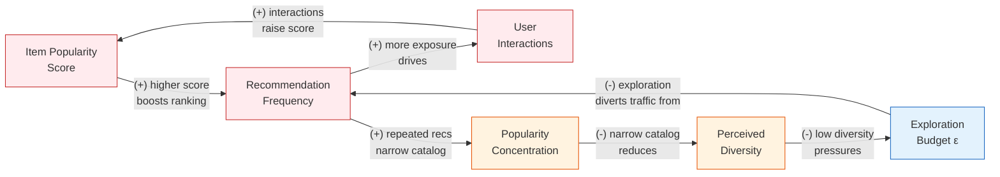

# Chapter 16: GNNs for Recommender Systems

**Part 4: Graphs in the Wild**

## Summary

Applies GNNs to recommender systems — from matrix factorization to LightGCN and PinSage — showing how bipartite user-item graphs enable scalable industrial recommendation.

## Concepts Covered

This chapter covers the following 6 concepts from the learning graph:

1. Recommender System (Graph)
2. Collaborative Filtering
3. Matrix Factorization (Rec)
4. Neural Collaborative Filter
5. LightGCN
6. PinSage

## Prerequisites

This chapter builds on:

- [Chapter 6: GNN Foundations: Message Passing and GCN](../06-gnn-foundations/index.md)
- [Chapter 7: GNN Design Space: GraphSAGE and GAT](../07-gnn-design-space/index.md)
- [Chapter 15: Heterogeneous Graphs](../15-heterogeneous-graphs/index.md)

---

!!! mascot-welcome "Predicting What You Haven't Seen"
    
    Every recommendation — the next song on a playlist, the product surfaced in a search result, the paper your institution's library system suggests — is a prediction about user preference for items the user has not yet interacted with. Recommender systems are one of the most economically consequential applications of machine learning, responsible for a significant fraction of content consumption and e-commerce revenue at scale. What makes the graph perspective essential is that user preferences are not independent: users with overlapping tastes form communities, items consumed by overlapping audiences occupy similar niches, and the multi-hop paths through a user-item interaction graph encode exactly the collaborative signals that pure attribute-based models miss. This chapter develops the graph-theoretic foundations of collaborative filtering, traces the evolution from classical matrix factorization through neural collaborative filtering to graph-based methods, and delivers a detailed treatment of LightGCN and PinSage — the two architectures that currently define the state of the practice for graph-based recommendation at scale.

---

## 16.1 Motivating Example: The Pinterest Home Feed

Pinterest serves over 450 million monthly active users with personalized content drawn from a corpus of more than 3 billion pins — images and videos annotated with topics, boards, and engagement signals. The core recommendation task is to rank the set of candidate pins for a given user's home feed by predicted engagement probability. A pin is a node, a user is a node, and a save (a user adding a pin to one of their boards) is an edge. The resulting graph is a bipartite interaction graph with billions of edges and heterogeneous node features: pins have image features extracted by convolutional networks, while users are largely defined by their interaction history.

What makes this problem hard for standard approaches is scale and sparsity combined. With 450M users and 3B pins, the interaction matrix has on the order of \( 10^{18} \) possible entries, of which only a tiny fraction (billions of saves) are observed. A given user may have saved only a few dozen pins, yet a recommender must find semantically similar content among billions of candidates. Content-based filtering — finding pins similar to a user's past saves based on image features — works for the immediate neighborhood but misses higher-order preferences: a user who saves landscape photography and also follows many travel boards is likely to engage with travel photography even if no image-feature similarity path connects it to their explicit save history. Collaborative signals, propagated through the user-item graph, capture exactly this kind of latent preference alignment.

The PinSage system (Ying et al. 2018) addresses this problem at web scale using a graph convolutional network over the pin–pin content similarity graph augmented by the user–pin interaction graph. Its design choices — importance-based neighbor sampling, curriculum negative mining, and MapReduce-style inference — define the engineering blueprint for industrial GNN recommendation systems that we will examine in §16.9.

---

## 16.2 The Bipartite Interaction Graph

The foundational representation for graph-based recommendation is the **bipartite interaction graph** \( G = (\mathcal{U} \cup \mathcal{I}, \mathcal{E}) \), where:

- \( \mathcal{U} = \{u_1, u_2, \ldots, u_{|\mathcal{U}|}\} \) is the set of users
- \( \mathcal{I} = \{i_1, i_2, \ldots, i_{|\mathcal{I}|}\} \) is the set of items
- \( \mathcal{E} \subseteq \mathcal{U} \times \mathcal{I} \) is the set of observed interactions (clicks, purchases, saves, ratings above threshold)

The graph is bipartite because edges connect users to items exclusively — there are no user-user or item-item edges in the base representation, though content similarity graphs on the item side are sometimes added. The interaction matrix \( \mathbf{R} \in \{0, 1\}^{|\mathcal{U}| \times |\mathcal{I}|} \) is the biadjacency matrix of this graph: \( R_{ui} = 1 \) if user \( u \) has interacted with item \( i \), and \( R_{ui} = 0 \) otherwise (either unobserved or genuinely unpreferred — a crucial ambiguity discussed in §16.10).

The adjacency matrix of the full graph, placing users and items as nodes in a single shared space, is:

\[
\mathbf{A} = \begin{pmatrix} \mathbf{0} & \mathbf{R} \\ \mathbf{R}^T & \mathbf{0} \end{pmatrix}
\]

This block-structured adjacency matrix is what GNN layers operate on when they propagate information through the user-item graph. A user node at layer \( k \) aggregates messages from all item nodes it has interacted with (its 1-hop neighborhood), and those item nodes have themselves aggregated from their user neighborhoods at layer \( k-1 \), encoding the 2-hop collaborative signal: "users who liked the same items as you also liked these other items."

The multi-hop structure is the graph-theoretic content of collaborative filtering. A 2-hop path user \( u \) → item \( i \) → user \( u' \) signals that \( u \) and \( u' \) share preferences; a 4-hop path user \( u \) → item \( i \) → user \( u' \) → item \( j \) carries the collaborative signal "item \( j \) was liked by someone who liked item \( i \) which you liked." GNNs with \( K \) layers capture all such paths up to length \( 2K \) in the bipartite graph, providing a principled mechanism for multi-hop collaborative signal propagation.

!!! mascot-thinking "The Multi-Hop Collaborative Signal"
    
    Multi-hop paths through the interaction graph encode qualitatively different collaborative signals. A 2-hop path (user → item → user) discovers latent user communities: users connected through the same items likely share taste. A 4-hop path (user → item → user → item) discovers latent item associations: items linked through co-enthusiast users are implicitly related in preference space. A 6-hop path begins to dilute the signal with noise because the graph becomes dense at distance 3 and nearly any two nodes share a 6-hop path. This is why LightGCN's ablations show 3 layers as optimal for most benchmarks: one layer too few misses important collaborative signals; one layer too many mixes in spurious connections. The analogy to over-smoothing in GNNs for node classification (Chapter 8) is exact — the same mechanism operates. In recommendation, the manifestation is not vanishing gradients but blurred user profiles: every user begins to look like the average user, and personalization collapses.

---

## 16.3 Collaborative Filtering

**Collaborative filtering** is the paradigm of predicting a user's preference for an item based solely on the pattern of past user-item interactions, without using any content features of the users or items. The core assumption is that users who have agreed on the past will agree in the future: if users \( u \) and \( u' \) have both liked items \( i_1, i_2, i_3 \), and \( u' \) has also liked \( i_4 \), the collaborative filtering assumption supports predicting that \( u \) would also like \( i_4 \).

There are two classical families of collaborative filtering methods. **Memory-based** methods (nearest-neighbor CF) compute user-user or item-item similarity directly from the interaction matrix — for example, cosine similarity between rows (user profiles) or columns (item profiles) — and aggregate ratings from the most similar neighbors. These methods are interpretable and require no training, but they scale poorly (\( O(|\mathcal{U}|^2) \) for all pairwise user similarities) and cannot generalize to users or items with very sparse interaction histories.

**Model-based** methods learn a parametric model of the interaction distribution. Matrix factorization is the canonical model-based approach, followed by neural and graph-based extensions. The progression from matrix factorization through GNN-based methods defines the structure of this chapter.

---

## 16.4 Matrix Factorization and BPR Loss

**Matrix factorization** (MF) models the interaction matrix \( \mathbf{R} \) as a product of two low-rank embedding matrices:

\[
\hat{\mathbf{R}} = \mathbf{U} \mathbf{V}^T
\]

where \( \mathbf{U} \in \mathbb{R}^{|\mathcal{U}| \times d} \) contains one \( d \)-dimensional embedding per user and \( \mathbf{V} \in \mathbb{R}^{|\mathcal{I}| \times d} \) contains one \( d \)-dimensional embedding per item. The predicted interaction score for user \( u \) and item \( i \) is:

\[
\hat{y}_{ui} = \mathbf{e}_u^T \mathbf{e}_i
\]

where \( \mathbf{e}_u \in \mathbb{R}^d \) and \( \mathbf{e}_i \in \mathbb{R}^d \) are the rows of \( \mathbf{U} \) and \( \mathbf{V} \) respectively. Learning is accomplished by minimizing the discrepancy between predicted and observed scores over the training set of interactions.

The choice of loss function matters significantly in recommendation settings. **Pointwise losses** (mean squared error, binary cross-entropy) treat each interaction as an independent prediction target, but they require a strategy for handling the unobserved entries of \( \mathbf{R} \) — which are mostly missing at random rather than genuinely negative. **Bayesian Personalized Ranking (BPR)** avoids this problem by framing the objective as a pairwise ranking problem: for each observed interaction \( (u, i) \), sample an unobserved item \( j \) (a negative sample) and optimize the model to rank \( i \) above \( j \) for user \( u \). The BPR loss is:

\[
\mathcal{L}_\text{BPR} = -\sum_{(u, i, j) \in \mathcal{O}} \ln \sigma\!\left(\hat{y}_{ui} - \hat{y}_{uj}\right) + \lambda \|\Theta\|^2
\]

where \( \mathcal{O} = \{(u, i, j) : (u, i) \in \mathcal{E},\, (u, j) \notin \mathcal{E}\} \) is the training triplet set, \( \sigma \) is the sigmoid function, \( \Theta \) are the model parameters, and \( \lambda \) is an L2 regularization coefficient. BPR is derived from the Bayesian analysis of the posterior estimator for the personalized ranking task and is the standard training objective for collaborative filtering models — including LightGCN and NGCF — because it handles implicit feedback (clicks, saves, purchases without explicit ratings) naturally.

!!! mascot-tip "BPR Loss vs. Pointwise Loss"
    
    The choice between BPR (pairwise) and binary cross-entropy (pointwise) has a significant empirical impact on recommendation performance. The fundamental difference is how unobserved interactions are treated: binary cross-entropy requires treating unobserved \( (u, j) \) pairs as negative examples (label = 0), which introduces a massive class imbalance (the number of non-interactions dwarfs interactions) and implicitly assumes that unobserved means disliked. BPR instead assumes only that observed items are preferred over sampled unobserved items for a given user, which is a weaker and more defensible assumption for implicit feedback. In practice, BPR with uniform negative sampling converges faster and to better local optima than BCE with all-negative or sampled-negative training on most recommendation benchmarks. A useful heuristic: use BPR as the default training objective and switch to BCE only when the evaluation metric is a pointwise measure like RMSE (i.e., actual rating prediction rather than ranking).

The limitation of plain matrix factorization is that it models user-item interactions as a single inner product in the low-rank embedding space, capturing only first-order (direct) interactions. Two users who have never shared a direct interaction — connected only through third-party items — are not explicitly related in the MF objective. This is where the graph perspective reveals its value: higher-order paths in the interaction graph encode relationships that first-order inner products cannot represent.

---

## 16.5 Why Matrix Factorization Misses the Graph Structure

To make concrete why multi-hop signals matter, consider a small example. Users \( u_1 \) and \( u_3 \) have no items in common. However, \( u_1 \) and \( u_2 \) both liked items \( i_1 \) and \( i_2 \), and \( u_2 \) and \( u_3 \) both liked items \( i_3 \) and \( i_4 \). Through the 4-hop path \( u_1 \to i_1 \to u_2 \to i_3 \to u_3 \), the graph reveals that \( u_1 \) and \( u_3 \) share the intermediate taste broker \( u_2 \). This transitivity of taste is a real phenomenon: consumers of independent cinema often discover new films through community chains rather than direct overlap.

Matrix factorization, trained with BPR on direct interactions only, has no mechanism to encode this 4-hop signal in the objective function. The embedding of \( u_1 \) is pulled toward \( i_1 \) and \( i_2 \) directly, and the embedding of \( u_3 \) is pulled toward \( i_3 \) and \( i_4 \) directly, but there is no training signal that brings these embeddings closer together through \( u_2 \). As a result, the model would predict low affinity between \( u_1 \) and \( i_3 \) even when the collaborative evidence strongly suggests otherwise.

GNN-based methods address this by propagating information through the graph before the inner product prediction: after \( K \) layers of message passing, the embedding of \( u_1 \) is a function of all nodes within \( K \) hops, including \( u_3 \) and the items \( u_3 \) has interacted with. The collaborative signal is encoded in the embedding itself rather than deferred to a separate similarity lookup.

---

## 16.6 Neural Collaborative Filtering

**Neural Collaborative Filtering** (NCF, He et al. 2017) replaces the inner product in matrix factorization with a multilayer perceptron, enabling the model to learn arbitrary interaction functions between user and item embeddings. The prediction score is:

\[
\hat{y}_{ui} = f_\theta\!\left(\mathbf{e}_u \,\|\, \mathbf{e}_i\right)
\]

where \( f_\theta \) is an MLP applied to the concatenation of user and item embeddings, and \( \|\, \) denotes vector concatenation. In practice, NCF typically uses a GMF (Generalized Matrix Factorization) component alongside the MLP, combining both components linearly before the output layer: this gives the model both the efficient bilinear structure of MF and the expressive nonlinear capacity of the MLP.

NCF demonstrated empirically that replacing the inner product with an MLP yields consistent improvements on several recommendation benchmarks. However, NCF still operates without graph structure — it uses only the first-order interaction signal between users and items. Subsequent work showed that adding graph-based higher-order signals yields further gains beyond what the MLP expressivity alone provides. NCF therefore represents a significant step from linear MF toward expressive deep models, but it is a stepping stone rather than the destination for the graph-based approach.

---

## 16.7 NGCF: Adding Graph Structure to Collaborative Filtering

**Neural Graph Collaborative Filtering** (NGCF, Wang et al. 2019) was the first architecture to explicitly propagate collaborative signals through the user-item bipartite graph using graph convolutional layers. Starting from initial user and item embeddings \( \mathbf{e}_u^{(0)} \) and \( \mathbf{e}_i^{(0)} \), NGCF defines the following propagation rule at layer \( k \):

\[
\mathbf{e}_u^{(k+1)} = \sigma\!\left(\mathbf{W}_1^{(k)} \mathbf{e}_u^{(k)} + \sum_{i \in \mathcal{N}_u} \frac{1}{\sqrt{|\mathcal{N}_u||\mathcal{N}_i|}} \left(\mathbf{W}_1^{(k)} \mathbf{e}_i^{(k)} + \mathbf{W}_2^{(k)} \left(\mathbf{e}_i^{(k)} \odot \mathbf{e}_u^{(k)}\right)\right)\right)
\]

where \( \mathbf{W}_1^{(k)}, \mathbf{W}_2^{(k)} \in \mathbb{R}^{d' \times d} \) are trainable weight matrices, \( \odot \) denotes element-wise multiplication (the interaction term between item and user embeddings), and the normalization \( 1/\sqrt{|\mathcal{N}_u||\mathcal{N}_i|} \) mirrors the symmetric normalization of GCN. The final prediction uses the concatenation of all \( K+1 \) layer embeddings:

\[
\hat{y}_{ui} = \left[\mathbf{e}_u^{(0)} \,\|\, \mathbf{e}_u^{(1)} \,\|\, \cdots \,\|\, \mathbf{e}_u^{(K)}\right]^T \left[\mathbf{e}_i^{(0)} \,\|\, \mathbf{e}_i^{(1)} \,\|\, \cdots \,\|\, \mathbf{e}_i^{(K)}\right]
\]

NGCF improved significantly over MF and NCF on standard benchmarks when it was published, validating the core hypothesis that multi-hop graph propagation encodes useful collaborative signals. However, He et al. (2020) subsequently showed through careful ablation that both the feature transformation matrices \( \mathbf{W}_1, \mathbf{W}_2 \) and the nonlinear activation \( \sigma \) actually hurt performance when removed from NGCF — meaning that the simpler version without these components consistently outperforms NGCF on the same benchmarks. This surprising finding motivates LightGCN.

---

## 16.8 LightGCN: The Power of Deliberate Simplification

**LightGCN** (He et al. 2020) strips the NGCF propagation to its essential component: the weighted neighborhood aggregation without any learned weight matrices or nonlinear activations. The LightGCN propagation rule for layer \( k \) is:

\[
\mathbf{e}_u^{(k+1)} = \sum_{i \in \mathcal{N}_u} \frac{1}{\sqrt{|\mathcal{N}_u|}\sqrt{|\mathcal{N}_i|}}\, \mathbf{e}_i^{(k)}
\]

\[
\mathbf{e}_i^{(k+1)} = \sum_{u \in \mathcal{N}_i} \frac{1}{\sqrt{|\mathcal{N}_i|}\sqrt{|\mathcal{N}_u|}}\, \mathbf{e}_u^{(k)}
\]

The only trainable parameters in LightGCN are the initial embeddings \( \mathbf{e}_u^{(0)} \) and \( \mathbf{e}_i^{(0)} \) for each user and item. All subsequent layer embeddings are deterministic functions of the initial embeddings and the graph structure. After \( K \) propagation steps, the final user and item representations are computed as a **layer-combination** — a weighted mean of all layer embeddings:

\[
\mathbf{e}_u = \sum_{k=0}^{K} \alpha_k\, \mathbf{e}_u^{(k)}, \qquad \mathbf{e}_i = \sum_{k=0}^{K} \alpha_k\, \mathbf{e}_i^{(k)}
\]

where \( \alpha_k \geq 0 \) are combination coefficients with \( \sum_k \alpha_k = 1 \). In the default configuration, \( \alpha_k = 1/(K+1) \) (uniform average), which He et al. found to work as well as learned coefficients. The predicted score and BPR loss are identical to matrix factorization:

\[
\hat{y}_{ui} = \mathbf{e}_u^T \mathbf{e}_i, \qquad \mathcal{L}_\text{BPR} = -\sum_{(u,i,j) \in \mathcal{O}} \ln \sigma\!\left(\hat{y}_{ui} - \hat{y}_{uj}\right) + \lambda \left(\|\mathbf{e}_u^{(0)}\|^2 + \|\mathbf{e}_i^{(0)}\|^2 + \|\mathbf{e}_j^{(0)}\|^2\right)
\]

The regularization acts only on the initial embeddings — there are no weight matrices to regularize. This makes LightGCN extremely parameter-efficient: a LightGCN model with \( |\mathcal{U}| + |\mathcal{I}| \) users and items, embedding dimension \( d \), and \( K \) layers has exactly \( (|\mathcal{U}| + |\mathcal{I}|) \times d \) parameters, identical to vanilla matrix factorization. The graph propagation is free.

### 16.8.1 Why Removing Transformations Helps

The empirical finding that removing feature transformations improves performance can be understood through several complementary lenses. First, the propagation matrices in LightGCN are already highly expressive because the graph structure \( \mathbf{A} \) is dense with collaborative information — adding learned weight matrices introduces additional optimization surface that can overfit noisy interaction data. Second, the interaction term \( \mathbf{W}_2 (\mathbf{e}_i \odot \mathbf{e}_u) \) in NGCF attempts to model user-item feature interactions at each propagation step, which adds parameters but also introduces gradient interference between the graph propagation objective and the interaction modeling objective. Third, and perhaps most importantly, nonlinear activations after each layer prevent the clean layer-combination interpretation: if \( \sigma \) is applied after aggregation, the embedding at layer \( k+1 \) is no longer a linear function of the initial embeddings, making the layer-combination less interpretable and the optimization less smooth.

LightGCN's success is a specific instantiation of a broader principle observed across GNN research: **graph structure is itself a powerful inductive bias**, and adding architectural complexity on top of good graph structure often hurts more than it helps. The same lesson appears in the SGC (Simple Graph Convolution) result for node classification: linear graph propagation without nonlinearities performs competitively with multi-layer GCNs on many benchmarks.

### 16.8.2 Matrix Form

LightGCN's propagation has a clean matrix form. Let \( \tilde{\mathbf{A}} = \mathbf{D}^{-1/2} \mathbf{A} \mathbf{D}^{-1/2} \) denote the symmetrically normalized adjacency matrix of the full bipartite graph (with \( \mathbf{D} \) the diagonal degree matrix). Let \( \mathbf{E}^{(0)} \in \mathbb{R}^{(|\mathcal{U}|+|\mathcal{I}|) \times d} \) be the stacked initial embedding matrix. Then layer \( k \) embeddings are \( \mathbf{E}^{(k)} = \tilde{\mathbf{A}}^k \mathbf{E}^{(0)} \), and the final embedding is:

\[
\mathbf{E} = \frac{1}{K+1} \sum_{k=0}^{K} \tilde{\mathbf{A}}^k \mathbf{E}^{(0)} = \frac{1}{K+1} \left(\mathbf{I} + \tilde{\mathbf{A}} + \tilde{\mathbf{A}}^2 + \cdots + \tilde{\mathbf{A}}^K\right) \mathbf{E}^{(0)}
\]

This reveals that LightGCN is a polynomial filter on the graph spectrum: it averages the responses of filters \( \{p_k(\lambda) = \lambda^k\}_{k=0}^K \) applied to the graph Laplacian eigenspectrum. The uniform averaging smooths the frequency response across the polynomial basis, acting as a low-pass filter over the interaction graph — exactly the right behavior for collaborative filtering, where the low-frequency components of the graph Laplacian encode the global preference communities.

---

## 16.9 PinSage: Industrial-Scale GNN Recommendation

!!! mascot-encourage "The Gap Between Research and Production"
    
    LightGCN is the model you would choose for a research benchmark with millions of interactions. PinSage is what you would build if you needed to serve recommendations for 3 billion pins to 450 million users with sub-100ms latency. The gap between these two settings reveals a full layer of systems engineering that research papers rarely expose. The core technical challenges of industrial-scale GNN recommendation — how to sample neighborhoods without materializing a petabyte adjacency matrix, how to train with billions of negative examples efficiently, how to produce embeddings for all items without re-running the GNN at inference time — are solved by PinSage's design decisions that have since become standard practice across the industry. Understanding PinSage teaches you both what graph-based recommendation looks like in production and which simplifications research benchmarks implicitly make.

**PinSage** (Ying et al. 2018) extends GraphSAGE (Chapter 7) to the Pinterest recommendation setting, introducing three innovations that make web-scale GNN training tractable.

### 16.9.1 Importance-Based Neighborhood Sampling

Standard neighborhood sampling (Chapter 20) selects a fixed random subset of neighbors at each layer, treating all neighbors as equally important. PinSage replaces this with **importance-based sampling** using short random walks: from a query pin \( u \), run \( T \) random walks of length \( L \) and count the visit frequency \( \pi(u, v) \) for each pin \( v \). The top-\( T \) pins by visit frequency are selected as the sampled neighborhood for \( u \).

The random walk visit counts approximate the **personalized PageRank** of each pin relative to the query pin, measuring how much influence each pin's embedding should have on \( u \)'s representation. Pins that are frequently visited from \( u \) are either directly connected (1-hop) or connected through densely shared neighborhoods (multi-hop but high centrality), and both types of influence are worth preserving. Standard uniform sampling treats a pin that shares a single common neighbor with \( u \) the same as a pin that shares 200 common neighbors — a significant loss of signal that importance sampling corrects.

### 16.9.2 Curriculum Negative Sampling

Training a recommendation model requires negative items — user-item pairs the model should rank below observed interactions. The quality of negative samples profoundly affects training efficiency and final model quality. PinSage uses a **curriculum strategy**: in early training epochs, negatives are sampled uniformly at random from all unobserved items (easy negatives, since random items are usually clearly dissimilar to observed ones). As training progresses, negatives are drawn from the output of a previous model checkpoint — items that an earlier version of the model ranked highly but that are nonetheless non-interacted-with (hard negatives). This curriculum mirrors the curriculum learning strategy in computer vision: start with easy examples to establish a good initialization, then focus on hard examples to push the decision boundary to the right location.

The justification for hard negative mining is that a model trained only on easy negatives learns to distinguish between a user's saved pins and completely random pins, but not to distinguish between saved pins and semantically similar but non-saved pins — precisely the hard cases that arise in production when ranking hundreds of high-quality candidates.

### 16.9.3 Efficient Inference via Mapreduce

At inference time, a naive GNN would require running the forward pass for every pin every time a user requests recommendations — an \( O(|\mathcal{I}| \times T_\text{forward}) \) operation per request. PinSage instead produces **offline embeddings** for all pins once per day by running inference in a MapReduce pipeline. The pipeline proceeds bottom-up through the GNN layers: first, item features are aggregated within each partition of the graph (Map step), then the aggregated representations are sent to the nodes that need them (Reduce step). The resulting per-pin embeddings are stored in a serving layer, and at query time the user's embedding is computed from the serving embeddings of their recent interactions using a fast inference pass. This offline-online split makes recommendation latency independent of model depth and graph size.

---

## 16.10 Limitations, Fairness, and the Popularity Bias Feedback Loop

The graph-based recommendation paradigm has two structural limitations that practitioners must address explicitly: the cold-start problem and the popularity bias feedback loop. Both arise from the same root cause — the model's dependence on observed interaction history — but they manifest and require different mitigations.

### 16.10.1 Cold Start

**Cold start** refers to the difficulty of making recommendations for new users (user cold start) or new items (item cold start) that have few or no observed interactions. In LightGCN, new users have no edges in the bipartite graph and therefore receive no neighborhood signals during propagation — their initial embedding \( \mathbf{e}_u^{(0)} \) is the only representation available. The standard mitigation is to initialize new user embeddings from the average of their interacted item embeddings (if a few initial interactions are collected) or from content features (if available). PinSage sidesteps item cold start by using content features (image embeddings from a ResNet) as input to the GNN layers, making the model partially inductive — new pins can be embedded using their image features even before accumulating interaction history.

### 16.10.2 The Popularity Bias Feedback Loop

A more subtle and pervasive problem is **popularity bias**: the tendency of collaborative filtering systems to over-recommend already-popular items, creating a self-reinforcing feedback loop between recommendation and interaction data that concentrates user attention on an ever-narrowing subset of the item catalog. The following causal loop diagram illustrates the dynamics:



| Loop | Type | Description |
|---|---|---|
| R1: Popularity Bias | Reinforcing | Popular items get recommended → more exposure → more interactions → higher popularity score → recommended even more |
| B1: Diversity Enforcement | Balancing | Repeated recommendations concentrate attention → perceived diversity drops → exploration budget increases → popularity-driven traffic is diverted |

| Arrow | Interpretation |
|---|---|
| Popularity Score → **(+)** → Recommendation Frequency | Models trained on historical interactions rank popular items higher because they have more training signal |
| Recommendation Frequency → **(+)** → User Interaction Count | Recommended items receive more exposure and therefore more clicks, regardless of intrinsic quality |
| User Interaction Count → **(+)** → Popularity Score | New interactions update the model, further increasing the item's popularity score |
| Recommendation Frequency → **(+)** → Popularity Concentration | As the same items are recommended repeatedly, the distribution of attention across the catalog narrows |
| Popularity Concentration → **(-)** → Perceived Diversity | High concentration means users see repetitive content, reducing satisfaction |
| Perceived Diversity → **(-)** → Exploration Budget | Low satisfaction motivates platform designers to increase the fraction of recommendations reserved for exploration |
| Exploration Budget → **(-)** → Recommendation Frequency | Diverting traffic to exploration items reduces the recommendation rate of popularity-driven items |

The **R1 loop** is the core pathology: each round of recommendations trains the next model on interaction data that reflects the previous model's recommendations, not the full distribution of user preferences. Long-tail items — which may have high intrinsic quality but low initial exposure — never accumulate enough interactions to compete. This is not merely a fairness concern: it is also a revenue concern, because a catalog that serves 10% of items to 90% of users is using its investment in the remaining 90% of items inefficiently.

The **B1 loop** represents the standard platform response: introduce an exploration term (divert some recommendation traffic to random or diversity-driven selections), adjust the re-ranking stage to enforce minimum representation of tail categories, or apply inverse propensity scoring to down-weight popular items during training. These interventions act as a balancing loop but with significant lag — the delay between changing the recommendation policy and observing corrected interaction data can be days to weeks in production systems.

Graph-based methods have both advantages and disadvantages relative to plain matrix factorization in the context of popularity bias. On one hand, multi-hop propagation can surface long-tail items that share neighborhoods with popular items, improving tail item coverage. On the other hand, the symmetrically normalized adjacency matrix in LightGCN uses degrees in the normalization — and popular items have high degree — which tends to attenuate popular items' messages (a form of implicit debiasing). The net effect depends strongly on the graph structure and must be verified empirically for each deployment.

---

## 16.11 Complete Code: LightGCN in PyTorch

The following implementation defines a full LightGCN model and training loop using PyTorch. The design mirrors LightGCN's original description: no weight matrices, no nonlinear activations during propagation, uniform layer combination, and BPR loss with L2 regularization on the initial embeddings. The data is structured as a bipartite edge list (user indices, item indices) and a set of held-out validation interactions for early stopping evaluation.

```python
import torch
import torch.nn as nn
import torch.nn.functional as F
from torch_sparse import SparseTensor
import numpy as np

# ── 1. Build synthetic bipartite interaction data ─────────────────────────────

def make_toy_interactions(
    num_users: int = 500,
    num_items: int = 1000,
    num_interactions: int = 5000,
    num_val: int = 500,
    seed: int = 42,
):
    """
    Creates a synthetic user-item interaction dataset.
    Returns:
      train_edge_index : (2, num_interactions) tensor [user_ids; item_ids]
      val_pairs        : (num_val, 2) tensor of (user, item) validation pairs
      val_labels       : (num_val,) binary labels (1 = interacted, 0 = negative)
    """
    rng = np.random.default_rng(seed)
    users = torch.from_numpy(rng.integers(0, num_users, num_interactions))
    items = torch.from_numpy(rng.integers(0, num_items, num_interactions))
    train_edge_index = torch.stack([users, items])  # (2, E)

    # Validation: mix of positive and random negative pairs
    val_users = torch.from_numpy(rng.integers(0, num_users, num_val))
    val_items_pos = torch.from_numpy(rng.integers(0, num_items, num_val // 2))
    val_items_neg = torch.from_numpy(rng.integers(0, num_items, num_val // 2))
    val_pairs = torch.stack([
        torch.cat([val_users[:num_val // 2], val_users[num_val // 2:]]),
        torch.cat([val_items_pos, val_items_neg]),
    ], dim=1)                                         # (num_val, 2)
    val_labels = torch.cat([
        torch.ones(num_val // 2, dtype=torch.float),
        torch.zeros(num_val // 2, dtype=torch.float),
    ])
    return train_edge_index, val_pairs, val_labels


# ── 2. LightGCN model ─────────────────────────────────────────────────────────

class LightGCN(nn.Module):
    """
    LightGCN (He et al. 2020): linear graph convolution on a bipartite
    user-item graph with no weight matrices and no nonlinear activations.

    Parameters
    ----------
    num_users   : number of users
    num_items   : number of items
    emb_dim     : embedding dimension for all users and items
    num_layers  : number of LightGCN propagation layers (K)
    """

    def __init__(
        self,
        num_users: int,
        num_items: int,
        emb_dim: int = 64,
        num_layers: int = 3,
    ):
        super().__init__()
        self.num_users = num_users
        self.num_items = num_items
        self.num_layers = num_layers

        # The ONLY trainable parameters: initial embeddings (E^0)
        self.user_emb = nn.Embedding(num_users, emb_dim)
        self.item_emb = nn.Embedding(num_items, emb_dim)

        nn.init.normal_(self.user_emb.weight, std=0.1)
        nn.init.normal_(self.item_emb.weight, std=0.1)

    def build_adj(self, edge_index: torch.Tensor, device) -> SparseTensor:
        """
        Build symmetrically normalized adjacency matrix of the bipartite graph.
        Node ordering: users 0..(num_users-1), items num_users..(num_users+num_items-1)

        edge_index: (2, E) tensor with [user_ids; item_ids]
        """
        N = self.num_users + self.num_items
        # Bipartite edges in both directions (user→item and item→user)
        row = torch.cat([edge_index[0], edge_index[1] + self.num_users])
        col = torch.cat([edge_index[1] + self.num_users, edge_index[0]])
        adj = SparseTensor(
            row=row, col=col,
            sparse_sizes=(N, N),
        ).to(device)
        # Symmetric normalization: D^{-1/2} A D^{-1/2}
        deg = adj.sum(dim=1).to(torch.float)
        deg_inv_sqrt = deg.pow(-0.5)
        deg_inv_sqrt[deg_inv_sqrt == float('inf')] = 0.0
        adj = adj.mul(deg_inv_sqrt.view(1, -1)).mul(deg_inv_sqrt.view(-1, 1))
        return adj

    def forward(self, adj: SparseTensor) -> tuple[torch.Tensor, torch.Tensor]:
        """
        Run K rounds of LightGCN propagation and return final user/item embeddings
        as the uniform average of all layer embeddings (including layer 0).

        Returns:
          user_final : (num_users, emb_dim)
          item_final : (num_items, emb_dim)
        """
        # Stack initial embeddings: (N, d) where N = num_users + num_items
        E = torch.cat([self.user_emb.weight, self.item_emb.weight], dim=0)

        layer_outputs = [E]  # collect E^(0), E^(1), ..., E^(K)
        E_curr = E
        for _ in range(self.num_layers):
            # E^{k+1} = A_tilde @ E^{k}  — no weight matrices, no activations
            E_curr = adj @ E_curr
            layer_outputs.append(E_curr)

        # Final embedding: uniform average over all layers  (Eq. 11 in He et al.)
        E_final = torch.stack(layer_outputs, dim=0).mean(dim=0)  # (N, d)

        user_final = E_final[:self.num_users]       # (num_users, emb_dim)
        item_final = E_final[self.num_users:]       # (num_items, emb_dim)
        return user_final, item_final

    def bpr_loss(
        self,
        user_final: torch.Tensor,
        item_final: torch.Tensor,
        users: torch.Tensor,
        pos_items: torch.Tensor,
        neg_items: torch.Tensor,
        l2_lambda: float = 1e-4,
    ) -> torch.Tensor:
        """
        Bayesian Personalized Ranking loss.
        Regularization acts on initial embeddings only (no weight matrices exist).
        """
        eu = user_final[users]          # (B, d)
        ei_pos = item_final[pos_items]  # (B, d)
        ei_neg = item_final[neg_items]  # (B, d)

        pos_score = (eu * ei_pos).sum(dim=-1)  # (B,)
        neg_score = (eu * ei_neg).sum(dim=-1)  # (B,)
        bpr = -F.logsigmoid(pos_score - neg_score).mean()

        # L2 regularization on initial embeddings only
        reg = (
            self.user_emb.weight[users].norm(2).pow(2)
            + self.item_emb.weight[pos_items].norm(2).pow(2)
            + self.item_emb.weight[neg_items].norm(2).pow(2)
        ) / len(users)

        return bpr + l2_lambda * reg


# ── 3. Training loop ──────────────────────────────────────────────────────────

def train_lightgcn(
    num_users: int = 500,
    num_items: int = 1000,
    emb_dim: int = 64,
    num_layers: int = 3,
    batch_size: int = 512,
    epochs: int = 30,
    lr: float = 1e-3,
    l2_lambda: float = 1e-4,
    seed: int = 42,
):
    """
    Train LightGCN on a synthetic bipartite graph and report validation AUC.

    batch_size  : number of (user, pos_item, neg_item) triplets per step
    num_layers  : LightGCN propagation depth K (3 is optimal on most benchmarks)
    l2_lambda   : L2 regularization weight for initial embeddings
    """
    device = torch.device('cuda' if torch.cuda.is_available() else 'cpu')

    # Data
    train_edges, val_pairs, val_labels = make_toy_interactions(
        num_users, num_items, seed=seed
    )
    train_edges = train_edges.to(device)
    val_pairs   = val_pairs.to(device)
    val_labels  = val_labels.to(device)

    # Model and optimizer
    model = LightGCN(num_users, num_items, emb_dim, num_layers).to(device)
    optimizer = torch.optim.Adam(model.parameters(), lr=lr)

    # Build the static normalized adjacency matrix (reused every epoch)
    adj = model.build_adj(train_edges, device)

    # BPR training data: (user, pos_item) pairs
    users_tr = train_edges[0]   # (E,)
    items_tr  = train_edges[1]  # (E,)
    E = len(users_tr)
    rng = np.random.default_rng(seed)

    for epoch in range(1, epochs + 1):
        model.train()
        # Shuffle and mini-batch
        perm = torch.randperm(E, device=device)
        epoch_loss = 0.0
        num_batches = 0
        for start in range(0, E, batch_size):
            idx = perm[start:start + batch_size]
            u_batch = users_tr[idx]
            pi_batch = items_tr[idx]
            # Sample uniformly random negative items
            ni_batch = torch.from_numpy(
                rng.integers(0, num_items, len(idx))
            ).to(device)

            optimizer.zero_grad()
            user_final, item_final = model(adj)
            loss = model.bpr_loss(
                user_final, item_final,
                u_batch, pi_batch, ni_batch, l2_lambda
            )
            loss.backward()
            optimizer.step()
            epoch_loss += loss.item()
            num_batches += 1

        if epoch % 5 == 0:
            model.eval()
            with torch.no_grad():
                user_final, item_final = model(adj)
                val_users = val_pairs[:, 0]
                val_items = val_pairs[:, 1]
                eu = user_final[val_users]
                ei = item_final[val_items]
                scores = (eu * ei).sum(dim=-1).cpu()
                # AUC: fraction of (pos, neg) pairs where pos_score > neg_score
                n_half = len(scores) // 2
                pos_scores = scores[:n_half]
                neg_scores = scores[n_half:]
                auc = (pos_scores.unsqueeze(1) > neg_scores.unsqueeze(0)).float().mean()
            print(f"Epoch {epoch:3d} | Loss {epoch_loss/num_batches:.4f} "
                  f"| Val AUC {auc:.4f}")

    return model

if __name__ == '__main__':
    model = train_lightgcn(epochs=30)
```

Four implementation notes are worth highlighting. First, the **only** learnable parameters are `user_emb.weight` and `item_emb.weight` — LightGCN has no weight matrices in its propagation, which is the architecture's defining characteristic. Second, the adjacency matrix is built once using symmetrically normalized degrees (the `build_adj` method) and reused across all epochs, since the graph structure does not change during training. Third, BPR loss regularizes only the **initial** embeddings (layer 0), not any intermediate layer representations — He et al. proved that this is equivalent to regularizing the final embeddings and is more numerically stable. Fourth, the layer-combination step (`torch.stack(...).mean(dim=0)`) implements the uniform average over \( K+1 \) layers, where the summation runs from \( k=0 \) (the initial embeddings) through \( k=K \) (the K-hop propagated embeddings).

---

## 16.12 Benchmark Results: Collaborative Filtering Methods

The following table reports Recall@20 on the Gowalla and Yelp-2018 benchmarks — two standard public datasets for implicit feedback collaborative filtering evaluation — drawn from the LightGCN paper. Recall@20 measures the fraction of each user's held-out interactions that appear in the top-20 recommended items. NDCG@20 is the normalized discounted cumulative gain, which additionally weighs earlier positions in the ranking more heavily.

| Model | Gowalla Recall@20 | Gowalla NDCG@20 | Yelp-2018 Recall@20 | Yelp-2018 NDCG@20 | Year |
|---|---|---|---|---|---|
| MF-BPR | 0.1291 | 0.1109 | 0.0561 | 0.0461 | 2009 |
| NCF | 0.1326 | 0.1157 | 0.0451 | 0.0363 | 2017 |
| NGCF | 0.1570 | 0.1327 | 0.0579 | 0.0477 | 2019 |
| LightGCN (K=3) | **0.1830** | **0.1554** | **0.0649** | **0.0530** | 2020 |
| SGL (contrastive) | 0.1954 | 0.1653 | 0.0675 | 0.0555 | 2021 |
| SimGCL | 0.2028 | 0.1712 | 0.0721 | 0.0601 | 2022 |

NCF's lower performance relative to even MF-BPR on Yelp-2018 is a known artifact of the dense Yelp graph structure, where the MLP interaction function overfits to the training distribution. LightGCN's consistent superiority over NGCF across both datasets validates the central claim of the ablation study: weight matrices and nonlinear activations hurt collaborative filtering performance rather than helping. SGL (Self-supervised Graph Learning) and SimGCL add contrastive self-supervised objectives to LightGCN's backbone, providing additional training signal beyond BPR and establishing the current state of the art for purely graph-based methods on these benchmarks.

---

## 16.13 MicroSim: Bipartite Graph Recommendation Explorer

#### Diagram: User-Item Graph with Multi-Hop Propagation Visualization


<iframe src="../../sims/ch16-lightgcn-explorer/main.html" width="100%" height="522px" scrolling="no"></iframe>
[Run User-Item Graph with Multi-Hop Propagation Visualization Fullscreen](../../sims/ch16-lightgcn-explorer/main.html)

---

## 16.14 Common Pitfalls

!!! mascot-warning "Four Ways Graph-Based Recommendation Goes Wrong"
    
    The graph structure that makes GNN-based recommendation powerful also introduces new failure modes beyond classical matrix factorization. The four most common are: **(1) Popularity bias amplification** — as described in §16.10.2, GNNs trained on interaction data without debiasing can reinforce the popularity feedback loop more aggressively than MF, because high-degree item nodes send messages to many users simultaneously; **(2) Treating all zeros as negatives** — the unobserved entries in the interaction matrix are a mixture of genuinely unpreferred items and items the user simply hasn't encountered yet; treating all zeros as hard negatives introduces a systematic false-negative rate that degrades BPR training; **(3) Data leakage through the graph** — if the validation interaction \( (u, i) \) is included in the training graph structure (even without the label), the user's \( K \)-hop neighborhood at validation time contains item \( i \)'s neighborhood information, artificially boosting the predicted score; always remove validation and test interactions from the graph before building the adjacency matrix; **(4) Layer depth beyond 3** — empirically, LightGCN with \( K > 3 \) layers performs no better and often worse than \( K = 3 \), because the graph becomes dense at distance 4+ and the over-smoothing dynamic described in §16.2 sets in; always treat K as a hyperparameter tuned on the validation set.

**Negative sampling strategy matters more than the model.** A common mistake is to treat negative sampling as a low-priority implementation detail. In fact, switching from uniform negative sampling to popularity-biased negative sampling (sampling negative items with probability proportional to their popularity) can close half the performance gap between LightGCN and more complex models on some benchmarks. The intuition is that popularity-biased negatives produce harder training examples, training the model to distinguish genuinely preferred items from distractors that happen to be popular — exactly the ranking decision the production recommender must make.

**Offline metrics do not predict online performance.** Recall@20 and NDCG@20 on a held-out test set measure the model's ability to rank withheld interactions above random non-interactions. But in production, the model competes against other items in a ranked list that the user actually sees — a fundamentally different distribution. A model with higher Recall@20 offline can have lower click-through rate online if it recommends high-quality but low-novelty items that the user has already considered and rejected. Offline evaluation is necessary but not sufficient; A/B testing against a production baseline is the only reliable measure of actual recommendation quality.

---

## 16.15 Exercises

The following 12 exercises span all six levels of Bloom's taxonomy.

**Remember**

1. Define "bipartite interaction graph" formally, specifying the node sets, edge set, and biadjacency matrix. What does it mean for the matrix \( \mathbf{R} \) to have entry \( R_{ui} = 0 \), and why is this ambiguous in implicit feedback settings?
2. List the three architectural components that NGCF includes which LightGCN removes, and state whether removing each component increases or decreases performance on standard benchmarks.

**Understand**

3. Explain in plain language why a 4-hop path in the bipartite interaction graph encodes a collaborative signal that cannot be captured by matrix factorization trained on first-order interactions. Use a concrete example involving two users and two items.
4. The LightGCN layer-combination equation \( \mathbf{e}_u = \frac{1}{K+1} \sum_{k=0}^K \mathbf{e}_u^{(k)} \) is described as a polynomial filter on the graph spectrum. Explain what "low-pass filtering" means in the context of the bipartite interaction graph and why it is the desired behavior for recommendation.

**Apply**

5. For a bipartite graph with 3 users (u1, u2, u3) and 4 items (i1, i2, i3, i4) with the interaction set \( \{(u1,i1),(u1,i2),(u2,i2),(u2,i3),(u3,i3),(u3,i4)\} \), manually compute the normalized edge weight \( 1/\sqrt{|\mathcal{N}_u|}\sqrt{|\mathcal{N}_i|} \) for each edge. Then compute the LightGCN layer-1 embedding of u1 given that all initial embeddings are \( \mathbf{e}^{(0)} = [1, 0] \) for all nodes.
6. Implement the BPR loss computation (without the full LightGCN propagation) in PyTorch for a batch of (user, positive item, negative item) triplets. Verify that your implementation produces a scalar loss and that the gradients flow to the embedding parameters.

**Analyze**

7. Compare LightGCN and PinSage on the following dimensions: (a) neighborhood sampling strategy, (b) presence of weight matrices, (c) suitability for cold-start items, (d) feasibility at web scale (billions of nodes and edges). For each dimension, explain which model is better suited and why.
8. The popularity bias feedback loop (§16.10.2) is described as a reinforcing loop. Identify the specific point in the loop where graph-based recommendation is more susceptible than matrix factorization, and explain the mechanism by which GNN propagation amplifies the reinforcing dynamic.

**Evaluate**

9. A practitioner reports that their LightGCN model achieves Recall@20 of 0.18 on a held-out test set, which is higher than their MF-BPR baseline at 0.14. They conclude that LightGCN is ready to replace MF-BPR in production. Critically evaluate this conclusion: what additional evidence would you require before deploying, and what risks does the practitioner's current evaluation methodology miss?
10. Evaluate the claim: "Curriculum negative mining in PinSage is not necessary because BPR with uniform negatives converges to the same solution given enough training epochs." Construct a formal argument for or against this claim, using the theory of hard negative examples in metric learning to support your position.

**Create**

11. Design a graph-based recommendation system for a podcast platform where users listen to episodes (items), follow other users (social graph), and episodes belong to podcast series (content hierarchy). Specify: (a) the full node and edge type set, (b) how you would extend LightGCN to handle this heterogeneous structure (drawing on Chapter 15), (c) what additional signals beyond listening history you would incorporate, and (d) how you would evaluate the system in a way that accounts for the temporal ordering of listening events.
12. Propose an algorithmic modification to LightGCN that reduces popularity bias without hurting overall Recall@20. Formalize the modification by changing one component of the BPR training objective or the propagation rule, state the inductive bias it introduces, describe how you would evaluate whether the modification reduces bias, and identify what tradeoffs it introduces.

---

## 16.16 Further Reading

**LightGCN: Simplifying and Powering Graph Convolution Network for Recommendation** — He, Deng, Wang, Li, Zhang, Wang (2020). The definitive reference for LightGCN, presenting both the ablation study that motivates removing NGCF's feature transformations and the theoretical analysis showing LightGCN is a polynomial graph filter. The paper's reproducibility appendix is particularly useful for implementing the training setup correctly, including BPR loss details and evaluation protocol.

**Graph Convolutional Matrix Completion** — van den Berg, Kipf, Welling (2017). The first work to apply graph convolutional networks to collaborative filtering, using a bipartite user-item graph where edge types encode rating values. Predates LightGCN and NGCF but provides a clean mathematical foundation for graph-based recommendation from the spectral GCN perspective, and includes an analysis of how graph regularization relates to the MF objective.

**Graph-based Intent Propagation for Recommendation** — Wang, He, Wang, Feng, Chua (2019). The NGCF paper, providing the immediate predecessor to LightGCN and the baseline against which LightGCN's ablations are measured. Worth reading alongside the LightGCN paper to understand precisely which components were removed and why the ablation results were surprising to the community at the time.

**Graph Neural Networks for Social Recommendation** — Fan, Ma, Li, He, Zhao, Tang, Yin (2019). Extends the bipartite interaction graph with a social user-user graph, propagating social influence signals through a heterogeneous GNN. Demonstrates that incorporating social trust relationships improves recommendation quality for users with sparse interaction histories — a practical approach to the user cold-start problem.

**Self-supervised Graph Learning for Recommendation** — Wu, Wang, Feng, He, Chen, Lian, Xie (2021). Introduces SGL, which augments LightGCN training with a contrastive self-supervised objective by applying random graph augmentations (edge dropout, node dropout, random walk). SGL consistently outperforms LightGCN on standard benchmarks and established contrastive learning on graphs as the dominant paradigm for recommendation beyond BPR-only training.

**Graph Convolutional Neural Networks for Web-Scale Recommender Systems (PinSage)** — Ying, He, Chen, Eksombatchai, Hamilton, Leskovec (2018). The PinSage paper, one of the most influential applied GNN papers and the blueprint for industrial GNN recommendation. Especially recommended reading for §5 (importance-based neighborhood aggregation), §6 (curriculum negative mining), and §7 (MapReduce inference pipeline), which address problems that research papers typically abstract away.

**Disentangling Long-Tail Effects for Robust Recommendation** — Zhang, Agarwal, Bhatt, Meka, Dhillon (2021). A detailed analysis of popularity bias in recommendation systems, proposing inverse propensity scoring as a debiasing mechanism that reweights training examples by the inverse probability that a user-item pair was exposed to the user under the current recommendation policy. Provides both theoretical guarantees (unbiased estimator of true user preferences) and empirical results on Amazon and Netflix datasets.

---

!!! mascot-celebration "You've Personalized the Graph"
    
    Recommender systems are where graph neural networks have their most immediate and measurable economic impact. The conceptual journey of this chapter — from the bipartite interaction graph through matrix factorization, neural collaborative filtering, and NGCF, to the deliberate simplification of LightGCN and the engineering sophistication of PinSage — illustrates a pattern that recurs throughout this textbook: the most powerful models often achieve their results not by adding complexity but by identifying and preserving exactly the right inductive bias, discarding everything else. LightGCN's insight that graph structure alone, without learned transformations or nonlinearities, outperforms heavily parameterized predecessors is a lesson about over-engineering that extends beyond recommendation. In Chapter 17, we will pivot from the bipartite interaction graph to relational databases — discovering that tabular data, at its core, is a heterogeneous graph waiting to be processed by the tools of this chapter.

[See Annotated References](./references.md)
