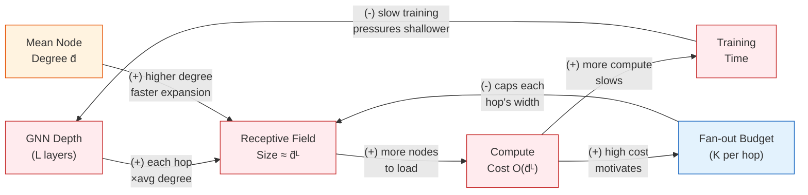

# Chapter 20: Scaling GNNs to Billion-Node Graphs

**Part 5: Scalability and Generation**

## Summary

Addresses the fundamental scalability challenge of GNN training on billion-node graphs through neighbor sampling, cluster-based mini-batching, GraphSAINT, and the SIGN architecture.

## Concepts Covered

This chapter covers the following 9 concepts from the learning graph:

1. Neighbor Sampling
2. GraphSAINT
3. Cluster-GCN
4. LADIES Sampler
5. Layer-Wise Sampling
6. Historical Embeddings (SIGN)
7. Graph Partitioning
8. Graph Sampling Strategy
9. SIGN Architecture

## Prerequisites

This chapter builds on:

- [Chapter 6: GNN Foundations: Message Passing and GCN](../06-gnn-foundations/index.md)
- [Chapter 7: GNN Design Space: GraphSAGE and GAT](../07-gnn-design-space/index.md)
- [Chapter 8: GNN Training, Augmentation, and Practical Tips](../08-gnn-training/index.md)
- [Chapter 18: Community Structure in Networks](../18-community-structure/index.md)
- [Chapter 19: Frequent Subgraph Mining](../19-subgraph-mining/index.md)

---

!!! mascot-welcome "Aggregating at Scale"
    
    Every architecture we have studied so far — GCN, GraphSAGE, GAT, GIN, Graph Transformers — has one thing in common: each forward pass touches the entire graph. That works when your graph has 34 nodes (hello, Karate Club) or even 170,000 (ogbn-arxiv on a single GPU). It breaks catastrophically when your graph has 3 billion nodes and you need to train before Tuesday. This chapter is about how the field solved that problem — not by making GNNs less powerful, but by being smarter about which parts of the graph each training step actually needs to see.

## 20.1 The Scalability Crisis in Graph Learning

The commercial success of GNNs is inseparable from a brutal practical constraint: the graphs that matter most are far too large to fit in GPU memory. Pinterest's recommendation graph contains over 3 billion nodes and 18 billion edges. The Microsoft Academic Graph tracks 250 million publications connected by citation links. The ogbn-papers100M benchmark — a curated subset of academic literature — contains 111 million nodes and 1.6 billion edges. Training even a two-layer GCN on these graphs in the standard full-batch mode would require storing dense activation matrices \( H^{(l)} \in \mathbb{R}^{n \times d} \) that occupy hundreds of gigabytes of memory, far exceeding the capacity of any individual accelerator.

To appreciate why this is a hard problem, recall the full-batch GCN update rule from Chapter 6:

\[
H^{(l+1)} = \sigma\!\left(\hat{A}\, H^{(l)}\, W^{(l)}\right)
\]

where \( \hat{A} = \tilde{D}^{-1/2} \tilde{A}\, \tilde{D}^{-1/2} \) is the symmetrically normalized adjacency matrix with self-loops, and \( H^{(l)} \in \mathbb{R}^{n \times d} \) stores one embedding vector per node at layer \( l \). For a graph with \( n = 10^8 \) nodes and embedding dimension \( d = 256 \), each activation matrix occupies \( 10^8 \times 256 \times 4 \) bytes = 102 GB — six times the memory of an A100 GPU. Even if we could fit the activations, the adjacency matrix \( \hat{A} \) itself would require dense storage on the order of \( n^2 \) entries, which is clearly infeasible. Sparse storage brings this down to \( O(m) \) where \( m \) is the number of edges, but multiplying sparse \( \hat{A} \) against dense \( H^{(l)} \) still requires touching all \( n \) rows of \( H^{(l)} \) in each layer — which cannot be parallelized across mini-batches without special care.

The solution adopted by the field is **mini-batch training**: partition the training computation into small batches, each touching only a subgraph of manageable size. But unlike mini-batch training in standard neural networks — where sampling a random subset of training examples is trivially straightforward — GNN mini-batching is complicated by **graph topology**. A node's embedding at layer \( L \) depends on its neighbors' embeddings at layer \( L-1 \), which depend on their neighbors at layer \( L-2 \), and so on recursively. To compute the embedding of a single target node correctly, you may need to touch a large fraction of the entire graph. Understanding exactly how large that fraction is — and the different strategies for controlling it — is the central subject of this chapter.

## 20.2 The Neighbor Explosion Problem

The core obstacle to GNN mini-batching is **neighborhood explosion**: the recursive dependency structure of message passing causes the number of nodes that must be loaded to grow exponentially with GNN depth.

To be precise, define the \( l \)-hop neighborhood of a node \( v \) as:

\[
\mathcal{N}^l(v) = \{u \in V : d(u, v) \leq l\}
\]

where \( d(u, v) \) is the shortest-path distance. For a graph with mean degree \( \bar{d} \), the size of this set grows roughly as:

\[
|\mathcal{N}^l(v)| \approx \bar{d}^{\,l}
\]

assuming the graph is locally tree-like (no short cycles) — a reasonable approximation for many real-world networks in their sparse regime. For a social graph with \( \bar{d} = 50 \) and a 3-layer GNN, each target node requires loading up to \( 50^3 = 125{,}000 \) nodes. For a mini-batch of 512 target nodes, that is up to 64 million node operations per training step — before any parameters are updated. This is the reinforcing loop that makes deep GNNs on large graphs computationally explosive.

Before examining the methods that tame this explosion, the following causal loop diagram formalizes the dynamics at play.

#### Diagram: Neighbor Explosion Causal Loop Diagram



| Loop | Type | Description |
|---|---|---|
| R1: Exponential Expansion | Reinforcing | More GNN layers → receptive field grows as \( \bar{d}^L \) → exponential compute → longer training |
| B1: Depth Ceiling | Balancing | Slow training time creates pressure to reduce depth, closing the reinforcing loop |
| B2: Sampling Discipline | Balancing | High compute motivates adding a fan-out budget \( K \), which caps the receptive field and linearizes cost |

The diagram captures two essential feedback dynamics. The **R1: Exponential Expansion** loop (L → RF → C → T) is reinforcing: deeper GNNs demand more nodes, which demand more compute, which increases training time. Left unchecked, this loop makes depth three or more layers impractical on large graphs. Two balancing loops counteract it. **B1: Depth Ceiling** closes the R1 loop: slow training creates empirical pressure to reduce depth, eventually terminating the reinforcing expansion. **B2: Sampling Discipline** is the engineering intervention that enables deep GNNs at scale: a fan-out budget \( K \) caps the receptive field size, converting exponential \( O(\bar{d}^L) \) compute into polynomial \( O(K^L) \) compute. The remainder of this chapter examines the design choices hidden inside that sampling budget.

The table below gives concrete numbers illustrating the explosion at different depths and degree regimes.

| GNN Depth \( L \) | Mean Degree \( \bar{d} \) | Receptive Field Size \( \bar{d}^L \) | Nodes Loaded (batch 512) |
|:---:|:---:|---:|---:|
| 2 | 10 | 100 | 51,200 |
| 3 | 10 | 1,000 | 512,000 |
| 2 | 50 | 2,500 | 1,280,000 |
| 3 | 50 | 125,000 | 64,000,000 |
| 3 | 100 | 1,000,000 | 512,000,000 |

At depth 3 with \( \bar{d} = 50 \), a mini-batch of 512 target nodes requires loading over 64 million node feature vectors — more than the entire ogbn-arxiv graph — just for one gradient step. The scalability challenge is not academic; it is the central engineering problem that every production GNN deployment must solve.

## 20.3 Neighbor Sampling: Stochastic Mini-Batching

The most widely deployed solution to neighborhood explosion is **neighbor sampling**, introduced as part of the GraphSAGE framework in Chapter 7 and formalized here for mini-batch training. The key idea is to replace the complete neighborhood \( \mathcal{N}(v) \) at each layer with a uniformly sampled subset of fixed size \( K \) — a **fan-out** hyperparameter that bounds the receptive field growth.

!!! mascot-thinking "Two Sources of Error"
    
    Sampling introduces **variance** — the gradient estimate based on a sampled neighborhood is a noisy version of the true gradient. But something subtle happens to the **bias**: under uniform neighbor sampling, the sampled aggregation is an unbiased estimator of the true aggregation only when the aggregator is a mean (as in GraphSAGE-mean). Sum and max aggregators behave differently under sampling. Before adopting a sampling strategy, think carefully about which aggregator you plan to use and whether the sampled gradient remains an unbiased estimator of the full-graph gradient.

Under neighbor sampling, the sampled SAGE aggregation at layer \( l \) for node \( v \) is:

\[
h_v^{(l)} = \sigma\!\left(W^{(l)} \cdot \text{CONCAT}\!\left(h_v^{(l-1)},\; \frac{1}{K}\sum_{u \in \tilde{\mathcal{N}}_K(v)} h_u^{(l-1)}\right)\right)
\]

where \( \tilde{\mathcal{N}}_K(v) \) is a size-\( K \) uniform random sample from \( \mathcal{N}(v) \). The recursion unrolls across all \( L \) layers, so computing \( h_v^{(L)} \) requires: a sample of \( K \) nodes at layer \( L-1 \), a sample of \( K \) neighbors for each of those \( K \) nodes at layer \( L-2 \), and so forth. The total nodes loaded per target node is bounded by \( K^L \) — polynomial rather than exponential, with the savings proportional to \( (\bar{d}/K)^L \).

PyTorch Geometric implements this entire pipeline through the `NeighborLoader` class. The following code trains a three-layer GraphSAGE model on ogbn-arxiv using neighbor sampling with fan-outs of 15 at each layer. Before reading the code, note the key parameters: `num_neighbors` is a list of fan-out sizes per layer (outermost layer first when interpreting from the target node's perspective), `batch_size` controls target-node batch size, and `shuffle=True` randomizes the order of training nodes across epochs.

```python
import torch
import torch.nn.functional as F
from torch_geometric.datasets import Planetoid
from torch_geometric.loader import NeighborLoader
from torch_geometric.nn import SAGEConv
from ogb.nodeproppred import PygNodePropPredDataset, Evaluator

# Load ogbn-arxiv (170K nodes, 1.2M edges, 40 classes)
dataset = PygNodePropPredDataset(name='ogbn-arxiv')
data = dataset[0]
split_idx = dataset.get_idx_split()

# NeighborLoader samples fan-out neighbors per hop
# num_neighbors=[15, 10, 5] means:
#   Layer 3 (closest to output): 5 neighbors sampled
#   Layer 2: 10 neighbors sampled
#   Layer 1 (closest to input): 15 neighbors sampled
# input_nodes restricts target nodes to the training set
train_loader = NeighborLoader(
    data,
    num_neighbors=[15, 10, 5],  # 3-hop fan-out (outermost first)
    batch_size=1024,
    input_nodes=split_idx['train'],
    shuffle=True,
    num_workers=4,
)

class GraphSAGE(torch.nn.Module):
    def __init__(self, in_channels, hidden_channels, out_channels, num_layers=3):
        super().__init__()
        self.convs = torch.nn.ModuleList()
        self.convs.append(SAGEConv(in_channels, hidden_channels))
        for _ in range(num_layers - 2):
            self.convs.append(SAGEConv(hidden_channels, hidden_channels))
        self.convs.append(SAGEConv(hidden_channels, out_channels))

    def forward(self, x, edge_index):
        for i, conv in enumerate(self.convs):
            x = conv(x, edge_index)
            if i < len(self.convs) - 1:
                x = F.relu(x)
                x = F.dropout(x, p=0.5, training=self.training)
        return x

device = torch.device('cuda' if torch.cuda.is_available() else 'cpu')
model = GraphSAGE(
    in_channels=data.num_node_features,
    hidden_channels=256,
    out_channels=dataset.num_classes,
).to(device)

optimizer = torch.optim.Adam(model.parameters(), lr=0.001)

def train(loader):
    model.train()
    total_loss = 0
    for batch in loader:
        batch = batch.to(device)
        optimizer.zero_grad()
        # batch.x contains features for all nodes in the sampled subgraph
        # batch.y[:batch.batch_size] contains labels for target nodes only
        out = model(batch.x, batch.edge_index)
        loss = F.cross_entropy(
            out[:batch.batch_size],
            batch.y[:batch.batch_size].squeeze(1)
        )
        loss.backward()
        optimizer.step()
        total_loss += float(loss)
    return total_loss / len(loader)
```

A key implementation detail: `NeighborLoader` returns a mini-batch in which the first `batch.batch_size` nodes are the target nodes, and subsequent nodes are the sampled neighbors needed to compute those targets' embeddings. Only `out[:batch.batch_size]` contributes to the loss — the neighbor embeddings are intermediate computations. This structure is consistent across all neighbor-sampling frameworks and must be handled correctly to avoid inadvertently computing loss on auxiliary nodes.

## 20.4 Layer-Wise Sampling: FastGCN and LADIES

Neighbor sampling (§20.3) samples neighbors **node-wise**: for each target node, independently sample \( K \) neighbors. This is intuitive but produces a separate computation graph for every node, leading to high variance in gradient estimates and redundant feature loads (the same high-degree node may be sampled repeatedly across different target nodes in the same mini-batch).

**Layer-wise sampling** takes a different approach: instead of sampling neighborhoods one node at a time, it samples a fixed set of nodes per layer to serve as the "active" nodes for that entire layer. The active nodes at layer \( l \) interact with the active nodes at layer \( l-1 \) via sampled edges. This produces a shared computation graph for the entire mini-batch, reducing redundant loads.

**FastGCN** (Chen et al., 2018) formalizes this as importance sampling. Let \( q_l(u) \) be an importance distribution over nodes at layer \( l \). FastGCN computes the layer-\( l \) embedding using importance-weighted aggregation:

\[
h_v^{(l)} = \sigma\!\left(\frac{1}{n}\sum_{u \in \mathcal{N}(v)} \frac{\hat{A}_{vu}}{q_l(u)} h_u^{(l-1)}\right), \quad u \sim q_l
\]

where \( q_l(u) \propto \|\hat{A}_{:,u}\|_2 \) — the column norm of the normalized adjacency, which reflects how influential node \( u \) is across all potential target nodes. Sampling high-importance nodes more frequently reduces variance compared to uniform sampling.

**LADIES** (Layer-dependent Importance Sampling, Zou et al., 2019) extends FastGCN by making the sampling distribution at layer \( l \) depend on which nodes were selected at layer \( l+1 \). Specifically, for target nodes selected at the output layer, LADIES computes the induced importance scores only over their actual neighbors, not over the entire node set. This layer-dependent conditioning reduces variance substantially because nodes that cannot possibly contribute to the current batch's gradients are excluded from sampling. The LADIES sampler selects \( s_l \) nodes at layer \( l \) with probabilities proportional to:

\[
p_l(u) \propto \sum_{v \in \mathcal{S}_{l+1}} \hat{A}_{vu}^2
\]

where \( \mathcal{S}_{l+1} \) is the set of active nodes at layer \( l+1 \). This constructs an upper-bounded, layer-dependent neighborhood that shares computation more efficiently than node-wise sampling while maintaining lower gradient variance than FastGCN's global importance distribution.

The trade-off between the three sampling families is summarized in the following table, which covers concepts we have now fully introduced.

| Method | Sampling Unit | Variance | Memory Efficiency | Independence of Nodes |
|--------|-------------|----------|------------------|-----------------------|
| Neighbor Sampling (SAGE) | Node-wise | High | Moderate | Independent per target |
| FastGCN | Layer-wise (global) | Medium | High | Shared across batch |
| LADIES | Layer-wise (local) | Low | High | Shared, layer-conditioned |

## 20.5 Cluster-GCN: Graph Partitioning for Mini-Batching

!!! mascot-tip "The Community Detection Connection"
    
    Chapter 18 introduced community detection as a way to find dense internal structure in networks. Cluster-GCN exploits exactly this structure for a different purpose: by partitioning the graph into communities and training on one community at a time, most of a node's neighbors are within the same mini-batch. Cross-cluster edges are dropped during training — a form of controlled graph augmentation that the Louvain and METIS algorithms make computationally cheap to compute once and reuse across all epochs.

A conceptually distinct approach to GNN mini-batching treats the problem as a **graph partitioning** problem. The idea behind **Cluster-GCN** (Chiang et al., 2019) is to partition the graph \( G \) into \( c \) clusters \( \mathcal{G}_1, \ldots, \mathcal{G}_c \) using a graph partitioning algorithm, then train on one cluster \( \mathcal{G}_t \) per mini-batch. Within a cluster, nodes are densely connected, so the intra-cluster edges provide high-quality neighborhood information. Between clusters, edges are dropped: a node near the boundary of cluster \( \mathcal{G}_t \) treats nodes in \( \mathcal{G}_{t' \neq t} \) as non-existent during the mini-batch.

Graph partitioning is performed using **METIS** (Karypis and Kumar, 1998), a multilevel graph partitioning algorithm that recursively coarsens the graph, partitions the coarsened version, and then uncoarsens the partition while refining the cut. The objective is to minimize the number of inter-cluster edges (the **edge cut**) subject to roughly equal cluster sizes. Because node embeddings at the same layer within a cluster depend only on intra-cluster neighbors, the Cluster-GCN loss for cluster \( \mathcal{G}_t \) is:

\[
\mathcal{L}^{(t)} = \frac{1}{|\mathcal{G}_t|} \sum_{v \in \mathcal{G}_t} \ell\!\left(f_\theta(v; \mathcal{G}_t),\, y_v\right)
\]

where \( f_\theta(v; \mathcal{G}_t) \) denotes the GNN applied to the restricted subgraph. Critically, the memory required for one mini-batch is \( O(|\mathcal{G}_t|) \) — bounded by cluster size, not full graph size — and no inter-cluster messages need to be fetched.

The gradient variance introduced by dropping cross-cluster edges is controlled by **stochastic partition mixing**: instead of using a single cluster per mini-batch, randomly combine \( p \) clusters \( \mathcal{G}_{t_1} \cup \ldots \cup \mathcal{G}_{t_p} \) and use all edges among the combined node set. This recovers some cross-partition edges while maintaining bounded mini-batch size.

The following code demonstrates ClusterGCN training using PyG's `ClusterData` and `ClusterLoader`. Before running, note that `ClusterData` computes the METIS partition once and saves it to disk — subsequent epochs reload the partition rather than recomputing it. The `num_parts` parameter controls the number of clusters (typically \( c = \lceil n / \text{target-cluster-size} \rceil \)), and `log` prints partition quality statistics.

```python
from torch_geometric.loader import ClusterData, ClusterLoader

# Partition the graph into 1500 clusters (≈113 nodes/cluster for ogbn-arxiv)
# METIS minimizes inter-cluster edges, so intra-cluster density is high
cluster_data = ClusterData(
    data,
    num_parts=1500,
    recursive=False,  # Standard METIS (non-recursive)
    log=True,         # Print partitioning statistics
    save_dir='./cluster_cache/'  # Cache on disk; reload in future epochs
)

# ClusterLoader randomly samples clusters and collates them into mini-batches
# batch_size=20 combines 20 clusters (~2260 nodes) per gradient step
cluster_loader = ClusterLoader(
    cluster_data,
    batch_size=20,
    shuffle=True,
    num_workers=4,
)

def train_cluster(loader):
    model.train()
    total_loss = 0
    for batch in loader:
        batch = batch.to(device)
        optimizer.zero_grad()
        # batch contains a combined subgraph of randomly sampled clusters
        # No batching offset needed; all nodes in batch are training targets
        out = model(batch.x, batch.edge_index)
        # Mask to training nodes only (batch may contain val/test nodes from the clusters)
        mask = batch.train_mask
        loss = F.cross_entropy(out[mask], batch.y[mask].squeeze(1))
        loss.backward()
        optimizer.step()
        total_loss += float(loss) * mask.sum().item()
    return total_loss / split_idx['train'].numel()
```

The most important practical difference from `NeighborLoader` is that there is no "target node offset": all nodes in the cluster batch may contribute to the loss (subject to the training mask), because all neighbors needed for any node's embedding are present in the same cluster by construction.

## 20.6 GraphSAINT: Sampling the Whole Subgraph

!!! mascot-encourage "A Different Way to Think About Batching"
    
    Neighbor sampling builds mini-batches bottom-up: start from target nodes and expand outward. Cluster-GCN builds them by partitioning. GraphSAINT tries a third approach: sample a random subgraph first, then train a complete GNN on that subgraph. It sounds similar to Cluster-GCN, but the key difference is how the subgraph is sampled — and how the resulting training bias is corrected. If you find the first two approaches unsatisfying, GraphSAINT's normalizing coefficients are worth studying carefully.

**GraphSAINT** (Graph Sampling-based Inductive Learning Method, Zeng et al., 2020) decouples the mini-batch construction from the GNN architecture: rather than adapting the GNN to sample during training, it samples a subgraph \( \mathcal{G}_s \) first, then applies any standard GNN on \( \mathcal{G}_s \) intact. This makes GraphSAINT architecture-agnostic — the same sampler can be used with GCN, GraphSAGE, GAT, or any other message-passing model.

Three subgraph samplers are available:

- **Node sampler**: Sample \( r \) nodes uniformly at random, then include all edges between selected nodes. Fast, but high-degree nodes appear disproportionately often.
- **Edge sampler**: Sample \( r \) edges uniformly at random, then include both endpoints. Preserves graph connectivity better than node sampling.
- **Random walk sampler**: Start \( r \) random walks of length \( l \), then include all nodes and edges touched by the walks. Concentrates sampling in locally dense regions, reducing cross-cluster edge loss.

Each sampler introduces a **sampling bias**: nodes or edges that appear more frequently in the sampled subgraph receive more gradient updates. GraphSAINT corrects for this bias using **normalization coefficients** that downweight frequently sampled elements. For node \( v \) with sampling probability \( p_v \) and edge \( (u,v) \) with sampling probability \( p_{uv} \), the normalized loss is:

\[
\mathcal{L} = \frac{1}{|\mathcal{V}_s|} \sum_{v \in \mathcal{V}_s} \frac{\ell(f_\theta(v; \mathcal{G}_s), y_v)}{p_v}, \qquad A_{uv}^{\text{norm}} = \frac{A_{uv}}{p_{uv}}
\]

where \( p_v \) and \( p_{uv} \) are pre-computed analytically for the node and edge samplers, or estimated by counting empirical frequencies from a few trial sampling runs. With correct normalization, the GraphSAINT estimator is an unbiased estimator of the full-graph gradient — a theoretical guarantee that neither neighbor sampling nor Cluster-GCN provides in general.

The following code shows GraphSAINT training with the random walk sampler, which empirically delivers the best accuracy-efficiency trade-off on most benchmarks.

```python
from torch_geometric.loader import GraphSAINTRandomWalkSampler

# GraphSAINTRandomWalkSampler samples subgraphs via random walks
# walk_length: number of steps in each random walk
# num_steps: number of random walks started per mini-batch
# sample_coverage: number of mini-batches used to estimate normalization coefficients
#   (higher = more accurate bias correction, but slower initialization)
saint_loader = GraphSAINTRandomWalkSampler(
    data,
    batch_size=6000,    # target subgraph node count
    walk_length=2,       # 2-hop random walks
    num_steps=5,         # gradient steps per epoch (not mini-batch count)
    sample_coverage=100, # mini-batches used to estimate normalization coefficients
    save_dir='./saint_cache/',
    log=False,
)

def train_saint(loader):
    model.train()
    total_loss = 0
    for batch in loader:
        batch = batch.to(device)
        # batch.edge_norm contains the normalization coefficients for edges
        # batch.node_norm contains the normalization coefficients for nodes
        optimizer.zero_grad()
        out = model(batch.x, batch.edge_index)
        # Apply node normalization to de-bias the loss
        loss = F.cross_entropy(
            out[batch.train_mask],
            batch.y[batch.train_mask].squeeze(1),
            reduction='none'
        )
        loss = (loss * batch.node_norm[batch.train_mask]).sum()
        loss.backward()
        optimizer.step()
        total_loss += float(loss)
    return total_loss
```

## 20.7 SIGN: Decoupling Propagation from Learning

All three approaches above — neighbor sampling, Cluster-GCN, and GraphSAINT — perform graph operations inside the training loop: each gradient step requires loading graph structure and propagating messages along edges. For very large graphs, this message-passing overhead dominates training time regardless of how cleverly the neighborhoods are sampled.

!!! mascot-warning "Staleness vs. Freshness"
    
    Historical embeddings — cached node representations from previous epochs — appear in several GNN scaling methods as a way to avoid re-computing neighbor features from scratch. The appeal is obvious: if node u's embedding hasn't changed much since the last epoch, we can reuse it instead of re-propagating. The danger is equally obvious: stale embeddings introduce bias proportional to how much the model has changed since the cache was written. Use historical embeddings only when your model changes slowly (late in training or with small learning rates) and always monitor accuracy on the validation set to catch stale-embedding degradation.

**SIGN** (Scalable Inception Graph Neural Networks, Rossi et al., 2020) eliminates in-loop graph operations entirely by adopting a **pre-computation** paradigm. The key insight is that for a GNN with linear aggregation (such as GCN or any polynomial filter), all graph-dependent computations can be performed once, offline, before training begins. What remains for the neural network to learn is a purely local function of pre-computed feature vectors.

Concretely, define the family of pre-computed diffusion operators \( \{\Omega_k\}_{k=0}^{K} \) applied to the node feature matrix \( X \):

\[
\hat{X}_k = \Omega_k X, \quad k = 0, 1, \ldots, K
\]

Common choices for \( \Omega_k \) include:

- \( \hat{A}^k \) — the \( k \)-th power of the symmetrically normalized adjacency (GCN-style diffusion)
- \( D^{-1}A^k \) — random walk diffusion
- \( \frac{1}{k+1}\sum_{j=0}^{k} \hat{A}^j \) — mean pooling of all hops up to \( k \) (the SIGN "inception" trick)

The SIGN architecture concatenates all \( K+1 \) diffusion outputs and passes the result through a shared MLP:

\[
Z_v = \text{MLP}\!\left(\text{CONCAT}\!\left(\hat{X}_0[v],\, \hat{X}_1[v],\, \ldots,\, \hat{X}_K[v]\right)\right)
\]

where \( \hat{X}_k[v] \) denotes row \( v \) of \( \hat{X}_k \). Crucially, once \( \hat{X}_0, \hat{X}_1, \ldots, \hat{X}_K \) are computed offline, training the MLP involves no graph operations whatsoever — it is a standard mini-batch MLP training problem on a dataset of \( n \) feature vectors, each of dimension \( (K+1) \times d \). Mini-batch sampling is trivially unbiased, and training speed is bounded only by the MLP's FLOPs, not by graph traversal. The offline pre-computation of \( \hat{X}_k \) is a matrix-vector product that can be performed efficiently using sparse-dense multiplication in \( O(m \cdot d) \) time per hop.

This approach also naturally incorporates the concept of **historical embeddings**: the \( \hat{X}_k \) tensors are computed once and stored, acting as a perfect "historical record" of each node's neighborhood at hop \( k \). Unlike the stale embeddings warning above, there is no staleness issue here because the pre-computed features are frozen and the neural network's parameters update independently.

The following code illustrates SIGN pre-computation and training. Before reviewing it, note the key separation: `precompute_sign_features` runs once before the training loop, and the training loop itself is a standard batched MLP update with no graph loader.

```python
import torch
import torch.nn as nn
import torch.nn.functional as F
from torch_geometric.transforms import SIGN as SIGNTransform

# Step 1: Pre-compute diffusion features offline
# SIGNTransform computes A^0 X, A^1 X, ..., A^K X and stores as data.xs[0..K]
# K=3: captures up to 3-hop neighborhood information
transform = SIGNTransform(K=3)  # K is the number of diffusion hops
data_sign = transform(data)
# data_sign.xs is a list of K+1 tensors:
#   data_sign.xs[0] = X (zero-hop, original features)
#   data_sign.xs[1] = A_hat @ X (one-hop diffusion)
#   data_sign.xs[2] = A_hat^2 @ X (two-hop diffusion)
#   data_sign.xs[3] = A_hat^3 @ X (three-hop diffusion)

class SIGNModel(nn.Module):
    """SIGN: Concatenate K+1 diffusion levels, pass through shared MLP."""
    def __init__(self, in_channels, hidden_channels, out_channels, K=3, dropout=0.5):
        super().__init__()
        self.K = K
        self.dropout = dropout
        # One linear layer per diffusion level (inception-style)
        self.lins = nn.ModuleList([
            nn.Linear(in_channels, hidden_channels) for _ in range(K + 1)
        ])
        # Final classifier on concatenated outputs
        self.classifier = nn.Sequential(
            nn.BatchNorm1d((K + 1) * hidden_channels),
            nn.ReLU(),
            nn.Dropout(dropout),
            nn.Linear((K + 1) * hidden_channels, hidden_channels),
            nn.BatchNorm1d(hidden_channels),
            nn.ReLU(),
            nn.Dropout(dropout),
            nn.Linear(hidden_channels, out_channels),
        )

    def forward(self, xs):
        # xs: list of K+1 tensors, each shape (batch, in_channels)
        outs = [lin(x) for lin, x in zip(self.lins, xs)]
        out = torch.cat(outs, dim=-1)
        return self.classifier(out)

# Step 2: Standard mini-batch MLP training — no graph operations!
from torch.utils.data import DataLoader, TensorDataset

# Combine all diffusion features and labels into a flat dataset
xs_train = [x[split_idx['train']] for x in data_sign.xs]
ys_train = data.y[split_idx['train']].squeeze(1)
train_dataset = TensorDataset(*xs_train, ys_train)
train_loader_sign = DataLoader(train_dataset, batch_size=50000, shuffle=True)

sign_model = SIGNModel(
    in_channels=data.num_node_features,
    hidden_channels=512,
    out_channels=dataset.num_classes,
    K=3,
).to(device)

optimizer_sign = torch.optim.Adam(sign_model.parameters(), lr=0.001)

def train_sign(loader):
    sign_model.train()
    total_loss = 0
    for batch in loader:
        *xs, y = [b.to(device) for b in batch]
        optimizer_sign.zero_grad()
        out = sign_model(xs)
        loss = F.cross_entropy(out, y)
        loss.backward()
        optimizer_sign.step()
        total_loss += float(loss)
    return total_loss / len(loader)
```

The absence of a graph loader inside `train_sign` is the signature of SIGN's design: graph topology has been fully absorbed into the pre-computed feature tensors, and training is purely a multi-input MLP optimization. This makes SIGN extremely scalable: the training loop can run on CPUs without any graph infrastructure, and the pre-computation step can be parallelized across the graph independently of the training hardware.

#### Diagram: SIGN Architecture vs. Neighbor Sampling Architecture

<details markdown="1">
<summary>SIGN vs. Neighbor Sampling — Side-by-Side Architecture Comparison</summary>
Type: interactive-infographic
**sim-id:** ch20-sign-vs-sampling
**Library:** p5.js
**Status:** Specified

Two-panel interactive diagram (each panel 380×500px, total 760×500px, responsive to window resize) comparing SIGN pre-computation and neighbor-sampling training pipelines side-by-side.

**Left panel — Neighbor Sampling:**
- Show a target node (orange circle) and 2 layers of sampled neighbors (smaller circles)
- Animate arrows showing messages flowing inward from layer-2 neighbors to layer-1 to target
- Label "In-loop graph ops: O(K^L) per step"
- Controls: sliders for K (fan-out, range 2-20) and L (layers, range 1-3)
- As K increases, show more neighbor circles appearing at each hop
- As L increases, add additional hop rings

**Right panel — SIGN Pre-computation:**
- Top section: static "Offline" block showing A^0 X, A^1 X, A^2 X, A^3 X as stacked matrices with colored bars (one color per hop level)
- Bottom section: dynamic "Online Training" block showing a multi-input MLP receiving the 4 pre-computed vectors
- Label "No graph ops in training loop: O(d) per node"
- Arrow from offline block to online block labeled "pre-computed once"
- Controls: slider for K (range 0-4) adding/removing precomputed diffusion levels

**Interactions:**
- Clicking any node circle in the left panel opens a tooltip explaining that node's role (target, 1-hop neighbor, 2-hop neighbor)
- Clicking any matrix block in the right panel opens a tooltip explaining what A^k X computes and its neighborhood interpretation
- Toggle button "Show Memory Usage" adds a colored bar below each panel showing relative memory proportional to subgraph size vs. pre-computed matrix size

**Learning objective (Applying — Bloom's Taxonomy):** Students can manipulate the fan-out K and depth L to observe how sampling complexity scales and compare it with SIGN's constant-per-node pre-computation cost.

Implementation: p5.js with DOM sliders and tooltip divs. Mouse-over on all interactive elements. Responsive via `windowResized()` callback.
</details>

## 20.8 Choosing Your Scaling Strategy

The four families of methods — neighbor sampling, layer-wise sampling, subgraph sampling (Cluster-GCN and GraphSAINT), and pre-computation (SIGN) — occupy different points in the accuracy-efficiency trade-off space. Choosing among them depends on the graph size, model depth, available hardware, and whether training-time graph access is feasible. The following table summarizes the key dimensions, drawing on the concepts fully introduced in the preceding sections.

| Method | Gradient Bias | Memory per Batch | Graph Access During Training | Best For |
|--------|:-------------:|:----------------:|:---------------------------:|----------|
| Neighbor Sampling | Unbiased (mean agg.) | \(O(K^L)\) nodes | Yes (online) | Moderate graphs, deep models |
| FastGCN | Unbiased | \(O(s \cdot L)\) | Yes (online) | When layer-shared compute matters |
| LADIES | Unbiased | \(O(s \cdot L)\) | Yes (online) | Low-variance layer sampling |
| Cluster-GCN | Biased (cut edges) | \(O(|\mathcal{G}_t|)\) | Offline partition + online | Large graphs, shallow models |
| GraphSAINT | Unbiased (w/ norm.) | \(O(|\mathcal{G}_s|)\) | Yes (subgraph) | Architecture-agnostic scaling |
| SIGN | Unbiased | \(O(n \cdot (K+1) \cdot d)\) precompute | No (offline only) | Billion-node static graphs |

Three practical heuristics guide the choice:

- If the graph fits on one machine and you need 3+ GNN layers with full neighborhood access, use **neighbor sampling** with `NeighborLoader`. It is the simplest to implement correctly.
- If the graph is very large but can be partitioned into clusters that each fit in GPU memory, use **Cluster-GCN** — the one-time METIS partitioning cost is amortized across all epochs.
- If the graph is static (not updated between training runs) and you want maximum throughput, use **SIGN** — no graph infrastructure is needed at training time, and the pre-computation is a one-time cost.

## 20.9 Benchmark Results

The following table reports test accuracy on ogbn-arxiv (169,343 nodes, 1,166,243 edges, 40 classes) for the methods covered in this chapter. All results use the official OGB evaluation pipeline with standard train/validation/test splits. The variance is reported over five runs with different random seeds.

| Method | Test Accuracy | Val Accuracy | Training Time/Epoch | Reference |
|--------|:-------------:|:------------:|:-------------------:|-----------|
| Full-batch GCN | 71.74 ± 0.29% | 73.00% | 12s | Kipf & Welling, 2017 |
| GraphSAGE (neighbor sampling, \(K=15\)) | 71.49 ± 0.27% | 73.23% | 4.2s | Hamilton et al., 2017 |
| Cluster-GCN | 72.04 ± 0.26% | 73.74% | 3.1s | Chiang et al., 2019 |
| GraphSAINT (random walk) | 71.84 ± 0.16% | 73.61% | 2.8s | Zeng et al., 2020 |
| SIGN (\(K=3\)) | 71.95 ± 0.11% | 73.23% | 1.4s | Rossi et al., 2020 |
| SIGN (\(K=3\)) + labels | **73.23 ± 0.06%** | **74.80%** | 1.6s | Rossi et al., 2020 |

Several observations are worth noting. First, all sampling-based methods achieve accuracy within 1% of full-batch training while reducing per-epoch training time by 3–9×. Second, SIGN achieves the lowest training-time variance across seeds — the standard deviation of 0.06% vs. 0.27–0.29% for sampling methods reflects the elimination of stochastic neighborhood construction. Third, incorporating label propagation (the "+ labels" row) gives SIGN a meaningful accuracy boost with minimal additional cost, because label information can also be pre-diffused offline.

## 20.10 Common Pitfalls

**Confusing mini-batch size with subgraph size.** When using `NeighborLoader`, `batch_size` refers to the number of target nodes, not the number of nodes loaded into GPU memory. At fan-out \( K = 15 \) and depth \( L = 3 \), each target node loads up to \( 15^3 = 3{,}375 \) additional nodes. A "mini-batch" of 1,024 target nodes can load over 3.4 million nodes into memory — potentially exceeding GPU capacity on dense graphs.

**Forgetting to apply the training mask after subgraph sampling.** Cluster-GCN and GraphSAINT batches contain validation and test nodes from the sampled region, not only training nodes. Failing to apply `batch.train_mask` computes loss on nodes with unknown labels (zeroed-out or corrupted labels), introducing training noise that is hard to diagnose.

**Using stale normalization coefficients.** GraphSAINT's normalization coefficients \( p_v \) and \( p_{uv} \) are estimated empirically by running the sampler for `sample_coverage` mini-batches before training. If the sampler's behavior changes (e.g., different random seed or dataset version), the cached coefficients become incorrect and must be re-estimated.

**Pre-computing SIGN diffusion on the wrong adjacency matrix.** SIGN's accuracy is sensitive to whether \( \hat{A} = D^{-1/2} A D^{-1/2} \) (symmetric normalization) or \( D^{-1} A \) (row normalization) is used. The two produce qualitatively different diffusion behaviors — symmetric normalization emphasizes low-degree nodes, while row normalization treats all rows equally. Always match the normalization in pre-computation to the normalization assumed by your GNN architecture.

**Ignoring the training-to-inference discrepancy in neighbor sampling.** During inference, the full neighborhood must be used (no sampling) to obtain consistent embeddings. If your inference code accidentally samples neighbors at test time, you will observe high-variance and systematically lower test accuracy than the training curves suggest.

## 20.11 Further Reading

The following papers provide the technical depth behind the methods introduced in this chapter:

- **Hamilton, Ying, and Leskovec (2017) — Inductive Representation Learning on Large Graphs.** The GraphSAGE paper that introduced neighbor sampling for GNN mini-batching; the inductive setting (training on one graph, applying to unseen nodes) is equally important for scaling. [arXiv:1706.02216](https://arxiv.org/abs/1706.02216)

- **Chen, Ma, and Xiao (2018) — FastGCN: Fast Learning with GCNs via Importance Sampling.** Derives the importance-sampling formulation for layer-wise sampling and proves variance bounds that justify the \( \|\hat{A}_{:,u}\|_2 \) distribution. [arXiv:1801.10247](https://arxiv.org/abs/1801.10247)

- **Zou et al. (2019) — Stochastic Training of GCNs with LADIES.** Introduces layer-dependent importance sampling; the variance reduction proof relative to FastGCN is technically illuminating. [arXiv:1905.12405](https://arxiv.org/abs/1905.12405)

- **Chiang et al. (2019) — Cluster-GCN: An Efficient Algorithm for Training Deep and Large GCNs.** The graph partitioning approach; Section 4 analyzes the variance of the stochastic gradient estimator under cluster sampling and derives the stochastic multiple-cluster mixing strategy. [arXiv:1905.07953](https://arxiv.org/abs/1905.07953)

- **Zeng et al. (2020) — GraphSAINT: Graph Sampling Based Inductive Learning Method.** Derives unbiased normalization coefficients for node, edge, and random-walk samplers; Appendix B provides a clear proof of gradient unbiasedness. [arXiv:1907.04931](https://arxiv.org/abs/1907.04931)

- **Rossi et al. (2020) — SIGN: Scalable Inception Graph Neural Networks.** The pre-computation paradigm; Table 2 benchmarks SIGN against all major GNN architectures on ogbn-arxiv, ogbn-products, and Flickr at 10–1000× faster training than full-batch GCN. [arXiv:2004.11198](https://arxiv.org/abs/2004.11198)

- **Ying et al. (2018) — PinSage: Graph Convolutional Neural Networks for Web-Scale Recommender Systems.** Demonstrates neighbor sampling at 3 billion nodes in a production recommender system; the producer-consumer training pipeline and importance-based neighbor selection are key engineering innovations. [arXiv:1806.01973](https://arxiv.org/abs/1806.01973)

## 20.12 Exercises

The following 12 exercises span all six levels of Bloom's Taxonomy, progressing from recall to creative application.

**Remembering**

1. Define neighborhood explosion and write the formula for the expected receptive field size \( |\mathcal{N}^L(v)| \) in terms of mean degree \( \bar{d} \) and GNN depth \( L \). For a graph with \( \bar{d} = 20 \) and \( L = 4 \), compute the expected receptive field size.

2. List the three subgraph samplers offered by GraphSAINT and briefly describe how each constructs the sampled subgraph (one sentence per sampler).

**Understanding**

3. Explain why neighbor sampling is an unbiased gradient estimator for GraphSAGE with mean aggregation but is biased for GraphSAGE with max aggregation. What property of the mean makes it sampling-invariant?

4. Cluster-GCN drops edges between clusters during training. Explain the trade-off this creates between gradient variance and computational efficiency. Why does stochastic multiple-cluster mixing improve this trade-off?

**Applying**

5. Adapt the `NeighborLoader` code from §20.3 to use fan-outs \( [25, 15] \) (two layers) and `batch_size=2048`. Explain how changing from three layers to two layers affects (a) the maximum nodes loaded per mini-batch and (b) the model's theoretical receptive field.

6. The SIGN pre-computation in §20.7 uses \( K = 3 \). Modify the code to use \( K = 5 \) and describe what additional neighborhood information the two new diffusion levels \( \hat{X}_4 \) and \( \hat{X}_5 \) capture relative to \( \hat{X}_3 \).

**Analyzing**

7. Compare the training-time memory requirements of neighbor sampling (fan-out \( K = 15 \), depth \( L = 3 \), batch size 1024) versus SIGN (\( K = 3 \)) on a graph with \( n = 10^6 \) nodes and feature dimension \( d = 128 \). Assume 4 bytes per float. Which method uses less GPU memory during a training step? Show your calculations.

8. The causal loop diagram in §20.2 identifies two balancing loops: B1 (Depth Ceiling) and B2 (Sampling Discipline). For a production team that cannot reduce GNN depth (because accuracy drops), which loop provides relief? Describe a concrete engineering intervention that activates this loop, using LADIES as an example.

**Evaluating**

9. A practitioner claims: "Cluster-GCN is always better than GraphSAINT because METIS produces lower-variance mini-batches." Evaluate this claim. Under what graph characteristics would GraphSAINT outperform Cluster-GCN, and vice versa? Consider both accuracy and efficiency in your analysis.

10. SIGN achieves the lowest variance across seeds in the benchmark table (§20.9). A colleague argues this means SIGN should always be preferred over sampling methods. Identify two scenarios where SIGN's pre-computation assumption fails and a sampling-based approach would be more appropriate.

**Creating**

11. Design a hybrid scaling strategy that combines SIGN's pre-computation paradigm with a learned attention mechanism (similar to GAT). Specifically: (a) describe how you would pre-compute attention-weighted diffusion features offline, (b) identify the limitation of doing so, and (c) propose a two-stage training procedure that pre-computes an approximation offline and refines it online.

12. Propose a new sampling strategy for dynamic graphs, where edges are added and deleted over time. Your strategy must: (a) handle edge insertions and deletions without recomputing the full partition, (b) maintain gradient unbiasedness, and (c) work with GNNs of depth \( L \geq 2 \). Sketch the normalization coefficient update rule when an edge \( (u, v) \) is added.

---

!!! mascot-celebration "You've Conquered the Scalability Wall"
    
    You now understand the full landscape of GNN scaling strategies — from the neighborhood explosion that makes full-batch training on large graphs impossible, to the four families of methods that tame it: neighbor sampling, layer-wise sampling, subgraph sampling (Cluster-GCN and GraphSAINT), and pre-computation (SIGN). Each method makes a different bet about where to spend computation: online graph traversal versus offline pre-computation, exact neighborhoods versus sampled approximations, biased gradients versus unbiased ones with normalization overhead. The billion-node graphs that power modern recommendation systems, drug discovery pipelines, and knowledge bases all rely on these ideas. Next, we turn to a different challenge entirely: not how to scale GNNs, but how to use them to generate new graphs from scratch.
