# Chapter 22: Temporal and Dynamic Graphs

**Part 5: Scalability and Generation**

## Summary

Treats graphs as evolving over time with TGN and TGAT, covering temporal graph representations, event-based memory modules, and applications to traffic forecasting.

## Concepts Covered

This chapter covers the following 5 concepts from the learning graph:

1. Traffic Forecasting (Graph)
2. Temporal Graph
3. Dynamic Graph
4. Temporal GNN (TGN)
5. TGAT

## Prerequisites

This chapter builds on:

- [Chapter 1: Introduction to Graphs and Networks](../01-intro-to-graphs/index.md)
- [Chapter 6: GNN Foundations: Message Passing and GCN](../06-gnn-foundations/index.md)
- [Chapter 7: GNN Design Space: GraphSAGE and GAT](../07-gnn-design-space/index.md)
- [Chapter 20: Scaling GNNs to Billion-Node Graphs](../20-scaling-gnns/index.md)

---

!!! mascot-welcome "Graphs Across Time"
    
    Every GNN we have built so far assumes the graph is a fixed object: the same nodes, the same edges, the same features — frozen in time while we train on them. Real graphs do not behave that way. A road network's traffic conditions change every minute. A financial transaction graph acquires thousands of new edges per second. A social platform's friendship graph grows as users join and shrinks as accounts close. This chapter asks what it takes to build GNNs that reason over graphs as they evolve — not just as a sequence of snapshots, but as a continuous stream of events with timestamps, causes, and consequences. The machinery we develop here — event memories, time encodings, and causal walks — forms the foundation of every modern temporal graph learning system.

## 22.1 Why Static GNNs Break on Evolving Graphs

A social network at 9am is not the same network at 9pm. Between those twelve hours, millions of interactions have occurred: posts liked, messages sent, new follows initiated, old accounts suspended. A static GNN trained on the 9am snapshot and asked to predict the likelihood of a friendship at 9pm is working from stale topology — it has no mechanism to incorporate the twelve hours of events that intervened.

Three structural properties of real dynamic systems expose the limits of static GNNs:

- **Temporal ordering matters.** The sequence of interactions carries causal information. If user A messages user B and then user B buys a product, the message may have caused the purchase. A static snapshot that aggregates both events erases their temporal relationship.
- **Node representations should be recency-sensitive.** A node's most important neighborhood information is typically from its recent interactions, not its entire history. Static GNNs treat all neighborhood messages as equally current.
- **New nodes and edges arrive continuously.** Transductive GNNs (trained on a fixed node set) cannot handle new nodes arriving after training. A temporal model must be inductive by design.

To address these properties, the field has developed two complementary paradigms for representing temporal graphs — and it is worth understanding both before choosing between them for a given application.

## 22.2 Two Representations: Snapshots vs. Event Streams

Before examining specific architectures, we must define the data structures that temporal GNNs operate on. Two representations dominate the literature, and the choice between them constrains every subsequent architectural decision.

A **snapshot graph** (also called a discrete-time dynamic graph) discretizes time into uniform intervals \( t_1, t_2, \ldots, t_T \) and represents the graph at each interval as a static snapshot \( G^{(t)} = (V^{(t)}, E^{(t)}, X^{(t)}) \). At each timestep, a standard GNN processes the current snapshot, and a sequence model (typically an RNN or Transformer) tracks how node embeddings evolve across snapshots. The approach is conceptually simple and compatible with any static GNN backbone, but it discards intra-interval temporal ordering and cannot represent graphs where events arrive at irregular, millisecond-level intervals.

A **continuous-time dynamic graph** (CTDG) represents the graph as a timestamped stream of events. Each event is a tuple \( (u, v, t, \mathbf{e}_{uv}^{(t)}) \) — a directed interaction from node \( u \) to node \( v \) at time \( t \), optionally annotated with an edge feature vector \( \mathbf{e}_{uv}^{(t)} \) (e.g., transaction amount, message content). The node set \( V \) may also grow over time as new users or entities appear. The CTDG representation preserves exact temporal ordering and supports millisecond-level timestamps, but requires architectures designed specifically for irregularly-spaced event streams.

!!! mascot-thinking "Which Representation Should You Use?"
    
    The choice between snapshots and event streams is not aesthetic — it reflects whether temporal ordering within your time granularity matters for your task. For traffic forecasting (§22.8), five-minute sensor readings are natural snapshot intervals: within five minutes, the ordering of individual car passages is irrelevant to predicting the next five-minute average speed. For fraud detection on credit card transactions, the ordering within a second matters: a card used to buy a $1 test charge immediately before a $4,000 electronics purchase is a classic fraud pattern that a five-minute snapshot would merge into a single "two transactions" observation. Match your representation to the temporal resolution of the signal you care about.

The following table summarizes the key differences between the two paradigms, covering the concepts we have just introduced.

| Property | Snapshot Graph | Continuous-Time Dynamic Graph |
|----------|:-------------:|:-----------------------------:|
| Time granularity | Fixed intervals | Arbitrary timestamps |
| Intra-interval ordering | Lost | Preserved |
| Backbone model | Static GNN + RNN/Transformer | Event-based memory model |
| New node handling | Requires re-training or inductive extension | Native (nodes appear with first event) |
| Representative models | EvolveGCN, T-GCN | TGN, TGAT, JODIE, CAWN |
| Best for | Regular sensor data, traffic | Transactions, social interactions |

The remainder of this chapter focuses primarily on continuous-time dynamic graphs, which are the setting for the most sophisticated and general temporal GNN architectures (TGN, TGAT, CAWN). Traffic forecasting is covered as an application where snapshot graphs are the natural choice.

## 22.3 Temporal Graph Networks (TGN)

**Temporal Graph Networks** (TGN, Rossi et al., 2020) is the most general and widely adopted continuous-time dynamic graph framework. TGN decomposes temporal graph learning into four modular components — memory, message function, message aggregator, and embedding module — that can be independently specified and combined. Understanding each component is essential before examining how they compose into a full training pipeline.

### 22.3.1 The Memory Module

The memory module is TGN's defining innovation. Each node \( v \) maintains a persistent **memory vector** \( \mathbf{s}_v(t) \in \mathbb{R}^d \) that summarizes all interactions involving \( v \) up to time \( t \). Unlike a GNN node embedding (which is recomputed from scratch at each forward pass), the memory vector is a running state that accumulates information across the entire interaction history. When node \( v \) participates in an interaction at time \( t \), its memory is updated; between interactions, the memory remains frozen at its last-updated value.

Formally, when an event \( (u, v, t, \mathbf{e}) \) occurs, TGN computes a **temporal message** for each endpoint and uses it to update their memories. The message for node \( u \) is:

\[
\mathbf{m}_u(t) = \text{msg}\!\left(\mathbf{s}_u(t^-),\, \mathbf{s}_v(t^-),\, \Delta t_u,\, \mathbf{e}_{uv}^{(t)}\right)
\]

where \( \mathbf{s}_u(t^-) \) is node \( u \)'s memory just before time \( t \), \( \Delta t_u = t - t_u^{\text{last}} \) is the time elapsed since \( u \)'s most recent prior interaction, and \( \mathbf{e}_{uv}^{(t)} \) is the edge feature. The memory is then updated by a GRU:

\[
\mathbf{s}_u(t) = \text{GRU}\!\left(\mathbf{m}_u(t),\, \mathbf{s}_u(t^-)\right)
\]

This is the core recurrence of TGN: each event triggers a memory update for both participants, and those updated memories influence how both nodes are processed in all future events.

### 22.3.2 Temporal Graph Memory Dynamics — Causal Loop Diagram

The memory update rule creates a self-reinforcing feedback loop: a node's memory influences how it processes future events, and those future events update the memory further. Time encoding introduces a counterbalancing decay mechanism. The following diagram formalizes these dynamics before we examine the time encoding in detail.

#### Diagram: Temporal Graph Memory Dynamics — Causal Loop Diagram

```mermaid
flowchart LR
    M["Node Memory\nsᵥ(t)"] -->|"(+) richer memory\nforms better"| MSG["Temporal\nMessage mᵥ(t)"]
    MSG -->|"(+) message\nupdates"| M

    M -->|"(+) memory quality\nimproves"| Q["Embedding\nQuality zᵥ(t)"]
    Q -->|"(+) better embeds\nattract"| I["Interaction\nRelevance"]
    I -->|"(+) more events\ngenerate"| MSG

    I -->|"(-) frequent events\nreduce"| DT["Elapsed Time\nΔt"]
    DT -->|"(+) longer gap\nmagnifies"| TE["Time Encoding\nφ(Δt)"]
    TE -->|"(-) discounts stale\nmessages in"| MSG

    click M href "#2231-the-memory-module" "Memory vector sᵥ(t) — persistent summary of all interactions involving node v up to time t"
    click MSG href "#2231-the-memory-module" "Temporal message mᵥ(t) — computed from both endpoints' memories, edge features, and elapsed time"
    click Q href "#2233-embedding-module" "Embedding zᵥ(t) — combines memory with temporal attention over recent interaction history"
    click I href "#2231-the-memory-module" "Interaction relevance — likelihood that node v participates in future events"
    click DT href "#224-time-encoding-making-elapsed-time-differentiable" "Elapsed time Δt — time since node v's most recent interaction"
    click TE href "#224-time-encoding-making-elapsed-time-differentiable" "Time encoding φ(Δt) — sinusoidal representation that discounts older events in memory updates"

    style M fill:#e8f5e9,stroke:#388e3c
    style MSG fill:#e8f5e9,stroke:#388e3c
    style Q fill:#e8f5e9,stroke:#388e3c
    style I fill:#e8f5e9,stroke:#388e3c
    style DT fill:#fff3e0,stroke:#e65100
    style TE fill:#e3f2fd,stroke:#1565c0
```



| Loop | Type | Description |
|---|---|---|
| R1: Memory Self-Update | Reinforcing | Richer memory → better messages → memory updates further → richer memory; longer path: richer memory → better embeddings → more interactions → more messages → richer memory |
| B1: Memory Decay | Balancing | Longer inactivity (large \( \Delta t \)) → larger time encoding → discounts incoming messages → limits stale memory reinforcement |

The diagram reveals two essential dynamics. The **R1: Memory Self-Update** loop (M → MSG → M) is reinforcing: a node's current memory shapes the messages it generates, which update its memory further. This is the core learning mechanism — nodes accumulate increasingly rich representations as they interact. The **B1: Memory Decay** loop closes through elapsed time: long inactivity (large \( \Delta t \)) produces time encodings that discount incoming messages, preventing stale memories from being reinforced by outdated interactions. Together, R1 drives memory enrichment and B1 ensures recency sensitivity.

### 22.3.3 Embedding Module

The memory module provides a compact per-node summary, but it does not directly incorporate the node's current graph neighborhood. The **embedding module** computes a richer temporal embedding by combining the node's memory with a temporal attention over its recent interaction history:

\[
\mathbf{z}_v(t) = \text{attn}\!\left(\mathbf{s}_v(t),\; \{(\mathbf{s}_u(t^-), \mathbf{e}_{uv}^{(t')}, \phi(t - t')) : (u, v, t') \in \mathcal{N}^k(v, t)\}\right)
\]

where \( \mathcal{N}^k(v, t) \) is the set of up to \( k \) most recent interactions involving \( v \) before time \( t \), and \( \phi(t - t') \) is a time encoding of the elapsed time since each historical interaction. The attention mechanism weights historical interactions by their recency and by how their source node memories align with the query node's current state — a temporal analogue of the static GAT attention introduced in Chapter 7.

The following code implements the core TGN pipeline using PyG Temporal's `TGNMemory` module. Key parameters to understand before reading: `memory_dim` is the size of each node's memory vector \( d \); `time_dim` is the dimension of the time encoding; `embedding_module` selects the graph attention embedding; and `message_module` specifies the message function (identity, MLP, or LSTM).

```python
import torch
from torch_geometric.nn import TGNMemory, TransformerConv
from torch_geometric.nn.models.tgn import (
    IdentityMessage, LastAggregator, LastNeighborLoader
)

# Memory parameters:
#   memory_dim: size of each node's persistent memory vector
#   time_dim: size of the time-encoding vector phi(delta_t)
#   message_module: how to compute the temporal message from memory + edge features
#   aggregator_module: how to aggregate multiple messages for the same node in one batch
memory = TGNMemory(
    num_nodes=data.num_nodes,
    raw_message_dim=data.msg.size(-1),  # edge feature dimension
    memory_dim=100,
    time_dim=100,
    message_module=IdentityMessage(data.msg.size(-1), 100, 100),
    aggregator_module=LastAggregator(),
)

# Embedding module: temporal graph attention (one-hop)
# TransformerConv with in_channels = memory_dim + time_dim
gnn = TransformerConv(
    in_channels=100 + 100,     # memory_dim + time_dim
    out_channels=100,
    heads=2,
    dropout=0.1,
    edge_dim=data.msg.size(-1),  # edge features passed to attention
)

# Link prediction head: score an edge from source to destination embedding
link_pred = torch.nn.Linear(100, 1)

# Neighbor loader: maintains a rolling window of recent neighbors per node
neighbor_loader = LastNeighborLoader(data.num_nodes, size=10, device='cpu')

def forward(src, dst, neg_dst, t, msg, last_neighbor_batch):
    """One training step for a batch of (src, dst) interaction events."""
    # Step 1: Retrieve memories for all nodes in the batch
    n_id = torch.cat([src, dst, neg_dst]).unique()
    z, last_update = memory(n_id)             # z: (num_unique_nodes, memory_dim)

    # Step 2: Compute temporal embeddings using recent neighbors
    # neighbor_loader returns the k most recent neighbors + their timestamps + edge features
    z = gnn(z[n_id], last_neighbor_batch.edge_index,
            last_neighbor_batch.t - t.unsqueeze(1),  # relative timestamps
            last_neighbor_batch.msg)

    # Step 3: Predict positive and negative link scores
    pos_out = link_pred(z[src] * z[dst])
    neg_out = link_pred(z[src] * z[neg_dst])

    # Step 4: Update memory with events from this batch
    memory.update_state(src, dst, t, msg)
    neighbor_loader.insert(src, dst)

    return pos_out, neg_out
```

Training TGN requires processing events in strict chronological order: the memory update from event at time \( t_1 \) must be applied before any event at \( t_2 > t_1 \) is processed. Unlike static GNN training where mini-batches can be shuffled freely, TGN mini-batches are contiguous time windows sampled from the chronologically sorted event stream.

## 22.4 Time Encoding: Making Elapsed Time Differentiable

A critical design choice in both TGN and TGAT is how to encode elapsed time \( \Delta t \) as a continuous vector that can participate in attention computations. A naive approach — using \( \Delta t \) as a scalar feature — fails because neural networks cannot easily represent the rich periodicity of temporal signals (daily cycles, weekly patterns, seasonal rhythms) from a single scalar.

**Time2Vec** (Kazemi et al., 2019) provides an elegant solution by mapping \( \Delta t \) to a vector of sinusoidal features with learnable frequency and phase parameters:

\[
\phi(\Delta t)_k = \begin{cases} w_0 \Delta t + b_0 & k = 0 \\ \sin(w_k \Delta t + b_k) & 1 \leq k \leq d \end{cases}
\]

where \( w_0, b_0, w_1, b_1, \ldots, w_d, b_d \) are learnable parameters. The linear component (\( k = 0 \)) allows the model to represent monotonic time trends; the sinusoidal components allow it to capture periodic patterns. This is directly analogous to the positional encodings used in Transformer architectures, extended to handle irregular time intervals.

!!! mascot-tip "Time Encoding = Positional Encoding for Irregular Sequences"
    
    If you have worked with Transformers, the Time2Vec encoding will look immediately familiar — it is the continuous-time generalization of the sinusoidal positional encoding used in BERT and GPT. The key difference is that Transformer positional encodings use fixed integer positions (1, 2, 3, ...), while Time2Vec uses actual timestamps with learnable frequencies. This means the model can discover that weekly periodicity (frequency ≈ 1/604800 seconds) or daily periodicity (frequency ≈ 1/86400 seconds) is relevant, without being told in advance. The linear term additionally allows the model to encode absolute time elapsed since the start of the dataset, capturing long-term drift.

The following code implements Time2Vec and shows how it integrates into the temporal attention mechanism:

```python
import torch
import torch.nn as nn
import math

class Time2Vec(nn.Module):
    """
    Learned sinusoidal time encoding.
    Maps a scalar elapsed time delta_t to a d-dimensional vector.
    Parameters:
        d: output dimension (includes 1 linear + d-1 sinusoidal components)
    """
    def __init__(self, d: int):
        super().__init__()
        self.d = d
        # Learnable frequency and phase parameters for each sinusoidal component
        self.w = nn.Parameter(torch.randn(d))   # frequencies
        self.b = nn.Parameter(torch.randn(d))   # phases

    def forward(self, delta_t: torch.Tensor) -> torch.Tensor:
        # delta_t: (batch,) or (batch, 1) — elapsed time in seconds (or normalized)
        delta_t = delta_t.unsqueeze(-1) if delta_t.dim() == 1 else delta_t
        # Linear component (k=0): captures monotonic trends
        linear = self.w[0] * delta_t + self.b[0]  # (batch, 1)
        # Sinusoidal components (k=1..d-1): capture periodic patterns
        periodic = torch.sin(self.w[1:] * delta_t + self.b[1:])  # (batch, d-1)
        return torch.cat([linear, periodic], dim=-1)  # (batch, d)


class TemporalAttention(nn.Module):
    """
    Attention over a node's recent interaction history, weighted by time encoding.
    q: query node memory (batch, memory_dim)
    keys: neighbor memories (batch, k_neighbors, memory_dim)
    delta_times: elapsed times since each neighbor interaction (batch, k_neighbors)
    """
    def __init__(self, memory_dim: int, time_dim: int, attn_dim: int):
        super().__init__()
        self.time_enc = Time2Vec(time_dim)
        # Project memory + time encoding to attention key/value space
        self.key_proj = nn.Linear(memory_dim + time_dim, attn_dim)
        self.val_proj = nn.Linear(memory_dim + time_dim, attn_dim)
        self.query_proj = nn.Linear(memory_dim, attn_dim)
        self.scale = math.sqrt(attn_dim)

    def forward(self, q, keys, delta_times):
        # Encode elapsed time for each neighbor interaction
        time_features = self.time_enc(delta_times.reshape(-1, 1))   # (batch*k, time_dim)
        time_features = time_features.reshape(*delta_times.shape, -1) # (batch, k, time_dim)
        # Concatenate neighbor memory with time encoding
        keys_t = torch.cat([keys, time_features], dim=-1)            # (batch, k, mem+time)
        K = self.key_proj(keys_t)       # (batch, k, attn_dim)
        V = self.val_proj(keys_t)       # (batch, k, attn_dim)
        Q = self.query_proj(q).unsqueeze(1)  # (batch, 1, attn_dim)
        # Scaled dot-product attention
        scores = (Q @ K.transpose(-2, -1)) / self.scale  # (batch, 1, k)
        weights = torch.softmax(scores, dim=-1)           # (batch, 1, k)
        out = (weights @ V).squeeze(1)                    # (batch, attn_dim)
        return out
```

## 22.5 TGAT: Temporal Graph Attention Networks

**TGAT** (Temporal Graph Attention Network, Xu et al., 2020) predates the full TGN framework and specializes in inductive link prediction on continuous-time dynamic graphs. Its key contribution is showing that the combination of graph attention (from GAT) with Time2Vec time encoding is sufficient for strong temporal link prediction without an explicit memory module.

TGAT's embedding for node \( v \) at query time \( t \) aggregates over its \( k \)-most-recent temporal neighbors using attention scores that incorporate both neighbor features and elapsed time:

\[
\mathbf{z}_v^{(t)} = \text{MultiHead-Attn}\!\left(\mathbf{x}_v \| \phi(0),\; \{(\mathbf{x}_u \| \phi(t - t')) : (u, t') \in \mathcal{N}^k(v, t)\}\right)
\]

where \( \| \) denotes concatenation and \( \phi(\cdot) \) is Time2Vec. The query is the node's own feature concatenated with the zero-time encoding (representing "now"), and the keys/values are neighbor features concatenated with their relative time encodings. Multiple TGAT layers stack temporal attention, expanding the temporal receptive field to \( L \)-hop temporal neighborhoods.

TGAT's inductive power comes from its purely feature-based design: because no global node identifiers enter the computation (only features and timestamps), TGAT naturally generalizes to nodes that did not appear during training. This distinguishes it from transductive methods like JODIE (§22.6), which require all nodes to be present during training.

The comparison between TGAT and TGN highlights an important design trade-off in temporal GNN architecture:

| Component | TGAT | TGN |
|-----------|:----:|:---:|
| Memory module | None | Per-node GRU memory |
| Time encoding | Time2Vec (fixed) | Time2Vec (learnable in embedding) |
| Inductive on new nodes | Yes | Yes (with embedding module) |
| Long-term memory | Limited (window of k neighbors) | Unlimited (persistent memory) |
| Computational cost | \( O(k^L) \) per node | \( O(k) \) per event + memory lookup |
| Best suited for | Sparse event streams | Dense, recurring interaction networks |

## 22.6 DyRep and JODIE: Learning Event Rate Dynamics

Two earlier temporal graph models address complementary aspects of dynamic graph learning and remain important reference points for understanding the design space.

**DyRep** (Trivedi et al., 2019) introduces a **two-timescale framework** that distinguishes between *structural events* (new edges forming between previously unconnected nodes, indicating a new relationship) and *communicative events* (interactions along existing edges, indicating an ongoing relationship). DyRep maintains a separate embedding for each timescale and uses a temporal point process to model the rate at which future events of each type will occur. This explicit event-rate modeling gives DyRep strong performance on event prediction tasks (predicting the time of the next interaction), not just binary link prediction at fixed time points.

**JODIE** (Kumar et al., 2019) focuses on **interaction networks** — bipartite graphs where two types of entities (e.g., users and items) interact over time. JODIE's key innovation is a **trajectory projection**: rather than computing a node's embedding only at interaction time, JODIE projects the embedding forward in time using a learned linear function of elapsed time. For user \( u \) with embedding \( \mathbf{z}_u(t) \), the projected embedding at future time \( t + \Delta \) is:

\[
\tilde{\mathbf{z}}_u(t + \Delta) = (1 + \mathbf{W}_{\Delta} \cdot \Delta) \cdot \mathbf{z}_u(t)
\]

where \( \mathbf{W}_{\Delta} \in \mathbb{R}^{d \times 1} \) is a learnable projection matrix. This projection allows JODIE to make predictions at arbitrary future times without requiring a new interaction to occur first — useful for tasks like predicting which item a user will interact with next, even if they have been inactive for hours.

!!! mascot-encourage "Temporal GNNs Are a Young Field"
    
    The five models covered in this chapter (TGN, TGAT, DyRep, JODIE, CAWN) were all published between 2019 and 2021 — a remarkably short window for what is now a mature subfield. The architectural language (memory modules, temporal attention, event-rate modeling) was essentially invented from scratch during those three years. If you are reading the primary papers, don't be discouraged by the notation differences between them: each team developed their own conventions before the field converged. TGN's notation (memory, message, embedding modules) is now the closest to a standard, and framing the other models in TGN terms is often the clearest path to comparison.

## 22.7 CAWN: Causal Anonymous Walks

**CAWN** (Causal Anonymous Walks, Wang et al., 2021) takes a structurally different approach to temporal link prediction. Rather than maintaining node memory or computing temporal attention over interaction history, CAWN encodes a link \( (u, v, t) \) by sampling **causal temporal random walks** rooted at each endpoint and encoding them using anonymized node identities.

A causal temporal walk from node \( v \) at time \( t \) is a sequence of nodes \( v = w_0, w_1, \ldots, w_L \) where each step \( (w_i, w_{i+1}) \) must satisfy: there exists an edge \( (w_i, w_{i+1}, t') \) in the event stream with \( t' < t \). The causality constraint — each step must use only edges that existed before the query time — prevents temporal information leakage and ensures the walk only traverses the graph's past.

The anonymization step distinguishes CAWN from most temporal GNNs: each node identity in the walk is replaced by a relative index indicating its role in the walk (walk position and distance from the root), not its global node ID. This makes CAWN's representation **inductive over both new nodes and new graphs**: it can predict links in graphs and node sets never seen during training, because the representation depends only on walk structure and edge timestamps, not on learned node embeddings.

CAWN encodes each sampled walk sequence using an LSTM that processes the anonymized node indices and relative timestamps in order. The representations of all walks rooted at \( u \) and \( v \) are aggregated (via mean pooling) and concatenated to predict \( P(\text{edge}(u,v,t)) \). Empirically, CAWN achieves strong inductive link prediction performance, particularly on sparse graphs where memory-based methods (TGN) have limited interaction history to leverage.

## 22.8 Traffic Forecasting with Temporal GNNs

Traffic forecasting is the most industrially impactful application of temporal GNNs and the primary use case for snapshot-based dynamic graph models. A road network is naturally represented as a graph: intersections (or sensor locations) are nodes, road segments are edges, and the node features are time-varying sensor readings — traffic speed, flow, or occupancy — recorded at regular intervals (typically every 5 minutes).

The forecasting task is: given the road network graph \( G \) and node feature history \( X^{(t-T)}, \ldots, X^{(t)} \), predict the next \( H \) timesteps \( X^{(t+1)}, \ldots, X^{(t+H)} \). This is a multi-step graph-to-graph prediction problem where both spatial dependencies (nearby roads influence each other) and temporal dependencies (recent traffic affects future traffic) must be modeled jointly.

Two foundational architectures combine GNNs with temporal sequence models for this task:

- **DCRNN** (Diffusion Convolutional Recurrent Neural Network, Li et al., 2018) models spatial dependencies using graph diffusion convolutions (which capture directional traffic flow along road segments) and temporal dependencies using an encoder-decoder RNN with scheduled sampling.
- **STGCN** (Spatio-Temporal Graph Convolutional Network, Yu et al., 2018) replaces the RNN with purely convolutional temporal processing — 1D convolutions along the time axis — achieving faster training and inference with competitive accuracy.

!!! mascot-warning "Temporal Leakage in Traffic Forecasting"
    
    The most common evaluation mistake in traffic forecasting is using future sensor readings in the graph structure computation. If your adjacency matrix is learned or updated from data (rather than fixed from the physical road network), make absolutely sure the adjacency at prediction time \( t \) uses only structural information available before \( t \). Using a correlation-based adjacency matrix computed on the entire dataset — including the test period — is a form of temporal leakage that will substantially inflate your reported performance. Always fix the adjacency from training data, or use the physical road network topology exclusively.

The standard benchmark is **METR-LA**, a traffic dataset from 207 sensors on Los Angeles highways, recording 5-minute average speeds over 4 months (March–June 2012). The dataset contains 34,272 timesteps and exhibits strong daily and weekly periodicity. The following code shows how to set up a simple snapshot-based temporal GNN training loop for METR-LA using PyG's `TemporalData` structure and a GCN backbone with GRU temporal processing:

```python
import torch
import torch.nn as nn
import torch.nn.functional as F
from torch_geometric.nn import GCNConv

class STGCN_Simple(nn.Module):
    """
    Simple spatio-temporal GCN: spatial GCN layer followed by temporal GRU.
    in_steps: number of historical timesteps used as input (T)
    out_steps: number of future timesteps to predict (H)
    num_nodes: number of road sensors
    in_channels: number of features per node per timestep (e.g., speed, flow)
    hidden_dim: GCN hidden dimension
    """
    def __init__(self, num_nodes, in_steps, out_steps,
                 in_channels=1, hidden_dim=64):
        super().__init__()
        self.in_steps = in_steps
        self.out_steps = out_steps
        self.num_nodes = num_nodes
        # Spatial: GCN applied to each snapshot independently
        self.spatial_conv = GCNConv(in_channels, hidden_dim)
        # Temporal: GRU over T hidden states → predict H steps
        self.temporal_gru = nn.GRU(
            input_size=hidden_dim,
            hidden_size=hidden_dim,
            num_layers=2,
            batch_first=True,
            dropout=0.1,
        )
        self.output_proj = nn.Linear(hidden_dim, out_steps * in_channels)

    def forward(self, x_seq, edge_index):
        # x_seq: (batch, T, num_nodes, in_channels)
        # edge_index: (2, num_edges) — static road network topology
        batch, T, N, C = x_seq.shape
        # Apply spatial GCN to each snapshot
        spatial_out = []
        for t in range(T):
            xt = x_seq[:, t].reshape(batch * N, C)   # (batch*N, C)
            ht = self.spatial_conv(xt, edge_index)    # (batch*N, hidden)
            ht = F.relu(ht).reshape(batch, N, -1)     # (batch, N, hidden)
            spatial_out.append(ht)
        # Stack: (batch, T, N, hidden) → process each node's time series
        spatial_seq = torch.stack(spatial_out, dim=1)   # (batch, T, N, hidden)
        spatial_seq = spatial_seq.permute(0, 2, 1, 3)  # (batch, N, T, hidden)
        spatial_seq = spatial_seq.reshape(batch * N, T, -1)  # (batch*N, T, hidden)
        # Temporal GRU over T snapshots
        gru_out, _ = self.temporal_gru(spatial_seq)         # (batch*N, T, hidden)
        last_hidden = gru_out[:, -1, :]                      # (batch*N, hidden)
        # Project to output: predict H future timesteps per node
        pred = self.output_proj(last_hidden)                 # (batch*N, H*C)
        pred = pred.reshape(batch, N, self.out_steps, C)    # (batch, N, H, C)
        return pred.permute(0, 2, 1, 3)                     # (batch, H, N, C)
```

The key parameters: `in_steps=12` (60 minutes of history), `out_steps=12` (60 minutes of prediction), `num_nodes=207` (METR-LA sensors). The static `edge_index` encodes physical road connections, fixing the spatial adjacency across all timesteps and preventing temporal leakage.

#### Diagram: Traffic Forecasting Architecture — MicroSim


<iframe src="../../sims/ch22-traffic-temporal/main.html" width="100%" height="522px" scrolling="no"></iframe>
[Run Traffic Forecasting Architecture — MicroSim Fullscreen](../../sims/ch22-traffic-temporal/main.html)

## 22.9 Benchmark Results

The standard benchmark for continuous-time dynamic graph methods is temporal link prediction on the **Wikipedia** and **Reddit** datasets (recurring user-page edits and user-post interactions), and on **MOOC** (student activity on online courses). Methods are evaluated by mean average precision (MAP) and ROC-AUC on a chronological test split — the last 20% of events by timestamp.

The following table summarizes results for the models covered in this chapter on the Wikipedia dataset (9,227 nodes, 157,474 events). All results use standard negative sampling (uniformly random negative destination nodes).

| Model | MAP | ROC-AUC | Parameters | Temporal Memory |
|-------|:---:|:-------:|:----------:|:---------------:|
| JODIE | 93.4% | 96.5% | Low | Trajectory projection |
| DyRep | 93.8% | 96.6% | Medium | Event-rate process |
| TGAT | 96.3% | 98.4% | Medium | Temporal attention only |
| CAWN | 98.0% | 99.0% | High | Causal anonymous walks |
| TGN (mean aggregator) | **98.5%** | **99.1%** | High | Per-node GRU memory |

TGN with the mean message aggregator achieves the best results on Wikipedia, with CAWN close behind. Critically, CAWN uses no per-node learned parameters (all identity is anonymous), making it the stronger choice when new nodes appear at test time with no prior interaction history — TGN's memory is empty for unseen nodes and defaults to random initialization.

## 22.10 Common Pitfalls

**Processing events out of chronological order.** TGN's memory correctness depends on events being processed in timestamp order. If mini-batches are sampled randomly (as in standard GNN training), the memory update from a later event may be applied before an earlier event, corrupting the memory state. Always sort events by timestamp before batching.

**Evaluating with future neighborhood information.** At test time, node \( v \)'s embedding at time \( t \) should only use interactions before \( t \). A common implementation error includes the test-time interaction itself in the embedding computation (as if the model "saw" the edge it is trying to predict). Always compute embeddings from the graph state at \( t^- \) (just before the test event).

**Ignoring memory resets between training epochs.** TGN's memory accumulates state across the entire training set. At the start of each epoch, if the memory is not reset, it carries stale state from the end of the previous epoch's last mini-batch — which may contain information about events near the train/test boundary, causing subtle leakage. Reset the memory state before each epoch and at the start of evaluation.

**Confusing TGAT's window parameter with TGN's memory capacity.** TGAT's `k_neighbors` parameter controls how many past interactions are retrieved per node. Increasing it linearly increases computation but has a natural ceiling beyond which older interactions contribute negligible attention weight. TGN's memory, by contrast, compresses all history into a fixed-size vector — increasing `memory_dim` may help quality but never increases temporal reach.

## 22.11 Further Reading

- **Rossi et al. (2020) — Temporal Graph Networks for Deep Learning on Dynamic Graphs.** The TGN paper; Appendix A defines the full module API and Table 2 provides comprehensive ablations of memory vs. no-memory and different message aggregators. [arXiv:2006.10637](https://arxiv.org/abs/2006.10637)

- **Xu et al. (2020) — Inductive Representation Learning on Temporal Graphs (TGAT).** The TGAT paper; Section 3.2 on temporal graph attention is the most reusable component and directly compatible with standard PyG attention layers. [arXiv:2002.07962](https://arxiv.org/abs/2002.07962)

- **Trivedi et al. (2019) — DyRep: Learning Representations over Dynamic Graphs.** Introduces the two-timescale framework and temporal point process modeling for event rate prediction; Section 4 on the Hawkes process connection is theoretically rich. [OpenReview](https://openreview.net/forum?id=HyePrhR5KX)

- **Kumar et al. (2019) — JODIE: Predicting Dynamic Embedding Trajectory in Temporal Interaction Networks.** The trajectory projection idea is elegant and practically useful for user-item bipartite graphs; Section 5 on the t-Batch training algorithm is the key engineering contribution. [arXiv:1908.01207](https://arxiv.org/abs/1908.01207)

- **Wang et al. (2021) — CAWN: Inductive Representation Learning in Temporal Networks via Causal Anonymous Walks.** The anonymization strategy is the key theoretical contribution; Theorem 1 proves that CAWN is strictly more expressive than message-passing GNNs for temporal link prediction when node identities are not available. [arXiv:2101.05974](https://arxiv.org/abs/2101.05974)

## 22.12 Exercises

**Remembering**

1. Define a continuous-time dynamic graph (CTDG) formally as a set of timestamped events. What is the minimum information each event must contain, and what optional information can be included?

2. List the four components of the TGN framework (memory, message function, message aggregator, embedding module) and describe what each component does in one sentence.

**Understanding**

3. Explain why processing TGN training events out of chronological order produces incorrect memory states. Give a concrete example involving three events at times \( t_1 < t_2 < t_3 \) where out-of-order processing produces a qualitatively different memory state than correct chronological processing.

4. Time2Vec uses both a linear component and sinusoidal components to encode elapsed time. Explain what temporal patterns each component is designed to capture, and describe a type of interaction network where the sinusoidal components would be more important than the linear component (and why).

**Applying**

5. Adapt the `STGCN_Simple` code from §22.8 to use `GAT` (graph attention convolution from PyG) instead of `GCNConv` for the spatial layer, with 4 attention heads. Explain what advantage GAT's attention mechanism provides over GCN's symmetric normalization for road network traffic prediction.

6. Using the `TemporalAttention` class from §22.4, implement a two-layer TGAT that stacks two temporal attention layers. Describe how the temporal receptive field of the two-layer model differs from the single-layer version.

**Analyzing**

7. Compare TGAT and TGN on a node that has never appeared in the training set (a cold-start node that joins the platform one week after training ends). For each model, describe exactly what embedding the model would compute for this node's first interaction, and identify which model handles this case better and why.

8. The CAWN model anonymizes node identities in causal walks, replacing global node IDs with relative walk positions. A critic argues this design makes CAWN less expressive than TGN because it cannot learn node-specific behavior. Construct a counter-argument: describe a link prediction scenario where CAWN's anonymization is an advantage rather than a limitation.

**Evaluating**

9. A team proposes evaluating their new temporal GNN by including the test-time interaction in the embedding computation (arguing it is a "self-supervised" signal). Identify the specific evaluation error this introduces, explain which metric (MAP, ROC-AUC, or both) is most affected, and estimate the direction and magnitude of the bias in their reported results.

10. For a high-frequency trading application where a new financial event arrives every millisecond, evaluate the computational feasibility of TGN vs. TGAT vs. CAWN. Consider: (a) per-event computation cost, (b) memory storage cost as event count grows, and (c) whether chronological mini-batching is tractable at millisecond granularity.

**Creating**

11. Design a temporal GNN for a **temporal knowledge graph** where entities and relations have timestamps (e.g., "Obama was president of USA from 2009 to 2017"). Your design must: (a) represent fact validity intervals, not just event timestamps, (b) define how to compute an entity embedding valid at a specific query time, and (c) handle facts that become invalid over time (e.g., the Obama-presidency fact should not contribute to queries after 2017).

12. Propose a hybrid architecture that combines TGN's per-node memory with CAWN's causal anonymous walk encoding. Specifically: (a) define how walk encodings would be computed using TGN memory states (rather than node features) at each step of the walk, (b) describe how this hybrid uses both global (per-node memory) and local (walk structure) information, and (c) identify one scenario where the hybrid would outperform pure TGN and one where it would underperform.

---

!!! mascot-celebration "Graphs That Remember and Forget"
    
    You have now equipped yourself with the full temporal graph toolkit: the snapshot-vs.-event-stream choice that sets up the whole architectural design space; TGN's modular memory framework with its self-reinforcing and decay dynamics; TGAT's attention-only approach that forgoes memory in favor of simplicity; CAWN's causal walk encoding that dispenses with node identity entirely; and traffic forecasting as a grounding application where snapshot GNNs shine. The field is still young, and the design space is still being charted — every model we covered was published between 2019 and 2021, and the benchmarks are already due for revision with larger, more diverse datasets. But the core tension — how much to memorize vs. how much to recompute from the current graph state — will remain the fundamental trade-off in temporal graph learning for years to come.

[See Annotated References](./references.md)
