# Chapter 25: Agents and Graphs

**Part 6: Frontiers**

## Summary

Examines emerging agent-graph architectures: agent memory graphs, tool-use graphs, scene graphs, and multi-hop reasoning agents as the frontier of graph-structured AI systems.

## Concepts Covered

This chapter covers the following 3 concepts from the learning graph:

1. Scene Graph
2. Agent Memory as Graph
3. Tool-Use Graph

## Prerequisites

This chapter builds on:

- [Chapter 6: GNN Foundations: Message Passing and GCN](../06-gnn-foundations/index.md)
- [Chapter 7: GNN Design Space: GraphSAGE and GAT](../07-gnn-design-space/index.md)
- [Chapter 12: Knowledge Graph Embeddings](../12-knowledge-graph-embeddings/index.md)
- [Chapter 24: Advanced GNN Topics: In-Context Learning and Uncertainty](../24-advanced-gnn-topics/index.md)

---

## 25.1 Graphs as the Skeleton of Intelligent Systems

!!! mascot-welcome "Welcome to Chapter 25"
    
    Welcome to Chapter 25 — the last full technical chapter before the conclusion. You have spent this book learning to represent, reason over, and learn from graphs. Now you will see graphs used as the **organizing substrate** for a new generation of AI systems: autonomous agents that maintain structured memory, plan sequences of tool use, and reason across multiple hops to answer complex questions. Graphs are not just the object of study here — they are the architecture. This chapter shows you why graph structure makes agents smarter, more reliable, and more interpretable than flat alternatives.

Something significant has shifted in artificial intelligence over the past few years. Language models can now plan, use tools, call external APIs, browse the web, execute code, and reflect on their own outputs. These capabilities are collectively called **agency** — the ability to take goal-directed action sequences in an environment rather than simply responding to a single prompt. Agents built on language models are already deployed in code assistants, research tools, and automated workflows.

The critical question for this chapter is: what does graph structure contribute to these agentic systems? The answer comes in three distinct forms. First, **scene graphs** provide a structured, relational representation of visual environments that enables spatial reasoning far beyond what raw image pixels or flat feature vectors support. Second, **agent memory as graph** provides a principled way to store and retrieve long-term knowledge across conversations — replacing ephemeral token-window memory with a persistent, queryable knowledge graph. Third, **tool-use graphs** organize the space of available tools into a structure that supports planning, dependency tracking, and parallel execution — turning a flat list of functions into a navigable architecture.

Throughout this chapter, a unifying theme emerges: the value of graph structure is not merely computational efficiency. It is **interpretability and modularity**. A knowledge graph memory can be inspected, corrected, and extended by a human. A tool-use graph can be reasoned about explicitly. A scene graph makes spatial reasoning transparent. In each case, the graph provides a structure that both the agent and the human can understand — which is increasingly important as AI systems take consequential actions in the world.

## 25.2 Scene Graphs: Structure for Visual Understanding

A **scene graph** is a structured representation of a visual scene in which objects are nodes and spatial or semantic relationships between objects are typed, directed edges. The term was coined in computer graphics, but its most influential modern use is in computer vision and multimodal AI, where scene graphs serve as an intermediate representation between raw pixel input and natural language reasoning.

Consider a photograph of a living room. A flat description might be: "There is a dog, a mat, a floor, a sofa, a table, and a lamp." This representation lists the objects but loses all relational information. A scene graph captures the structure:

- dog → *sits-on* → mat
- mat → *lies-on* → floor
- sofa → *next-to* → table
- lamp → *on-top-of* → table
- table → *in-front-of* → sofa

Formally, a scene graph \( G_{\text{scene}} = (O, E, L_O, L_E) \) consists of a set of object nodes \( O \), a set of directed edges \( E \subseteq O \times O \), object labels \( L_O : O \to \mathcal{C}_{\text{obj}} \) (assigning each node to an object category), and edge labels \( L_E : E \to \mathcal{C}_{\text{rel}} \) (assigning each edge a relationship type). The label sets \( \mathcal{C}_{\text{obj}} \) and \( \mathcal{C}_{\text{rel}} \) are task-defined vocabularies — typically hundreds of object categories and dozens of relationship types.

### 25.2.1 Scene Graph Generation

**Scene graph generation** is the task of automatically constructing a scene graph from an image. It is a structured prediction problem: given an image, simultaneously predict all objects and all pairwise relationships. The task decomposes into:

1. **Object detection**: identify all objects in the image with bounding boxes and category labels
2. **Relationship prediction**: for each pair of detected objects, predict the relationship type (or "no relation")

GNNs are naturally suited for relationship prediction: once object features have been extracted by a convolutional backbone, message passing between object nodes aggregates context about the surrounding scene, enabling each object to refine its relationship predictions based on what its neighbors are doing. A dog is more likely to be *sitting-on* a mat than a table; the mat is more likely to be *under* the dog if the dog feature vector encodes a sitting posture.

The standard evaluation benchmark for scene graph generation is **Visual Genome**, a dataset of 108K images annotated with 3.8 million object instances and 2.3 million relationships. State-of-the-art models (as of 2024) achieve Recall@50 (the fraction of ground-truth (subject, relation, object) triples recovered in the top-50 predictions) of approximately 50–60% for predicate classification (object boxes given, relationships to predict).

### 25.2.2 Downstream Applications

Scene graphs enable three classes of downstream reasoning that flat representations cannot handle:

**Visual Question Answering (VQA).** Questions like "What is to the left of the red lamp?" or "Is the dog sitting on or standing next to the mat?" require relational reasoning. A model that encodes the scene as a graph and then runs graph-structured question answering significantly outperforms models that operate on flat image features or detected object lists.

**Image captioning.** A caption that describes relational structure ("A dog sits on a mat in front of a sofa") is more informative than one that lists objects ("A dog. A mat. A sofa."). Generating relational captions requires encoding the scene graph and traversing it to produce a structured description.

**Robotics and embodied AI.** A robot navigating a room needs to know not just what objects are present but how they relate to each other — the cup is on the table which is next to the door. Scene graphs provide a compact, updateable representation of the environment that a robot can use for planning and manipulation.

!!! mascot-thinking "Why Not Just Use the Raw Image?"
    
    Why use a scene graph at all when modern vision-language models can process images directly? The answer is **compositionality and reliability**. A scene graph decomposes the visual scene into discrete entities and relations that can be independently verified, updated, and reasoned about. If a robotic arm moves the cup from the table to the counter, the scene graph can be updated with a single edge modification. A raw image representation has no such decomposition — every change requires reprocessing the entire image. For long-horizon planning and human oversight, structured intermediate representations beat end-to-end models.

## 25.3 Agent Memory as Graph

A language model agent processes a sequence of tokens within a fixed context window. When the conversation exceeds this window, earlier information is lost — the agent cannot remember what was discussed in prior sessions, cannot access facts from previous tasks, and cannot build up persistent world knowledge over time. This is a fundamental limitation for real-world deployment.

**Agent memory as graph** addresses this by maintaining a persistent **memory knowledge graph** \( G_{\text{mem}} \) alongside the language model. Rather than storing memory as a flat list of text snippets, the memory graph stores entities as nodes and relationships between them as typed edges. When the agent encounters new information, it extracts entities and relations and adds them to the graph. When the agent needs to retrieve relevant context, it queries the graph using graph traversal rather than text search.

### 25.3.1 Structure of a Memory Graph

A memory graph \( G_{\text{mem}} = (E_{\text{mem}}, R_{\text{mem}}) \) contains:

- **Entity nodes** \( E_{\text{mem}} \): people, places, concepts, events encountered by the agent across all sessions
- **Relation edges** \( R_{\text{mem}} \subseteq E_{\text{mem}} \times \mathcal{T} \times E_{\text{mem}} \): typed relationships between entities, where \( \mathcal{T} \) is a set of relationship types (works-at, located-in, happened-on, related-to, caused-by, etc.)
- **Temporal metadata**: timestamps recording when each node and edge was added, enabling recency-weighted retrieval
- **Confidence scores**: a weight \( w(e, r, e') \in [0, 1] \) on each edge encoding how confidently the agent believes this fact

Updating the memory graph after an agent interaction involves three operations. **Extraction** identifies entity mentions and relationships in the new conversation turn, typically using a lightweight LLM call with a structured output schema. **Merging** resolves whether an extracted entity is new or matches an existing node (entity resolution). **Integration** adds new nodes and edges or updates confidence scores on existing edges.

### 25.3.2 Retrieval and Reasoning over Memory

When the agent needs to answer a question or plan an action, it retrieves a **relevant subgraph** from \( G_{\text{mem}} \) rather than loading the entire graph into context. Two retrieval strategies are commonly used:

**Breadth-first subgraph retrieval:** start from the entity/entities most relevant to the query (found by embedding similarity), expand outward for \( k \) hops, return the resulting subgraph. This is analogous to the neighborhood sampling strategies from Chapter 20 — you sample a bounded subgraph rather than the entire graph.

**Path-based retrieval:** identify the start entity and end entity for a question, then retrieve all paths of length up to \( L \) connecting them. Path-based retrieval is especially useful for multi-hop questions ("What did Alice work on that Bob's company acquired?") where the answer requires traversing a chain of relationships.

The following code illustrates the memory graph update and retrieval loop. Before reading it, note three things: `extract_entities_relations` makes an LLM call to parse the conversation turn into structured facts; `add_to_graph` is a simple graph database write; `retrieve_subgraph` performs a BFS from the most relevant seed nodes.

```python
from collections import defaultdict, deque

class AgentMemoryGraph:
    def __init__(self):
        self.nodes = {}          # entity_id -> {'label': str, 'attrs': dict}
        self.edges = defaultdict(list)  # entity_id -> [(rel_type, target_id, confidence)]
        self.entity_index = {}   # label -> entity_id (for entity resolution)

    def update(self, conversation_turn: str, llm_extractor):
        """Extract entities and relations from a new turn and add to graph."""
        facts = llm_extractor(conversation_turn)
        # facts: [{'subject': str, 'relation': str, 'object': str, 'confidence': float}]
        for fact in facts:
            src_id = self._resolve_or_create(fact['subject'])
            tgt_id = self._resolve_or_create(fact['object'])
            self.edges[src_id].append((fact['relation'], tgt_id, fact['confidence']))

    def retrieve_subgraph(self, seed_entities: list, k_hops: int = 2) -> dict:
        """BFS from seed entities to retrieve a k-hop subgraph."""
        visited = set(seed_entities)
        frontier = deque([(e, 0) for e in seed_entities])
        subgraph_edges = []
        while frontier:
            node, depth = frontier.popleft()
            if depth >= k_hops:
                continue
            for rel, neighbor, conf in self.edges.get(node, []):
                subgraph_edges.append((node, rel, neighbor, conf))
                if neighbor not in visited:
                    visited.add(neighbor)
                    frontier.append((neighbor, depth + 1))
        return {'nodes': list(visited), 'edges': subgraph_edges}

    def _resolve_or_create(self, label: str) -> str:
        if label not in self.entity_index:
            eid = f"e{len(self.nodes)}"
            self.nodes[eid] = {'label': label}
            self.entity_index[label] = eid
        return self.entity_index[label]
```

### 25.3.3 MemGPT and Tiered Memory

**MemGPT** (Packer et al., 2023) introduces a tiered memory architecture for language model agents, explicitly separating memory into:

- **In-context memory** (working memory): the current conversation window, immediately accessible
- **External memory** (long-term storage): a persistent database or graph that the agent must explicitly retrieve from

MemGPT's key insight is that the agent should manage its own memory — deciding when to write facts to long-term storage and when to retrieve from it — using dedicated function calls (write-to-memory, search-memory, summarize-memory). When the memory is graph-structured, the write and search operations become graph writes and graph queries, enabling relational retrieval that flat text databases cannot provide.

## 25.4 Tool-Use Graphs

Modern AI agents are not limited to language — they can execute code, browse the web, query databases, call APIs, generate images, and interface with external software. Each of these capabilities is a **tool**: a function the agent can call with arguments to perform an action and receive an observation. The agent's job is to plan which tools to call, in what order, with what arguments, to achieve a goal.

When the number of available tools grows beyond a handful, flat tool lists become unwieldy. A **tool-use graph** organizes tools into a structured network where:

- **Tool nodes** represent individual capabilities (web-search, python-exec, sql-query, image-gen, email-send, etc.)
- **Dependency edges** connect tools that must be called in sequence because the output of one is the input of another
- **Compatibility edges** connect tools that can be called in parallel because they are independent
- **Constraint edges** represent tools that must NOT be called together (e.g., two tools that write to the same database table)

A tool-use graph \( G_{\text{tools}} = (T, D_{\text{seq}}, D_{\text{par}}, D_{\text{excl}}) \) enables the agent to perform **graph-structured planning**: given a goal, find a path (or DAG) through the tool graph from the initial state to the goal state that satisfies all dependency and constraint edges.

### 25.4.1 Tool Graphs in ReAct Agents

The **ReAct** framework (Yao et al., 2022) is the dominant pattern for tool-using agents. ReAct interleaves **reasoning** steps (the agent articulates its plan in natural language) with **acting** steps (the agent calls a tool and receives an observation). The cycle continues until the agent produces a final answer.

ReAct can be viewed as an implicit traversal of the tool-use graph. At each step, the agent's reasoning determines which edge in the tool graph to follow — which tool to call next. Making the tool-use graph explicit (rather than implicit in the agent's prompts) enables:

- **Validation**: check that the planned tool sequence respects dependency constraints before execution
- **Parallelism**: identify independent subtasks that can be dispatched simultaneously
- **Debugging**: trace which tools were called, in what order, with what inputs/outputs, when a task fails

The following code shows how tool dependencies can be represented as a directed graph and queried to find a valid execution order using topological sort. Before reading it, note: `networkx.topological_sort` returns nodes in an order where all dependencies come before dependents — which is exactly the order tools should be called; `in_degree_zero_nodes` identifies tools that can be called immediately (no unresolved dependencies).

```python
import networkx as nx

def build_tool_graph(tools, dependencies):
    """
    tools: list of tool names
    dependencies: list of (tool_a, tool_b) meaning tool_b depends on tool_a's output
    Returns: directed graph where edges point from prerequisite to dependent
    """
    G = nx.DiGraph()
    G.add_nodes_from(tools)
    for prereq, dependent in dependencies:
        G.add_edge(prereq, dependent)
    return G

def plan_execution_order(tool_graph):
    """
    Returns a topological ordering of tools (valid execution order).
    Raises NetworkXUnfeasible if there is a cycle (circular dependency).
    """
    if not nx.is_directed_acyclic_graph(tool_graph):
        raise ValueError("Tool dependency graph has a cycle — invalid plan!")
    return list(nx.topological_sort(tool_graph))

# Example: a research agent's tool pipeline
tools = ['web-search', 'retrieve-papers', 'summarize', 'python-exec', 'write-report']
deps = [
    ('web-search', 'retrieve-papers'),
    ('retrieve-papers', 'summarize'),
    ('summarize', 'write-report'),
    ('python-exec', 'write-report'),   # Python results also feed into report
]
tool_graph = build_tool_graph(tools, deps)
order = plan_execution_order(tool_graph)
print("Execution order:", order)
# Output: ['web-search', 'python-exec', 'retrieve-papers', 'summarize', 'write-report']
# Note: python-exec and web-search can run in parallel (both have in-degree 0)
```

#### Diagram: Agent Tool-Use Graph — Interactive Planner

<details markdown="1">
<summary>Interactive tool-use graph showing dependency traversal and parallel execution</summary>
Type: MicroSim
**sim-id:** ch25-tool-use-graph<br/>
**Library:** p5.js<br/>
**Status:** Specified

**Learning objective:** Students observe how a tool-use graph structures an agent's execution plan and how dependency edges determine which tools can run in parallel versus sequentially (Bloom's: Understanding — explaining how graph structure enables agent planning).

**Canvas:** 900 × 500 px, responsive to window resize. Background: #0d1117 (dark mode).

**Layout:** Full canvas force-directed graph with 8 tool nodes. Nodes are large circles (radius 40px) with icons (text labels inside) and category-colored borders:
- Web/search tools: blue
- Code execution tools: orange
- Data/DB tools: green
- Output/write tools: purple
- Analysis tools: teal

Edges are directed arrows. Dependency edges (solid, white) point from prerequisite to dependent. Optional parallel-safe annotations appear as dashed green arcs between independent sibling nodes.

**Preloaded scenario:** "Research report agent" with 8 tools:
1. web-search (blue) → 2. retrieve-papers (blue)
2. retrieve-papers → 4. summarize (teal)
4. summarize → 7. write-report (purple)
3. python-exec (orange) → 7. write-report
5. sql-query (green) → 6. data-analysis (teal) → 7. write-report
7. write-report → 8. email-send (purple)

**Execution animation (triggered by "Run Plan" button):**
- Step 1: nodes with in-degree 0 (web-search, python-exec, sql-query) glow gold simultaneously — label "Can run in parallel"
- Step 2: retrieve-papers unlocks and glows (web-search done)
- Step 3: summarize unlocks, data-analysis unlocks (both predecessors done)
- Step 4: write-report unlocks (summarize, python-exec, data-analysis done)
- Step 5: email-send unlocks
- Speed: 1.5 seconds per step, with completed nodes turning green

**Controls:**
- "Run Plan" button: starts the step-by-step execution animation
- "Reset" button: returns all nodes to idle state
- "Add Tool" button: opens a modal to add a new tool node and specify which existing tools it depends on
- "Remove Edge" button: click two nodes to remove the dependency between them; re-run to see the updated plan
- Scenario dropdown: "Research agent | Code debugging agent | Data pipeline agent"

**Interactions:**
- Clicking a node shows a tooltip: tool name, description, expected inputs/outputs, current status (idle/running/done)
- Clicking an edge shows: which tool produces the input for which tool
- Hovering a "parallel group" of nodes (those with in-degree 0 at a given step) highlights them with a shared glow

**Responsiveness:** graph scales to fill canvas; nodes reposition via force layout on resize
</details>

## 25.5 Multi-Hop Reasoning Agents and the Query Refinement Loop

The three building blocks — scene graphs, memory graphs, and tool graphs — all enable a common pattern: **multi-hop reasoning**. Many real-world questions cannot be answered from a single retrieved fact. They require traversing a chain of relationships, with each hop narrowing the search space for the next.

Consider the question: *"Which institution was affiliated with the researcher who first proposed attention mechanisms, and what GNN architecture did that institution's lab publish first?"*

Answering this requires at least four hops through a knowledge graph:
1. Find the researcher(s) who proposed attention mechanisms → Bahdanau, Vaswani et al.
2. Find the institution affiliated with one of them at the time → University of Montreal / Google Brain
3. Find the GNN papers published by that institution → Graph Attention Networks (GAT) from Google Brain
4. Identify which was first chronologically

No single knowledge graph query can answer this. An agent must reason about what it found at each step and formulate a new query based on that result.

### 25.5.1 The Agent Graph Reasoning Loop

Multi-hop reasoning agents follow a **query refinement loop**: they retrieve a subgraph, reason over it, generate a refined query based on what they found, retrieve a new subgraph, and repeat until they reach sufficient confidence or exhaust their hop budget. This loop has inherent feedback structure — it is a dynamical system with both reinforcing and balancing forces.

Before examining the causal loop diagram below, let us define the key quantities. The **query** \( Q_t \) is the agent's current search intent at step \( t \). The **retrieved subgraph** \( \text{SG}_t \) is the portion of the knowledge graph most relevant to \( Q_t \). The **reasoning output** \( \text{R}_t \) is the agent's partial answer and plan, produced by the language model attending to \( \text{SG}_t \). The **confidence** \( C_t \in [0, 1] \) is the agent's estimated certainty about its current answer. The **hop count** \( H_t \) is the number of retrieval-reasoning cycles completed.

#### Diagram: Agent Graph Reasoning Loop — Causal Loop Diagram

```mermaid
flowchart LR
    Q["Q — Query"] -->|"(+) better query\nretrieves richer"| SG["SG — Retrieved\nSubgraph"]
    SG -->|"(+) richer context\nenables deeper"| R["R — Reasoning\nOutput"]
    R -->|"(+) reasoning reveals\ngaps → refines"| RQ["RQ — Refined\nQuery"]
    RQ -->|"(+) replaces Q\nnext iteration"| Q

    R -->|"(+) each hop\nraises"| C["C — Confidence"]
    C -->|"(-) high confidence\ntriggers"| STOP["STOP — Terminate"]

    RQ -->|"(+) each cycle\nincrements"| H["H — Hop Count"]
    H -->|"(-) budget exhausted\ntriggers"| STOP

    click Q href "#2551-the-agent-graph-reasoning-loop" "Current natural-language query used to retrieve a subgraph"
    click SG href "#2551-the-agent-graph-reasoning-loop" "Portion of the knowledge graph most relevant to the current query"
    click R href "#2551-the-agent-graph-reasoning-loop" "LLM reasoning: partial answer, identified gaps, and next query plan"
    click RQ href "#2551-the-agent-graph-reasoning-loop" "Refined query — more specific, targeting gaps found in current reasoning"
    click C href "#2552-bounding-convergence-confidence-and-hop-budget" "Confidence C_t ∈ [0,1] — agent certainty in its current answer"
    click H href "#2552-bounding-convergence-confidence-and-hop-budget" "Hop counter H_t — bounded by a budget (typically 3–5 hops)"
    click STOP href "#2552-bounding-convergence-confidence-and-hop-budget" "Termination: C exceeds threshold (B1) or H exceeds budget (B2)"

    style Q fill:#e8f5e9,stroke:#388e3c
    style SG fill:#e8f5e9,stroke:#388e3c
    style R fill:#e8f5e9,stroke:#388e3c
    style RQ fill:#e8f5e9,stroke:#388e3c
    style C fill:#e3f2fd,stroke:#1565c0
    style H fill:#fff3e0,stroke:#e65100
    style STOP fill:#ffebee,stroke:#c62828
```



| Loop | Type | Description |
|---|---|---|
| R1: Query Refinement | Reinforcing | Better queries retrieve richer subgraphs → deeper reasoning → more refined queries → better next retrieval |
| B1: Confidence Threshold | Balancing | Each reasoning step raises confidence; when confidence exceeds the threshold, the loop terminates |
| B2: Hop Budget | Balancing | Each cycle increments the hop counter; when the budget is exhausted, the loop terminates regardless of confidence |

### 25.5.2 Bounding Convergence: Confidence and Hop Budget

The two balancing loops in the CLD serve distinct purposes. The **confidence threshold** (B1) is a soft terminator — it stops the loop when the agent has gathered enough evidence. The **hop budget** (B2) is a hard terminator — it stops the loop when the computational and latency budget is exhausted, regardless of confidence. Both are necessary:

- Without B1, the agent would continue refining queries even when the answer is already clear — wasting tokens and time.
- Without B2, a question with no answer (or an intractable retrieval path) would cause the agent to loop indefinitely.

In practice, the confidence estimate \( C_t \) is produced by the language model itself — a self-assessment that is not guaranteed to be well-calibrated. The conformalized GNN techniques from Chapter 24 offer a more principled approach: use the conformal prediction set size as a proxy for uncertainty, terminating retrieval when the prediction set shrinks to a singleton.

!!! mascot-encourage "Building These Systems Takes Time"
    
    Agent-graph systems combine everything you have learned: GNNs for encoding structure, knowledge graphs for memory, graph search for planning, and language models for reasoning. No single paper or codebase has "solved" this. The systems described here are research prototypes, and the field is changing fast. What you have built in this course — a deep understanding of how graphs represent knowledge and how GNNs reason over it — is the right foundation. The specific architectures will evolve; the graph-structured thinking will not.

### 25.5.3 Multi-Hop QA: A Running Example

To make the reasoning loop concrete, consider a minimal knowledge graph and a two-hop question.

**Knowledge graph (partial):**
- (attention, proposed-by, Bahdanau)
- (Bahdanau, affiliated-with, UniversityMontreal)
- (UniversityMontreal, produced, GGNN)
- (Transformer, proposed-by, VaswaniEtAl)
- (VaswaniEtAl, affiliated-with, GoogleBrain)
- (GoogleBrain, produced, GAT)

**Question:** "Which institution produced the model named after attention, and what was their first GNN?"

**Hop 1:** Query = "attention + GNN model" → Retrieved: (attention, proposed-by, Bahdanau), (Transformer, proposed-by, VaswaniEtAl). Reasoning: "The question may refer to Graph Attention Networks (GAT), which explicitly incorporates attention. GAT was produced by GoogleBrain."

**Hop 2:** Query = "GoogleBrain + GNN + first" → Retrieved: (GoogleBrain, produced, GAT). Reasoning: "GAT (2018) is the relevant GNN from GoogleBrain. Confidence: high."

**Termination:** confidence threshold exceeded after 2 hops.

This two-hop trace illustrates how the reinforcing loop (R1) operates: the first hop's reasoning identifies the correct institution, which sharpens the second hop's query to retrieve the specific answer.

#### Diagram: Multi-Hop KG Reasoning Agent

<details markdown="1">
<summary>Interactive multi-hop reasoning agent traversing a knowledge graph</summary>
Type: MicroSim
**sim-id:** ch25-multi-hop-reasoning<br/>
**Library:** p5.js<br/>
**Status:** Specified

**Learning objective:** Students watch an agent execute the query-retrieve-reason-refine loop step by step on a small knowledge graph, building intuition for how each hop narrows toward the answer (Bloom's: Applying — tracing an agent's reasoning path through a structured knowledge base).

**Canvas:** 960 × 540 px, responsive. Dark background (#0f0f1a). Two panels.

**Left panel (600px wide) — Knowledge Graph:**
Force-directed graph with 12 nodes and 18 edges. Nodes are colored by entity type:
- Person nodes: blue circles (Bahdanau, VaswaniEtAl, etc.)
- Institution nodes: green circles (UniversityMontreal, GoogleBrain, Stanford)
- Model/concept nodes: orange circles (Transformer, GAT, attention, GCN, GraphSAGE, GIN)

Edges are labeled with relationship types in small gray text. All edges are visible but unactivated at start.

**Animation per hop:**
- The seed node(s) for the current query glow gold
- Edges traversed in this hop animate with a traveling dot (gold, 0.5s)
- Newly discovered nodes light up white
- The "answer path" nodes and edges remain highlighted (green) after each hop

**Right panel (340px wide) — Agent Reasoning Log:**
A scrolling text panel showing:
- Current Query (Q_t): displayed in blue italic
- Retrieved Subgraph: list of (subject, relation, object) triples found this hop
- Reasoning: two-sentence LLM-style reasoning text
- Refined Query: next query in green
- Confidence bar: grows across hops (0 → 50% → 90% → terminates)
- Hop counter: "Hop 1 of 3 max"

**Controls:**
- "Next Hop →" button: advances one reasoning step
- "Auto Run" button: runs all hops with 2s delay between each
- "Reset" button: clears highlights and resets to hop 0
- Question dropdown: 3 preloaded multi-hop questions of increasing complexity (1-hop, 2-hop, 3-hop)

**Interactions:**
- Clicking any node shows its full list of outgoing relations in a tooltip
- Clicking any edge shows the (subject, relation, object) triple and confidence weight
- Hovering the confidence bar shows a tooltip explaining how confidence is estimated

**Responsiveness:** panels resize proportionally; at < 700px width, stack panels vertically with knowledge graph on top
</details>

## 25.6 Integrating the Three Graph Architectures

The three architectures — scene graphs, memory graphs, and tool-use graphs — are not independent. Real-world intelligent systems combine them. An embodied robot assistant might use:

- A **scene graph** to maintain a structured model of its visual environment (where are the objects, how are they arranged)
- A **memory graph** to retain user preferences, task history, and entity facts across sessions
- A **tool-use graph** to plan sequences of actions (perceive → reason → act) subject to physical constraints

The following table summarizes the three architectures along key design dimensions. All three have been explained in detail above; the table consolidates and compares them.

| Dimension | Scene Graph | Memory Graph | Tool-Use Graph |
|---|---|---|---|
| Node type | Visual objects | Entities (people, concepts) | Tools / capabilities |
| Edge type | Spatial/semantic relations | Factual relationships | Dependencies / constraints |
| Update mechanism | Perception (vision model) | Extraction (LLM) | Task specification |
| Query mechanism | Relation lookup | BFS / path retrieval | Topological planning |
| Primary benefit | Compositional visual reasoning | Persistent long-term memory | Structured agent planning |
| Main limitation | Scene graph generation accuracy | Entity resolution errors | Tool coverage / planning horizon |

!!! mascot-warning "Don't Conflate Memory Graphs with Retrieval-Augmented Generation"
    
    **Retrieval-augmented generation (RAG)** retrieves flat text chunks from a vector database and injects them into the LLM context. **Memory graphs** retrieve structured subgraphs from a relational graph and inject them as structured facts. These are not the same. RAG is faster to set up and works well when facts are self-contained paragraphs. Memory graphs are more powerful when answers require combining multiple related facts (multi-hop retrieval) or when the relationships between entities matter as much as the facts themselves. For knowledge-intensive tasks with complex relational structure, graph memory is worth the additional engineering cost.

## 25.7 Common Pitfalls

**Conflating agent planning graphs with knowledge graphs.** A tool-use graph represents *capabilities and dependencies* — it encodes what tools exist and which must run before which. A knowledge graph represents *world knowledge* — entities and their relationships. These serve completely different purposes. Do not try to represent tool dependencies as a knowledge graph or world knowledge as a tool graph. The structure of each is optimized for its purpose.

**Scene graph bottleneck.** A scene graph is only as good as the detection model that generates it. If the object detector misses an object or misclassifies a relationship, the scene graph carries that error downstream into all relational reasoning. In high-stakes applications (robotics, medical imaging), always include a human-in-the-loop verification step for scene graph generation before trusting the GNN reasoning built on top.

**Entity resolution failures in memory graphs.** When two conversation turns refer to the same entity with different phrasings ("the CEO of Apple" and "Tim Cook"), the agent must recognize they are the same node. Failure to resolve entities correctly creates duplicate nodes, inconsistent facts, and retrieval errors. Use a canonicalization layer (an embedding-based entity linker or explicit alias tracking) before inserting new nodes.

**Unbounded hop budgets.** The reinforcing loop in multi-hop reasoning (R1 in the CLD) has no intrinsic termination — without a hard hop budget, an agent with a poorly calibrated confidence estimator will continue retrieving and reasoning indefinitely. Always set a finite hop budget (typically 3–5 hops) and log how often the budget is exhausted without reaching the confidence threshold — this is a signal that either the budget or the confidence function needs tuning.

**Treating tool graphs as static.** In real deployments, tools are added, deprecated, and updated continuously. A tool-use graph that is correct at training time may be stale at inference time. Build tool graph maintenance (automated testing of tool availability, dependency checks on each agent run) into the deployment pipeline from the start.

## 25.8 Exercises

The following twelve exercises span all six levels of Bloom's taxonomy.

**Remembering**

1. Define "scene graph." What are the three components of the formal definition \( G_{\text{scene}} = (O, E, L_O, L_E) \)? Give one example of an object node and one example of a relationship edge for a kitchen scene.

2. What is the ReAct framework? Name the two types of steps it interleaves and describe what the agent does at each step.

**Understanding**

3. Explain the difference between retrieval-augmented generation (RAG) and agent memory as graph. In what types of questions would a memory graph provide better answers than RAG? Give a concrete example.

4. In the Agent Graph Reasoning Loop CLD, explain in plain language why R1 is a reinforcing loop and B1 is a balancing loop. What would happen if B1 did not exist?

5. Why does a tool-use graph need to be a **directed acyclic graph (DAG)** for topological planning to work? What real-world scenario would create a cycle in a tool dependency graph, and why is such a cycle a problem?

**Applying**

6. Sketch the tool-use graph for a data analysis agent that: (a) downloads a CSV file, (b) runs a Python script to compute statistics, (c) queries a database for baseline values, (d) generates a comparison plot, and (e) writes a summary report. Which tools can run in parallel, and which must be sequential? Show the execution order.

7. Using the `AgentMemoryGraph` code in Section 25.3.2, trace through three updates from the following conversation and draw the resulting graph after each update:
   - Turn 1: "Alice works at OpenAI as a researcher."
   - Turn 2: "Alice and Bob collaborated on the GPT-4 paper."
   - Turn 3: "Bob recently moved to Anthropic."

**Analyzing**

8. Compare scene graphs and memory graphs as knowledge representations. Both have entity nodes and relation edges. What is fundamentally different about how they are constructed, updated, and queried? When would a system need both?

9. The multi-hop reasoning trace in Section 25.5.3 used 2 hops to answer a 2-hop question. Analyze what would go wrong if the hop budget was set to 1. What would happen if the confidence threshold was set to 0 (always terminate after 1 hop)?

**Evaluating**

10. A robotics team proposes replacing their scene graph with a vision-language model that directly answers spatial queries (e.g., "Is the cup to the left of the plate?") from raw images, arguing this avoids scene graph generation errors. Evaluate this proposal. What advantages does it offer? What does it lose compared to an explicit scene graph? Under what circumstances would each approach be preferable?

11. Review the memory graph update code in Section 25.3.2. Identify at least three limitations of the entity resolution strategy (`_resolve_or_create`) that uses exact string matching on entity labels. Propose a more robust strategy for each limitation.

**Creating**

12. Design a complete agent architecture for the following task: "Given a user's research question, find the top-3 most relevant recent papers, extract their key claims, cross-reference the claims against a database of known facts, and produce a structured report flagging claims that are not supported by the database." Your design must: (a) specify the tool-use graph with at least 5 tools, (b) specify what goes in the agent's memory graph (initial contents and what gets updated after each run), (c) describe the multi-hop reasoning loop the agent uses to cross-reference claims, including the termination conditions, and (d) identify the most likely failure mode for each of your three graph components and propose a mitigation.

## 25.9 Further Reading

**MemGPT: Towards LLMs as Operating Systems** — Packer et al. (2023). *arXiv:2310.08560.* The foundational paper for tiered agent memory. Section 3 (the memory hierarchy design) and Section 4 (the self-directed memory management protocol) are the key contributions. The database analogy (LLM as OS, context window as RAM, external storage as disk) is illuminating. Relevant to Section 25.3.3.

**ReAct: Synergizing Reasoning and Acting in Language Models** — Yao et al. (2022). *ICLR 2023.* The canonical framework for tool-using agents. Section 3 (the ReAct format) and Table 1 (comparison with chain-of-thought and action-only baselines) are the core reading. Relevant to Section 25.4.1.

**Scene Graph Generation: A Comprehensive Survey** — Chang et al. (2023). *arXiv:2201.00443.* A thorough survey of scene graph generation methods organized by architecture (GNN-based, transformer-based, two-stage vs. one-stage). Table 2 (benchmark results on Visual Genome) is a useful overview of state-of-the-art performance. Relevant to Section 25.2.

**Graph-of-Thoughts: Solving Elaborate Problems with Large Language Models** — Besta et al. (2023). *arXiv:2308.09687.* Extends chain-of-thought to a graph structure where reasoning steps can branch and merge, enabling more complex compositional reasoning than linear chains. Directly relevant to multi-hop agent reasoning. Relevant to Section 25.5.

**HippoRAG: Neurobiologically Inspired Long-Term Memory for Large Language Models** — Gutierrez et al. (2024). *arXiv:2405.14831.* Uses a knowledge graph (inspired by the hippocampus) for retrieval-augmented generation, with GNN-based retrieval to find relevant subgraphs. The most direct implementation of Section 25.3 ideas with empirical evaluation. Relevant to Sections 25.3 and 25.5.

**ToolLLM: Facilitating Large Language Models to Master 16000+ Real-world APIs** — Qin et al. (2023). *arXiv:2307.16789.* A large-scale study of tool-use planning with LLMs. Section 3 (the depth-first search-based decision tree for tool planning) is structurally related to tool-use graph traversal. Relevant to Section 25.4.

**Visual Genome: Connecting Language and Vision Using Crowdsourced Dense Image Annotations** — Krishna et al. (2017). *IJCV.* The benchmark dataset for scene graph generation. Section 4 (region descriptions, objects, attributes, relationships, and question-answer pairs) explains what kinds of relational annotations are available. Relevant to Section 25.2.

!!! mascot-celebration "Chapter 25 Complete!"
    
    You have completed Chapter 25 — and with it, the last full technical chapter of this textbook. You now understand how graphs structure the three core components of modern AI agents: scene graphs for visual understanding, memory graphs for persistent knowledge, and tool-use graphs for structured planning. You have seen how these components combine in the multi-hop reasoning loop, and you understand the reinforcing and balancing dynamics that govern when and how that loop terminates. One chapter remains — the conclusion, where we step back and synthesize the full arc of everything you have learned.
