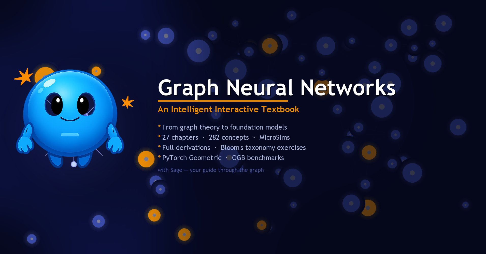

<figure markdown>
  { width="100%" }
</figure>

## About This Textbook

This textbook covers Graph Neural Networks from the ground up — starting with graph theory and classical graph algorithms, building through node embeddings and spectral methods, and reaching modern architectures including graph transformers, knowledge graph models, and LLM+GNN integration.

Every chapter leads with real-world motivation, builds intuition before equations, provides full mathematical derivations, and includes complete runnable code. Interactive MicroSims let you explore concepts directly in your browser.

## Who This Is For

- Graduate and advanced undergraduate students in machine learning, data mining, or network science
- Practitioners applying graph learning to recommender systems, knowledge graphs, drug discovery, or fraud detection
- Researchers who want a thorough reference covering both classical and frontier methods

Prior exposure to linear algebra, probability, and basic neural networks is assumed. Graph theory and PyTorch prerequisites are covered in Chapter 0.

## What's Inside

| | |
|---|---|
| **27 chapters** across 6 parts | From prerequisites through graph foundation models |
| **282 concepts** in a dependency graph | Always introduced in the right order |
| **Interactive MicroSims** | p5.js simulations embedded in every chapter |
| **Full derivations** | No "it can be shown that…" shortcuts |
| **12 exercises per chapter** | Spanning all six levels of Bloom's taxonomy |
| **2024–2025 benchmarks** | OGB results with current state-of-the-art citations |

## How to Navigate

Use the sidebar to move through **Chapters** sequentially, or jump directly to any topic. The **Learning Graph** shows how all 282 concepts relate to each other — useful for identifying prerequisites or planning a non-linear reading path. **MicroSims** can be used standalone or embedded in external course pages.

## Getting Started

Begin with [Chapter 0: Prerequisites](chapters/index.md) if you need to refresh graph theory, linear algebra, and PyTorch basics. Otherwise, jump to [Chapter 1: Introduction to Graphs](chapters/index.md) to start from the foundations of graph-structured data.

!!! mascot-welcome "Welcome from Sage"
    
    Welcome, graph explorer! I'm Sage — a graph node who learns by aggregating wisdom from my neighbors, just like the models we'll study together. Let's aggregate some knowledge!
