# MicroSims

Every chapter ships with at least one **MicroSim**: a small, self-contained interactive simulation that runs right in your browser. Drag sliders, click nodes, and step through algorithms to watch the math come alive. Nothing to install.

!!! tip "How to use a MicroSim"
    Each MicroSim is embedded directly in its chapter, next to the concept it illustrates. Use the on-screen sliders, buttons, and drop-downs to explore — you cannot break anything, so experiment freely. Click **Open full screen** under any sim below to run it on its own page.

There are **36 MicroSims** across the book, listed by chapter below.

## Chapter 0: Math and Programming Prerequisites

### [Matrix × Graph Explorer](ch00-matrix-graph-explorer/index.md)

<a href="ch00-matrix-graph-explorer/index.md">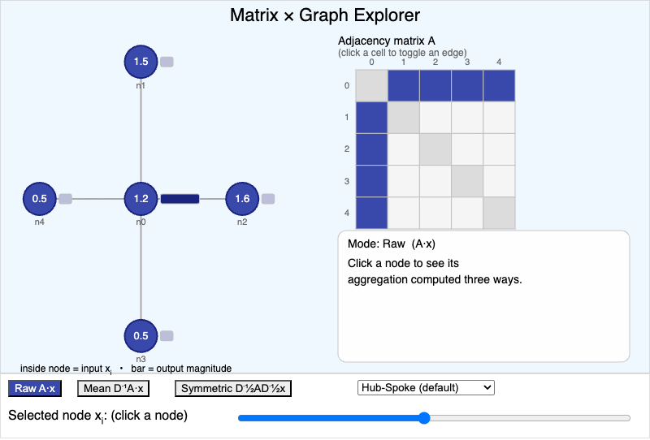</a>

Compare raw (A·x), mean (D⁻¹A·x), and symmetric (D⁻½AD⁻½x) aggregation on a small graph and see why GCN uses symmetric normalization.

[Open full screen :material-open-in-new:](ch00-matrix-graph-explorer/main.html){target=_blank}

## Chapter 1: Introduction to Graphs and Networks

### [Graph Property Explorer](ch01-graph-explorer/index.md)

<a href="ch01-graph-explorer/index.md">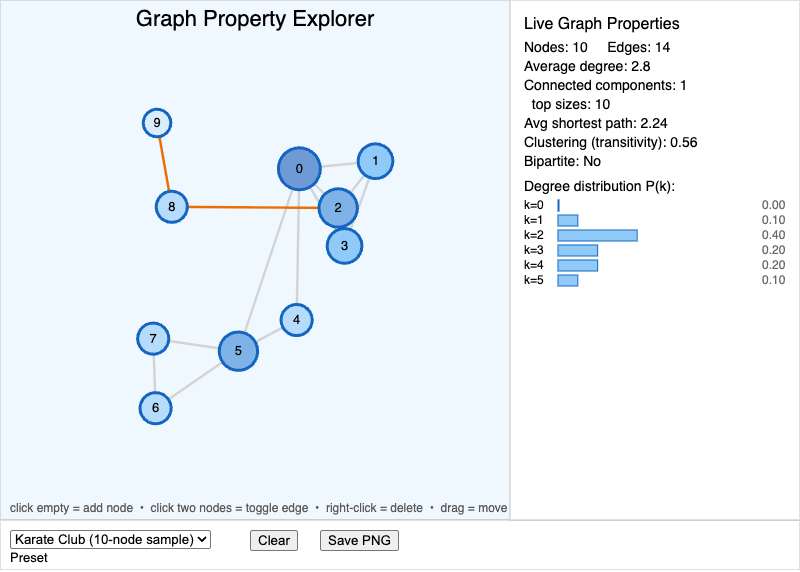</a>

Add and remove nodes and edges and watch degree, neighbors, and graph structure update live.

[Open full screen :material-open-in-new:](ch01-graph-explorer/main.html){target=_blank}

## Chapter 2: Graph Properties and Traditional ML Features

### [WL Color Refinement Simulator](ch02-wl-refinement/index.md)

<a href="ch02-wl-refinement/index.md">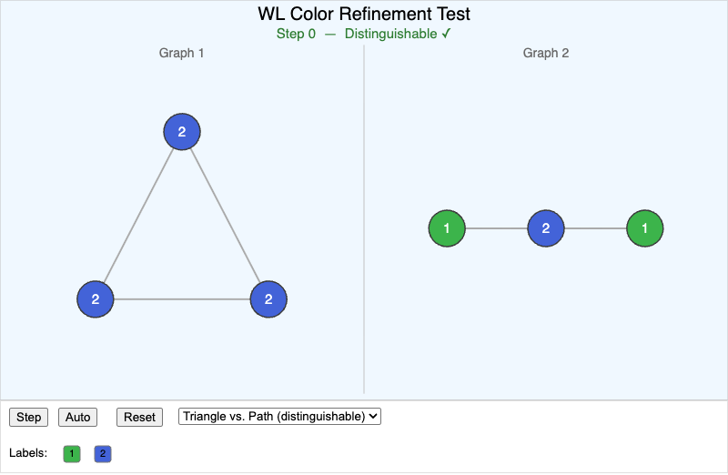</a>

Step through Weisfeiler-Lehman color refinement on two graphs side by side and see when they become distinguishable.

[Open full screen :material-open-in-new:](ch02-wl-refinement/main.html){target=_blank}

## Chapter 3: Link Analysis and PageRank

### [PageRank Power Iteration Simulator](ch03-pagerank-power-iteration/index.md)

<a href="ch03-pagerank-power-iteration/index.md">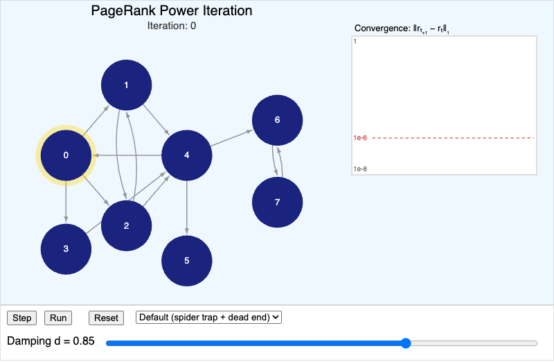</a>

Watch PageRank scores converge through power iteration; node size encodes rank and a slider controls the damping factor.

[Open full screen :material-open-in-new:](ch03-pagerank-power-iteration/main.html){target=_blank}

## Chapter 4: Node Embeddings: DeepWalk and node2vec

### [node2vec Biased Random Walk Explorer](ch04-node2vec-walk/index.md)

<a href="ch04-node2vec-walk/index.md">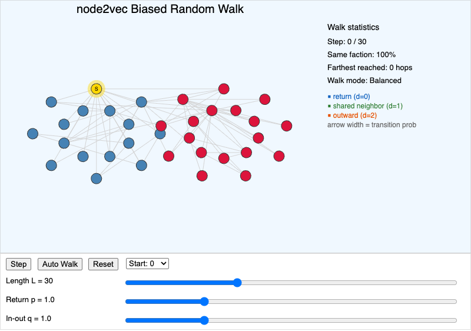</a>

Trace a biased random walk; the p (return) and q (in-out) sliders shift the walk between BFS-like and DFS-like exploration.

[Open full screen :material-open-in-new:](ch04-node2vec-walk/main.html){target=_blank}

## Chapter 5: Label Propagation and Semi-Supervised Learning

### [Label Propagation Step-by-Step Simulator](ch05-label-propagation-stepper/index.md)

<a href="ch05-label-propagation-stepper/index.md">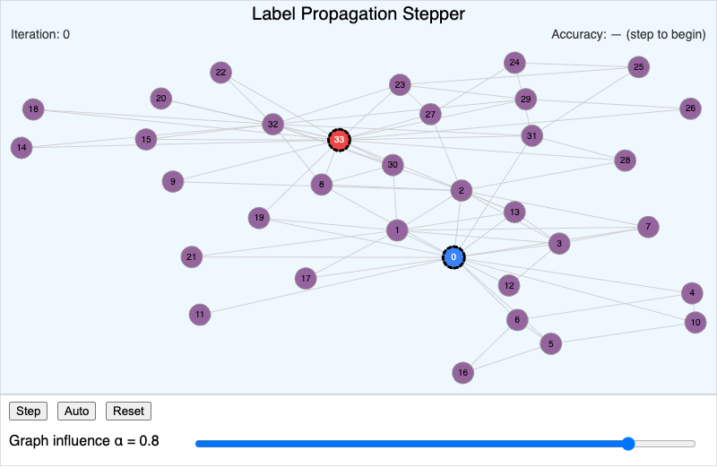</a>

Seed a few labels, then step through propagation rounds and watch labels diffuse across the graph.

[Open full screen :material-open-in-new:](ch05-label-propagation-stepper/main.html){target=_blank}

### [SIR Epidemic Dynamics on Network Structures](ch05-sir-epidemic-network/index.md)

<a href="ch05-sir-epidemic-network/index.md">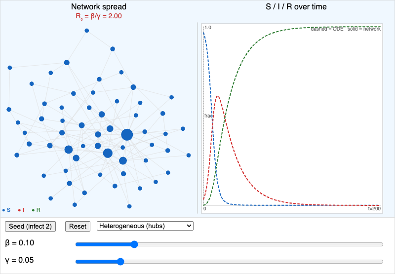</a>

Run an SIR epidemic over different network structures and see how topology drives how fast an infection spreads.

[Open full screen :material-open-in-new:](ch05-sir-epidemic-network/main.html){target=_blank}

## Chapter 6: GNN Foundations: Message Passing and GCN

### [GCN Message Passing Visualizer](ch06-gcn-message-passing/index.md)

<a href="ch06-gcn-message-passing/index.md">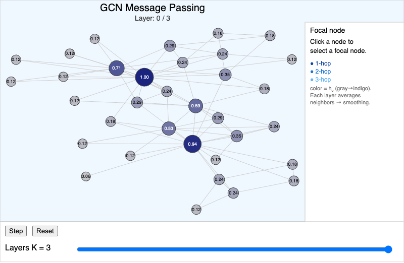</a>

Click a node and watch messages aggregate from its neighbors across 1, 2, and 3 GCN layers.

[Open full screen :material-open-in-new:](ch06-gcn-message-passing/main.html){target=_blank}

### [Spectral vs. Spatial GNN Explorer](ch06-spectral-spatial-explorer/index.md)

<a href="ch06-spectral-spatial-explorer/index.md">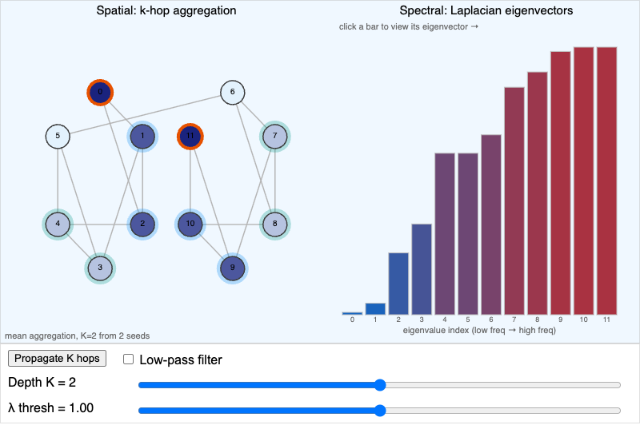</a>

Connect the spectral (eigenvalue) and spatial (message-passing) views of graph convolution.

[Open full screen :material-open-in-new:](ch06-spectral-spatial-explorer/main.html){target=_blank}

## Chapter 7: GNN Design Space: GraphSAGE and GAT

### [GAT Attention Weight Visualizer](ch07-gat-attention-weights/index.md)

<a href="ch07-gat-attention-weights/index.md">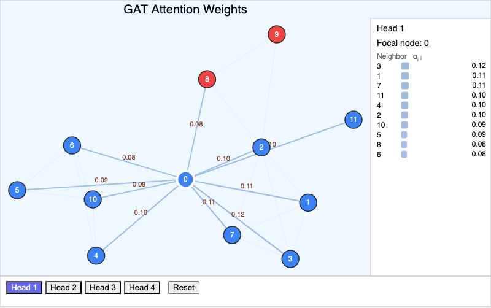</a>

Hover a node to see its softmax attention weights; edge thickness encodes how much each neighbor contributes.

[Open full screen :material-open-in-new:](ch07-gat-attention-weights/main.html){target=_blank}

### [GNN Design Space Interactive Comparison](ch07-gnn-design-comparison/index.md)

<a href="ch07-gnn-design-comparison/index.md">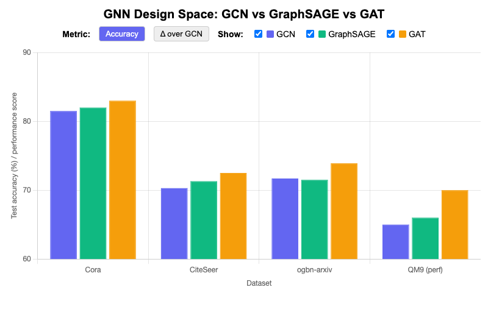</a>

Compare GNN design-space choices (aggregation, layers, skip connections) and their effect on accuracy.

[Open full screen :material-open-in-new:](ch07-gnn-design-comparison/main.html){target=_blank}

## Chapter 8: GNN Training, Augmentation, and Practical Tips

### [GNN Training Dynamics MicroSim](ch08-gnn-training-dynamics/index.md)

<a href="ch08-gnn-training-dynamics/index.md">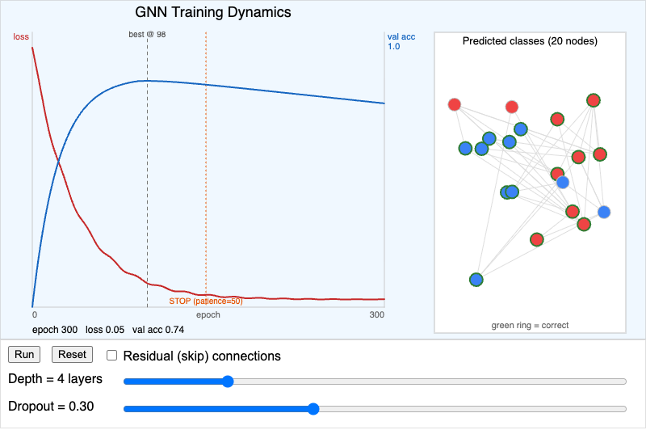</a>

Watch loss and accuracy curves evolve over epochs and toggle train/validation/test splits.

[Open full screen :material-open-in-new:](ch08-gnn-training-dynamics/main.html){target=_blank}

## Chapter 9: Theory of GNNs: Expressiveness and the WL Test

### [WL Refinement MicroSim](ch09-wl-refinement/index.md)

<a href="ch09-wl-refinement/index.md">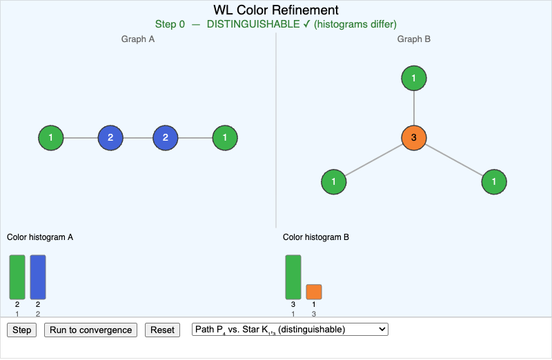</a>

Run the WL isomorphism test and see the canonical cases where two non-isomorphic graphs fool 1-WL.

[Open full screen :material-open-in-new:](ch09-wl-refinement/main.html){target=_blank}

## Chapter 10: Designing Powerful Encoders: GIN and Beyond

### [GIN vs. GCN Expressiveness MicroSim](ch10-gin-gcn-expressiveness/index.md)

<a href="ch10-gin-gcn-expressiveness/index.md">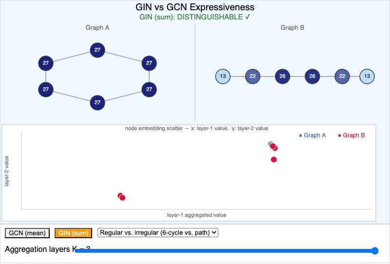</a>

On a 3-regular graph pair, GCN assigns identical embeddings while GIN tells the graphs apart.

[Open full screen :material-open-in-new:](ch10-gin-gcn-expressiveness/main.html){target=_blank}

## Chapter 11: Graph Transformers

### [Graph Transformer Attention Heatmap](ch11-graph-transformer-attention/index.md)

<a href="ch11-graph-transformer-attention/index.md">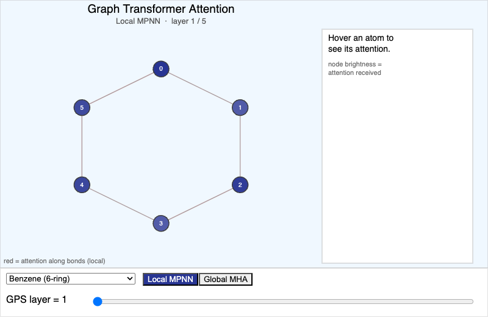</a>

Explore full graph-transformer attention as a heatmap and per-node query/key/value vectors.

[Open full screen :material-open-in-new:](ch11-graph-transformer-attention/main.html){target=_blank}

## Chapter 12: Knowledge Graph Embeddings

### [TransE Embedding Geometry](ch12-kg-embedding-geometry/index.md)

<a href="ch12-kg-embedding-geometry/index.md">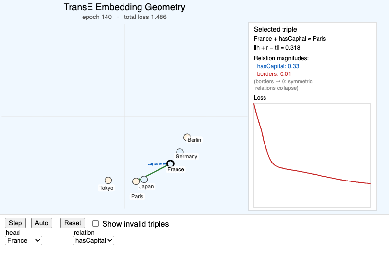</a>

Drag head, relation, and tail vectors in 2D; a triple is valid when h + r ≈ t (TransE).

[Open full screen :material-open-in-new:](ch12-kg-embedding-geometry/main.html){target=_blank}

## Chapter 13: Reasoning over Knowledge Graphs

### [Query2Box Multi-Hop Traversal](ch13-kg-query-traversal/index.md)

<a href="ch13-kg-query-traversal/index.md">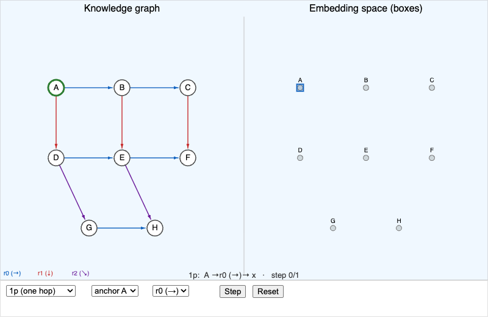</a>

Walk a Query2Box multi-hop query through projection and intersection over a knowledge graph.

[Open full screen :material-open-in-new:](ch13-kg-query-traversal/main.html){target=_blank}

## Chapter 14: Knowledge Graph Foundation Models

### [Cross-KG Structure Transfer](ch14-kg-embedding-space/index.md)

<a href="ch14-kg-embedding-space/index.md">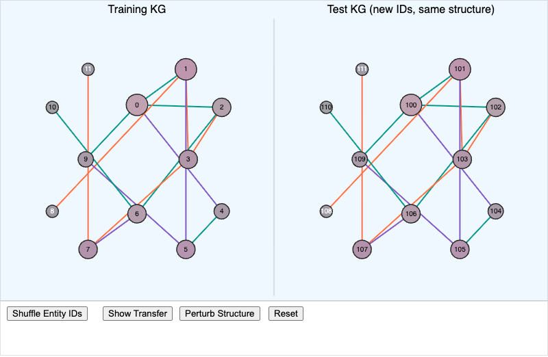</a>

Project entity and relation vectors to 2D and explore zero-shot transfer across knowledge graphs.

[Open full screen :material-open-in-new:](ch14-kg-embedding-space/main.html){target=_blank}

## Chapter 15: Heterogeneous Graphs

### [Typed Node and Edge Explorer](ch15-hetero-graph-explorer/index.md)

<a href="ch15-hetero-graph-explorer/index.md">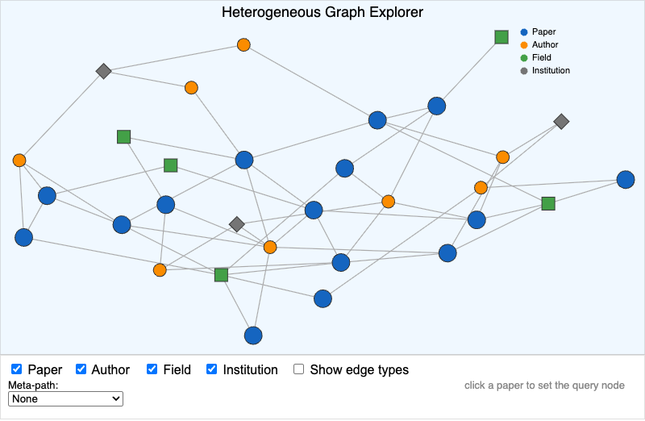</a>

Toggle node and edge types on and off and trace metapaths through a heterogeneous graph.

[Open full screen :material-open-in-new:](ch15-hetero-graph-explorer/main.html){target=_blank}

## Chapter 16: GNNs for Recommender Systems

### [User-Item Graph with Multi-Hop Propagation Visualization](ch16-lightgcn-explorer/index.md)

<a href="ch16-lightgcn-explorer/index.md">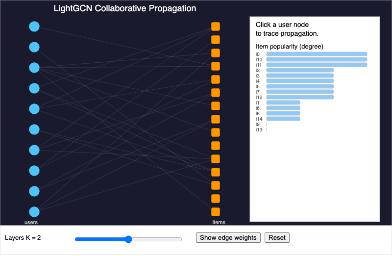</a>

Propagate over a user-item bipartite graph and see how multi-hop signal powers recommendations.

[Open full screen :material-open-in-new:](ch16-lightgcn-explorer/main.html){target=_blank}

## Chapter 17: Relational Deep Learning

### [Relational Schema to Heterogeneous Graph](ch17-table-to-graph/index.md)

<a href="ch17-table-to-graph/index.md">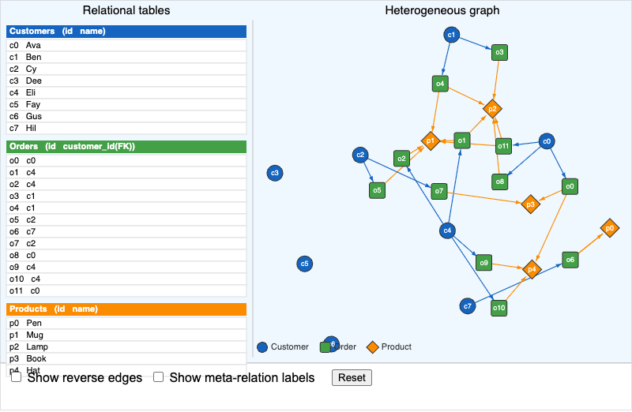</a>

Turn three relational tables (Users, Products, Purchases) into a typed heterogeneous graph.

[Open full screen :material-open-in-new:](ch17-table-to-graph/main.html){target=_blank}

## Chapter 18: Community Structure in Networks

### [Girvan-Newman Step-by-Step on the Karate Club Graph](ch18-girvan-newman/index.md)

<a href="ch18-girvan-newman/index.md">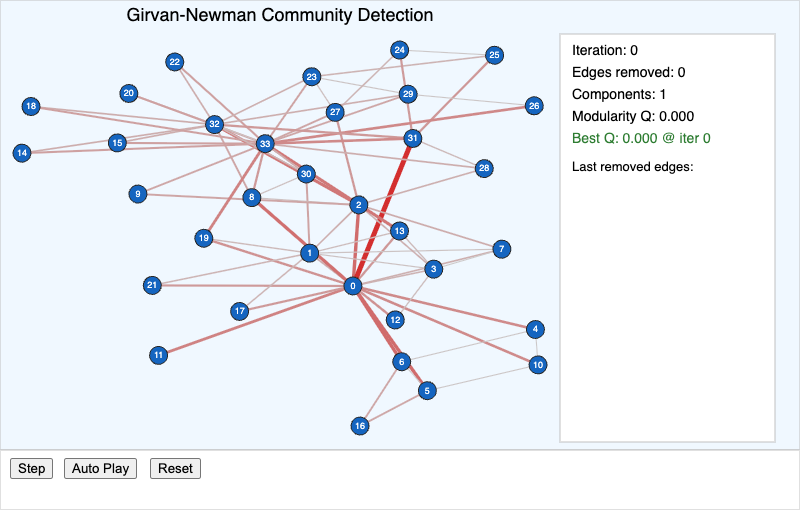</a>

Run Girvan-Newman edge-betweenness splitting on the Karate Club graph and watch communities emerge.

[Open full screen :material-open-in-new:](ch18-girvan-newman/main.html){target=_blank}

### [Louvain Two-Phase Iteration Explorer](ch18-louvain-explorer/index.md)

<a href="ch18-louvain-explorer/index.md">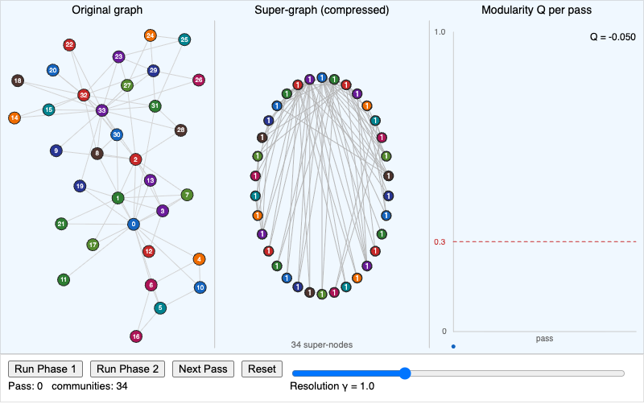</a>

Step through the two phases of Louvain modularity optimization and watch the score climb.

[Open full screen :material-open-in-new:](ch18-louvain-explorer/main.html){target=_blank}

## Chapter 19: Frequent Subgraph Mining

### [Motif Z-Score Explorer](ch19-motif-zscore/index.md)

<a href="ch19-motif-zscore/index.md">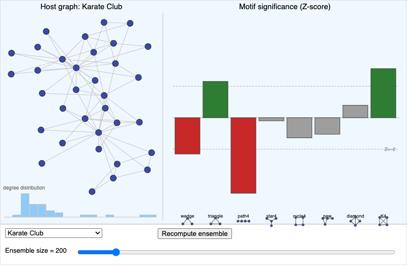</a>

Census 3- and 4-node subgraphs and compare counts against a random null model to get motif Z-scores.

[Open full screen :material-open-in-new:](ch19-motif-zscore/main.html){target=_blank}

### [SPMiner Order Embedding Space](ch19-spminer-embedding/index.md)

<a href="ch19-spminer-embedding/index.md">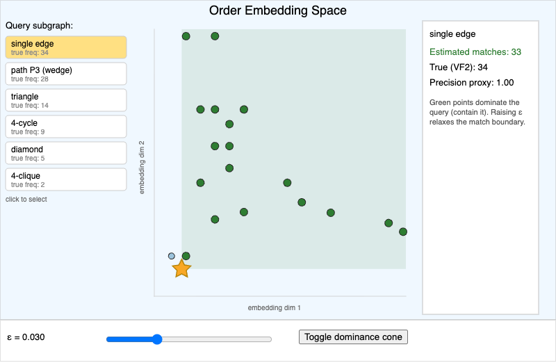</a>

Explore an order-embedding space where subgraph containment becomes a geometric relationship.

[Open full screen :material-open-in-new:](ch19-spminer-embedding/main.html){target=_blank}

## Chapter 20: Scaling GNNs to Billion-Node Graphs

### [SIGN Architecture vs. Neighbor Sampling Architecture](ch20-sign-vs-sampling/index.md)

<a href="ch20-sign-vs-sampling/index.md">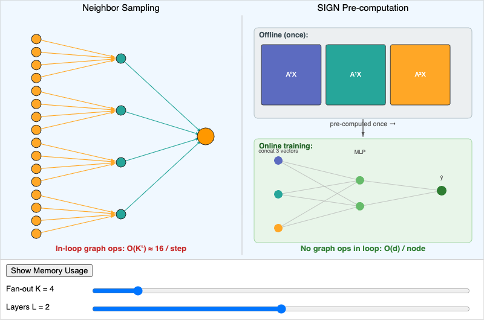</a>

Contrast precompute-then-train (SIGN) against neighbor sampling for scaling GNNs to large graphs.

[Open full screen :material-open-in-new:](ch20-sign-vs-sampling/main.html){target=_blank}

## Chapter 21: Deep Generative Models for Graphs

### [Drug Discovery GNN Pipeline](ch21-drug-discovery-pipeline/index.md)

<a href="ch21-drug-discovery-pipeline/index.md">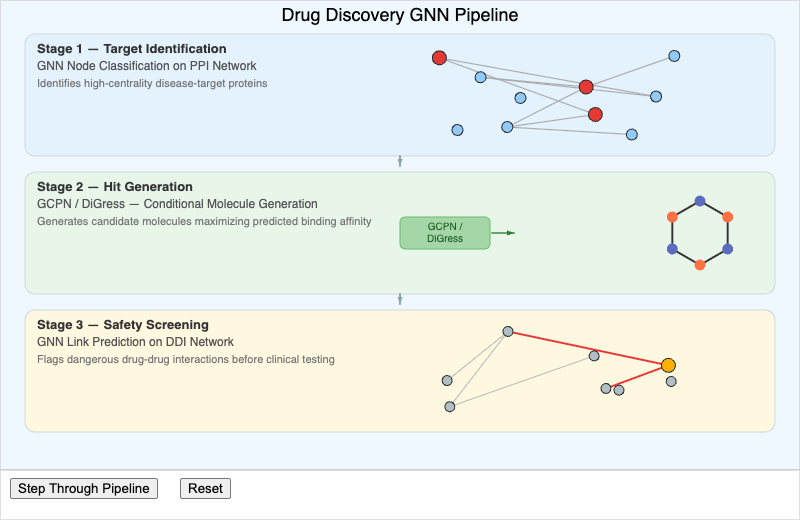</a>

Step through a molecular-graph GNN pipeline from molecule to property prediction.

[Open full screen :material-open-in-new:](ch21-drug-discovery-pipeline/main.html){target=_blank}

## Chapter 22: Temporal and Dynamic Graphs

### [Traffic Forecasting Architecture — MicroSim](ch22-traffic-temporal/index.md)

<a href="ch22-traffic-temporal/index.md">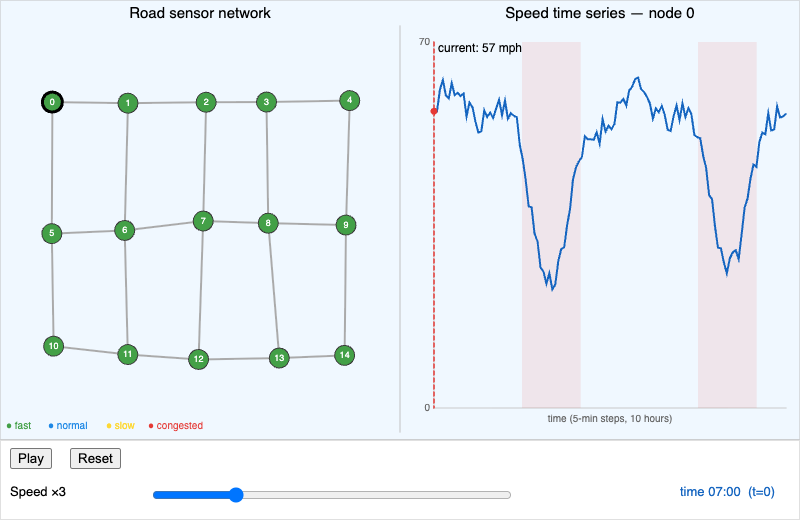</a>

See how a spatio-temporal GNN forecasts traffic by combining road structure with time.

[Open full screen :material-open-in-new:](ch22-traffic-temporal/main.html){target=_blank}

## Chapter 23: LLMs and GNNs: Text-Attributed Graphs and Joint Training

### [LLM+GNN Pipeline Explorer (Full Version)](ch23-llm-gnn-explorer/index.md)

<a href="ch23-llm-gnn-explorer/index.md">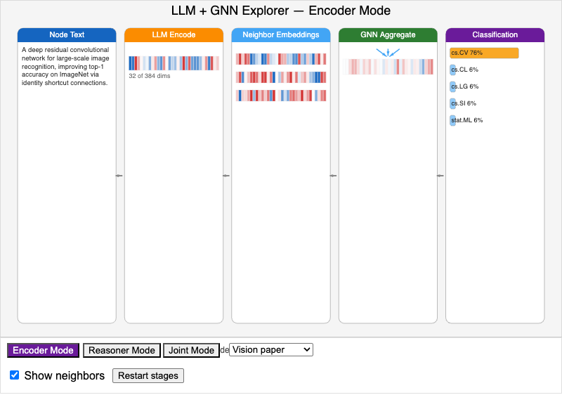</a>

Explore how text-attributed graphs combine LLM text encoders with GNN message passing.

[Open full screen :material-open-in-new:](ch23-llm-gnn-explorer/main.html){target=_blank}

### [LLM+GNN Pipeline — Text-to-Prediction](ch23-llm-gnn-pipeline/index.md)

<a href="ch23-llm-gnn-pipeline/index.md">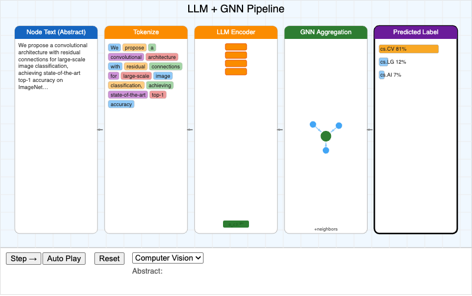</a>

Follow one node from raw text → LLM embedding → GNN aggregation → final prediction, with dimension bars at each stage.

[Open full screen :material-open-in-new:](ch23-llm-gnn-pipeline/main.html){target=_blank}

## Chapter 24: Advanced GNN Topics: In-Context Learning and Uncertainty

### [Contrastive Loss Surface Explorer](ch24-contrastive-loss-explorer/index.md)

<a href="ch24-contrastive-loss-explorer/index.md">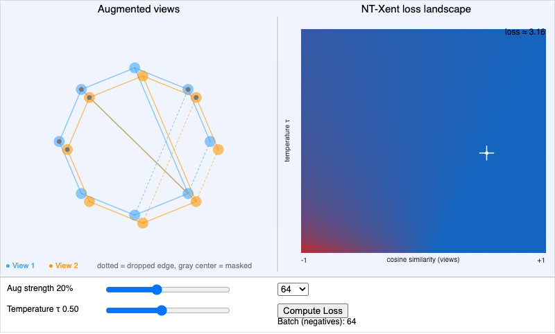</a>

Move augmentation strength and temperature across the NT-Xent loss landscape and read the operating point.

[Open full screen :material-open-in-new:](ch24-contrastive-loss-explorer/main.html){target=_blank}

### [Graph Contrastive Learning — Two-View Pipeline](ch24-graph-contrastive-learning/index.md)

<a href="ch24-graph-contrastive-learning/index.md">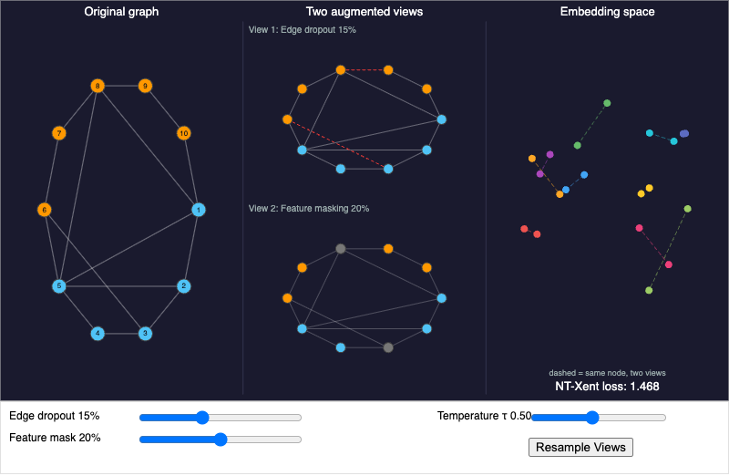</a>

Build two augmented views of a graph and pull matching node embeddings together while pushing others apart.

[Open full screen :material-open-in-new:](ch24-graph-contrastive-learning/main.html){target=_blank}

### [DGI vs. Contrastive Learning — Concept Map](ch24-ssl-concept-map/index.md)

<a href="ch24-ssl-concept-map/index.md">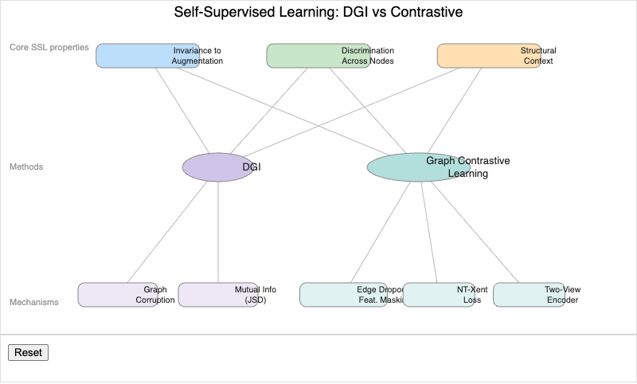</a>

Compare DGI and graph contrastive learning against the three core self-supervised-learning properties.

[Open full screen :material-open-in-new:](ch24-ssl-concept-map/main.html){target=_blank}

## Chapter 25: Agents and Graphs

### [Multi-Hop KG Reasoning Agent](ch25-multi-hop-reasoning/index.md)

<a href="ch25-multi-hop-reasoning/index.md">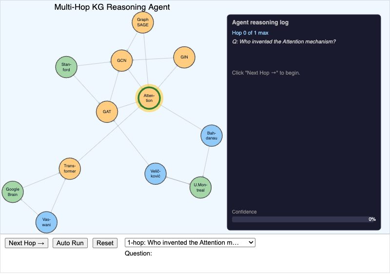</a>

Watch an agent answer a multi-hop question over a knowledge graph, tracing retrieved nodes and confidence per hop.

[Open full screen :material-open-in-new:](ch25-multi-hop-reasoning/main.html){target=_blank}

### [Agent Tool-Use Graph — Interactive Planner](ch25-tool-use-graph/index.md)

<a href="ch25-tool-use-graph/index.md">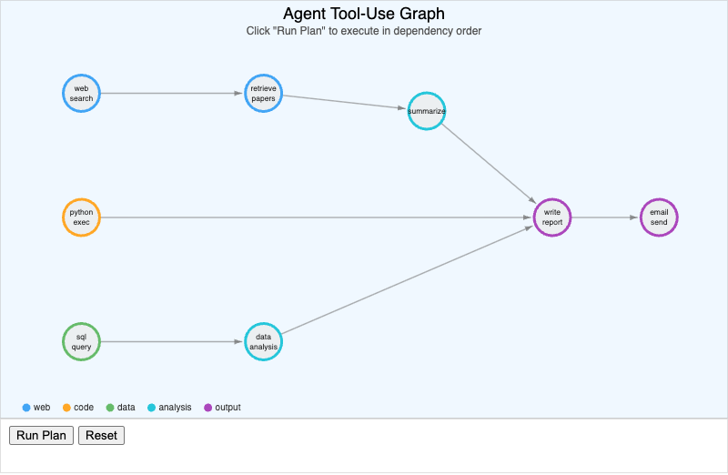</a>

Run an agent's tool-use plan as a dependency graph; independent tools fire in parallel waves.

[Open full screen :material-open-in-new:](ch25-tool-use-graph/main.html){target=_blank}

## Chapter 26: Conclusion — The GNN Design Space and Open Problems

### [GNN Architecture Family Tree](ch26-gnn-family-tree/index.md)

<a href="ch26-gnn-family-tree/index.md">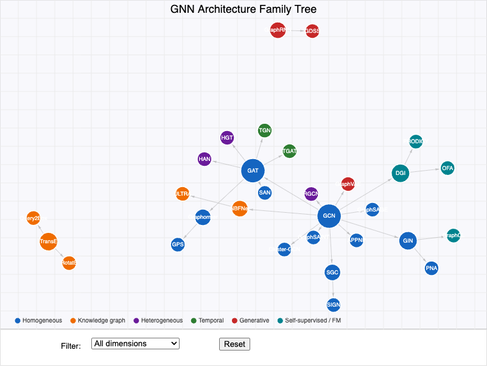</a>

Browse an interactive taxonomy of GNN architectures with 'extends / inspired by' lineage edges.

[Open full screen :material-open-in-new:](ch26-gnn-family-tree/main.html){target=_blank}

